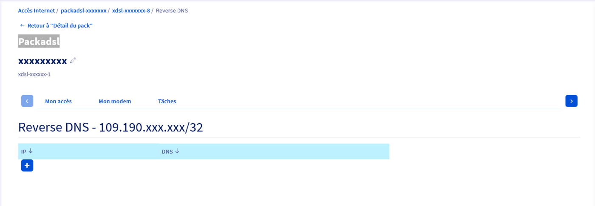
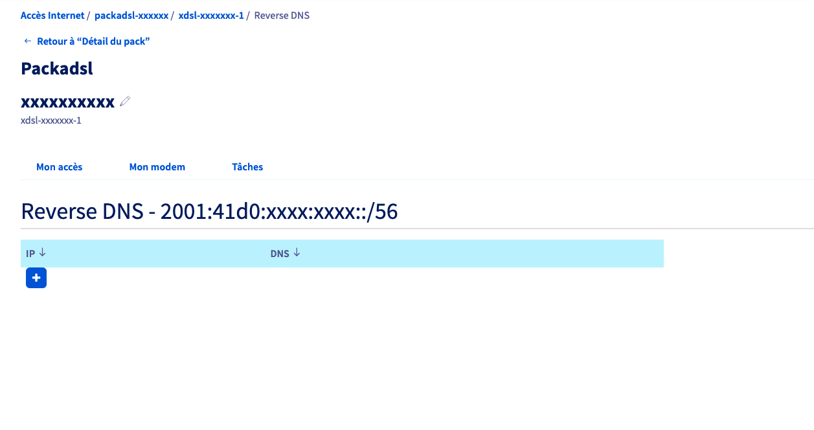
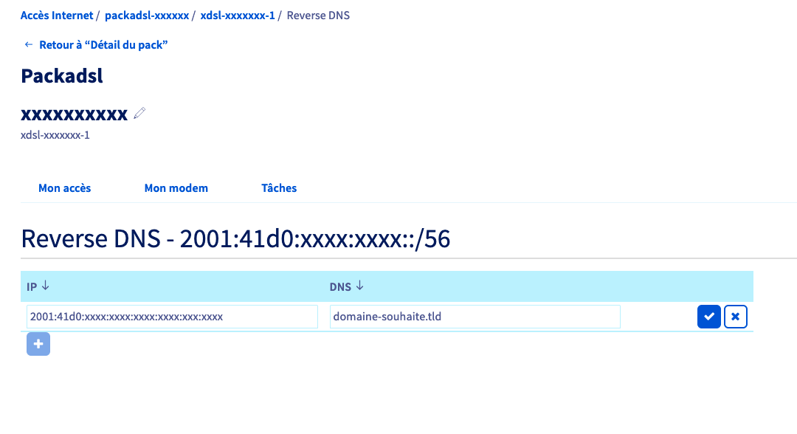

## Objectif

Le Reverse DNS, aussi appelé PTR Record (ou pointer record) sert à associer une adresse IP à un enregistrement de nom de domaine.

Il est important de l'utiliser car l'absence de Reverse DNS peut être considérée comme une erreur et peut entraîner le refus d'accès à certains services.
Par exemple, dans le cadre de l'utilisation d'un serveur e-mail, si l'e-mail est envoyé depuis un serveur ayant une adresse IP sans résolution DNS appropriée, il a de grandes chances d'être refusé par le serveur de réception.

## Prérequis

- Un nom de domaine (ou sous-domaine) redirigeant vers l'adresse IP (IPv4 et/ou IPv6) de votre accès xDSL ou fibre.
- Un accès xDSL ou fibre OVHcloud.

Il est également possible de configurer les Reverse DNS des blocs IPv4 fournis en option sur nos accès.<br>
Retrouvez plus d'informations sur notre guide « [Commander et gérer un bloc IP /29](/pages/web_cloud/internet/internet_access/comment_commander_et_gerer_un_bloc_ip_29) ».

## En pratique

### Vérifier que le nom de domaine est bien configuré

Nous allons faire le test avec le domaine `ovhtelecom.fr`.

#### Sous Windows

Cliquez sur les onglets ci-dessous pour afficher les détails selon le type d'IP souhaité.

> [!tabs]
> IPv4
>>
>> Ouvrez l'invite de commande et saisissez :
>>
>> ```console
>> nslookup ovhtelecom.fr
>> ```
>>
>> Vous obtiendrez une réponse du type :
>>
>> ```console
>> Name : www.ovhtelecom.fr Address : 198.27.92.21
>> ```
>>
> IPv6
>>
>> Ouvrez l'invite de commande et saisissez :
>>
>> ```console
>> nslookup -type=AAAA ovhtelecom.fr
>> ```
>>
>> Vous obtiendrez une réponse du type :
>>
>> ```console
>> Nom : ovhtelecom.fr
>> Address:  2001:41d0:ab1e:ef00:a2e5:9aad:8a1:598f
>> ```
>>
>>

#### Sous macOS et Linux

Cliquez sur les onglets ci-dessous pour afficher les détails selon le type d'IP souhaité.

> [!tabs]
> IPv4
>>
>> Ouvrez le terminal et saisissez :
>>
>> ```console
>> host ovhtelecom.fr
>> ```
>>
>> Vous obtiendrez une réponse du type :
>>
>> ```console
>> ovhtelecom.fr has address 198.27.92.21
>> ```
>>
> IPv6
>>
>> Ouvrez l'invite de commande et saisissez :
>>
>> ```console
>> host ovhtelecom.fr
>> ```
>>
>> Vous obtiendrez une réponse du type :
>>
>> ```console
>> ovhtelecom.fr has IPv6 address 2001:41d0:ab1e:ef00:a2e5:9aad:8a1:598f
>> ```
>>

Dans les deux cas, nous voyons que le nom de domaine pointe bien vers notre adresse IP `198.27.92.21` en IPv4 et l'IP `2001:45d0:ab1e:ef00:a2e5:9aad:8a1:598f` en IPv6.

Si ce n'est pas le cas, nous vous invitons à vous rapprocher de votre bureau d'enregistrement afin de configurer votre nom de domaine. Si OVHcloud est votre bureau d'enregistrement, consultez le guide « [Editer une zone DNS OVHcloud](/pages/web_cloud/domains/dns_zone_edit) ».

Nous pouvons maintenant passer à l'étape suivante qui est la configuration de notre Reverse DNS.

### Configurer le Reverse DNS de votre connexion

La configuration du Reverse DNS s'effectue dans l'espace client OVHcloud :

- Connectez-vous à votre [espace client OVHcloud](/links/manager), partie `Telecom`{.action}.
- Cliquez sur `Accès Internet`{.action}.
- Cliquez sur votre packadsl `Packadsl-xxxxxxx`{.action}.
- Cliquez sur votre accès `(xdsl ou ftth)-xxxxxxx-1`{.action}.

Dans les caractéristiques sur la droite, vous verrez apparaître votre IPv4 publique sous cette forme : `109.190.xxx.xxx` ou `151.127.xxx.xxx` et votre préfixe IPv6 public sous cette forme : `2001:41d0:xxxx:xxxx::`.

- Cliquez sur l'icône engrenage (⚙) à côté de votre IP.
- Cliquez sur le `+`{.action} afin d'ajouter le reverse DNS.

> [!tabs]
> IPv4
>>
>> {.thumbnail}
>>
>> - Saisissez votre IPv4 publique et le sous domaine souhaité puis validez.
>> - Saisissez le nom de domaine ou sous-domaine et cliquez sur `Suivant`{.action}. Validez à la page suivante.
>>
>> {.thumbnail}
>>
> IPv6
>>
>> {.thumbnail}
>>
>> > [!warning]
>> >
>> > **Vérifiez vos paramètres de sécurité IPv6**
>> >
>> > En IPv6, c'est votre machine qui est exposée directement sur Internet. De ce fait, il est indispensable de vous assurer que tous les moyens de sécurité disponibles (pare-feu routeur et machine, iptable, ouverture de port, etc...) sont activés et parfaitement configurés.
>>
>> - En IPv6 vous devez saisir l'adresse IPv6 de la machine qui va exploiter votre nom de domaine. Votre IPv6 doit contenir le même préfixe que votre connexion Internet.
>> - Saisissez le nom de domaine ou sous-domaine et cliquez sur `Suivant`{.action}. Validez à la page suivante.
>>
>> {.thumbnail}


Quelques minutes seront nécessaires pour que la nouvelle valeur de votre DNS soit visible dans votre espace client.

### Vérifier la configuration du Reverse DNS

Nous allons utiliser les mêmes commandes que pour la vérification de la configuration du nom de domaine mais cette fois-ci avec l'adresse IP.

#### Sous Windows

Cliquez sur les onglets ci-dessous pour afficher les détails selon le type d'IP souhaité.

> [!tabs]
> IPv4
>>
>> Ouvrez l'invite de commande et saisissez :
>>
>> ```console
>> nslookup 198.27.92.21
>> ```
>>
>> Vous obtiendrez une réponse du type :
>>
>> ```console
>> Name : www.ovhtelecom.fr Address : 198.27.92.21
>> ```
>>
> IPv6
>>
>> Ouvrez l'invite de commande et saisissez :
>>
>> ```console
>> nslookup 2001:41d0:ab1e:ef00:a2e5:9aad:8a1:598f
>> ```
>>
>> Vous obtiendrez une réponse du type :
>>
>> ```console
>> Nom :    ovhtelecom.fr
>> Address:  2001:41d0:ab1e:ef00:a2e5:9aad:8a1:598f
>> ```
>>
#### Sous macOS et Linux

Cliquez sur les onglets ci-dessous pour afficher les détails selon le type d'IP souhaité.

> [!tabs]
> IPv4
>>
>> Ouvrez le terminal et saisissez :
>>
>> ```console
>> host 198.27.92.21
>> ```
>>
>> Vous obtiendrez une réponse du type :
>>
>> ```console
>> 21.92.27.198.in-addr.arpa domain name pointer www.ovhtelecom.fr.
>> ```
>>
> IPv6
>>
>> Ouvrez le terminal et saisissez :
>>
>> ```console
>> host 2001:41d0:ab1e:ef00:a2e5:9aad:8a1:598f
>> ```
>>
>> Vous obtiendrez une réponse du type :
>>
>> ```console
>> f.8.9.5.1.a.8.d.a.a.9.5.e.2.a.0.0.f.e.e.1.b.a.0.d.4.1.1.0.0.2.ip6.arpa = domain name pointer ovhtelecom.fr.
>> ```
>>

Dans les deux cas, nous voyons que l'adresse IP redirige bien vers le nom de domaine [ovhtelecom.fr](http://ovhtelecom.fr).

Votre Reverse DNS est maintenant configuré.

## Aller plus loin

Échangez avec notre communauté d'utilisateurs sur <https://community.ovh.com>.
