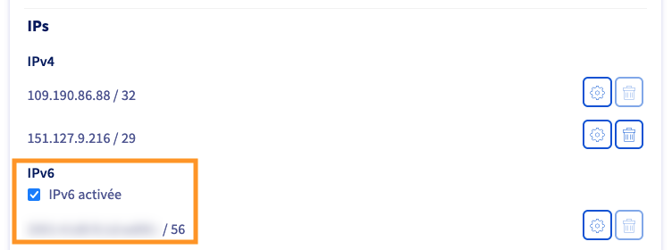
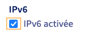

## Objectif

La pénurie d'IPv4 avançant de plus en plus, l'utilisation d'une IPv6 en parallèle d'une IPv4 représente un avantage dans les réseaux de demain où l'IPv4 deviendra dispensable.

**Découvrez comment activer l'IPv6 de votre connexion Internet OVHcloud depuis l'espace client.**

## Prérequis

- Disposer d'un [accès Internet xDSL ou FTTH OVHcloud](/links/telecom/offre-internet).
- Disposer d'une machine connectée et configurée IPv6 (facultatif).
<!-- CP-NAV-START:telecom-xdsl-fttx -->
---

### Accès à l'espace client OVHcloud

- **Lien direct :** [Accès Internet](/links/control-panel/telecom-xdsl-fttx)
- **Pour accéder à vos services :** `Télécom`{.action} > `Offres Internet`{.action} > Sélectionnez votre accès

---
<!-- CP-NAV-END:telecom-xdsl-fttx -->

## En pratique

### Étape 1 : Activer votre adresse IPv6

> [!success]
>
> Par défaut, nous activons une IPv6 sur chacun de nos accès Internet livrés. Aucune manipulation n'est nécessaire si celle-ci est déjà activée.
>

<!-- CP-STEPS-START:activer-ipv6 -->
Depuis votre [espace client OVHcloud](/links/control-panel/telecom-xdsl-fttx), cliquez sur votre accès à Internet FTTH ou xDSL dans le cadre `Accès Internet` à droite, puis positionnez-vous sur l'onglet `Mon accès`{.action}.

Dans le cadre « Caractéristiques », reportez-vous aux éléments de la partie `IPs`. Vous retrouverez dans cette dernière les adresses IP associées à votre accès à Internet. Vérifiez l'état de l'adresse IPv6 afin de savoir si celle-ci est activée ou non :

{.thumbnail}

- Si la ligne IPv6 est cochée, votre IP est déjà activée.
- Si la ligne IPv6 est décochée, votre IP est désactivée.

> [!alert]
>
> Si vous possédez un modem OVHcloud, l'activation ou la désactivation de l'IPv6 entraînera une réinitialisation de votre modem. Nous vous recommandons donc de vous assurer que vous avez sauvegardé votre configuration si jamais votre modem n'est pas configuré à distance.
>
> Pour en savoir plus sur la configuration à distance du modem OVHcloud, veuillez consulter le guide suivant : [Configurer sa box à partir de l'espace client OVHcloud](/pages/web_cloud/internet/internet_access/configuration_du_modem_a_partir_de_votre_espace_client).
>

Pour activer ou désactiver l'IPv6 sur votre accès Internet, il suffit de cocher ou décocher la case :

{.thumbnail}
<!-- CP-STEPS-END:activer-ipv6 -->

### Étape 2 : Vérifier que l'IPv6 fonctionne sur votre accès

> [!primary]
>
> Pour les tests suivants, une machine ayant une configuration IPv6 activée par défaut et sécurisée est nécessaire.

> [!warning]
>
> Si vous ne possédez pas de modem OVHcloud, reportez-vous à la notice d'utilisation de votre modem afin d'utiliser votre IPv6.

Pour vérifier que l'IPv6 est active, utilisez la commande suivante qui affiche votre adresse IPv6 publique.

Ouvrez un terminal de commande et tapez la commande suivante :

```console
curl -6 ifconfig.ovh
```

Vous devriez obtenir une réponse de ce type (ici une IPv6 à titre d'illustration) :

```console
2001:123a:456b:789c:123d:456b:789d:123a
```

Dans cette adresse on retrouve bien le préfixe IPv6 attribué par votre connexion OVHcloud (que vous retrouvez sur votre espace client) `2001:123a:456b:789c:` et le reste de l'adresse qui correspond à votre machine `123d:456b:789d:123a`.

> [!primary]
>
> Par défaut sur les configurations réseaux IPv6, la partie « adresse machine » est temporaire. Celle-ci change généralement toutes les 24h si votre configuration réseau est dite EUI-64. Dans le cas contraire, nous vous invitons à vérifier votre configuration machine IPv6 afin de vous assurer qu'elle dispose bien de toutes les sécurités nécessaires.
>

Vous êtes désormais connecté en IPv6 et pouvez naviguer sur des sites ou accéder à des ressources compatibles avec ce type d'adresse IP.

> [!success]
>
> Même si vous avez une IPv6, votre machine et votre routeur OVHcloud continuent également de fonctionner en IPv4 grâce au système de « *dual-stack* ». Ainsi, cela vous permet d'accéder à des ressources qui sont joignables uniquement en IPv4 et inversement uniquement en IPv6, sans changer de configuration.

## Aller plus loin

Échangez avec notre [communauté d'utilisateurs](/links/community).