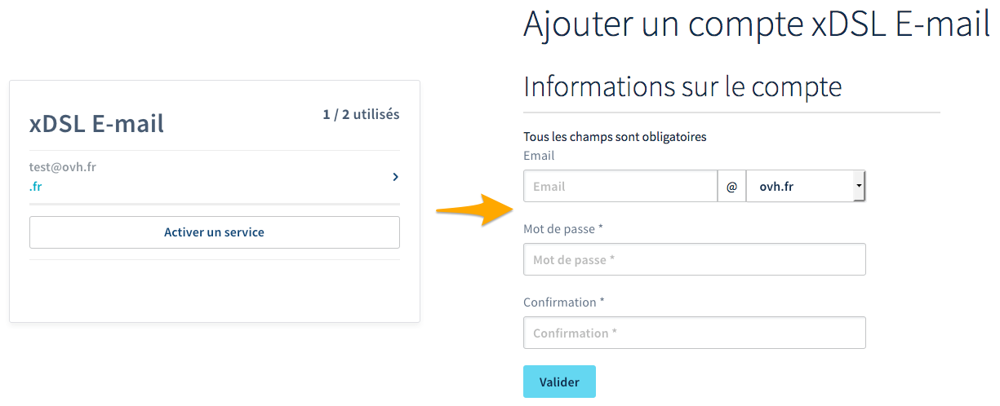

## Objectif

Vous pouvez bénéficier d'adresses e-mail avec nos offres FTTH/xDSL OVHcloud. Ces adresses permettent d'envoyer et de recevoir vos messages depuis l'appareil de votre choix.

**Découvrez comment activer les adresses e-mail incluses dans votre offre FTTH/xDSL et comment y accéder.**

## Prérequis

- Disposer d'un [accès Internet xDSL ou FTTH OVHcloud](/links/telecom/offre-internet).
- Pouvoir encore créer des adresses e-mail dans le cadre de votre offre.
<!-- CP-NAV-START:telecom-xdsl-fttx -->
---

### Accès à l'espace client OVHcloud

- **Lien direct :** [Accès Internet](/links/control-panel/telecom-xdsl-fttx)
- **Pour accéder à vos services :** `Télécom`{.action} > `Offres Internet`{.action} > Sélectionnez votre accès

---
<!-- CP-NAV-END:telecom-xdsl-fttx -->

## En pratique

### Étape 1 : Activer son adresse FTTH/xDSL e-mail

<!-- CP-STEPS-START:activer-adresse-email -->
Pour démarrer la manipulation, depuis votre [espace client OVHcloud](/links/control-panel/telecom-xdsl-fttx), sélectionnez le *Pack* contenant l'accès à Internet concerné, puis cliquez sur `Activer un service`{.action} dans la rubrique « Téléphonie ».

Sur la nouvelle page qui s'affiche, remplissez les informations demandées :

|Information|Description|
|---|---|
|E-mail|Renseignez le nom que portera votre adresse e-mail (votre « prénom.nom », par exemple).|
|Mot de passe|Définissez le mot de passe de cette adresse, puis confirmez-le.|

{.thumbnail}

Cliquez sur `Valider`{.action} pour lancer la création de l'adresse e-mail. Répétez cette manipulation si vous souhaitez créer une seconde adresse e-mail.
<!-- CP-STEPS-END:activer-adresse-email -->

> [!primary]
>
> Pour des raisons de sécurité, nous vous invitons à respecter les conditions indiquées lors du choix du mot de passe. Nous vous recommandons également :
>
> - de ne pas utiliser deux fois le même mot de passe ;
>
> - de choisir un mot de passe qui n'a aucun rapport avec vos informations personnelles (évitez les mentions à votre nom, prénom ou date de naissance, par exemple) ;
>
> - de renouveler régulièrement vos mots de passe ;
>
> - de ne pas noter sur un papier ni de vous envoyer vos mots de passe sur votre adresse e-mail, mais plutôt d'utiliser un logiciel du type « gestionnaire de mots de passe » ;
>
> - de ne pas enregistrer vos mots de passe dans votre navigateur web, même si ce dernier vous le propose.
>

### Étape 2 : Utiliser votre adresse e-mail

Vous pouvez à présent utiliser votre adresse e-mail. Connectez-vous au [webmail OVHcloud](/links/web/email) avec les identifiants de votre nouvelle adresse.

Si vous souhaitez configurer votre adresse e-mail sur un logiciel de messagerie ou un appareil (comme un smartphone ou une tablette), consultez nos tutoriels dédiés sur [cette page](/products/web-cloud-email-collaborative-solutions-email-pro).

Si vous éprouvez des difficultés lors de la configuration de votre adresse, nous vous recommandons de faire appel à un [prestataire spécialisé](/links/partner) et/ou de contacter l’éditeur du client de messagerie utilisé. Les paramètres mentionnés dans le tableau ci-dessus peuvent vous être demandés.

## Aller plus loin

Échangez avec notre [communauté d'utilisateurs](/links/community).