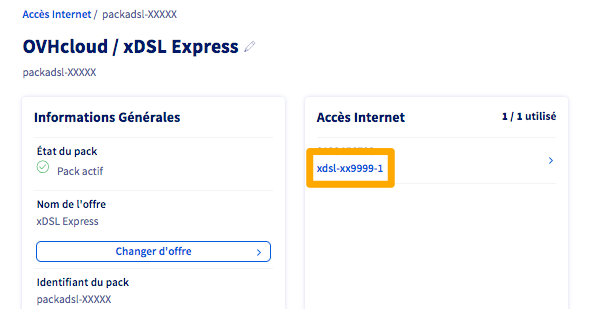
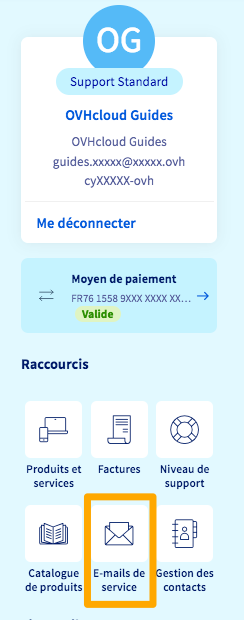
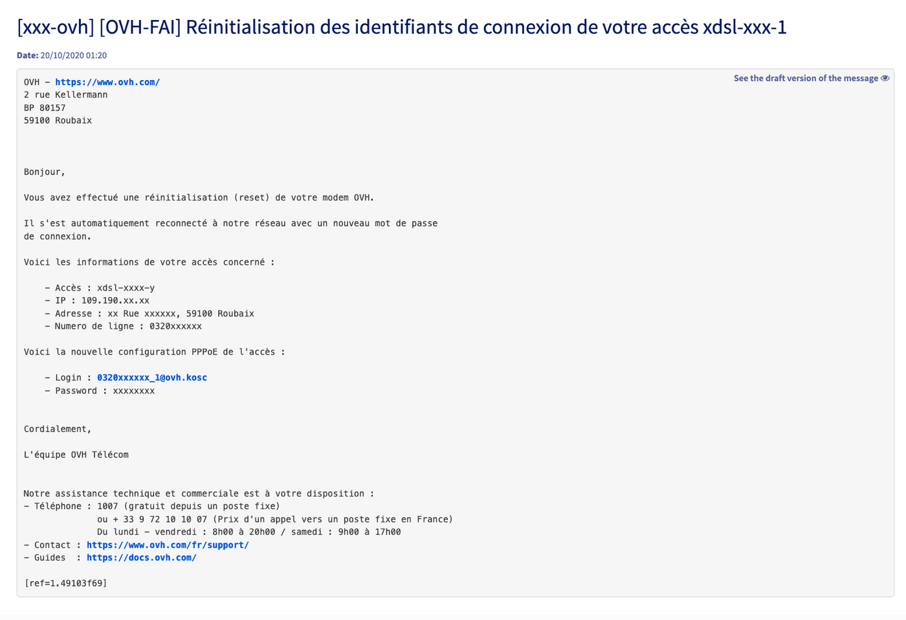

## Objectif

Si vous souhaitez utiliser votre équipement personnel pour gérer la connexion PPPoE sur votre offre xDSL/FTTH OVHcloud, vous devez récupérer les identifiants PPPoE associés à cet accès.

Les identifiants *Point to Point Protocol over Ethernet* (PPPoE) sont composés d'un nom d'utilisateur (ID) sous la forme `xxxxxxxxxx@ovh.xxx` et d'un mot de passe unique. Leur fonction est d'authentifier un équipement (équipement personnel ou modem fourni par OVHcloud) sur les infrastructures OVHcloud.

**Découvrez comment utiliser les API OVHcloud pour récupérer les identifiants PPPoE d'un accès à Internet**.

## Prérequis

- Disposer d'un [accès Internet xDSL ou FTTH OVHcloud](/links/telecom/offre-internet).
- Disposer d'un équipement (routeur, firewall) compatible PPPoE.
<!-- CP-NAV-START:telecom-xdsl-fttx -->
---

### Accès à l'espace client OVHcloud

- **Lien direct :** [Accès Internet](/links/control-panel/telecom-xdsl-fttx)
- **Pour accéder à vos services :** `Télécom`{.action} > `Offres Internet`{.action} > Sélectionnez votre accès

---
<!-- CP-NAV-END:telecom-xdsl-fttx -->

- Être connecté aux [API OVHcloud](/links/api).
- Consulter le guide [Premiers pas avec les API OVHcloud](/pages/manage_and_operate/api/first-steps) pour vous familiariser avec l'utilisation des APIv6 OVHcloud.

## En pratique

Les identifiants PPPoE vous sont envoyés par e-mail (à l'adresse e-mail de contact de votre compte OVHcloud) pendant la livraison de votre accès. 
Ces identifiants vous permettent de configurer le modem OVHcloud, dans le cas d’une configuration manuelle en local, ou un équipement personnel pour l’usage de votre accès à Internet.

Si votre offre a été fournie avec un modem OVHcloud, les identifiants PPPoE vous sont envoyés par e-mail systématiquement après chaque réinitialisation du modem.

Le *login* reste identique après chaque réinitialisation.
Pour des raisons de sécurité, le *mot de passe* est systématiquement modifié après chaque réinitialisation.

**Lors de la première connexion du modem OVHcloud, celui-ci est automatiquement réinitialisé. Un nouveau mot de passe PPPoE vous est alors communiqué suite à cette réinitialisation.**

Si vous souhaitez utiliser votre propre modem/routeur, vous pouvez utiliser les API OVHcloud afin de générer l'envoi de nouveaux identifiants PPPoE par e-mail.

Dans un premier temps, il vous faut retrouver le *serviceName* de votre accès à Internet.

### Récupérer le serviceName de votre accès xDSL ou FTTH

<!-- CP-STEPS-START:recuperer-servicename -->
Le *serviceName* correspond à la référence interne de votre accès. Pour la retrouver, suivez ces étapes :

Depuis votre [espace client OVHcloud](/links/control-panel/telecom-xdsl-fttx), sélectionnez le *Pack* contenant l'accès à Internet concerné. La référence interne est affichée dans le cadre `Accès Internet` à droite.

{.thumbnail}
<!-- CP-STEPS-END:recuperer-servicename -->

### Générer l'envoi de nouveaux identifiants par e-mail

> [!warning]
>
> Chaque utilisation de l'appel API décrit ci-dessous générera un nouveau mot de passe PPPoE. **Cela aura pour effet de couper la session de votre modem si elle est active, occasionnant une déconnexion**. N'utilisez donc cet appel API que si vous êtes certain de pouvoir reconfigurer votre équipement personnel dans la foulée.
>

Utilisez l'appel API :

> [!api]
>
> @api {v1} /xdsl POST /xdsl/{serviceName}/requestPPPLoginMail
>

Saisissez, dans le champ `serviceName`, la référence de votre accès obtenue à l'étape précédente. Cliquez alors sur `Execute`{.action}. Le message `null` confirmera la bonne prise en compte de votre demande.

Dans un délai approximatif de deux à trois minutes, vous recevrez un e-mail, **sur l'adresse e-mail de contact du compte OVHcloud**, contenant l'identifiant PPPoE et le nouveau mot de passe.

#### Retrouver l'e-mail dans l'espace client OVHcloud

<!-- CP-STEPS-START:retrouver-email-espace-client -->
Si vous n'avez pas accès à l'adresse e-mail de contact du compte OVHcloud, vous pouvez consulter les e-mails de service depuis l'[espace client OVHcloud](/links/control-panel/telecom-xdsl-fttx).

Une fois connecté, cliquez sur votre nom puis sur `E-mails de service`{.action}.

{.thumbnail}

L'objet de l'e-mail est le suivant :

{.thumbnail}

Voici un exemple d'e-mail contenant les identifiants PPPoE :

{.thumbnail}
<!-- CP-STEPS-END:retrouver-email-espace-client -->

### Configurer votre routeur

Vous pouvez suivre le guide « [Configurer un routeur manuellement](/pages/web_cloud/internet/internet_access/advanced_config_router_manually) » pour configurer manuellement vos identifiants PPPoE sur votre propre matériel.

## Aller plus loin

Échangez avec notre [communauté d'utilisateurs](/links/community).
