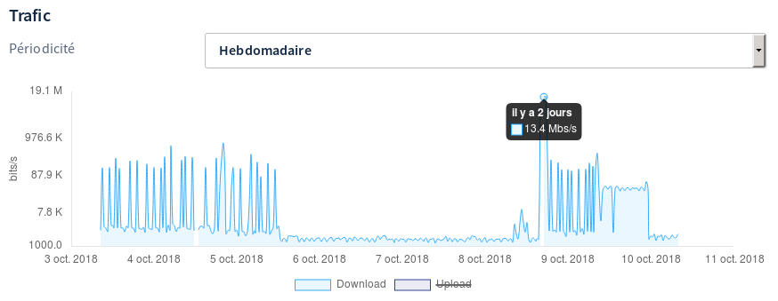
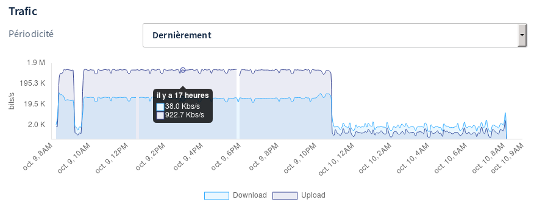

## Objectif

Votre solution xDSL OVHcloud vous permet d'accéder à différents types de contenus sur Internet (des sites ou des médias, par exemple). Vous consommez alors des ressources allouées à votre connexion, aussi appelées bande passante ou débit. Lorsqu'elles sont intégralement utilisées, vous saturez votre ligne et cela peut entraîner des lenteurs (comme des sites web qui se chargent lentement ou des vidéos qui ne s'affichent plus en haute définition).

**Apprenez à vérifier si votre lien xDSL est saturé.**

## Prérequis

- Être connecté à l'[espace client OVHcloud](https://www.ovh.com/auth/?action=gotomanager&from=https://www.ovh.com/fr/&ovhSubsidiary=fr){.external}, partie `Télécom`{.action}.
- Disposer d'un ordinateur relié via un câble Ethernet au modem utilisant le lien xDSL que vous souhaitez tester.

## En pratique

La méthode la plus courante pour vérifier votre débit est d'effectuer un test par le biais d'un site internet spécialisé. Cette méthode, bien qu'intéressante, reste un indicateur réalisé à un instant T. Le résultat obtenu peut donc énormément varier selon l'utilisation faite de votre connexion au même moment.

Depuis votre espace client OVHcloud, vous avez la possibilité de consulter l'activité de votre connexion sur une période de temps que vous choisissez. Vous pouvez ainsi vérifier le débit alloué ainsi que le trafic utilisé. Cela permet d'avoir une vision globale de l'utilisation de votre connexion par tous les équipements reliés à votre modem.

Poursuivez la lecture de cette documentation selon la vérification que vous souhaitez effectuer. Bien évidemment, les deux peuvent être réalisées conjointement.

- [Vérifier l'activité de ma connexion depuis l'espace client](/pages/web_cloud/internet/internet_access/verifier-lien-xdsl-sature#verifier-lactivite-de-ma-connexion-depuis-lespace-client){.external}.

- [Effectuer un test ponctuel de débit](/pages/web_cloud/internet/internet_access/verifier-lien-xdsl-sature#effectuer-un-test-ponctuel-de-debit){.external}.

### Vérifier l'activité de ma connexion depuis l'espace client

Cette opération se réalise en plusieurs étapes. Le but étant de pouvoir vérifier si votre connexion est saturée ou non.

Pour débuter la manipulation, connectez-vous à votre [espace client OVHcloud](https://www.ovh.com/auth/?action=gotomanager&from=https://www.ovh.com/fr/&ovhSubsidiary=fr){.external}, partie `Télécom`. Cliquez sur `Accès Internet`{.action}, sélectionnez le pack concerné puis l'accès que vous souhaitez vérifier. Assurez-vous alors d'être positionné sur l'onglet `Mon accès`{.action}.

{.thumbnail}

#### Étape 1 : vérifier le débit alloué à ma connexion

Toujours positionné sur l'onglet `Mon accès`{.action}, descendez dans la page jusqu'à voir la section `Statistiques`{.action}. Visualisez alors le graphique intitulé « **Synchronisation** ». Ce dernier représente le débit descendant (dit « download » pour les données reçues) et montant (dit « upload » pour les données envoyées) alloués à votre connexion.

**Notez que le débit réel que vous pouvez utiliser correspond environ à 80 % du débit qui s'affiche dans le graphique de synchronisation.** D'ailleurs, si ce débit est beaucoup plus bas que celui qui était indiqué lors du test d'éligibilité, reportez-vous aux instructions de la documentation « [Rétablir la synchronisation d’une connexion suite à une coupure](/pages/web_cloud/internet/internet_access/reestablish-synchronization){.external} » car un élément pourrait perturber la qualité de votre connexion.

Prenez connaissance des informations qui s'affichent dans le graphique sur la période que vous souhaitez vérifier. Nous vous conseillons de noter ces informations. Par exemple, l'image ci-dessous montre un modem disposant actuellement d'un débit synchronisé stable de 14,7 Mbit/s en descendant et de 1,01 Mbit/s en montant.

{.thumbnail}

#### Étape 2 : vérifier le trafic utilisé sur votre connexion

Vérifions à présent le trafic utilisé sur votre connexion. Toujours positionné sur l'onglet `Mon accès`{.action}, descendez dans la page jusqu'à voir la section `Statistiques`{.action}. Visualisez alors le graphique intitulé « **Trafic** ». Ce dernier représente l'utilisation du débit descendant (dit « download » pour les données reçues) et montant (dit « upload » pour les données envoyées) de votre connexion internet.

Prenez connaissance des informations qui s'affichent. Par exemple, l'image ci-dessous montre l'utilisation du débit descendant d'une connexion internet sur plusieurs jours ; elle pointe notamment le fait que la consommation a atteint un pic de 13,4 Mbit/s de débit descendant utilisé. 

{.thumbnail}

Cette autre image montre une autre situation, où l'utilisation du débit montant d'une connexion internet plafonne pendant plusieurs heures à 0,92 Mbit/s.

{.thumbnail}

#### Étape 3 : interpréter les résultats obtenus

Maintenant que vous avez pu constater le débit alloué à votre connexion internet ainsi que le trafic utilisé sur celle-ci, il ne vous reste plus qu'à faire correspondre les deux. Ceci vous permettra de vérifier si l'intégralité du débit disponible (montant ou descendant) a été utilisée à un moment donné ou l'est encore actuellement.

Pour cela, comparez sur une même période de temps le débit alloué à votre connexion par rapport au trafic utilisé. N'oubliez pas que le débit réel que vous pouvez utiliser correspond environ à 80 % du débit qui s'affiche dans le graphique « **Synchronisation** ». Dès lors, deux possibilités s'ouvrent selon les résultats obtenus. 

- **Le débit utilisé sur votre connexion atteint le débit maximal alloué à cette dernière** : 

Vous constatez alors une saturation de votre connexion qui peut provoquer des lenteurs, voire une impossibilité de navigation, ainsi que des dysfonctionnements dans la qualité de vos communications téléphoniques (dans le cas de la VoIP). Si tel est le cas, vous devez identifier ce qui accapare le débit. 

Par exemple, vérifiez si vous n'avez pas un logiciel ou un système d'exploitation qui télécharge du contenu en ligne (mises à jour, jeux vidéo, médias, etc.), si vous ne visionnez pas actuellement une vidéo en très haute définition sur internet ou si vous n'utilisez pas un logiciel qui diffuse du contenu en ligne (hébergement, caméra sur IP, synchronisation du contenu de votre ordinateur vers un serveur distant, etc.).

- **Le débit utilisé sur votre connexion n'atteint pas le débit maximal alloué à cette dernière** : 

Vous ne constatez alors pas de saturation de votre connexion. Si tel est le cas, veuillez poursuivre vers l'étape « [Effectuer un test ponctuel de débit](/pages/web_cloud/internet/internet_access/verifier-lien-xdsl-sature#effectuer-un-test-ponctuel-de-debit){.external} » de cette documentation.

### Effectuer un test ponctuel de débit

OVHcloud met à votre disposition sur le site <http://proof.ovh.net/> un outil permettant de vérifier votre débit à un instant T. Gardez en tête que le résultat obtenu peut énormément varier selon l'utilisation faite de votre connexion au moment où vous réalisez ce test.

Afin que celui-ci puisse s'effectuer dans les meilleures conditions, nous vous recommandons au préalable de :

- limiter au maximum (voire intégralement) l'utilisation de votre connexion internet ;
- réaliser la vérification sur un équipement relié via un câble Ethernet à votre modem.

Une fois prêt, cliquez sur `Lancer le test`{.action} puis patientez. Dès que le résultat s'affiche, vérifiez que le débit descendant (dit « download » pour les données reçues) et montant (dit « upload » pour les données envoyées) correspond à ce que votre ligne peut livrer. Nous vous recommandons ici de réaliser plusieurs tests et d'en dégager une tendance globale. 

{.thumbnail}

Si vous constatez un débit bien inférieur à celui que votre ligne peut livrer, et si ce n'est pas déjà fait, nous vous invitons à [vérifier l'activité de votre connexion depuis l'espace client](/pages/web_cloud/internet/internet_access/verifier-lien-xdsl-sature#verifier-lactivite-de-ma-connexion-depuis-lespace-client){.external} afin de vous assurer qu'aucun élément n'accapare l'intégralité ou une grande partie des ressources disponibles. Si votre connexion n'est pas saturée, reportez-vous aux instructions de la documentation « [Résoudre une interruption ou des lenteurs de navigation](/pages/web_cloud/internet/internet_access/resoudre-interruption-lenteurs-navigation){.external} » car un élément pourrait perturber la qualité de la connexion sur l'équipement que vous utilisez. 

Si vous constatez un bon débit lors de vos différents tests, ceci indique que votre connexion fonctionne correctement. Cependant, si vous obtenez de manière récurrente ou aléatoire un débit faible, reportez-vous aux instructions de la documentation « [Rétablir la synchronisation d’une connexion suite à une coupure](/pages/web_cloud/internet/internet_access/reestablish-synchronization){.external} » car un élément pourrait perturber la qualité de votre connexion.

## Aller plus loin

Échangez avec notre communauté d'utilisateurs sur <https://community.ovh.com>.
