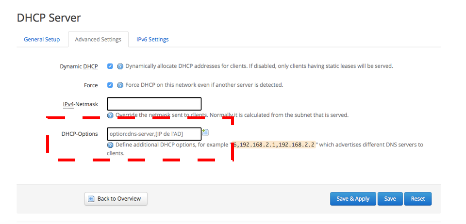

## Objectif

Intégrer un serveur Active Directory avec votre OverTheBox permet de centraliser l'administration des utilisateurs et améliorer la sécurité de votre réseau. Ce guide pratique vous montrera comment ajouter un serveur Active Directory à votre configuration OverTheBox, facilitant la gestion des politiques de sécurité et des accès utilisateurs au sein de votre organisation.

**Découvrez comment ajouter un serveur Active Directory à OverTheBox.**

## Prérequis

- Disposer d'un service [OverTheBox](https://www.ovhtelecom.fr/overthebox/)
- Au moins un accès à Internet, par [OVHcloud](https://www.ovhtelecom.fr/offre-internet/) ou un autre founisseur d'accès
- Un matériel OverTheBox fourni par OVHcloud ou une installation depuis le projet Open Source ([installer l'image overthebox sur votre materiel](/pages/web_cloud/internet/overthebox/advanced_installer_limage_overthebox_sur_votre_materiel))

## En pratique

### Configuration
- Connectez-vous sur [http://overthebox.ovh (192.168.100.1)](http://overthebox.ovh){.external} en tant qu'administrateur
- Rendez-vous dans l'onglet "Network > Interfaces"
- Éditez la configuration de l'interface LAN

{.thumbnail}

- Rendez-vous en bas de page, dans la partie "DHCP server"
- Saisissez dans le champ DHCP-Options : "option:dns-server,x.x.x.x" où x.x.x.x représente l'IP de votre serveur Active Directory
- Cliquez sur "Save & Apply" pour confirmer

{.thumbnail}

## Aller plus loin

- N'hésitez pas à échanger avec notre communauté d'utilisateurs sur vos produits Télécom sur notre site [OVHcloud Community](https://community.ovh.com/c/telecom)
- Consultez la [FAQ OverTheBox](/pages/web_cloud/internet/overthebox/install_faq)