## Objectif

Découvrez comment configurer votre réseau depuis l'interface OverTheBox. Ce guide vous permet de configurer votre réseau dans d'autres topologies que celle présente par défaut.

Découvrez ainsi :

- Comment transformer une interface WAN en interface LAN sur les OTB V3, V3 LTE et V2c.
- Comment transformer une interface LAN en interface WAN sur l'OTB V2b.
- Comment configurer une interface en IP statique.
- Comment configurer une interface en PPPoE avec [les offres internet d'OVHcloud](/links/telecom/offre-internet).
- Comment configurer une interface en 4G.

## Prérequis

- Une **OverTheBox** fournie par OVHcloud ou une installation depuis [le projet Open Source](/pages/web_cloud/internet/overthebox/advanced_installer_limage_overthebox_sur_votre_materiel).
- Être connecté à l'interface web de l'**OverTheBox** depuis [overthebox.ovh](http://overthebox.ovh) ou [192.168.100.1](https://192.168.100.1).

## En pratique

### Modifier la topologie réseau

> [!success]
>
> Il est recommandé de redémarrer votre **OverTheBox** une fois la configuration terminée pour une bonne prise en compte de celle-ci.
>

Cette section explique comment modifier la topologie réseau par défaut d'une **OverTheBox**.

#### OTB V3 et V2c 

Les OTB V3, V3 LTE et V2c ont **quatre** interfaces physiques, par défaut **trois** interfaces **WAN** et **une** interface **LAN**. Il est possible de transformer une interface WAN en interface LAN.

[!tabs]
> 1. Suppression
>>
>> - Rendez-vous dans l'onglet `Network > Interfaces`{.action}.
>> - Supprimez l'interface que vous souhaitez ajouter au LAN avec le bouton `Delete`{.action}, dans notre exemple `eth3_dhcp`.
>> - Confirmez vos changements avec le bouton `Save & Apply`{.action}.
>> - Puis passez à l'étape 2 « Ajout au bridge ».
>>
>> 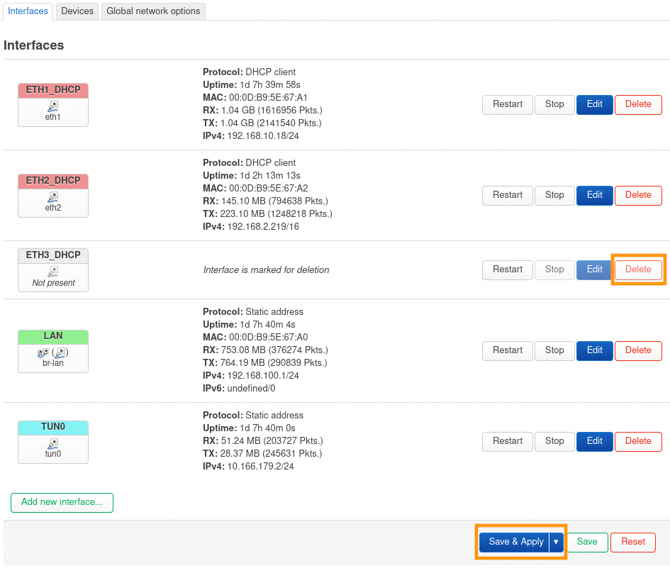{.thumbnail}
>>
> 2. Modifier le bridge
>>
>> - Rendez-vous dans l'onglet `Devices`{.action}.
>> - Modifiez le bridge `br-lan` à l'aide du bouton `Configure...`{.action}.
>> - Puis passez à l'étape 3 « Ajout au bridge ».
>>
>> 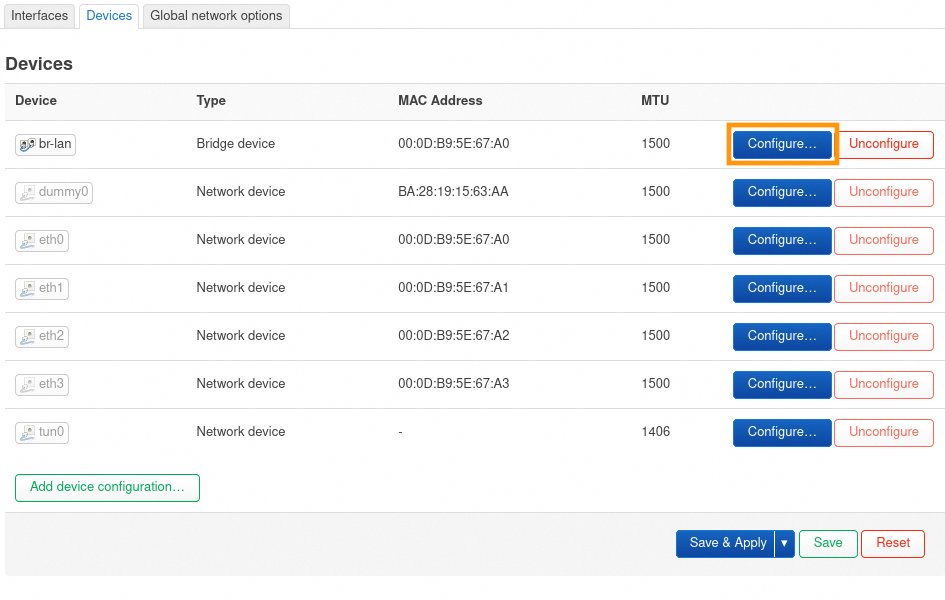{.thumbnail}
>>
> 3. Ajout au bridge
>>
>> - Modifiez le paramètre `Bridge ports`{.action} en sélectionnant l'interface, dans notre exemple `eth3`.
>> - Confirmez avec le bouton `Save`{.action}.
>>
>> 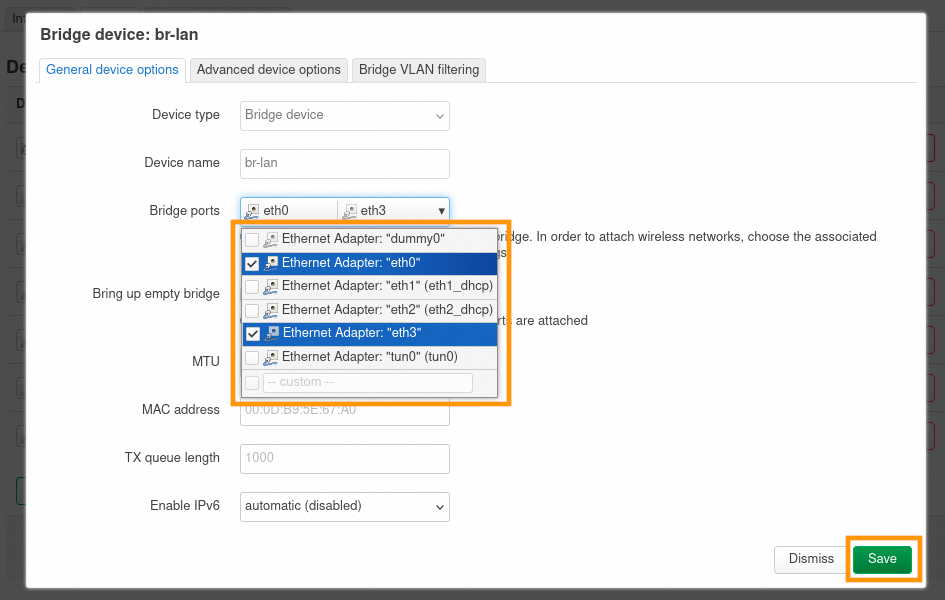{.thumbnail}
>>
>> - Confirmez vos changements avec le bouton `Save & Apply`{.action}.
>> - Puis passez à l'étape 4 « Confirmation ».
>>
>> 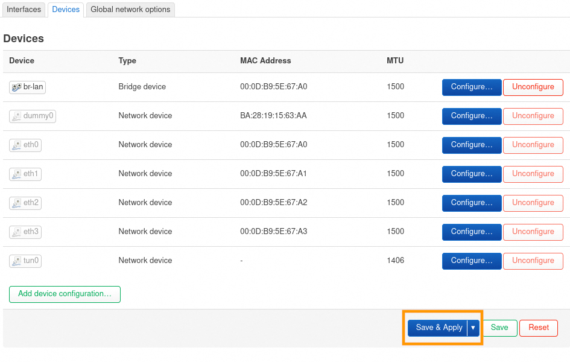{.thumbnail}
>>
> 4. Confirmation
>>
>> - Retournez dans la section `Interfaces`{.action}.
>> - Vérifiez que l'interface est présente dans le bridge en passant la souris au dessus des icônes.
>>
>> 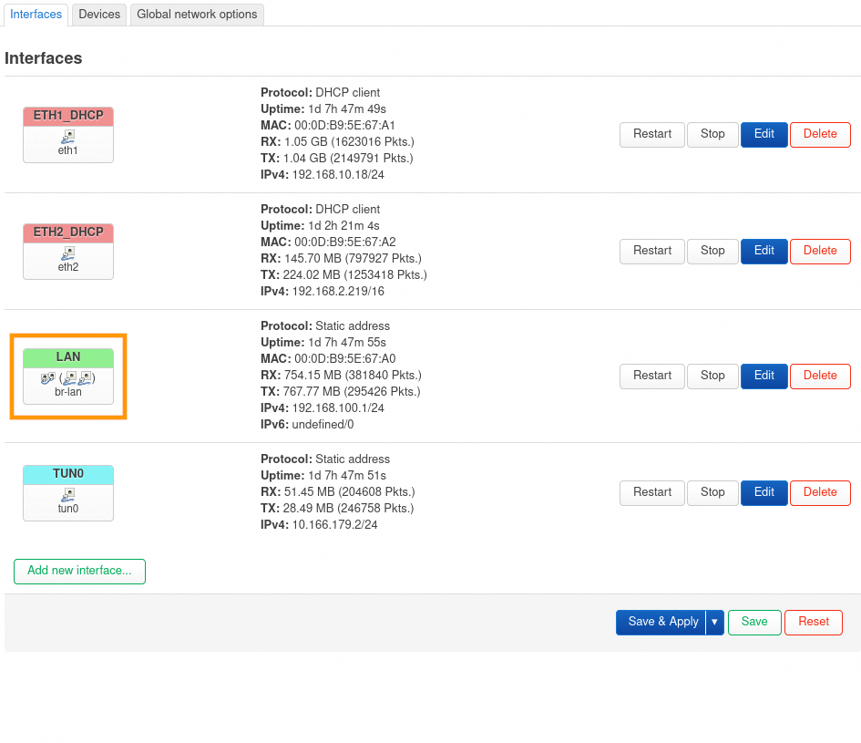{.thumbnail}
>>

#### OTB V2B

L'OTB V2B a **quatorze** interfaces physiques, par défaut **deux** interfaces **WAN** et **douze** interfaces **LAN**. Il est possible de transformer une interface LAN en interface WAN pour ajouter une connexion supplémentaire.

- Rendez-vous dans l'onglet `OverTheBox > Switch Configuration`{.action}.
- Cliquez sur le port que vous souhaitez modifier, dans notre exemple le `port 12`.
- Validez la modification avec le bouton `Save & Apply`.
- Le port est maintenant prêt pour être connecté à votre troisième connexion WAN.

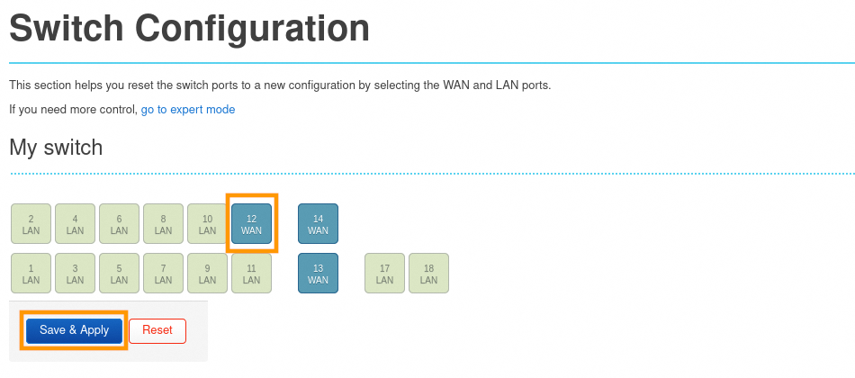{.thumbnail}

### Modifier la configuration des interfaces

> [!success]
>
> Il est recommandé de redémarrer votre **OverTheBox** une fois la configuration terminée pour une bonne prise en compte de celle-ci.
>

Cette section explique comment modifier la configuration des interfaces d'une **OverTheBox**.

#### Configurer une interface en IP statique

Si vous souhaitez qu'une interface utilise une IP statique plutôt que le DHCP de votre modem.

[!tabs]
> 1. Changer de protocole
>>
>> - Rendez-vous dans l'onglet `Network > Interfaces`{.action}.
>> - Sélectionnez l'interface à modifier, dans notre exemple `eth2_dhcp`.
>> - Cliquez sur le bouton `Edit`{.action}.
>>
>> 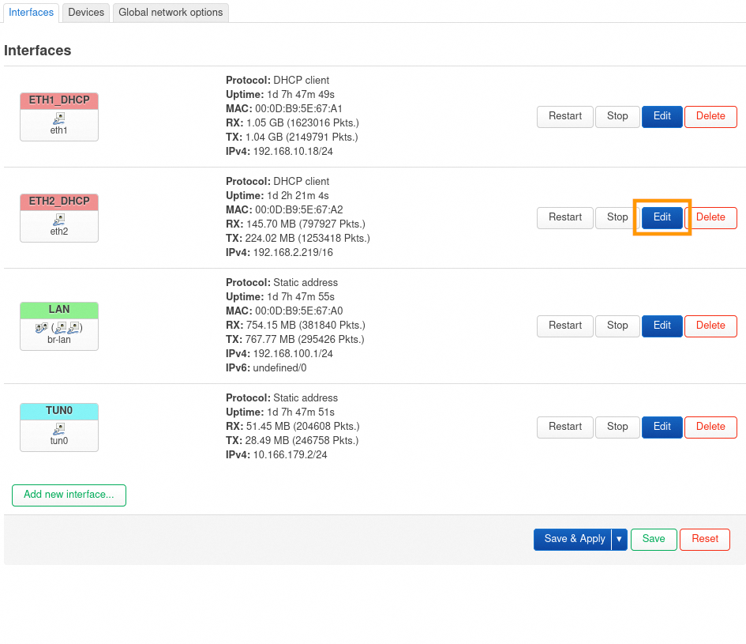{.thumbnail}
>>
>> - Modifiez le protocole en `Static Address`{.action}.
>> - Cliquez sur le bouton `Switch protocol`{.action}.
>> - Puis passez à l'étape 2 « Configuration ».
>>
>> 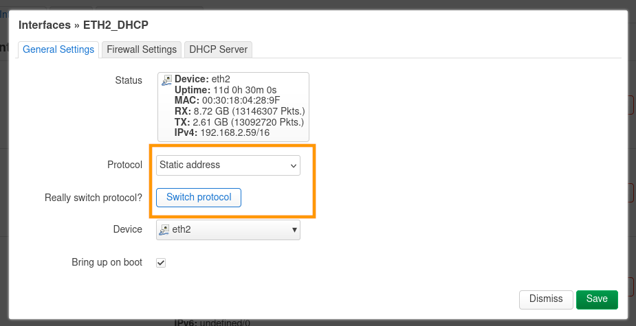{.thumbnail}
>>
> 2. Configuration
>>
>> - Dans le paramètre `IPv4 address`{.action}, renseignez l'IP statique que l'**OverTheBox** doit utiliser (cette IP ne doit pas être déjà utilisée). Pour notre exemple, `192.168.2.10`.
>> - Dans le paramètre `IPv4 netmask`{.action}, renseignez le [masque de sous réseau](https://fr.wikipedia.org/wiki/Sous-r%C3%A9seau#IPv4). Pour notre exemple, le réseau est `192.168.2.0/24`, le masque est donc `255.255.255.0`.
>> - Dans le paramètre `IPv4 gateway`{.action}, renseignez l'IP de passerelle de votre modem. Pour notre exemple, le modem a l'IP `192.168.2.1`.
>> - De manière facultative, vous pouvez donner un autre nom à l'interface avec le paramètre `Label`{.action}.
>> - Confirmez vos changements avec le bouton `Save`{.action}.
>> - Appliquez vos changements avec le bouton `Save & Apply`{.action}.
>>
>> 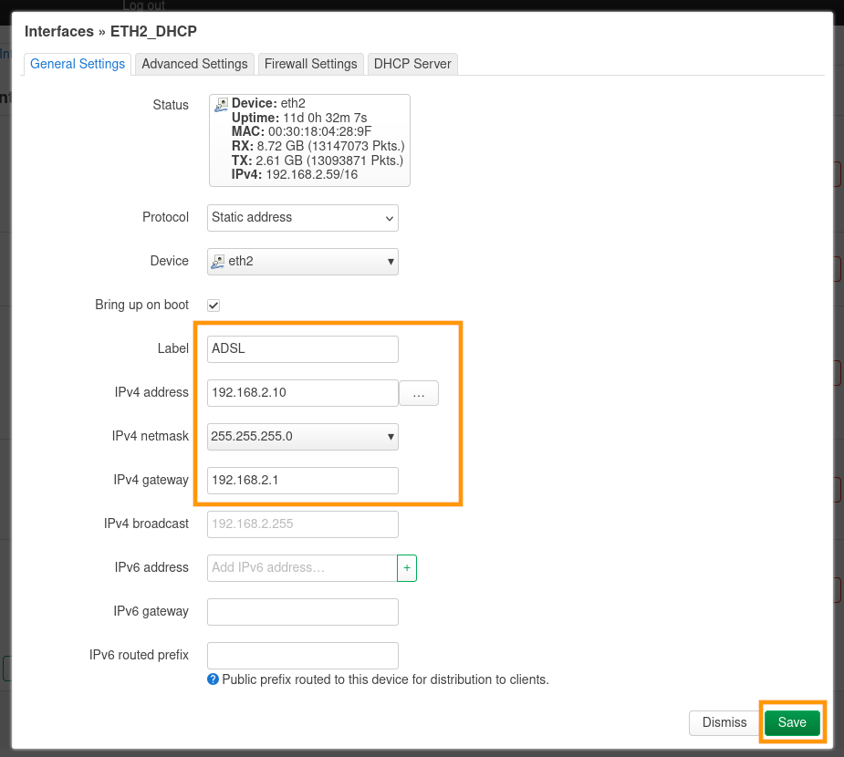{.thumbnail}
>>

#### Configurer une interface en PPPoE 

> [!primary]
>
> Cette configuration n'est fonctionnelle qu'avec [les offres internet d'OVHcloud](/links/telecom/offre-internet).
>

Si vous souhaitez qu'une interface utilise le PPPoE plutôt que le DHCP de votre modem.

- Pour un **accès fibre**, vous pouvez directement brancher l'**OverTheBox** à l'**ONT**.
- Pour un **accès DSL**, vous devez brancher l'**OverTheBox** sur un **modem en bridge**. Voir le guide « [Comment activer le mode bridge sur un modem Zyxel](pages/web_cloud/internet/internet_access/comment_activer_bridge_zyxel) ».

Tout d'abord, consultez le guide « [Configurer un routeur manuellement](/pages/web_cloud/internet/internet_access/advanced_config_router_manually) » pour obtenir vos **identifiants de connexion PPP** ainsi que votre **profil d'accès internet**

[!tabs]
> 1. Changer de protocole
>>
>> - Rendez-vous dans l'onglet `Network > Interfaces`{.action}.
>> - Sélectionnez l'interface à modifier, dans notre exemple `eth2_dhcp`.
>> - Cliquez sur le bouton `Edit`{.action}.
>>
>> {.thumbnail}
>>
>> - Modifiez le protocole en `PPPoE`{.action}.
>> - Cliquez sur le bouton `Switch protocol`{.action}.
>> - Puis passez à l'étape 2 « Configuration ».
>>
>> 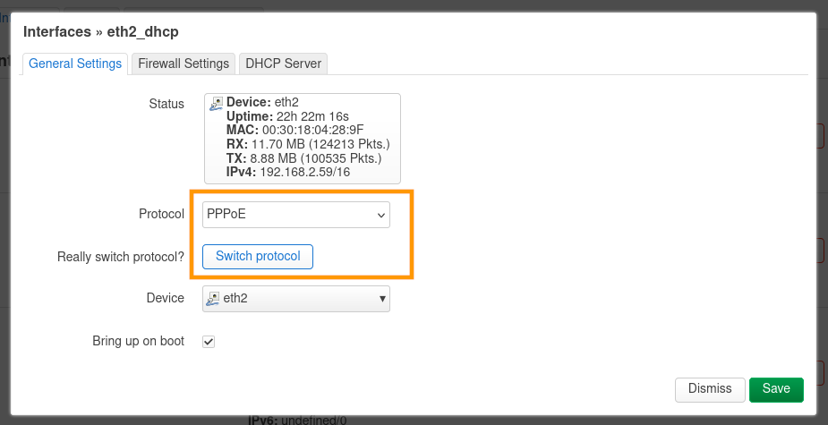{.thumbnail}
>>
> 2. Configuration
>>
>> - Dans le paramètre `PAP/CHAP username`{.action}, renseignez votre **nom d'utilisateur PPP**. Pour notre exemple, `0320xxyyzz_1@ovh.kosc`.
>> - Dans le paramètre `PAP/CHAP password`{.action}, renseignez votre **mot de passe PPP** reçu par e-mail.
>>
>> {.thumbnail}
>>
>> - Rendez-vous dans la section `Advanced Settings`{.action}.
>> - Vérifiez que le paramètre `Obtain IPv6 address`{.action} est correctement positionné sur `Disabled`. Si ce n'est pas le cas, modifiez-le.
>> - Confirmez vos changements avec le bouton `Save`{.action}.
>> - Appliquez vos changements avec le bouton `Save & Apply`{.action}.
>> - Si votre **profil d'accès internet** nécessite un **VLAN**, passez à l'étape 3 « Ajout du VLAN ».
>>
>> 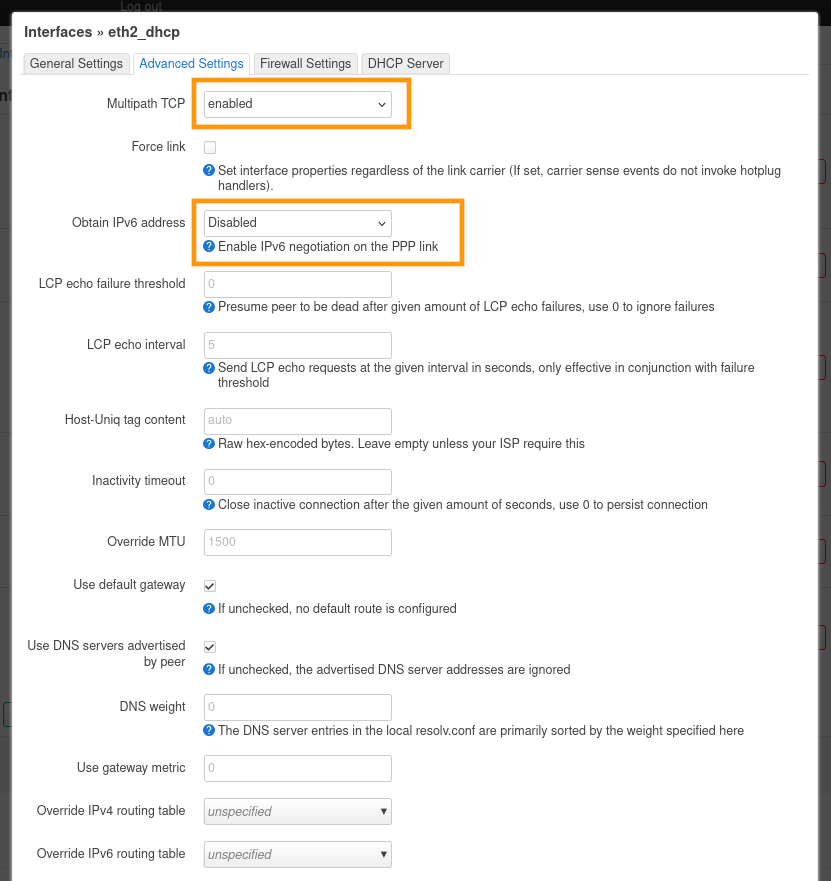{.thumbnail}
>>
> 3. Ajout du VLAN
>>
>> - Si votre **profil d'accès internet** est `Standard`, cette étape n'est pas nécessaire.
>> - Si votre **profil d'accès internet** est `Orange`, vous devez utiliser le `VLAN ID` **835**.
>> - Si votre **profil d'accès internet** est `Bouygues`, vous devez utiliser le `VLAN ID` **4001**.
>> - Rendez-vous dans l'onglet `Devices`{.action}.
>> - Cliquez sur le bouton `Add device configuration...`{.action}.
>>
>> {.thumbnail}
>>
>> - Dans le paramètre `Device type`{.action}, renseignez `VLAN 802.1q`.
>> - Dans le paramètre `Base device`{.action}, renseignez l'interface. Pour notre exemple, `eth2`.
>> - Dans le paramètre `VLAN ID`{.action}, renseignez le `VLAN ID` de votre **profil d'accès internet**. Pour notre exemple, en profil **Bouygues**, le `VLAN ID` est `4001`.
>> - Confirmez vos changements avec le bouton `Save`{.action}.
>> - Appliquez vos changements avec le bouton `Save & Apply`{.action}.
>> - Puis passez à l'étape 4 « Utiliser le VLAN ».
>>
>> 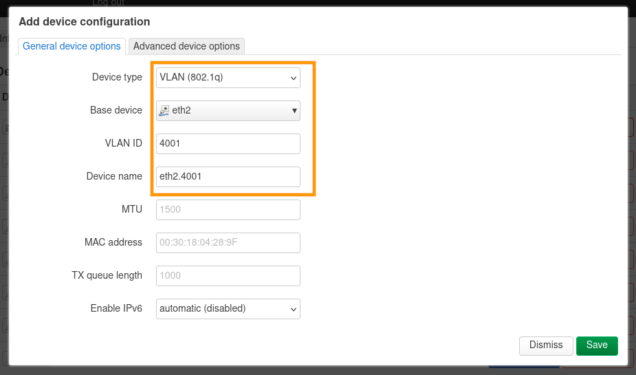{.thumbnail}
>>
> 4. Utiliser le VLAN
>>
>> - Si votre **profil d'accès internet** est `Standard`, cette étape n'est pas nécessaire.
>> - Retournez sur l'onglet `Interfaces`{.action}.
>> - Cliquez sur le bouton `Edit`{.action} de l'interface.
>> - Dans le paramètre `Device`{.action}, renseignez le *device* créé lors de l'étape précédente. Pour notre exemple, `eth2.4001`.
>> - Confirmez vos changements avec le bouton `Save`{.action}.
>> - Appliquez vos changements avec le bouton `Save & Apply`{.action}.
>>
>> 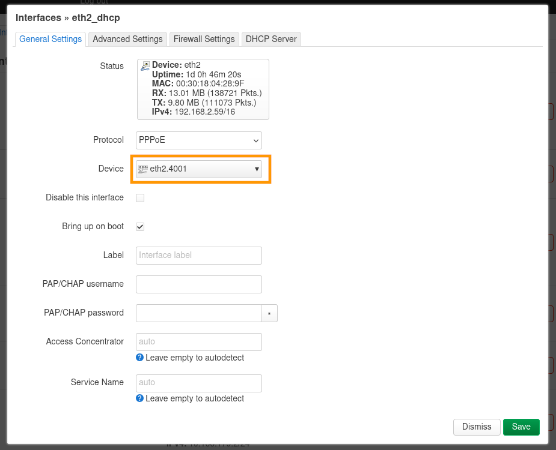{.thumbnail}
>>

#### Configurer une interface 4G 

> [!warning]
>
> Cette section est pour un usage avancé, veuillez d'abord consulter le guide « [Comment configurer un lien 4G sur OverTheBox?](pages/web_cloud/internet/overthebox/plus_itv2_lte) ».
>

Cette section est indiquée pour vous si :

- Vous utilisez votre propre matériel avec un module 4G/5G intégré.
- Vous souhaitez configurer manuellement une interface 4G.
- Vous utilisez un modem USB qui n'utilise pas le DHCP.
- Vous souhaitez aller plus loin dans la configuration d'une **OTB V3 LTE**.

> [!primary]
>
> Le protocole `uqmi` est disponible nativement sur **OverTheBox**, mais l'usage de `ModemManager` est recommandé.
>

[!tabs]
> 1. Exploration
>>
>> - Rendez-vous dans l'onglet `Status > Mobile Service`{.action}.
>> - Notez le *device* utilisé par votre interface, dans notre exemple : `/sys/devices/pci0000:00/0000:00:14.0/usb2/2-2`.
>> - Puis passez à l'étape 2 « Ajout ».
>>
>> 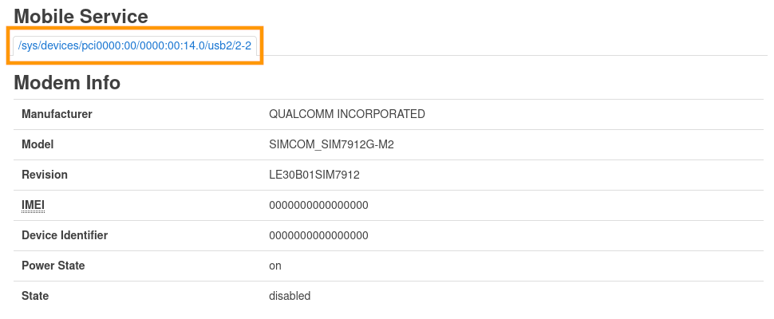{.thumbnail}
>>
> 2. Ajout
>>
>> - Retournez sur l'interface web.
>> - Rendez-vous dans l'onglet `Network > Interfaces`{.action}.
>> - Cliquez sur le bouton `Add new interface...`{.action}.
>>
>> 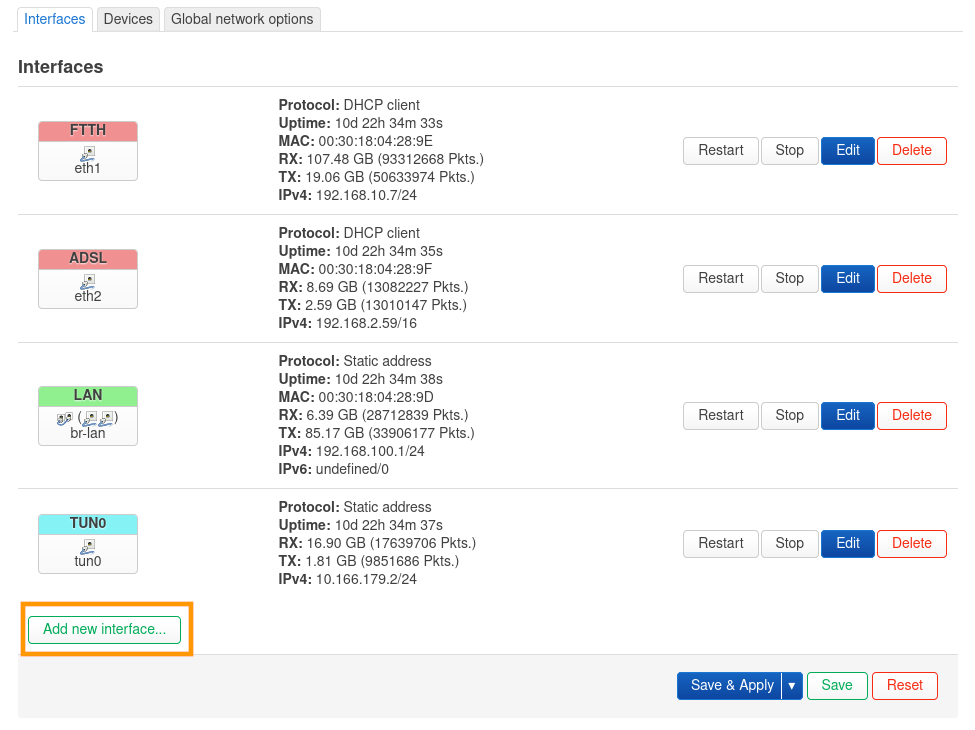{.thumbnail}
>>
>> - Dans le paramètre `Name`{.action}, renseignez un nom. Pour notre exemple, `LTE`.
>> - Dans le paramètre `Protocol`{.action}, renseignez `ModemManager`.
>> - Cliquez sur le bouton `Create Interface`{.action}.
>> - Puis passez à l'étape 3 « Configuration ».
>>
>> 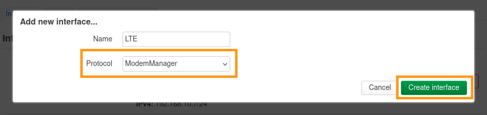{.thumbnail}
>>
> 3. Configuration
>>
>> - Dans le paramètre `Modem Device`{.action}, choisissez le *device* récupéré à l'étape 1. Pour notre exemple, `/sys/devices/pci0000:00/0000:00:14.0/usb2/2-2`.
>> - Dans le paramètre `APN`{.action}, renseignez l'APN de votre opérateur.
>> - Dans le paramètre `PIN`{.action}, renseignez le PIN de votre carte SIM.
>> - Dans le paramètre `Authentication Type`{.action}, renseignez le champ en suivant les recommandations de votre opérateur, par défaut `None` pour les opérateurs nationaux.
>> - Dans le paramètre `IP Type`{.action}, renseignez `IPv4 only`.
>>
>> 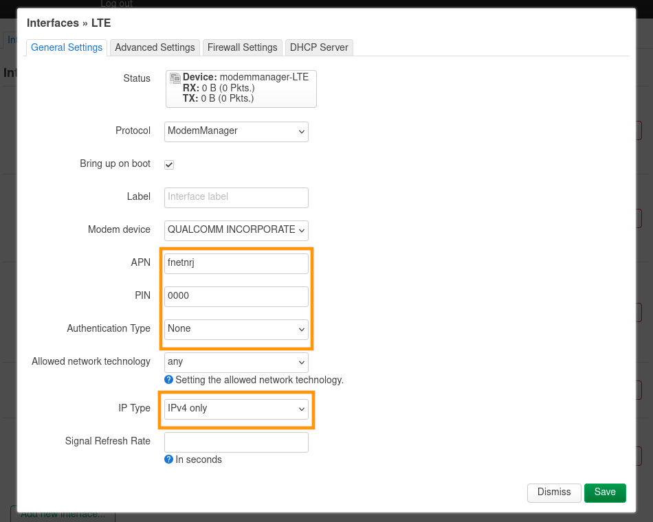{.thumbnail}
>>
>> - Rendez-vous dans la section `Advanced Settings`{.action}.
>> - Vérifiez que le paramètre `Multipath TCP`{.action} est correctement positionné sur `enabled` ou `backup`.
>> - Dans le paramètre `Use gateway metric`{.action}, renseignez un poids, idéalement plus haut que les interfaces physiques, par exemple `38`.
>> - Dans le paramètre `Override IPv4 routing table`{.action}, renseignez une table, idéalement plus haute que les interfaces physiques, par exemple `208` (ce paramètre ne peut pas dépasser 253).
>>
>> 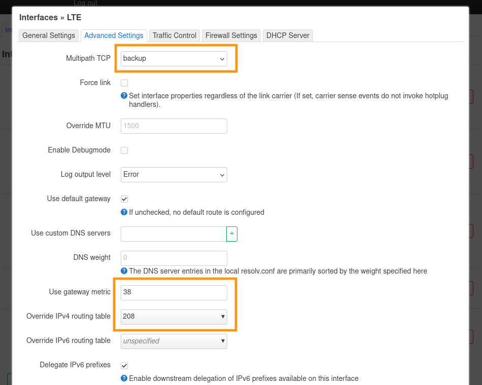{.thumbnail}
>>
>> - Rendez-vous dans la section `Firewall`{.action}.
>> - Dans le paramètre `Create / Assign firewall-zone`{.action}, choisissez la zone `wan` en rouge.
>> - Confirmez vos changements avec le bouton `Save`{.action}.
>>
>> 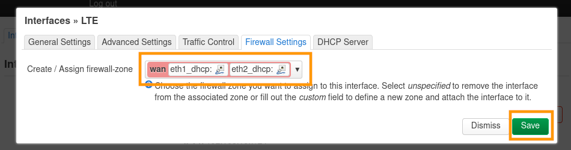{.thumbnail}
>>
>> - Appliquez vos changements avec le bouton `Save & Apply`{.action}.
>> - Puis passez à l'étape 4 « Vérification ».
>>
>> {.thumbnail}
>>
> 4. Vérification
>>
>> - Rendez-vous dans l'onglet `Status > Mobile Service`{.action}.
>> - Vérifiez que le paramètre `Power State` est sur `on`.
>> - Vérifiez que le paramètre `State` est sur `connected`.
>> - Vérifiez que le paramètre `Signal Quality` est au-dessus de `50%`. Une valeur plus basse indique une mauvaise réception.
>> - Vérifiez que les paramètres `MCC` et `MNC` correspondent aux valeurs fournies par votre opérateur.
>> - Vérifiez que le paramètre `Active` de la carte SIM est sur `yes`.
>>
>> 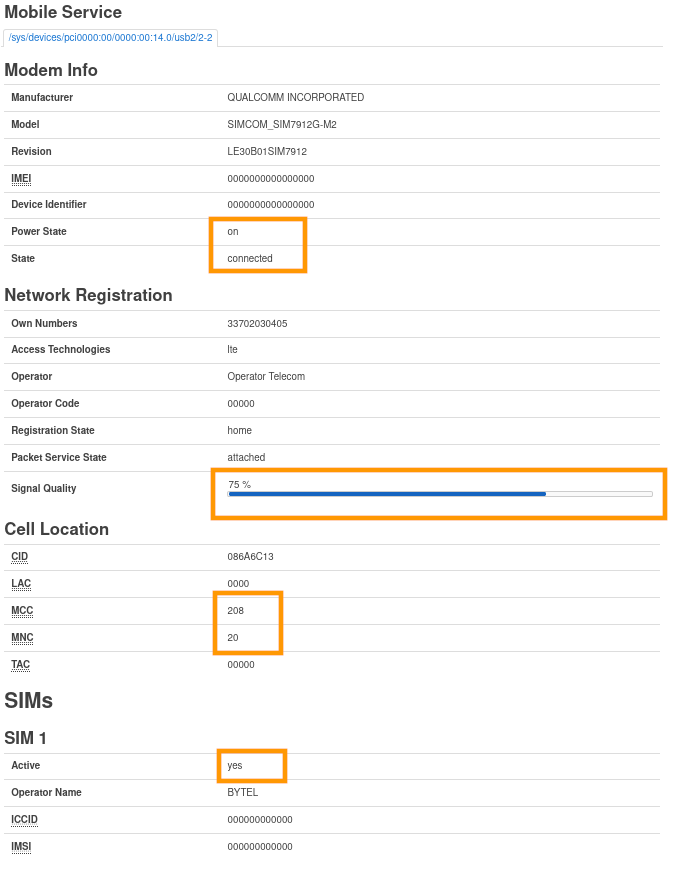{.thumbnail}
>>

## Aller plus loin

### Configurations avancées des interfaces

Ce guide contient de nombreuses informations vous permettant d'établir des configurations avancées de vos interfaces.

- Pour des configurations à base de VLAN, consultez les étapes 3 et 4 de la section « [Configurer une interface en PPPoE](pppoe) ».
- Pour la création manuelle d'une interface WAN, consultez l'étape 3 de la section « [Configurer une interface en 4G](#4g) », en particulier les paramètres de la section `Advanced Settings` et `Firewall`.
- Pour la création et la configuration d'un bridge, consultez la section « [OTB V3 et V2c](v3-v2c) ».

**OverTheBox** étant basé sur **OpenWRT**, vous pouvez également consulter la [documentation OpenWRT](https://openwrt.org/docs/start).

Vous pouvez aussi échanger avec notre communauté d'utilisateurs sur notre site [OVHcloud Community](https://community.ovh.com/c/telecom)
