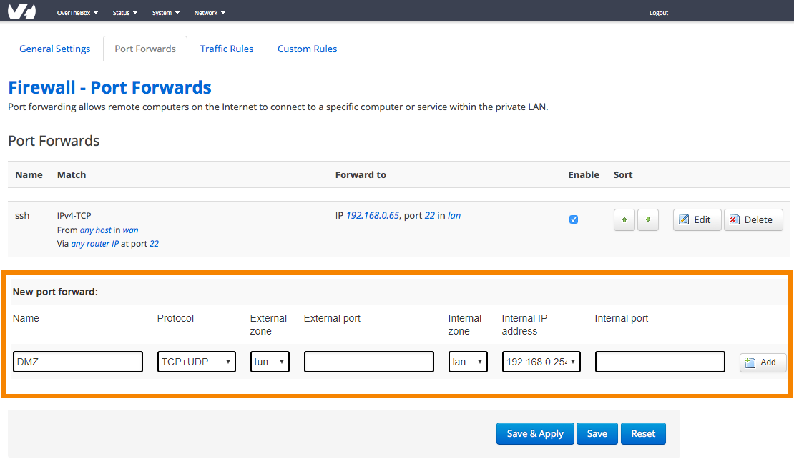

## Objectif

Si vous souhaitez conserver un routeur, tel qu'un pfSense, pour gérer votre LAN, vos VPNs, etc., tout en bénéficiant des fonctionnalités avancées de OverTheBox, vous pouvez configurer OverTheBox en mode transparent en créant une DMZ.

**Découvrez comment coupler OverTheBox avec un autre routeur en créant une DMZ.**

## Prérequis

- Disposer d'un service [OverTheBox](https://www.ovhtelecom.fr/overthebox/)
- Au moins un accès à Internet, par [OVHcloud](https://www.ovhtelecom.fr/offre-internet/) ou un autre founisseur d'accès
- Un matériel OverTheBox fourni par OVHcloud ou une installation depuis le projet Open Source ([installer l'image overthebox sur votre materiel](/pages/web_cloud/internet/overthebox/advanced_installer_limage_overthebox_sur_votre_materiel))

L'intégralité de votre réseau **LAN** sera gérée par votre routeur personnel. Cela comprend le **serveur DHCP**. Veuillez donc d'abord désactiver le **serveur DHCP** de votre **OverTheBox** comme indiqué sur le guide suivant :

[Désactiver le serveur DHCP d’OverTheBox](/pages/web_cloud/internet/overthebox/middle_desactiver_le_serveur_dhcp_doverthebox)

## En pratique

Rendez-vous sur [http://overthebox.ovh (192.168.100.1)](http://overthebox.ovh){.external} depuis votre ordinateur connecté au modem principal.

- Cliquez sur **"Network"**, puis sur **"Firewall"** et enfin sur **"Port Forwards"**.
- Configurez votre redirection :
    - **Name** : DMZ
    - **Protocol** : TCP + UDP
    - **External zone** : indiquez **TUN**
    - **External port** : laissez vide
    - **Internal zone** : indiquez **LAN**
    - **Internal Ip** : Indiquer l'adresse IP de votre routeur
    - **Internal port** : laissez vide
- Cliquez d'abord sur **"Add"** puis sur **"Save & Apply"**.

{.thumbnail}

## Aller plus loin

- N'hésitez pas à échanger avec notre communauté d'utilisateurs sur vos produits Télécom sur notre site [OVHcloud Community](https://community.ovh.com/c/telecom)
- Consultez la [FAQ OverTheBox](/pages/web_cloud/internet/overthebox/install_faq)