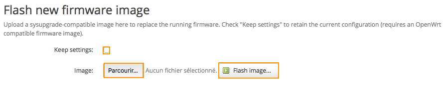
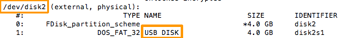
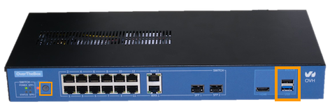
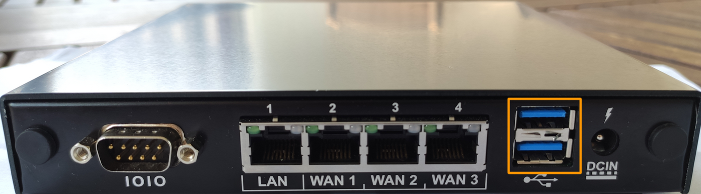

## Objectif

Installer l'image OverTheBox sur votre propre matériel est une étape cruciale pour tirer pleinement parti des fonctionnalités avancées de gestion de réseau qu'offre OVHcloud. Ce guide vous explique comment installer ou mettre à jour votre matériel en installant manuellement l'image OverTheBox.

**Découvrez comment installer l'image OverTheBox sur votre matériel.**

## Prérequis

- Une **OverTheBox** fournie par OVHcloud ou un matériel compatible avec la solution OverTheBox (plateforme x86_64 avec un processeur Intel ou AMD)
- Au moins un accès à Internet, fourni par [OVHcloud](https://www.ovhtelecom.fr/offre-internet/) ou un autre founisseur d'accès

## En pratique

### Télécharger la dernière image du logiciel OverTheBox

Pour installer manuellement le logiciel OverTheBox, vous devez télécharger l'image sur votre ordinateur.

- Pour un appareil avec un unique port ethernet RJ45 (comme un NUC Intel), seule la version [v0.8](http://downloads.overthebox.net/v0.8/targets/x86/64/latest.img.gz) est compatible.
- Pour un appareil de type **Raspberry Pi 3**, seule [cette image](http://downloads.overthebox.net/v0.8/targets/brcm2708/bcm2710/latest.img.gz) est compatible.
- Pour un appareil avec plusieurs ports ethernet RJ45, nous recommandons d'utiliser la dernière version [stable](http://downloads.overthebox.net/stable/targets/x86/64/latest.img.gz).

Si vous cherchez une version particulière, d'autres options sont disponible sur le site [http://downloads.overthebox.net/](http://downloads.overthebox.net/).

### Mettre à jour un appareil OverTheBox

> [!warning]
>
> Cette méthode est recommandée pour les appareils sous une version inférieure à v0.6.33 ou qui ne contactent pas le serveur de provisioning.
>

Si une version du logiciel OverTheBox est déjà installée sur votre appareil, vous pouvez simplement le mettre à jour depuis l'interface web locale.

- Rendez-vous sur [http://overthebox.ovh](http://overthebox.ovh){.external} ou [http://192.168.100.1](http://192.168.100.1).
- Cliquez sur `System`{.action}.
- Cliquez sur `Backup/Flash Firmware`{.action}.

{.thumbnail}

Ensuite, dans la section **Flash new firmware image** :

- Cliquez sur `Parcourir`{.action}.
- Choisissez le fichier image que vous venez de télécharger.
- Laissez la case **"Keep settings"** cochée si vous souhaitez conserver vos configurations.
- Cliquez sur `Flash image`{.action}.

{.thumbnail}

- Attendez quelques minutes afin qu'**OverTheBox** soit de nouveau opérationnelle.

> [!success]
>
> Votre OverTheBox est maintenant mise à jour, votre configuration a été réappliquée automatiquement si la case **Keep settings** n'a pas été décochée.
>

### Installation automatique à l'aide d'une clé USB

> [!warning]
>
> Cette méthode n'est disponible que pour les appareils vendus par OVHcloud.
>

Si le système n'est pas installé sur votre appareil, vous pouvez créer une clé USB bootable contenant l'image OverTheBox afin d'installer complétement le système.

#### Création d'une clé USB bootable sous Windows

- Téléchargez la dernière image **OverTheBox** sur votre ordinateur
- Décompressez l'image grâce à un logiciel tel que [WinRAR](https://www.rarlab.com/download.htm){.external} afin d'obtenir le fichier **.img**.
- Branchez la clé USB sur l'ordinateur.
- Téléchargez le logiciel [Win32 Disk Imager](https://win32diskimager.org/#download){.external} et ouvrez-le.
- Cliquez sur `Parcourir`{.action} pour retrouver le fichier **.img**.
- Sélectionnez la clé USB dans le champ **Device**.
- Cliquez sur `Write`{.action}.
- Une fois la procédure terminée, cliquez sur `Exit`{.action}.

{.thumbnail}

> [!success]
>
> La clé USB est maintenant prête à être utilisée pour flasher l'OverTheBox.
>

#### Création d'une clé USB bootable sous macOS

Toute l'opération se faisant en ligne de commande, ouvrez le **Terminal**.

- Téléchargez la dernière image **OverTheBox** sur votre ordinateur

Identifiez le dossier désignant les partitions de votre clé USB.

- Branchez la clé USB puis entrez la commande suivante :

```bash
diskutil list
```

Vous obtiendrez plusieurs rubriques /dev/disk**X** (où **X** est remplacé par un chiffre).

Le dossier correspondant à votre clé doit être le dernier et être désigné ainsi : « /dev/disk **X**  (external, physical) ».

{.thumbnail}

Maintenant que vous connaissez l'emplacement de votre clé USB, vous pouvez flasher cette dernière.

- Tapez la commande suivante (**en remplaçant X par le bon chiffre de votre clé**) :

```bash
# Positionnez vous dans le dossier où se trouve l'image
cd ~/Téléchargements
gunzip -c latest.img.gz | dd of=/dev/diskX
```

Patientez le temps de l'exécution, **cela peut durer plusieurs minutes**.

> [!success]
>
> La clé USB est maintenant prête à être utilisée pour flasher l'OverTheBox.
>

#### Création d'une clé USB bootable sous Linux

Toute l'opération se faisant en ligne de commande, ouvrez le **Terminal**.

- Téléchargez la dernière image **OverTheBox** sur votre ordinateur

Identifiez le dossier désignant les partitions de votre clé USB.

- Branchez la clé USB puis tapez la commande suivante :

```bash
df -h
```

Vous obtiendrez plusieurs rubriques /dev/sd**X** (où **X** est remplacé par une lettre)
Le dossier correspondant à votre clé doit être le dernier. Vous pouvez vous en assurer en vérifiant que le nom de votre clé est bien affiché dans les dernières lignes.
Maintenant que vous connaissez l'emplacement de votre clé USB, vous pouvez flasher cette dernière.

- Tapez la commande suivante (**en remplaçant X par la bonne lettre de votre clé**) :

```bash
# Positionnez vous dans le dossier où ce trouve l'image
cd ~/Téléchargements
gunzip -c latest.img.gz | dd of=/dev/sdX
```

Patientez le temps de l’exécution, **cela peut durer plusieurs minutes**.

> [!success]
>
> La clé USB est maintenant prête à être utilisée pour flasher l'OverTheBox.
>

#### Utilisation de la clé USB bootable

- Débranchez l'**OverTheBox** du courant électrique
- Branchez la clé USB bootable sur un des ports USB de l'**OverTheBox**

Dans le cas de l'OverTheBox Intel, la clé USB doit être branchée sur un des ports USB **au dos** de l'appareil.

{.thumbnail}

Dans le cas d'une OverTheBox IT v1, la clé USB doit être branchée sur un des ports USB **noirs** :

{.thumbnail}

Dans le cas d'une OverTheBox Plus, la clé USB doit être branchée sur un des ports USB **en façade** :

{.thumbnail}

Dans le cas d'une OverTheBox IT v2, la clé USB doit être branchée sur un des ports USB **au dos** :

{.thumbnail}

- Branchez l'**OverTheBox** sur le courant électrique. Le boîtier commence sa réinitialisation
- Dans le cas de l'OverTheBox Intel, attendez que le **voyant de façade Power** soit éteint (cela peut prendre plusieurs minutes).
- Dans le cas de l'OverTheBox IT v1, attendez que le **voyant de façade Power** s'éteigne puis se rallume automatiquement (cela peut prendre plusieurs minutes).
- Dans le cas de l'OverTheBox Plus, attendez que le **voyant de façade Power** s'éteigne puis se rallume automatiquement (cela peut prendre plusieurs minutes).
- Dans le cas de l'OverTheBox IT v2, attendez que le **voyant de façade Power** s'éteigne puis se rallume automatiquement (cela peut prendre plusieurs minutes).
- Débranchez la clé USB puis redémarrez votre **OverTheBox**.

> [!success]
>
> Votre OvertheBox est maintenant opérationelle. Vous pouvez l'installer en suivant la procédure décrite dans les guides suivants :
>
> [Configurer un ancien appareil OverTheBox v1 (Intel & IT v1)](/pages/web_cloud/internet/overthebox/intel_itv1_installation)
>
> [Comment installer OverTheBox ?](/pages/web_cloud/internet/overthebox/plus_itv2_installation)
>

### Installation manuelle depuis une distribution Linux live

Dans le cas d'un autre appareil non fourni par OVHcloud, vous devez installer l'image OverTheBox manuellement en écrivant l'image directement sur le disque dur de votre matériel.

#### Booter depuis une distribution Linux live

Vous pouvez par exemple créer une clé USB bootable sous Ubuntu en vous aidant de [cette documentation](http://doc.ubuntu-fr.org/live_usb){.external}.
Vous aurez besoin d'un clavier et d'un écran.

#### Identifier l'espace disque de destination

Entrez la commande suivante :

```bash
cat /proc/partitions

root@ubuntu:~# cat /proc/partitions
major minor  #blocks  name
 179        0    3866624 mmcblk0
 179        1       4096 mmcblk0p1
 179        2     524288 mmcblk0p2
 179       24       2048 mmcblk0rpmb
 179       16       2048 mmcblk0boot1
 179        8       2048 mmcblk0boot0
```

Dans cet exemple, on identifie que la destination d'installation sera **mmcblk0**.

#### Télécharger l'image OverTheBox

La page suivante liste les images d'**OverTheBox** compilées : [http://downloads.overthebox.net/stable/](http://downloads.overthebox.net/stable/){.external}

```bash
wget http://downloads.overthebox.net/stable/targets/x86/64/latest.img.gz
```

#### Installation

Décompressez l'image téléchargée et écrivez-la sur le disque grâce à l'utilitaire **dd**.

```bash
gunzip latest.img.gz
sudo dd if=latest.img of=/dev/mmcxxx
```

Vous devez remplacer **mmcxxx par votre destination d'installation.

Retirez maintenant votre « live usb » et redémarrez votre matériel.

> [!success]
>
> Votre matériel est maintenant opérationel. Vous pouvez l'installer en suivant la procédure décrite dans les guides suivants :
>
> - Sur une machine avec 1 seul port ethernet : [Configurer un ancien appareil OverTheBox v1 (Intel & IT v1)](/pages/web_cloud/internet/overthebox/intel_itv1_installation).
> - Sur une machine avec plus d'un port ethernet : [Comment installer OverTheBox ?](/pages/web_cloud/internet/overthebox/plus_itv2_installation).
>

## Aller plus loin

- N'hésitez pas à échanger avec notre communauté d'utilisateurs sur vos produits Télécom sur notre site [OVHcloud Community](https://community.ovh.com/c/telecom)
- Consultez la [FAQ OverTheBox](/pages/web_cloud/internet/overthebox/install_faq)
