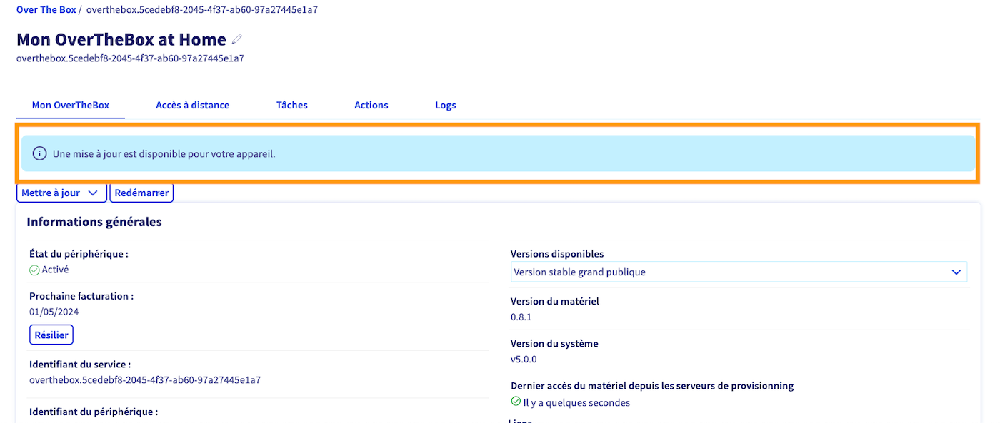
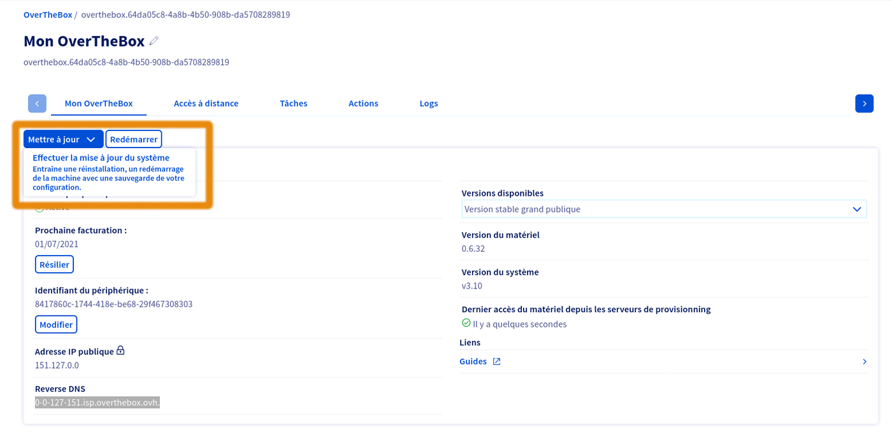
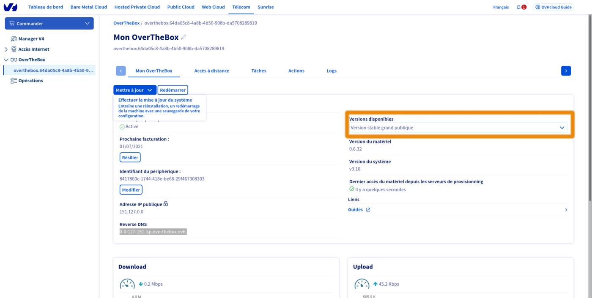
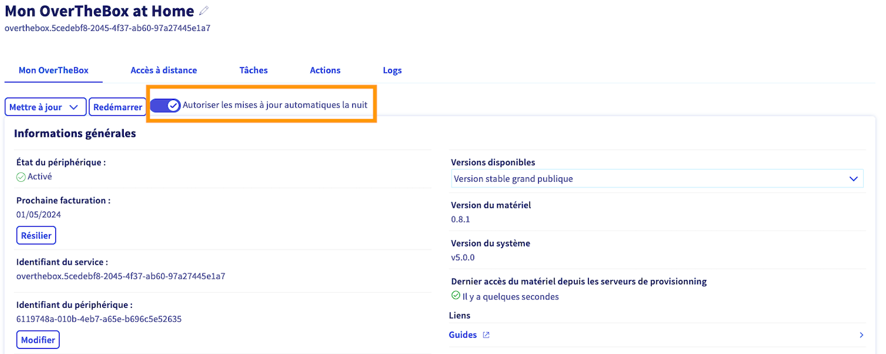

## Objectif

Découvrez comment mettre à jour votre appareil OverTheBox, afin de profiter des dernières améliorations apportées sur cette solution.

## Prérequis

- Disposer d'un service **OverTheBox** fourni par OVHcloud.
- Être connecté à l'[espace client OVHcloud](/links/manager) dans la partie `Telecom`{.action}.

## En pratique

La méthode recommandée est de mettre à jour votre appareil OverTheBox depuis l'espace client OVHcloud.

### Consulter la version de son appareil

L'OverTheBox est un projet open-source hébergé sur la plateforme GitHub. Le code est librement accessible et vous permet de consulter concrètement ce qui change entre chaque version.
La version d'un appareil est au format [semver](https://semver.org/lang/fr/), vous pouvez consulter la version actuellement installée sur votre appareil depuis l'espace client.

Connectez-vous à votre [espace client OVHcloud](/links/manager), partie `Telecom`{.action}.

Cliquez sur `OverThebox`{.action} dans la barre de services à gauche, puis sélectionnez le service OverTheBox que vous souhaitez mettre à jour.

Le champ `Version du matériel` indique la version actuellement installée sur votre appareil. Elle est basée sur les tags du [dépôt git overthebox](https://github.com/ovh/overthebox/tags){.external}.

{.thumbnail}

### Vérifier si une mise à jour est disponible

Connectez-vous à votre [espace client OVHcloud](/links/manager), partie `Telecom`{.action}.

Cliquez sur `OverThebox`{.action} dans la barre de services à gauche, puis sélectionnez le service OverTheBox que vous souhaitez mettre à jour.

Si une mise à jour est disponible, une bannière s'affiche comme sur l'image ci-dessous.

{.thumbnail}

### Mise à jour via l'espace client

> [!warning]
>
> Cette action n'est possible que si votre appareil contacte notre serveur de provisionning. Si ce n'est pas le cas, vous devez effectuer une [installation manuelle](/pages/web_cloud/internet/overthebox/advanced_installer_limage_overthebox_sur_votre_materiel).
>

Connectez-vous à votre [espace client OVHcloud](/links/manager), partie `Telecom`{.action}.

Cliquez sur `OverThebox`{.action} dans la barre de services à gauche, puis sélectionnez le service OverTheBox que vous souhaitez mettre à jour.

Cliquez ensuite sur le bouton `Mettre à jour`{.action}, puis cliquez une seconde fois sur l'encart explicatif, la mise à jour commencera alors.

{.thumbnail}

Attendez quelques minutes afin que l'appareil **OverTheBox** soit de nouveau opérationnel.

> [!success]
>
> Votre appareil OvertheBox est maintenant mise à jour, votre configuration a été réappliquée automatiquement.
>

### Modifier le canal de version

> [!warning]
>
> Pour un appareil avec un unique port ethernet RJ45 (comme un NUC Intel), seul le canal `v0.8` est compatible
>

Par défaut, un appareil OverTheBox est sur le canal `stable` qui contient la dernière version logicielle stable. Ce canal est recommandé, vous pourrez ainsi profiter des dernières fonctionnalités.

D'autre canaux sont disponibles :

- Le canal `beta` permet de tester la prochaine version du logiciel avant le déploiment sur le canal `stable`.
- Les canaux de versions, comme `v0.9`, `v1.0`, permettent de maintenir votre matériel sur une version majeure précise. Seules des mises à jour mineures, telles que des correctifs, seront proposées.

Connectez-vous à votre [espace client OVHcloud](/links/manager), partie `Telecom`{.action}.

Cliquez sur `OverThebox`{.action} dans la barre de services à gauche, puis sélectionnez le service OverTheBox que vous souhaitez modifier.

Selectionnez ensuite le canal souhaité à l'aide du menu déroulant `Versions disponibles`{.action}.

{.thumbnail}

### Désactiver les mises à jour automatiques

Par défaut, un appareil OverTheBox est mis à jour automatiquement la nuit si une nouvelle version du logicielle est disponible. Vous pouvez désactiver cette fonctionnnalité depuis l'espace client.

Connectez-vous à votre [espace client OVHcloud](/links/manager), partie `Telecom`{.action}.

Cliquez sur `OverThebox`{.action} dans la barre de services à gauche, puis sélectionnez le service OverTheBox que vous souhaitez modifier.

Activez ou désactivez les mise à jour automatique à l'aide de l'interrupteur `Autoriser les mises à jour automatiques la nuit`{.action}.

{.thumbnail}

### Voir les différences entre versions

L'OverTheBox est un projet open-source hébergé sur la plateforme GitHub. Le code est librement accessible et vous permet de consulter concrètement ce qui change entre chaque version.

Le code est séparé sur trois dépôts git distincts :

- [overthebox-lede](https://github.com/ovh/overthebox-lede) contient les sources du système [openwrt](https://openwrt.org/) utilisé comme base pour le système d'exploitation d'OverTheBox.
- [overthebox-feeds](https://github.com/ovh/overthebox-feeds) contient les sources des différents paquets modifiés ou ajoutés pour améliorer le logiciel d'OverTheBox.
- [overthebox](https://github.com/ovh/overthebox) contient les sources qui permettent de construire l'image logicielle d'OverTheBox.

L'ensemble des modifications est consultable ici :

- [Changelog en Anglais](https://github.com/ovh/overthebox/releases).
- [Changelog en Français](https://github.com/ovh/overthebox/blob/master/CHANGELOG_fr.md).

## Aller plus loin

### Impossible de se connecter à l'OverTheBox après une mise à jour

Il est recommandé d'attendre environ dix minutes après le lancement de la mise à jour de l'OverTheBox avant de s'y connecter.
En effectuant une mise à jour ou une réinitialisation, les baux DHCP précédemment alloués aux appareils du LAN ne sont plus considérés comme étant émis par l'OverTheBox, cela peut potentiellement induire des problèmes pour les équipement du LAN.

Dans ce cas, les recommandations sont les suivantes :

- Débranchez le câble réseau entre l'ordinateur et l'OverTheBox puis rebranchez-le au bout d'environ une minute.
- Redémarrez les services réseau sur l'ordinateur.
- Redémarrerzl'ordinateur pour le « forcer » à oublier l'ancien lease DHCP.
- Si aucune des étapes précédentes ne fonctionne, débranchez électriquement l'OverTheBox pendant environ une minute puis rebranchez-la.

### Matrice des versions

| Canal | OverTheBox | OpenWRT | Linux | MPTCP | Compatibilité du matériel |
| ---  | :---: | :---: | :---: | :---: | ---: |
| v0.8 | v0.8.1 | 19.07.10 | 4.14.276 | v0.94 | nuc, ITv1, rpi3, v2b, v2c |
| v0.9 | v0.9.6 | 21.02.5 | 5.4.217 | v0.96 | v2b, v2c |
| v1.0 | v1.0.3 | 23.05.5 | 5.15.167 | v1 | v3lte, v3, v2b, v2c |
| stable | v0.9.6 | 21.02.5 | 5.4.217 | v0.96 | v2b, v2c |
| beta | v1.0.3 | 23.05.5 | 5.15.167 | v1 | v3lte, v3, v2b, v2c |

### Installer manuellement une image

Vous pouvez suivre le guide « [Installer l’image OverTheBox sur votre matériel](/pages/web_cloud/internet/overthebox/advanced_installer_limage_overthebox_sur_votre_materiel) » pour installer manuellement la dernière image du système OverTheBox.

N'hésitez pas à échanger avec notre communauté d'utilisateurs sur vos produits Télécom sur notre site [OVHcloud Community](https://community.ovh.com/c/telecom)
