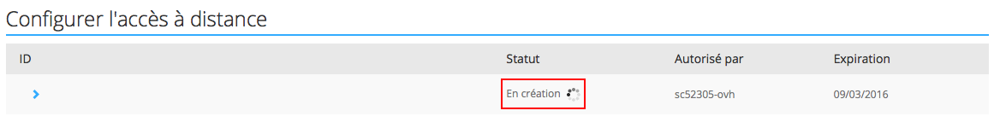

## Objectif

Ajouter un accès à distance à votre OverTheBox permet une gestion et une surveillance sécurisées de votre réseau depuis n'importe quel endroit. Cette fonctionnalité est essentielle pour les administrateurs réseau qui ont besoin de maintenir une continuité opérationnelle et de réagir rapidement à des événements critiques, quel que soit leur emplacement.

**Découvrez comment ajouter un accès à distance sur OverTheBox.**

## Prérequis

- Disposer d'un service [OverTheBox](https://www.ovhtelecom.fr/overthebox/)
- Au moins un accès à Internet, par [OVHcloud](https://www.ovhtelecom.fr/offre-internet/) ou un autre founisseur d'accès
- Un matériel OverTheBox fourni par OVHcloud ou une installation depuis le projet Open Source ([installer l'image overthebox sur votre materiel](/pages/web_cloud/internet/overthebox/advanced_installer_limage_overthebox_sur_votre_materiel))

## En pratique

### Configuration

- Rendez-vous sur votre espace client partie **OverTheBox** : [https://www.ovhtelecom.fr/manager/#/overTheBox/](https://www.ovhtelecom.fr/manager/#/overTheBox/){.external}.
- Cliquez sur votre service **OverTheBox**.
- Cliquez sur **“ Accès à distance ”**.

Informations à inscrire dans la partie “**Ajouter un accès à distance**” :

- **IP autorisée** : Cette adresse IP publique sera la seule autorisée à se connecter sur l'OverTheBox à distance. Laissez ce champ vide si l'IP autorisée doit être celle de votre connexion actuelle.
- **Port exposé (443, 22, ...)** : Port de l'**OverTheBox** qui sera contacté lors de l'accès à distance. Choisir **443** pour un accès à distance via le navigateur ou **22** pour un accès via SSH.
- **Date d'expiration** : Date à laquelle l'accès à distance sera fermé.
- **Clef publique** : Obligatoire pour les connexions de type SSH, cette clef permet une connexion sécurisée.

### Exemple

Si je souhaite pouvoir accéder à mon  **OverTheBox**  via un navigateur web depuis mon adresse IP actuelle, voici ce que je dois configurer :

{.thumbnail}

Une fois cette configuration validée, vous pouvez suivre sa mise en place directement sur la même page du manager. Cela peut prendre plusieurs minutes.

{.thumbnail}

Vous pourrez ensuite retrouver le lien d'accès à distance :

{.thumbnail}

## Aller plus loin

- N'hésitez pas à échanger avec notre communauté d'utilisateurs sur vos produits Télécom sur notre site [OVHcloud Community](https://community.ovh.com/c/telecom)
- Consultez la [FAQ OverTheBox](/pages/web_cloud/internet/overthebox/install_faq)