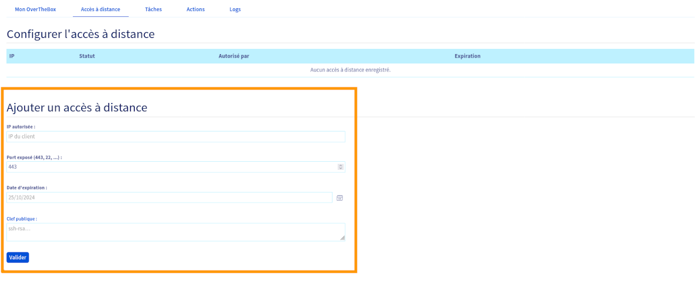
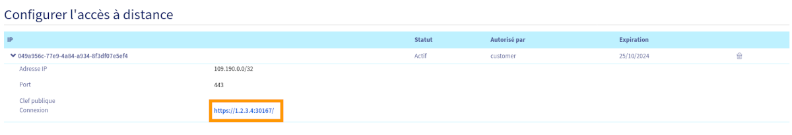
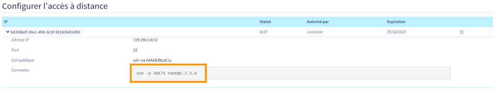
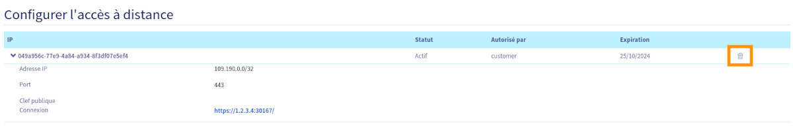

## Objectif

Ajouter un accès à distance à votre OverTheBox permet une gestion et une surveillance sécurisées de votre réseau depuis n'importe quel endroit. Cette fonctionnalité est essentielle pour les administrateurs réseau qui ont besoin de maintenir une continuité opérationnelle et de réagir rapidement à des événements critiques, quel que soit leur emplacement.

**Découvrez comment ajouter un accès à distance sur OverTheBox.**

## Prérequis

- Disposer d'un service **OverTheBox** fourni par OVHcloud.
- Être connecté à l'[espace client OVHcloud](/links/manager) dans la partie `Telecom`{.action}.

## En pratique

### Création de l'accès à distance

Connectez-vous à votre [espace client OVHcloud](/links/manager), partie `Telecom`{.action}. 
Cliquez sur `OverThebox`{.action} dans la barre de services à gauche, puis sélectionnez le service OverTheBox auquel vous souhaitez acceder à distance. 
Cliquez sur `Accès à distance`{.action}.

Informations à inscrire dans la partie `Ajouter un accès à distance`{.action} :

- **IP autorisée** : Cette adresse IP publique sera la seule autorisée à se connecter sur l'OverTheBox à distance. Laissez ce champ vide si l'IP autorisée doit être celle de votre connexion actuelle.
- **Port exposé** : Port de l'**OverTheBox** qui sera contacté lors de l'accès à distance. Choisissez **443** pour un accès à distance via le navigateur ou **22** pour un accès via SSH.
- **Date d'expiration** : Date à laquelle l'accès à distance sera fermé.
- **Clef publique** : Obligatoire pour les connexions de type SSH, cette clef permet une connexion sécurisée.
- Validez la création à l'aide du bouton `Valider`{.action}.
- Une fois l'action créée, patientez quelques minutes le temps que l'accès à distance se configure.

> [!primary]
>
> L'**OverTheBox** se connecte sur notre infrastructure, aucune ouverture de port sur les modems en amont de l'**OverTheBox** n'est nécessaire.
>

{.thumbnail}

### Connexion à distance

> [!primary]
>
> Pour une connexion sur l'interface web, il est possible que le navigateur alerte sur un possible problème de sécurité. La connexion est bien chiffrée mais le navigateur ne reconnaît pas le certificat SSL car il n'est pas signé par une autorité de certification.
>

> [!tabs]
> HTTPS
>>
>> Une fois l'accès à distance créé, vous pouvez vous connecter à votre **OverTheBox** en cliquant sur le lien.
>>
>> {.thumbnail}
>>
> SSH
>>
>> Une fois l'accès à distance créé, vous pouvez vous connecter à votre **OverTheBox** en entrant la commande affichée dans votre terminal.
>>
>> {.thumbnail}
>>

### Suppression de l'accès à distance

Vous pouvez supprimer un accès à distance en cliquant sur le symbole en forme de poubelle.

{.thumbnail}

## Aller plus loin

### Configurer un autre type d'ouverture de port

Pour plus de détails sur l'ouverture de port afin d'accéder à un autre équipement sur votre réseau local, consultez le guide « [Comment configurer une redirection de port ?](/pages/web_cloud/internet/overthebox/middle_redirection_de_port) ».

N'hésitez pas à échanger avec notre communauté d'utilisateurs sur vos produits Télécom sur notre site [OVHcloud Community](https://community.ovh.com/c/telecom)
