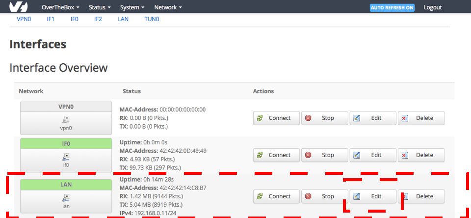

## Objectif

Pour des raisons de configuration réseau spécifiques ou pour intégrer un autre serveur DHCP, vous pouvez désactiver le serveur DHCP sur votre OverTheBox.

**Découvrez comment désactiver le serveur DHCP de votre OverTheBox.**

## Prérequis

- Disposer d'un service [OverTheBox](https://www.ovhtelecom.fr/overthebox/)
- Au moins un accès à Internet, par [OVHcloud](https://www.ovhtelecom.fr/offre-internet/) ou un autre founisseur d'accès
- Un matériel OverTheBox fourni par OVHcloud ou une installation depuis le projet Open Source ([installer l'image overthebox sur votre materiel](/pages/web_cloud/internet/overthebox/advanced_installer_limage_overthebox_sur_votre_materiel))

## En pratique

### Désactivation du serveur

- Connectez vous sur [http://overthebox.ovh (192.168.100.1)](http://overthebox.ovh){.external} en tant qu'administrateur
- Rendez vous dans l'onglet **" Network > Interfaces "**
- Éditez la configuration de l'interface LAN

{.thumbnail}

- Rendez-vous en bas de page, dans la partie "DHCP server"
- Cochez **" Ignore interface "** dans l'onglet "General Setup"
- Cliquez sur "Save & Apply" pour confirmer

{.thumbnail}

## Aller plus loin

- N'hésitez pas à échanger avec notre communauté d'utilisateurs sur vos produits Télécom sur notre site [OVHcloud Community](https://community.ovh.com/c/telecom)
- Consultez la [FAQ OverTheBox](/pages/web_cloud/internet/overthebox/install_faq)