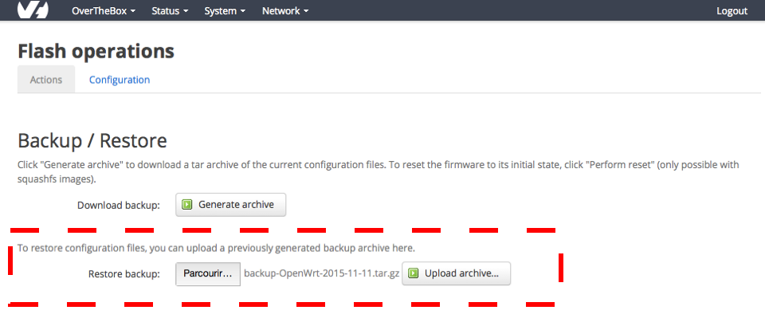

## Objectif

Sauvegarder et restaurer la configuration de votre OverTheBox permet de récupérer rapidement vos paramètres en cas de panne ou de modification réseau inattendue.

**Découvrez comment sauvegarder et restaurer la configuration de votre OverTheBox.**

## Prérequis

- Disposer d'un service [OverTheBox](https://www.ovhtelecom.fr/overthebox/)
- Au moins un accès à Internet, fourni par [OVHcloud](https://www.ovhtelecom.fr/offre-internet/) ou un autre founisseur d'accès
- Un matériel OverTheBox fourni par OVHcloud ou une installation depuis le projet Open Source (consultez le guide « [Installer l'image overthebox sur votre materiel](/pages/web_cloud/internet/overthebox/advanced_installer_limage_overthebox_sur_votre_materiel) »)

## En pratique

### Générer une copie de votre configuration

- Connectez vous sur [http://overthebox.ovh (192.168.100.1)](http://overthebox.ovh){.external} en tant qu'administrateur
- Rendez-vous dans l'onglet `System`{.action} > `Backup / restore firmware`{.action}
- Cliquez sur `Generate Archive`{.action}

{.thumbnail}

### Restaurer une configuration

- Connectez-vous sur [http://overthebox.ovh (192.168.100.1)](http://overthebox.ovh){.external} en tant qu'administrateur
- Rendez-vous dans l'onglet `System`{.action} > `Backup / restore firmware`{.action}
- Sélectionnez votre fichier de configuration
- Cliquez sur `Upload archive`{.action}
- Votre OverTheBox procédera à un redémarrage

{.thumbnail}

## Aller plus loin

- N'hésitez pas à échanger avec notre communauté d'utilisateurs sur vos produits Télécom sur notre site [OVHcloud Community](https://community.ovh.com/c/telecom)
- Consultez la [FAQ OverTheBox](/pages/web_cloud/internet/overthebox/install_faq)