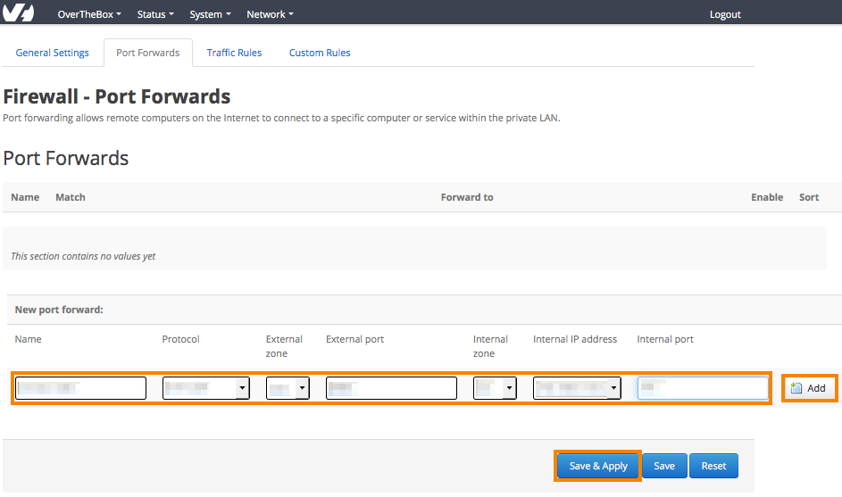
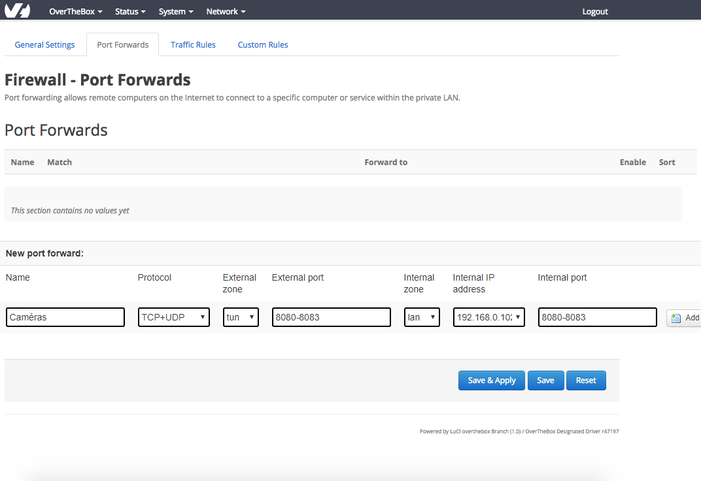

## Objectif

Sur l'OverTheBox, il est possible de configurer une redirection de port afin de vous permettre d'accéder à une machine de votre réseau local depuis un réseau extérieur.

## Prérequis

Afin que la redirection de port fonctionne correctement, il est impératif que la machine cible de cette redirection possède comme passerelle par défaut l'IP de l' **OverTheBox**.

> [!success]
>
> C'est normalement déjà le cas si cette machine est configurée en récupération d'IP automatique et si le DHCP est géré par OverTheBox.
> Pour plus d'informations, consultez la procédure d'installation : [Installation OverTheBox Plus ou IT v2](/pages/web_cloud/internet/overthebox/plus_itv2_installation).
>

## En pratique

> [!warning]
>
> Les ports **5006 à 5009** et **1090** ne peuvent pas être utilisés ou redirigés car ils sont utilisés pour le fonctionnement interne de l'OverTheBox.

### Créer une redirection de port

- Rendez-vous sur [http://overthebox.ovh (192.168.100.1)](http://overthebox.ovh){.external} depuis votre ordinateur connecté au modem principal.
- Cliquez sur **"Network"**
- Cliquez sur **"Firewall"**
- Cliquez sur **"Port Forwards"**
- Configurez votre redirection
    - **Name** : nommez votre règle
    - **Protocol** : choisissez le protocole (il est possible de laisser **TCP + UDP** par défaut)
    - **External zone** : indiquez **TUN**
    - **External port** : renseignez le port appelé depuis l'extérieur
    - **Internal zone** : indiquez **LAN**
    - **Internal Ip** : choisissez l'IP cible de la redirection
    - **Internal port** : indiquez le port de la destination à cibler
- Cliquez d'abord sur **"Add"**
- Cliquez ensuite sur **"Save & Apply"**

#### Exemple

Dans votre réseau  **OverTheBox**, vous possédez un serveur **HTTP**  sur la machine locale **192.168.0.102**  qui affiche la vidéo d'une caméra de surveillance. Vous souhaitez rediriger le port **8080** de l'**OverTheBox** vers le port **80** de ce serveur **HTTP** afin de pouvoir accéder à cette caméra depuis un autre réseau, via l' **IP publique** et le **port 8080** de l' **OverTheBox** .

Voici la configuration à apporter :

{.thumbnail}

### Créer une redirection d'une plage de ports

- Rendez-vous sur [http://overthebox.ovh (192.168.100.1)](http://overthebox.ovh){.external} depuis votre ordinateur connecté au modem principal.
- Cliquez sur **"Network"**
- Cliquez sur **"Firewall"**
- Cliquez sur **"Port Forwards"**
- Configurez votre redirection
    - **Name** : nommez votre règle
    - **Protocol** : choisissez le protocole (il est possible de laisser **TCP + UDP** par défaut)
    - **External zone** : indiquez **TUN**
    - **External port** : renseignez la plage de ports appelée depuis l'extérieur sous la forme **"portDébut-portFin"**
    - **Internal zone** : indiquez **LAN**
    - **Internal Ip** : choisissez l'IP cible de la redirection
    - **Internal port** : indiquez la plage de ports cible sous la forme **"portDébut-portFin"**

> [!warning]
>
> Les plages "external port" et "internal port" doivent comporter le même nombre de ports.
>

- Cliquez d'abord sur **"Add"**
- Cliquez ensuite sur **"Save & Apply"**

#### Exemple

Dans votre réseau  **OverTheBox**, vous possédez 4 serveurs **HTTP** sur la machine locale **192.168.0.102** et qui affichent les vidéos de 4 caméras de surveillance. Vous souhaitez rediriger les ports **8080** à **8083** de l'**OverTheBox** vers les ports **8080** à **8083** de ce serveur **HTTP**, afin de pouvoir accéder à ces caméras depuis un autre réseau via l' **IP publique** de l' **OverTheBox**.

Voici la configuration à apporter :

{.thumbnail}

## Aller plus loin

N'hésitez pas à échanger avec notre communauté d'utilisateurs sur vos produits Télécom sur notre site [OVHcloud Community](https://community.ovh.com/c/telecom).