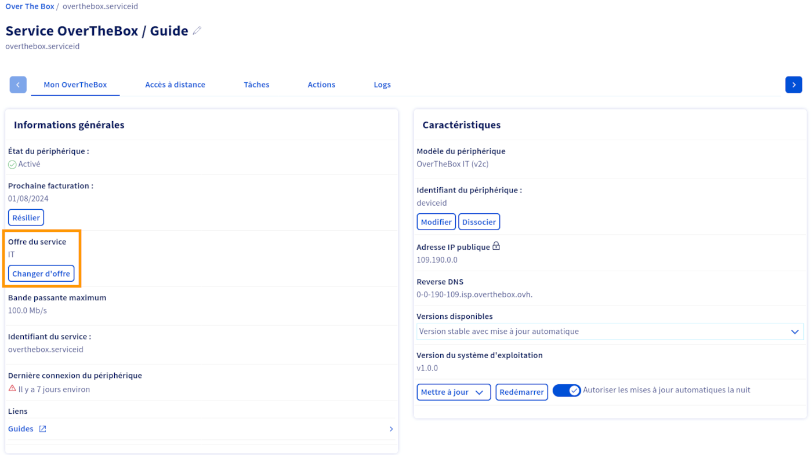
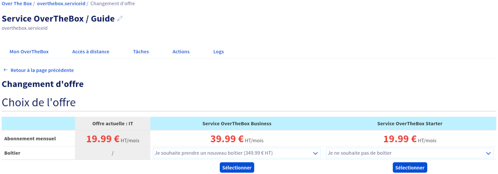
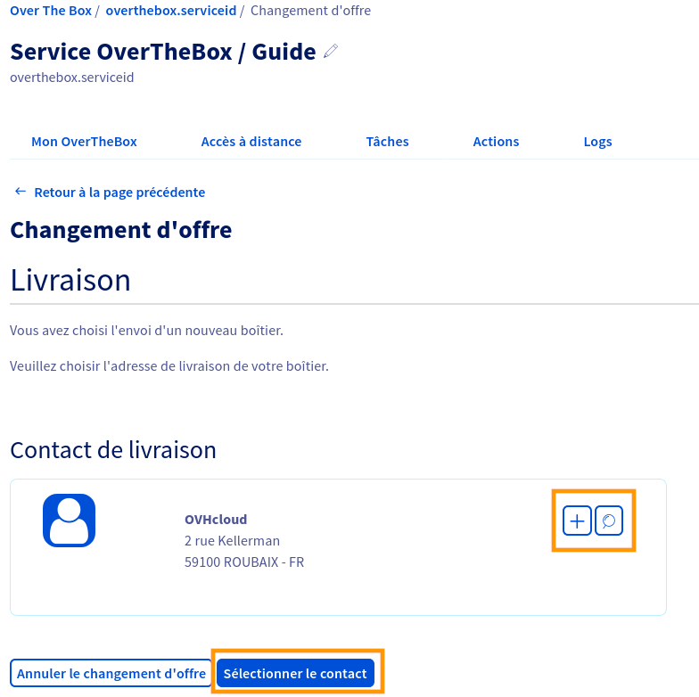
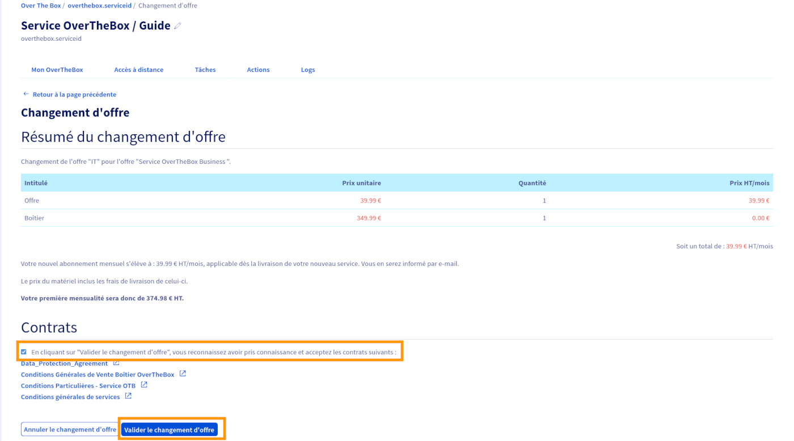
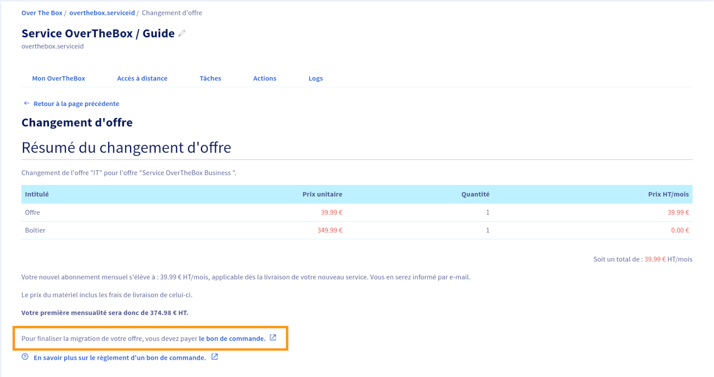

## Objectif

Vous pouvez faire évoluer votre offre OverTheBox afin de pouvoir accéder à de nouvelles fonctionnalités et services.

Le changement d'offre permet de :

- Migrer d'une offre Starter 500Mbps à une offre Business 1Gbps.
- Migrer d'une offre Business 1Gbps à une offre Starter 500 Mbps.
- Migrer d'une ancienne offre de service à une nouvelle offre Starter ou Business.
- Commander un boitier OTBv3

Lors d'une migration, l'adresse IP de votre service est conservée et votre appareil OverTheBox actuel reste compatible.

## Prérequis

- Disposer d'un service OverTheBox actif.
- Être connecté à l’[espace client OVHcloud](/links/manager), partie `Télécom` :

{.thumbnail}

## En pratique

### Changer d’offre

La demande de changement d'offre s'effectue via votre [espace client OVHcloud](/links/manager).

Dans l'onglet `Télécom`{.action}, sélectionnez la rubrique `OverTheBox`{.action} puis choisissez le service que vous souhaitez faire évoluer.

Cliquez ensuite sur `Changer d'offre`{.action} dans le cadre « Informations Générales ».

{.thumbnail}

La première colonne du tableau récapitule votre offre actuelle (son nom et son tarif). Les autres colonnes concernent les offres auxquelles vous pouvez souscrire.
Dans la deuxième ligne du tableau, vous pouvez, si vous le souhaitez, commander un boitier OverTheBox v3 en plus de votre changement d'offre.

Une fois votre choix effectué, cliquez sur le bouton `Sélectionner`{.action} sous la colonne correspondant à l'offre que vous souhaitez souscrire.

{.thumbnail}

### Sélectionner une addresse de livraison

> [!primary]
> Si vous avez choisi l'option `Je ne souhaite pas de boitier`{.action}, vous pouvez passer à la section « [Valider le changement d'offre](#validation) » de ce guide.

Si vous avez choisi de commander un nouveau boitier avec votre changement d'offre, vous devez choisir une adresse de livraison.

Par défaut, l'adresse est celle de votre compte OVHcloud. Vous pouvez cependant modifier cette adresse :

- Cliquez sur le bouton `+`{.action} pour renseigner une nouvelle adresse.
- Cliquez sur le bouton `loupe`{.action} pour sélectionner une adresse précédemment renseignée.

Une fois l'adresse saisie, cliquez sur le bouton `Sélectionner le contact`{.action}.

> [!primary]
> Les frais de livraison sont inclus dans le prix du boitier.

{.thumbnail}

### Valider le changement d'offre 

La page `Résumé du changement d'offre` résume la tarification mensuelle de la nouvelle offre, ainsi que le cout du boitier (si l'option a été sélectionnée).

Validez les contrats afférents, puis cliquez sur le bouton `Valider le changement d'offre`{.action}.

{.thumbnail}

### Payer le bon de commande

> [!primary]
> Une fois le bon de commande payé, le changement d'offre est immédiat si vous n'avez pas choisi de boitier.
> Dans le cas où vous avez choisi un boitier, le changement d'offre sera réalisé à réception du boitier.
> Un remboursement au prorata de la facturation du mois en cours est alors établi.

Pour finaliser le changement d'offre, ainsi que la livraison du boitier, vous devez payer le bon de commande généré lors de la confirmation de la migration.Pour ce faire, cliquez sur le lien contenu dans la phrase `Pour finaliser la migration de votre offre, vous devez payer le bon de commande.`{.action}.

> [!primary]
> Pour plus d'informations sur le paiement d'un bon de commande, consultez le guide « [Gérer mes commandes OVHcloud](/pages/account_and_service_management/managing_billing_payments_and_services/managing_ovh_orders) ».

{.thumbnail}

## Aller plus loin

N'hésitez pas à échanger avec notre communauté d'utilisateurs sur vos produits Télécom sur notre site [OVHcloud Community](https://community.ovh.com/c/telecom)

Retrouvez plus d'informations sur les offres OverTheBox sur [notre page OverTheBox](https://www.ovhtelecom.fr/overthebox/).
