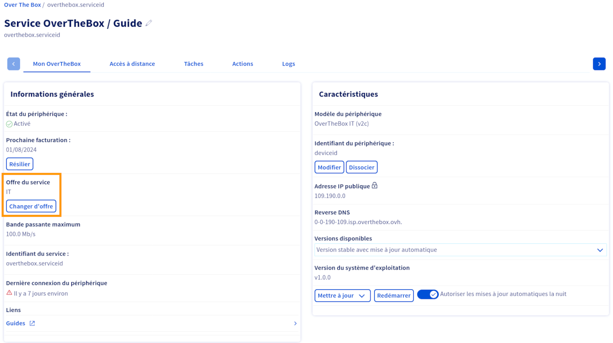
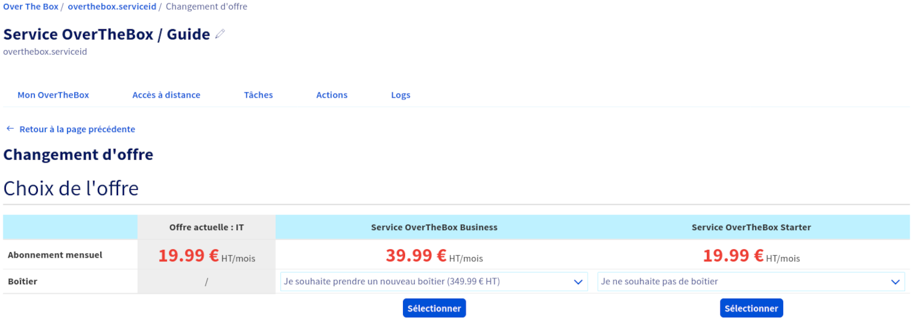
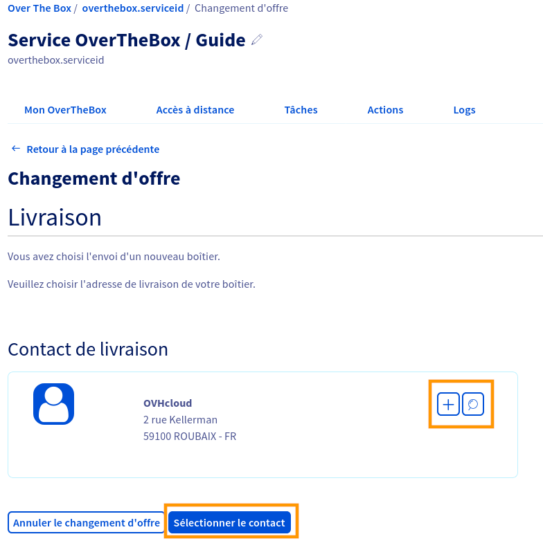
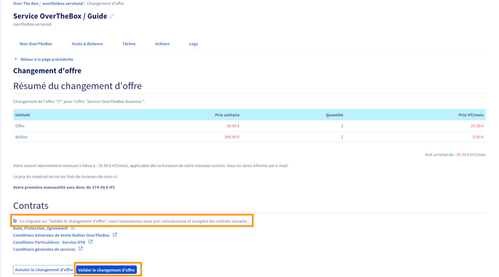
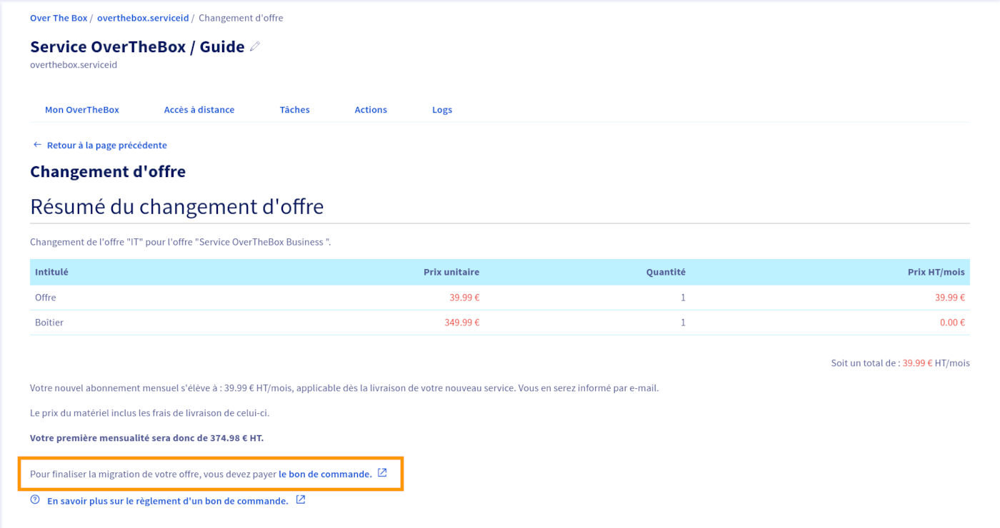

## Objectif

Vous pouvez faire évoluer votre offre OverTheBox pour accéder à de nouvelles fonctionnalités et services.

Le changement d'offre permet de :

- Migrer d'une offre Starter 500Mbps à une offre Business 1Gbps.
- Migrer d'une offre Business 1Gbps à une offre Starter 500 Mbps.
- Migrer d'une ancienne offre de service à une nouvelle offre Starter ou Business.
- Commander un boîtier OTBv3

Lors d'une migration, l'adresse IP de votre service est conservée et votre appareil OverTheBox actuel reste compatible.

## Prérequis

- Disposer d'un service OverTheBox actif.
<!-- CP-NAV-START:telecom-otb -->
---

### Accès à l'espace client OVHcloud

- **Lien direct :** [OverTheBox](/links/control-panel/telecom-otb)
- **Pour accéder à vos services :** `Télécom`{.action} > `OverTheBox`{.action} > Sélectionnez votre service

---
<!-- CP-NAV-END:telecom-otb -->

## En pratique

### Changer d’offre

<!-- CP-STEPS-START:changer-offre -->
Depuis votre [espace client OVHcloud](/links/control-panel/telecom-otb), sélectionnez le service OverTheBox que vous souhaitez faire évoluer et cliquez sur `Changer d’offre`{.action} dans le cadre « Informations Générales ».

{.thumbnail}

La première colonne du tableau récapitule votre offre actuelle (son nom et son tarif). Les autres colonnes concernent les offres auxquelles vous pouvez souscrire.
Dans la deuxième ligne du tableau, vous pouvez, si vous le souhaitez, commander un boîtier OverTheBox v3 en plus de votre changement d’offre.

Une fois votre choix effectué, cliquez sur le bouton `Sélectionner`{.action} sous la colonne correspondant à l’offre que vous souhaitez souscrire.

{.thumbnail}
<!-- CP-STEPS-END:changer-offre -->

### Sélectionner une adresse de livraison

<!-- CP-STEPS-START:selectionner-adresse-livraison -->
> [!primary]
> Si vous avez choisi l'option `Je ne souhaite pas de boîtier`{.action}, vous pouvez passer à la section « [Valider le changement d'offre](#validation) » de ce guide.

Si vous avez choisi de commander un nouveau boîtier avec votre changement d'offre, vous devez choisir une adresse de livraison.

Par défaut, l'adresse est celle de votre compte OVHcloud. Vous pouvez cependant modifier cette adresse :

- Cliquez sur le bouton `+`{.action} pour renseigner une nouvelle adresse.
- Cliquez sur le bouton `loupe`{.action} pour sélectionner une adresse précédemment renseignée.

Une fois l'adresse saisie, cliquez sur le bouton `Sélectionner le contact`{.action}.

> [!primary]
> Les frais de livraison sont inclus dans le prix du boîtier.

{.thumbnail}
<!-- CP-STEPS-END:selectionner-adresse-livraison -->

### Valider le changement d'offre 

<!-- CP-STEPS-START:valider-changement-offre -->
La page `Résumé du changement d'offre` résume la tarification mensuelle de la nouvelle offre, ainsi que le coût du boîtier (si l'option a été sélectionnée).

Validez les contrats afférents, puis cliquez sur le bouton `Valider le changement d'offre`{.action}.

{.thumbnail}
<!-- CP-STEPS-END:valider-changement-offre -->

### Payer le bon de commande

<!-- CP-STEPS-START:payer-bon-commande -->
> [!primary]
> Une fois le bon de commande payé, le changement d'offre est immédiat si vous n'avez pas choisi de boîtier.
> Dans le cas où vous avez choisi un boîtier, le changement d'offre sera réalisé à réception du boîtier.
> Un remboursement au prorata de la facturation du mois en cours est alors établi.

Pour finaliser le changement d'offre, ainsi que la livraison du boîtier, vous devez payer le bon de commande généré lors de la confirmation de la migration. Pour ce faire, cliquez sur le lien contenu dans la phrase `Pour finaliser la migration de votre offre, vous devez payer le bon de commande.`{.action}.

> [!primary]
> Pour plus d'informations sur le paiement d'un bon de commande, consultez le guide « [Gérer mes commandes OVHcloud](/pages/account_and_service_management/managing_billing_payments_and_services/managing_ovh_orders) ».

{.thumbnail}
<!-- CP-STEPS-END:payer-bon-commande -->

## Aller plus loin

Retrouvez plus d'informations sur les offres OverTheBox sur [notre page OverTheBox](/links/telecom/overthebox).

Échangez avec notre [communauté d'utilisateurs](/links/community).
