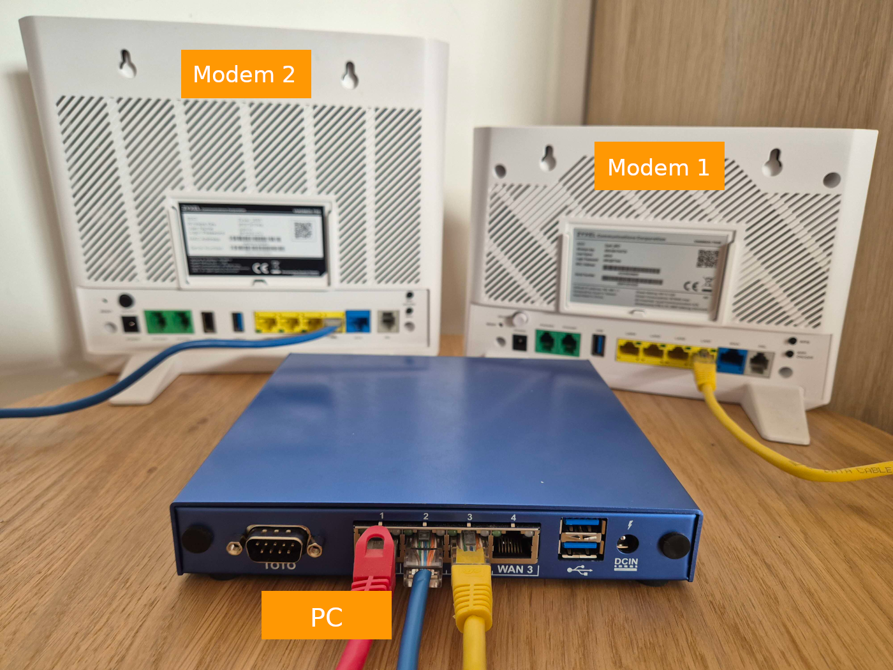
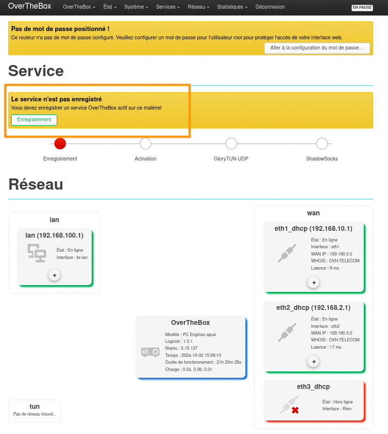
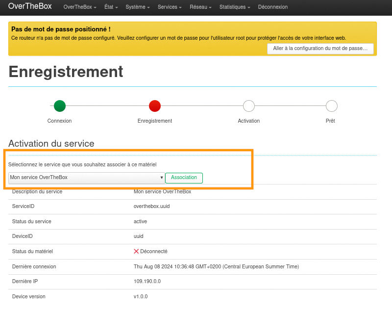
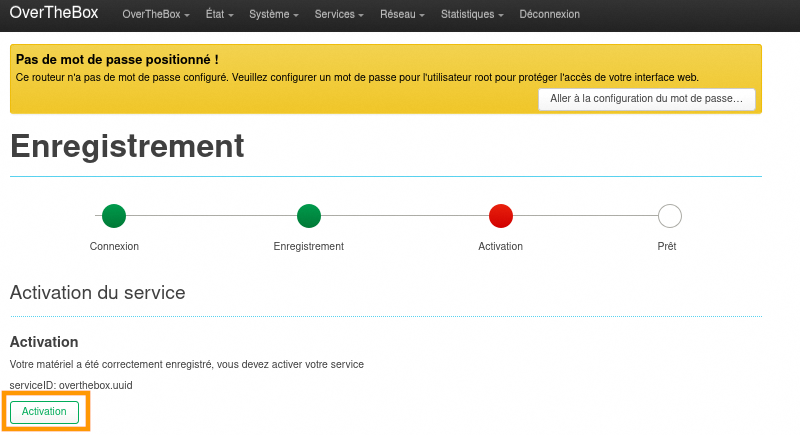
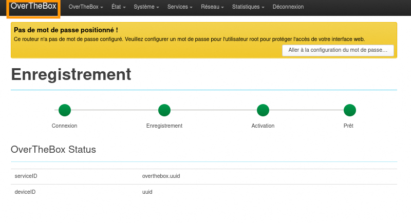
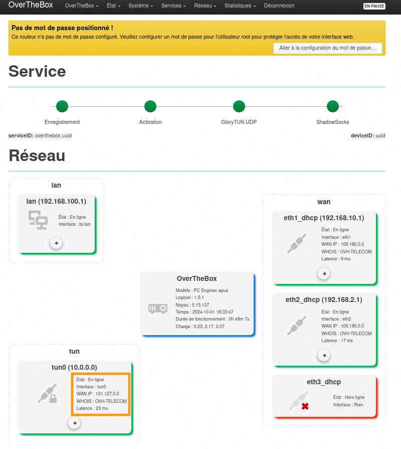
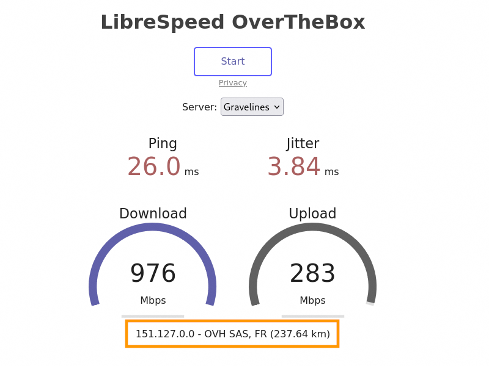

## Objectif

Découvrez comment installer et configurer votre équipement OverTheBox afin de profiter de votre offre OverTheBox.

## Prérequis

- Au moins un modem ayant accès à Internet sur lequel vous devez être en capacité de modifier la configuration réseau (IP et DHCP). **Exemple** : Box fournie par un fournisseur d'accès Internet comme OVHcloud ou un opérateur national.
- Une **OverTheBox** fournie par OVHcloud ou une installation depuis le projet Open Source ([installer l'image overthebox sur votre materiel](/pages/web_cloud/internet/overthebox/advanced_installer_limage_overthebox_sur_votre_materiel))

> [!warning]
>
> À ce stade, aucun branchement ne doit être effectué entre les modems et l'OverTheBox.
> Il est aussi impératif d'utiliser uniquement les modems et l'OverTheBox pendant toute la durée de l'installation.
> Si votre installation doit comprendre un switch, il est préférable d'intégrer ce dernier une fois la procédure terminée.
>

## En pratique

### Étape 1 : préparation de vos modems

Pour le bon déroulement de la procédure d'installation, il est impératif que le modem réponde à deux conditions :

- Le serveur DHCP du modem doit être **activé**.
- Si vous avez plus d'un modem, ils doivent être sur des réseaux locaux différents les uns des autres.

> [!success]
>
> Rassurez-vous, cette fonction est déjà activée sur les Box des principaux opérateurs grand public. Si vous pouvez aller sur Internet en passant directement par le modem, sans avoir effectué de configuration spécifique préalable sur l'ordinateur, cela veut dire que le DHCP est activé.
>

> [!primary]
>
> Afin de connaître l'adresse IP d'un modem non fourni par OVHcloud, veuillez vous rapprocher de votre administrateur ou de votre fournisseur d'accès.
>

- **Cas d'un modem Technicolor TG788 ou TG789 fourni par OVHcloud :** l'adresse IP par défaut d'un modem OVHcloud Technicolor TG788 ou TG789 est 192.168.**1**.254.
- **Cas d'un modem Technicolor TG799vac ou Zyxel fourni par OVHcloud :** l'adresse IP par défaut d'un modem OVHcloud Technicolor TG799vac ou Zyxel est 192.168.**1**.1. 

Il n'est donc pas possible de cumuler l'un de ces modems avec un autre modem en 192.168.**1**.0/24.

### Étape 2 : branchement des modems

Dans un premier temps, pour chaque modem, branchez un câble ethernet entre le port LAN du modem et le port **WAN** de votre **OverTheBox** afin qu'ils soient correctement identifiés comme liens vers internet.

Branchez ensuite votre ordinateur sur un des ports LAN de votre **OverTheBox**. Vous pouvez alors raccorder votre **OverTheBox** sur le courant électrique.

Cliquez sur l'onglet correspondant à votre offre OverTheBox :

> [!tabs]
>  Starter / Business
>> Dans le cas d'une **OTB V3** ou **OTB V3 LTE** vendue avec les offres **OverTheBox Starter & Business**
>>
>> - **Modem 1**: Câble jaune, IP 192.168.**0**.1
>> - **Modem 2**: Câble bleu, IP 192.168.**1**.1
>> - **Votre ordinateur**: Câble rouge
>>
>> {.thumbnail width="800"}
>>
> Plus
>> Dans le cas d'une **OTB V2b** vendue avec les anciennes offres **OverTheBox Plus**
>>
>> - **Modem 1**: Câble jaune, IP 192.168.**0**.1
>> - **Modem 2**: Câble bleu, IP 192.168.**1**.1
>> - **Votre ordinateur**: Câble rouge
>>
>> {.thumbnail width="800"}
>>
> IT
>>
>> - **Modem 1**: Câble jaune, IP 192.168.**0**.1
>> - **Modem 2**: Câble bleu, IP 192.168.**1**.1
>> - **Votre ordinateur**: Câble rouge
>>
>> {.thumbnail width="800"}
>>

> [!success]
>
> Votre OverTheBox peut maintenant contacter nos serveurs et va se mettre à jour automatiquement. Veuillez patienter cinq minutes avant de passer à l'étape suivante.
>

### Étape 3 : enregistrement du service

> [!warning]
>
> Les opérations qui suivent doivent être effectuées depuis un ordinateur connecté directement sur un des ports LAN de l'OverTheBox (câble rouge sur les images ci-dessus).
>

Rendez-vous sur [http://overthebox.ovh](http://overthebox.ovh) ou [https://192.168.100.1](https://192.168.100.1).

Sur la page d'authentification, cliquez sur `Connexion`{.action}. Par défaut, aucun mot de passe n'est configuré.

Cliquez sur le bouton `Enregistrement`{.action}.

{.thumbnail}

Puis suivez toutes les étapes suivantes :

> [!tabs]
> 1. Connexion
>>
>> - Sur l'écran d'enregistrement, cliquez sur le bouton `Connexion`{.action} pour vous connecter à votre compte OVHcloud.
>> - Renseignez vos identifiants OVHcloud puis cliquez sur `Continue`{.action}, puis autorisez la connexion API.
>> - La page vous redirigera sur la page d'authentification de l'interface web de l'**OverTheBox**. Cliquez à nouveau sur `Connexion`{.action}.
>> - Puis passez à l'étape enregistrement
>>
>> {.thumbnail}
>>
> 2. Enregistrement
>>
>> - Une fois connecté, cliquez sur le **service OverTheBox** que vous souhaitez associer à votre appareil.
>> - Puis passez à l'étape d'activation.
>>
>> {.thumbnail}
>>
> 3. Activation
>>
>> - Une fois le service associé, activez-le en cliquant sur le bouton `Activation`{.action}.
>> - Puis passez à l'étape suivante.
>>
>> {.thumbnail}
>>
> 4. Prêt
>>
>> - L'enregistrement est terminé et votre offre est désormais activée. Pour revenir à la page d'accueil, cliquez sur `OverTheBox`{.action} en haut à gauche de l'interface.
>>
>> {.thumbnail}
>>

> [!success]
>
> Votre service est désormais actif.

### Étape 4 : vérifier le bon fonctionnement de votre service

Le service OverTheBox est actif et opérationnel, vous pouvez consultez l'**IP publique** de votre service sur l'interface **TUN**.

{.thumbnail}

- Assurez-vous que l'installation s'est bien déroulée en vérifiant votre **IP publique** sur notre site [https://perf.overthebox.net/](https://perf.overthebox.net/). Vous devez obtenir une adresse IP similaire à 109.190.x.y ou 151.127.x.y et identique au champ **WAN IP** de l'interface **TUN**.

{.thumbnail}

> [!warning]
>
> Si ces opérations ne retournent pas les bonnes informations, veuillez recommencer [l'intégralité de l'étape 3 ci-dessus](#step3), point par point.
>

## Aller plus loin

### Ajouter une interface 4G

Si vous souhaitez configurer l'interface 4G de votre **OTB V3 LTE** ou ajouter une interface 4G par clé USB sur un autre modèle, consultez le guide « [Comment configurer un lien 4G sur OverTheBox?](/pages/web_cloud/internet/overthebox/plus_itv2_lte) ».

### Ajouter une connexion supplémentaire

Si vous souhaitez ajouter une connexion supplémentaire, consultez le guide « [Comment configurer une interface réseau ?](/pages/web_cloud/internet/overthebox/advanced_creer_une_interface_modem_manuellement) ».

### Ajouter un décodeur TV

Si vous utilisez la télévision par Internet via l'un de vos fournisseurs d'accès, veuillez laisser le décodeur TV branché sur votre modem (si ce dernier n'est pas directement intégré dedans) afin d'éviter tout blocage du flux vidéo par votre opérateur si ce flux passe par le service OverTheBox.

### Ajouter un réseau WiFi

Les modems sont isolés dans leurs propre VLAN. Le WiFi des modems est donc indisponible depuis le réseau LAN de l'OverTheBox. Il est possible de réutiliser le WiFi d'un modem Zyxel fourni avec l'une de nos offres Internet. Pour plus d'informations, consultez notre guide « [Comment réutiliser le wifi d'un modem Zyxel avec OverTheBox](/pages/web_cloud/internet/internet_access/comment_reutiliser_wifi_zyxel_otb) ».

Dans les autres cas de figure, il faudra utiliser un point d'accès WiFi dédié. Le WiFi de vos modems reste fonctionnel mais les équipements connectés ne profiteront ni de l'agrégation, ni du tunnel chiffré.

N'hésitez pas à échanger avec notre communauté d'utilisateurs sur vos produits Télécom sur notre site [OVHcloud Community](https://community.ovh.com/c/telecom).
