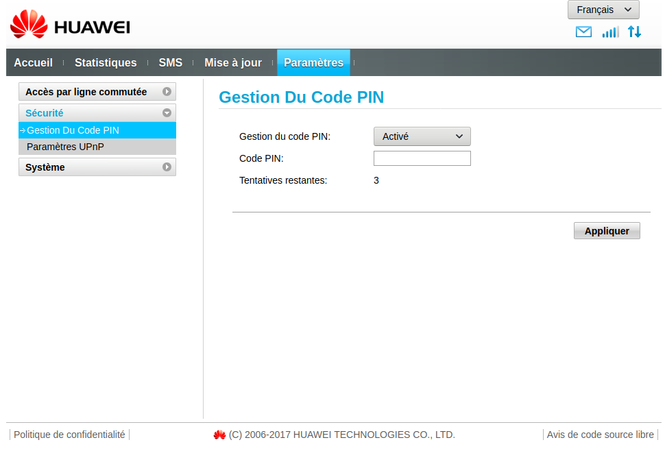
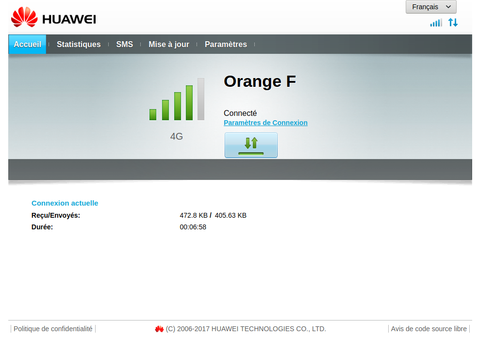
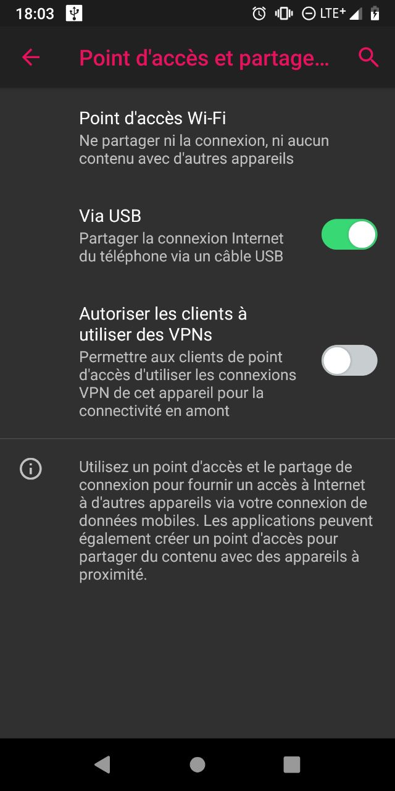
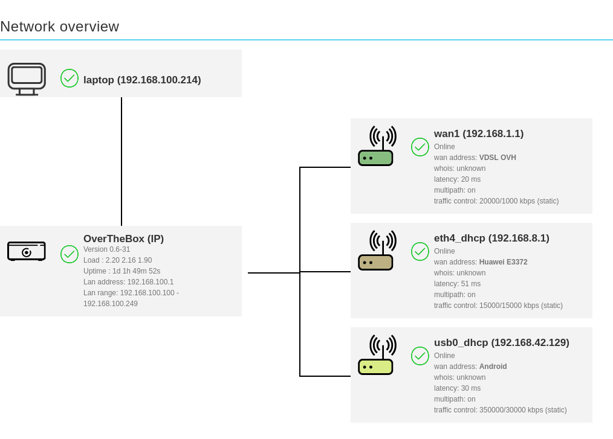
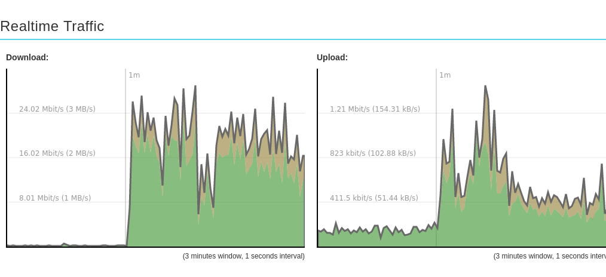

## Objectif

Grâce à un lien LTE, votre **OverTheBox** est capable de tirer parti des réseaux mobiles 3G/4G des opérateurs.
Un lien LTE permet une continuité de service en cas de défaillance sur votre réseau fixe (cuivre ou fibre), en utilisant un autre support technologique pour accéder à Internet.
 De plus, les débits offerts par les connexions LTE sont souvent supérieurs aux connexions cuivre. Cela permet d'améliorer significativement votre débit, en particulier le débit montant, grâce à l'agrégation permise par votre service OverTheBox.
Toutefois, les liens LTE souffrent d'une plus grande latence, ce qui peut avoir un impact négatif sur certaines applications comme la VoIP.

## Prérequis

- Une **OverTheBox** fournie par OVHcloud ou une installation depuis le projet Open Source (plus d'informations sur notre guide « [Installer l'image OverTheBox sur votre materiel](/pages/web_cloud/internet/overthebox/advanced_installer_limage_overthebox_sur_votre_materiel) »).
- Disposer d'une clé LTE Huawei E3372 ainsi qu'une carte SIM permettant l'accès au réseau mobile de données.
- Alternativement, vous pouvez également utiliser un téléphone sous Android ou iOS avec une carte SIM permettant l'accès au réseau mobile de données.

## En pratique

### Étape 1 : configurer votre appareil LTE

#### Configurer une clé LTE Huawei E3372

Insérez la carte SIM dans votre clé Huawei E3372, puis branchez la clé sur votre ordinateur. Accédez à la clé via votre navigateur à l'adresse `192.168.8.1`.

Une fois connecté, accédez au menu `Paramètres`{.action} puis, dans le menu `Gestion Du Code PIN`{.action}, entrez le code PIN de votre carte SIM.

{.thumbnail}

Retournez sur l'onglet `Accueil`{.action} pour vérifier que vous êtes bien connecté. Si la clé est correctement connectée, la LED sur celle-ci doit également être de couleur fixe, de couleur cyan pour un réseau 4G ou verte pour un réseau 3G.

{.thumbnail}

> [!success]
>
> Votre clé est prête, il ne reste plus qu'à la brancher sur un des ports USB de votre **OverTheBox**
>

#### Configurer un téléphone Android

> [!primary]
>
> L'interface Android dépend du modèle de votre téléphone, il est possible que les nom des menus ne soientt pas exactement identiques à ceux présentés dans ce guide.
>

- Branchez votre téléphone à l'aide d'un câble USB sur l'un des ports USB de votre **OverTheBox**.
- Ouvrez les paramètres de votre téléphone.
- Cliquez sur `Réseau et Internet`{.action}.
- Cliquez sur `Point d'accès et partage de connexion`{.action}.
- Activez le paramètre « Partage de connexion **Via USB** ».

{.thumbnail}

> [!success]
>
> Votre téléphone partage sa connexion LTE avec votre **OverTheBox**.
>

#### Configurer un téléphone Apple

> [!alert]
>
> Apple à introduit des changements depuis la version iOS14 qui peuvent rendre le partage impossible avec l'**OverTheBox**.
>

- Branchez votre téléphone à l'aide d'un câble USB sur l'un des ports USB de votre **OverTheBox**.
- Ouvrez les paramètres de votre téléphone.
- Cliquez sur `Partage de connexion`{.action}.
- Activez le paramètre « Partage de connexion ».

> [!success]
>
> Votre téléphone partage sa connexion LTE avec votre **OverTheBox**.
>

### Étape 2 : vérifier la connexion LTE

Que vous utilisiez une clé LTE Huawei E3372 ou un téléphone, l'équipement fournissant la connexion LTE attribue automatiquement une IP à l'**OverTheBox** grâce au DHCP. L'interface est donc automatiquement détectée par l'**OverTheBox** sans besoin d'intervention de votre part.

Pour vérifier que l'interface est correctement détectée, vérifiez qu'elle est bien présente dans le cadre **Network overview** de la page principale.

{.thumbnail}

Pour vous assurer que l'agrégation fonctionne correctement, vérifiez la présence, dans le cadre **Realtime trafic**, d'un trafic ayant la même couleur que celle de l'interface dans **Network overview**.

Dans cet exemple,  la courbe verte correspond à notre connexion VDSL tandis que la courbe marron correspond à notre clé LTE Huawei E3372.

{.thumbnail}

## Aller plus loin

N'hésitez pas à échanger avec notre communauté d'utilisateurs sur vos produits Télécom sur notre site [OVHcloud Community](https://community.ovh.com/c/telecom)
