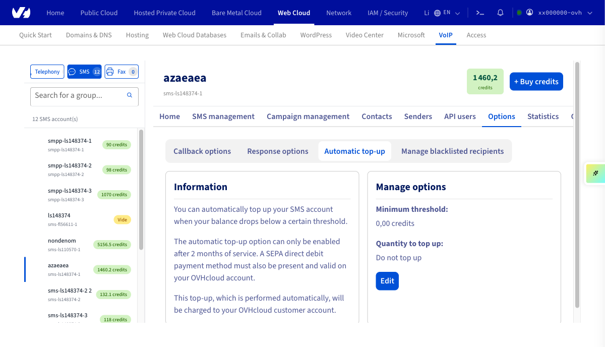
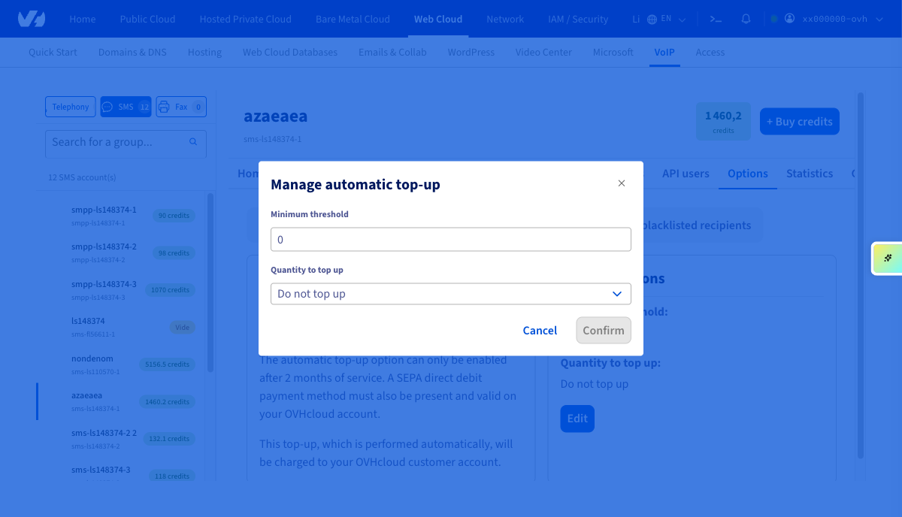
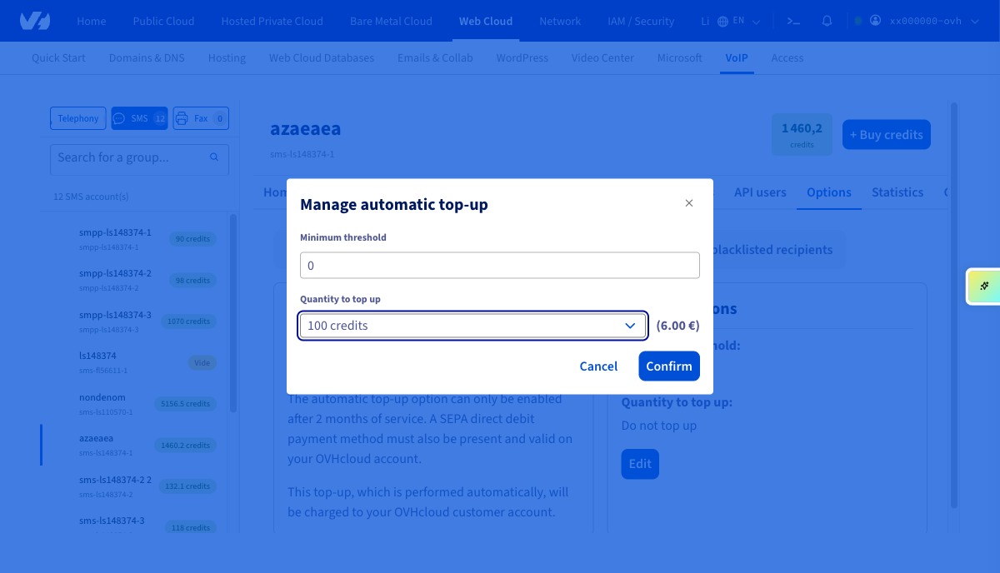
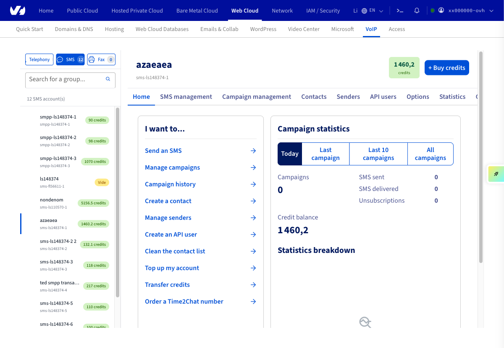
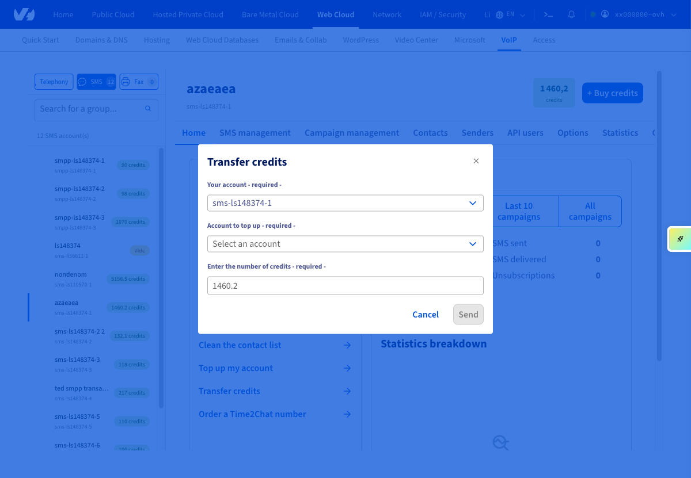

## Objectif

Ce guide vous explique ce que sont les crédits SMS, comment les recharger automatiquement et comment les transférer entre vos comptes SMS.

## Prérequis

- Disposer d'un compte SMS OVHcloud.
- Être connecté aux [API OVHcloud](/links/api) (uniquement pour les transferts de crédits).

<!-- CP-NAV-START:telecom-sms -->
---

### Accès à l'espace client OVHcloud

- **Lien direct :** [SMS](/links/control-panel/telecom-sms)
- **Pour accéder à vos services :** `Télécom`{.action} > `SMS`{.action} > Sélectionnez votre compte SMS

---
<!-- CP-NAV-END:telecom-sms -->

{.thumbnail}

## En pratique

### Les crédits SMS

1 crédit SMS correspond au coût pour l'envoi de 1 SMS en France métropolitaine, le tarif étant dégressif en fonction du nombre de crédits SMS que vous achetez en une fois. 

Vous trouverez la liste des packs SMS sur la [page des packs SMS](/links/telecom/sms).

**Exemple pour l'achat d'un pack de 100 crédits SMS, chaque crédit coûtant donc 0,06 € HT :**

L'envoi de 1 SMS en France métropolitaine coûte 1 crédit. Avec ce pack, vous pourrez envoyer 100 SMS en France métropolitaine.
L'envoi de 1 SMS en Inde coûte 0,4 crédit. Avec ce pack, vous pourrez envoyer 250 SMS en Inde.

Consultez la [grille tarifaire SMS](/links/telecom/sms-prices) pour connaître le coût d'envoi, en crédits, de vos SMS en fonction de leur destination.

> [!primary]
>
> Un SMS ne peut contenir qu'une quantité limitée de caractères en fonction de son encodage. Le détail des encodages et caractères admis est disponible sur ce guide :
> 
> [Envoyer des SMS depuis mon espace client OVHcloud](/pages/web_cloud/messaging/sms/envoyer_des_sms_depuis_mon_espace_client#etape-2-composer-votre-sms)
>

### La recharge automatique

Pour ne jamais être à court de crédit sur votre compte, vous pouvez activer la recharge automatique. Dès qu'un seuil minimum de crédits restants est atteint, une nouvelle quantité de crédits est automatiquement ajoutée sur votre compte SMS.

> [!warning]
>
> L'option de recharge automatique ne peut être activée que si les conditions suivantes sont remplies :
>
> - un moyen de paiement de type Prélèvement SEPA est présent et validé sur votre compte OVHcloud ;
> - votre service SMS doit avoir au moins 2 mois d'ancienneté.

Rendez-vous dans le menu `Options`{.action} (1) puis `Recharge automatique`{.action} (2).

{.thumbnail}

Cliquez alors sur `Modifier`{.action} dans la rubrique « Gérer les options ».

{.thumbnail}

Enfin, remplissez les champs requis :

- Seuil minimum (1) : lorsque ce seuil est atteint, la recharge automatique se déclenche.
- Quantité à recharger (2) : définit la quantité de crédits à recharger sur votre compte SMS. Les choix possibles sont : 100, 200, 250, 500, 1000, 5000 et 10000.
- Cliquez sur le bouton `Valider`{.action} pour appliquer le paramétrage.

{.thumbnail}

### Transférer des crédits SMS

> [!primary]
>
> Le transfert de crédits n'est possible qu'entre les comptes SMS d'un seul et même compte client OVHcloud. Le transfert de crédits entre deux comptes clients OVHcloud est impossible.
>

Cliquez sur `Transférer des crédits`{.action} depuis l'onglet `Accueil`{.action}.

{.thumbnail}

Choisissez alors :

- le compte SMS qui va transférer les crédits ;
- le compte SMS qui va recevoir les crédits ;
- le nombre de crédits à transférer.

Cliquez sur `Envoyer`{.action} pour valider le transfert. Celui-ci est immédiat.

{.thumbnail}

## Aller plus loin

Échangez avec notre [communauté d'utilisateurs](/links/community).
