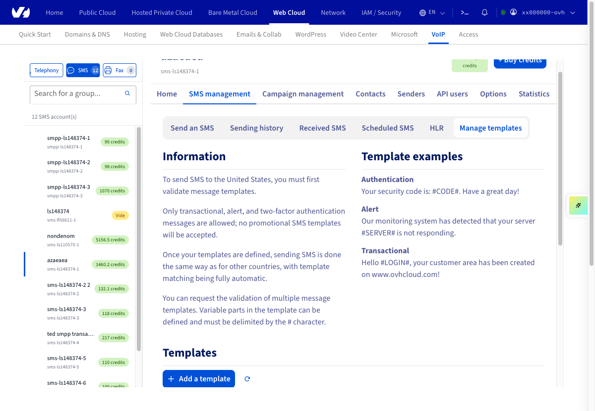
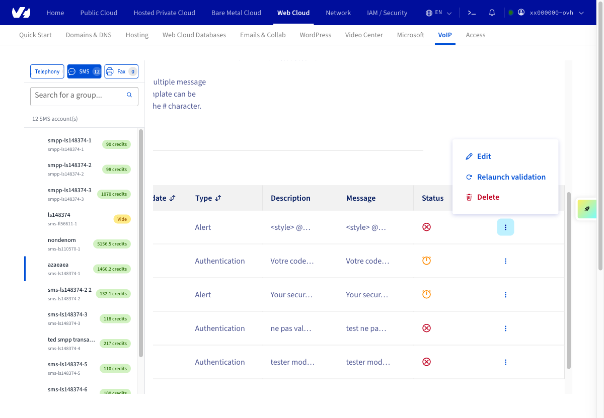
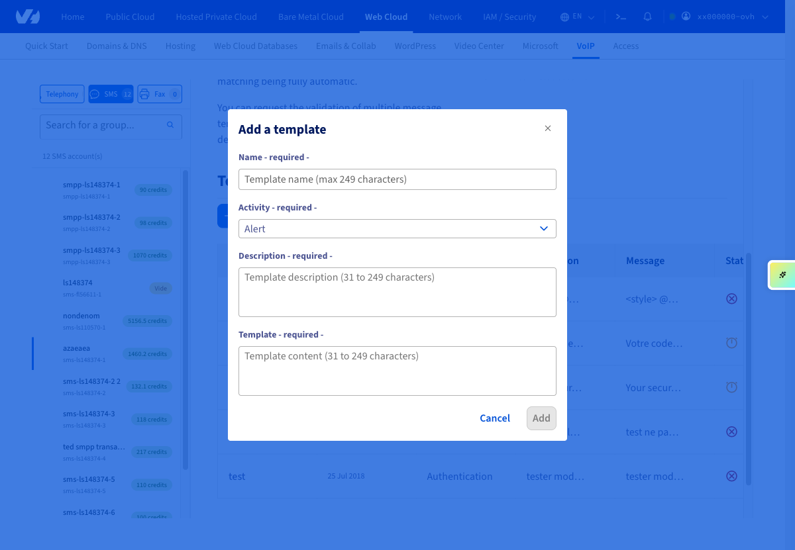
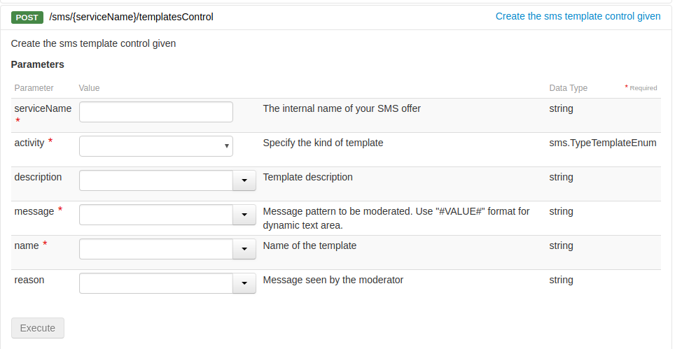

## Objective

Sending SMS messages to the United States requires compliance with specific rules. This guide explains these rules and shows how to apply them.

## Requirements

- An OVHcloud SMS account with SMS credits.
- Access to the [OVHcloud API](/links/api) (for the API method only)

<!-- CP-NAV-START:telecom-sms -->
---

### OVHcloud Control Panel Access

- **Direct link:** [SMS](/links/control-panel/telecom-sms)
- **Navigation path:** `Telecom`{.action} > `SMS`{.action} > Select your SMS account

---
<!-- CP-NAV-END:telecom-sms -->

{.thumbnail}

## Instructions

### Step 1: Understanding the restrictions

In accordance with the US SMS regulation authority (Neustar), a message template must be validated through our services before an SMS can be sent to this destination.
Only alert and two-factor authentication messages are authorised, and advertising SMS templates are not accepted. Once you have set your templates, the SMS will be sent the same way as for other countries.

You can request the validation of multiple message templates.

> [!primary]
>
> Setting message templates is free and is carried out by the OVHcloud teams within two working days.
>

### Step 2: Adding a template

#### 2.1 Via the Control Panel

<!-- CP-STEPS-START:add-template-cp -->
Click on the `Message and campaign`{.action} tab and click `SMS management`{.action}.

Finally, click `Manage templates`{.action}.

{.thumbnail}

On the next page, click on `Actions`{.action} then on `Add`{.action}.

{.thumbnail}

A pop-up will appear with fields to complete.

{.thumbnail}

| Field       | Description                                                                                                      |
|-------------|------------------------------------------------------------------------------------------------------------------|
| Name         | Template name                                                                                                  |
| Activity    | Select the template type:<br>\- Alert<br>\- Authentication<br>\- Transaction processing system |
| Description | Template description                                                                                            |
| Template      | Write the template, including the variable between #                                                                  |

<!-- CP-STEPS-END:add-template-cp -->

#### 2.2 Via APIs

> [!success]
> If you are not familiar with using the OVHcloud API, please refer to our guide on [Getting started with the OVHcloud API](/pages/manage_and_operate/api/first-steps).

Log in to [api.ovh.com/](/links/api), then use the following API:

> [!api]
>
> @api {v1} /sms POST /sms/{serviceName}/templatesControl
>

{.thumbnail}

Fill in the required fields and click on `Execute`{.action}.

#### Examples of templates

Below are two examples of message templates that can be sent to the US.

- Authentication template example:

```bash
Your security code is: #CODE#. Have a good day!
```

- Alert template example:

```bash
Our monitoring system detected your server #SERVER# doesn't respond to ping requests
```

### Step 3: Analysing returns

Once your message template has been created and validated, the outgoing SMS automatically compares your content with your templates. If the comparison is positive, the SMS is sent in the same way as one sent to another recipient.

If you send an SMS to the US without creating and validating a template, the SMS will be rejected and the Premium Tracking Transaction Code (PTT code) 1999 will be sent to you, which corresponds to the “No templates available” error message.

You can view the other possible return codes in the [SMS users guide](/pages/web_cloud/messaging/sms/tout_savoir_sur_les_utilisateurs_sms).

## Go further

Join our [community of users](/links/community).
