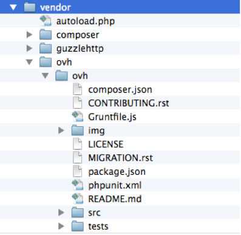
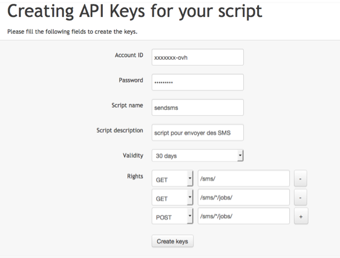
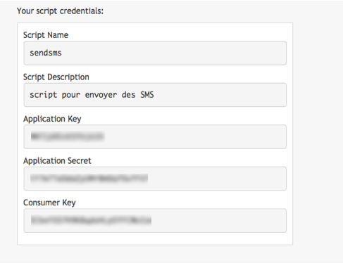

## Wprowadzenie

Wiadomości SMS są szeroko wykorzystywane do rozpowszechniania praktycznych informacji, śledzenia statusu zamówienia lub procesu transakcyjnego, powiadamiania o nietypowych zdarzeniach lub przypominania o spotkaniach. W niniejszym przewodniku szczegółowo opisano sposób wysłania pierwszej wiadomości SMS przy użyciu interfejsu API OVHcloud RESTful w PHP. 

**Dowiedz się, jak wysyłać wiadomości SMS za pomocą interfejsu API RESTful w PHP**

## Wymagania początkowe

- Dostęp do środowiska deweloperskiego PHP
- Posiadanie konta SMS OVHcloud z zasileniami SMS

## W praktyce

### Etap 1: Pobranie wrappera PHP do API OVHcloud

Przejdź na stronę projektu [https://github.com/ovh/php-ovh](https://github.com/ovh/php-ovh)

Możesz szybko zintegrować wrappera PHP dzięki narzędziu Composer: [https://getcomposer.org/](https://getcomposer.org/)

Postępuj zgodnie z instrukcjami podanymi w portalu GitHub, utwórz plik composer.json, jak pokazano w projekcie:
GitHub> Readme > Quickstart

Twój projekt, a także plik autoload.php umożliwiający zarządzanie wszystkimi zależnościami i importami, znajdziesz w katalogu ./vendor/ovh/ovh/

{.thumbnail}

### Etap 2: Utworzenie identyfikatorów

Identyfikatory są niezbędne do korzystania z interfejsu API SMS. Identyfikatory te tworzy się jednorazowo w celu określenia aplikacji, która będzie wysyłać wiadomości SMS. Czas ważności tych identyfikatorów można skonfigurować.

Utwórz identyfikatory skryptu (wszystkie klucze naraz) na tej stronie:
[https://auth.eu.ovhcloud.com/api/createToken](https://auth.eu.ovhcloud.com/api/createToken?GET=/sms/&GET=/sms/*/jobs&POST=/sms/*/jobs) (ten adres URL automatycznie zapewni Ci odpowiednie uprawnienia na potrzeby kroków opisanych w tym przewodniku).

{.thumbnail}

W tym prostym przykładzie uzyskujemy uprawnienia dostępu do informacji o koncie, możliwość przeglądania wiadomości oczekujących oraz wysyłania wiadomości SMS.

- GET /sms
- GET /sms/\*/jobs
- POST /sms/\*/jobs

Gwiazdka (\*) aktywuje wywołania tych metod dla wszystkich Twoich kont SMS. Możesz również ograniczyć wywołania do jednego konta, jeśli zarządzasz więcej niż jednym kontem SMS w ramach Twojego konta OVHcloud, zamieniając ciąg „/sms” na „/sms/NAZWA-KONTA” oraz „/sms/\*/” na „/sms/NAZWA-KONTA/”.

W ten sposób uzyskasz identyfikatory dla Twojego skryptu:

- Application Key (określa Twoją aplikację)
- Application Secret (uwierzytelnia Twoją aplikację)
- Consumer Key (udziela aplikacji zezwolenia na dostęp do wybranych metod)

{.thumbnail}

Środowisko jest gotowe, identyfikatory zostały utworzone, a Ty możesz już tworzyć kod Twojego skryptu PHP.

### Etap 3: Wdrożenie SDK PHP

Dla większej prostoty utworzyliśmy zestaw PHP SDK, który znajdziesz w [repozytorium GitHub php-ovh-sms](https://github.com/ovh/php-ovh-sms).

### Etap 4: Podstawowe połączenie z API

Teraz możesz przetestować połączenie z API, wyświetlając szczegóły każdego konta SMS:

```
<?php
/**
 * Wyświetla szczegóły każdego konta SMS
 * 
 * Przejdź na stronę https://auth.eu.ovhcloud.com/api/createToken?GET=/sms/&GET=/sms/*/jobs&POST=/sms/*/jobs
 * aby wygenerować klucze dostępu API do:
 *
 * GET /sms
 * GET /sms/*/jobs
 * POST /sms/*/jobs
 */

require __DIR__ . '/vendor/autoload.php';
use \Ovh\Api;

$endpoint = 'ovh-eu';
$applicationKey = "your_app_key";
$applicationSecret = "your_app_secret";
$consumer_key = "your_consumer_key";

$conn = new Api(    $applicationKey,
                    $applicationSecret,
                    $endpoint,
                    $consumer_key);
     
$smsServices = $conn->get('/sms/');
foreach ($smsServices as $smsService) {

    print_r($smsService);
}

?>
```

Po uruchomieniu tego skryptu uzyskasz listę Twoich kont SMS.

### Etap 5: Wysłanie pierwszej wiadomości SMS

Aby wysłać wiadomość SMS, wykorzystaj metodę POST jobs: [https://api.ovh.com/console/#/sms/{serviceName}/jobs#POST](https://api.ovh.com/console/#/sms/{serviceName}/jobs#POST)

> [!primary]
>
> **Tylko dla kont OVHcloud we Francji z wyłączeniem DOM-TOM:**
> 
> Parametr senderForResponse umożliwi wykorzystanie numeru skróconego, co pozwoli na wysyłanie wiadomości SMS bezpośrednio, bez konieczności tworzenia nadawcy alfanumerycznego (na przykład Twoja nazwa).
> 
> Numery skrócone umożliwiają również otrzymywanie odpowiedzi od adresatów Twoich wiadomości SMS, co może być przydatne w przypadku badania zadowolenia, aplikacji do głosowania, gry itp.
>
>

```
<?php
/**
 * Wysyła wiadomość SMS, a następnie wyświetla listę wiadomości SMS oczekujących na wysłanie.
 * 
 * Przejdź na stronę https://auth.eu.ovhcloud.com/api/createToken?GET=/sms/&GET=/sms/*/jobs&POST=/sms/*/jobs
 * aby wygenerować klucze dostępu API do:
 *
 * GET /sms
 * GET /sms/*/jobs
 * POST /sms/*/jobs
 */

require __DIR__ . '/vendor/autoload.php';
use \Ovh\Api;

$endpoint = 'ovh-eu';
$applicationKey = "your_app_key";
$applicationSecret = "your_app_secret";
$consumer_key = "your_consumer_key";

$conn = new Api(    $applicationKey,
                    $applicationSecret,
                    $endpoint,
                    $consumer_key);
     
$smsServices = $conn->get('/sms/');
foreach ($smsServices as $smsService) {

    print_r($smsService);
}

$content = (object) array(
	"charset"=> "UTF-8",
	"class"=> "phoneDisplay",
	"coding"=> "7bit",
	"message"=> "Dzień dobry, SMS OVH wysłany z api.ovh.com",
	"noStopClause"=> false,
	"priority"=> "high",
	"receivers"=> [ "+3360000000" ],
	"senderForResponse"=> true,
	"validityPeriod"=> 2880
);
$resultPostJob = $conn->post('/sms/'. $smsServices[0] . '/jobs', $content);

print_r($resultPostJob);

$smsJobs = $conn->get('/sms/'. $smsServices[0] . '/jobs');
print_r($smsJobs);
        
?>
```

Oto rodzaj oczekiwanej odpowiedzi:

```
sms-XXXXXX-1
Array
(
    [totalCreditsRemoved] => 1
    [invalidReceivers] => Array
        (
        )

    [ids] => Array
        (
            [0] => 26929925
        )

    [validReceivers] => Array
        (
            [0] => +3360000000
        )

)
Array
(
)
```

Uzyskujesz konto SMS (ServiceName). Otrzymujesz jedną odpowiedź, która zużywa 1 zasilenie SMS na jeden ważny numer. Na koniec widzisz, że nie ma wiadomości SMS oczekujących na wysłanie.

## Sprawdź również

W [konsoli API](/links/console) możesz odkryć inne metody ułatwiające integrację usług SMS, takie jak: wiadomości SMS pozwalające na odpowiedź (dotyczy wyłącznie kont OVHcloud we Francji), masowa wysyłka przy użyciu pliku CSV, wysyłki reklamowe, monitorowanie potwierdzeń odbioru itd.

Dołącz do [grona naszych użytkowników](/links/community).
