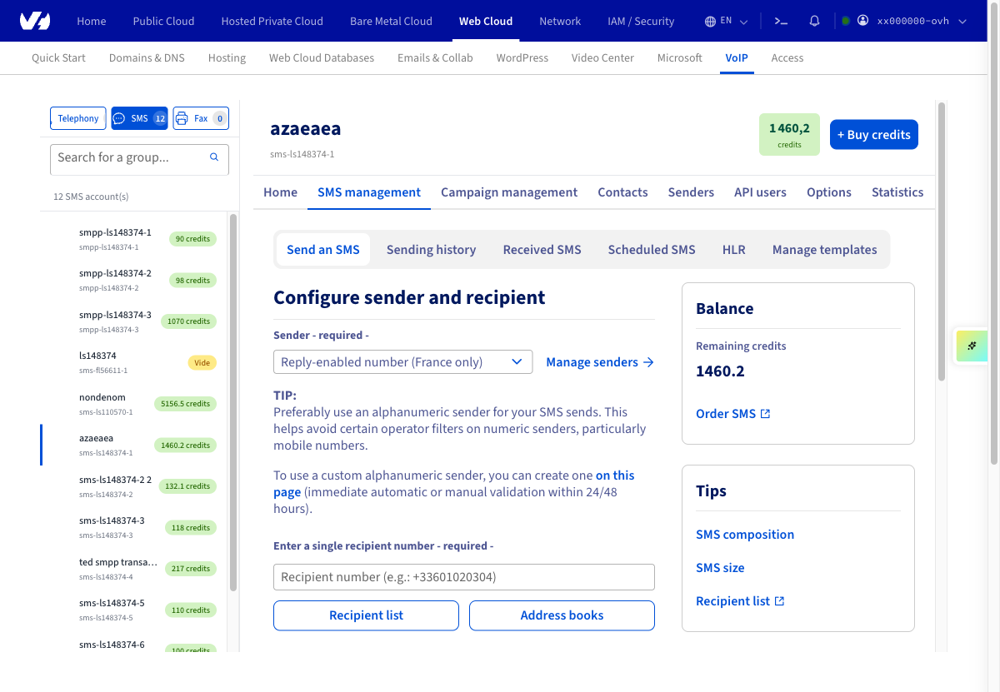
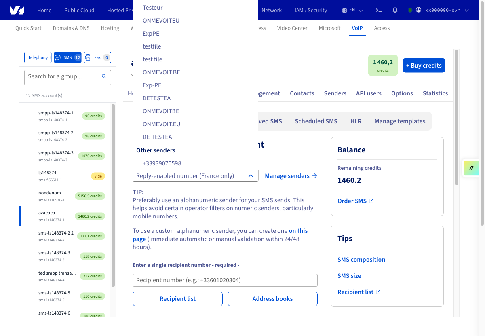
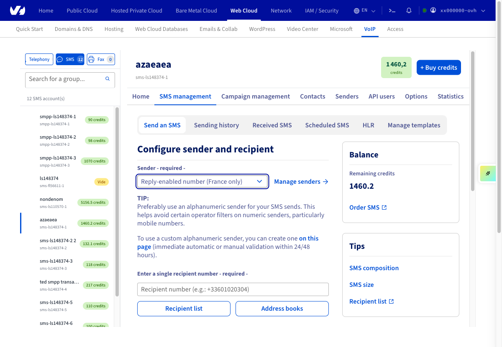
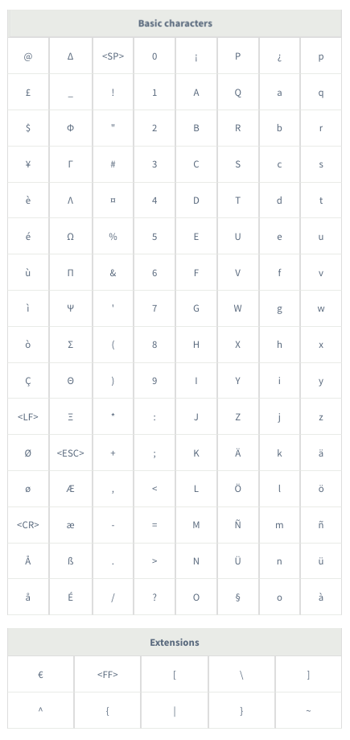
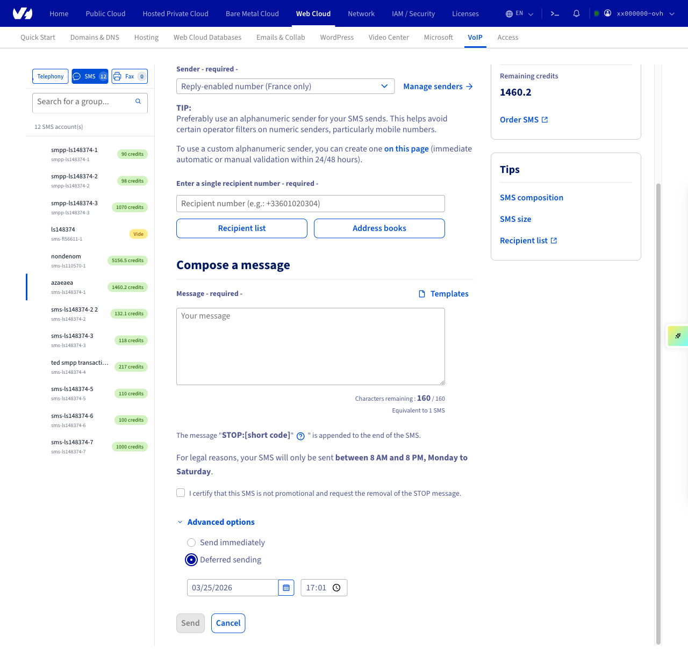

## Objetivo

Es posible enviar SMS directamente desde el área de cliente de OVHcloud. 

**Esta guía explica paso a paso cómo enviar sus primeros SMS.**

## Requisitos

- Disponer de una cuenta de SMS en OVHcloud con saldo de SMS.

<!-- CP-NAV-START:telecom-sms -->
---

### Acceso al área de cliente de OVHcloud

- **Enlace directo:** [SMS](/links/control-panel/telecom-sms)
- **Ruta de navegación:** `Telecom`{.action} > `SMS`{.action} > Seleccione su cuenta SMS

---
<!-- CP-NAV-END:telecom-sms -->

{.thumbnail}

## Procedimiento

En la pestaña **Inicio**, haga clic en el enlace `Enviar un SMS`{.action} del apartado **Quiero...**.

<!-- CP-STEPS-START:send-sms-overview -->
{.thumbnail}
<!-- CP-STEPS-END:send-sms-overview -->

### 1. Configurar el remitente y el destinatario

> [!primary]
> Para obtener más información sobre la creación y el uso de un remitente, consulte nuestra guía "[Todo sobre los remitentes SMS](/pages/web_cloud/messaging/sms/tout_savoir_sur_les_expediteurs_sms)".

<!-- CP-STEPS-START:configure-sender-recipient -->
Una vez en la página de envío de los SMS, podrá configurar distintos parámetros para adaptar el envío de SMS a sus necesidades.

{.thumbnail}

En el desplegable `Remitente`{.action} (1), seleccione un número corto que permita responder (solo para las cuentas de OVHcloud Francia) o un remitente alfanumérico.

Introduzca a continuación el número del destinatario (2) en formato internacional (+346XXXXXXXX). También es posible enviar SMS a varios destinatarios. Puede hacerlo de dos formas diferentes:

- Mediante una lista de destinatarios en formato .CSV con el botón `Lista de destinatarios`{.action}.
Para más información, puede consultar nuestra guía relativa a las [listas de destinatarios de SMS](/pages/web_cloud/messaging/sms/liste_de_destinataire_sms).

- Mediante una agenda de contactos (3). Puede crearla directamente en el área de cliente o importarla a través de un archivo .CSV o .TXT.
Para más información, puede consultar nuestra guía relativa a las [agendas de contactos de SMS](/pages/web_cloud/messaging/sms/gerer_mes_carnets_dadresses_sms).
<!-- CP-STEPS-END:configure-sender-recipient -->

### 2. Escribir un SMS

> [!primary]
>
> Por motivos legales, los SMS comerciales solo se enviarán **entre 8:00 y 20:00, de lunes a sábado**.

<!-- CP-STEPS-START:compose-sms-message -->
Una vez que haya seleccionado el remitente y los destinatarios, ya puede empezar a escribir el mensaje.

{.thumbnail}

Introduzca su mensaje en el área de texto (1). En la esquina inferior derecha podrá ver un contador en el que se indican el número de caracteres restantes y la cantidad de SMS correspondiente (2).

> [!primary]
>
> Recomendamos no superar los 8 SMS por mensaje. A partir de este límite, los operadores ya no garantizan la entrega del mensaje.

Las tablas que ofrecemos a continuación recogen los caracteres autorizados con codificación de 7 bits. Los caracteres de la tabla "**Extensiones**" cuentan por dos.

La longitud máxima de un SMS es de 160 caracteres con codificación de 7 bits (norma GSM 03.38).

 Si utiliza caracteres que no figuran en estas tablas, la codificación pasará a Unicode y la longitud máxima del SMS se reducirá a 70 caracteres.

{.thumbnail}
<!-- CP-STEPS-END:compose-sms-message -->

**Opciones avanzadas**

<!-- CP-STEPS-START:advanced-options -->
{.thumbnail}

Desplegando estas opciones, puede realizar un envío de SMS en diferido (1). Por defecto, el envío será inmediato.

También puede configurar el tipo de envío (2) (eligiendo entre Estándar, Flash y Sim) pero esta funcionalidad está desfasada.
<!-- CP-STEPS-END:advanced-options -->

## Más información

Interactúe con nuestra [comunidad de usuarios](/links/community).
