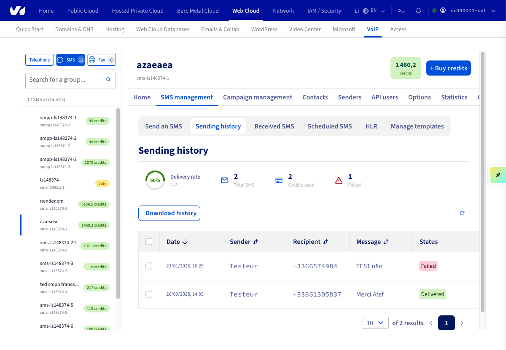
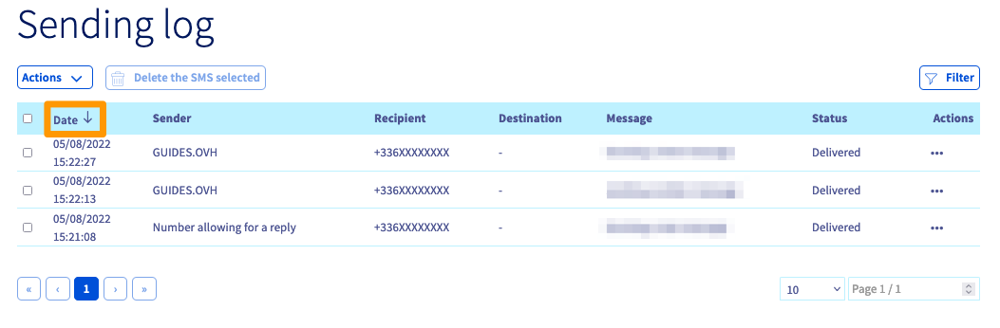
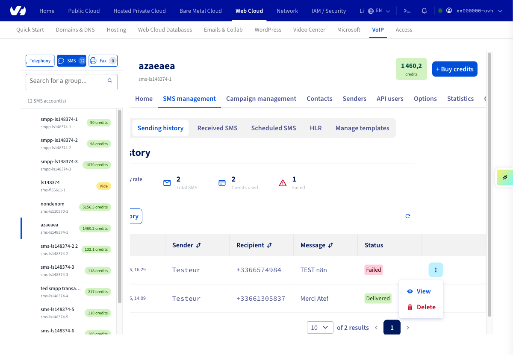
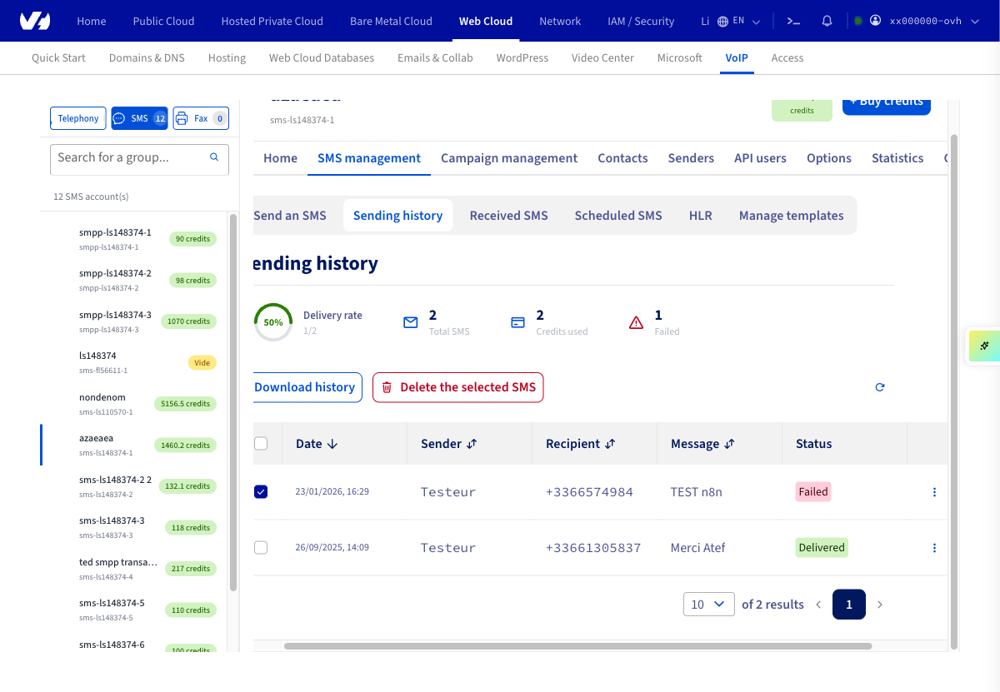
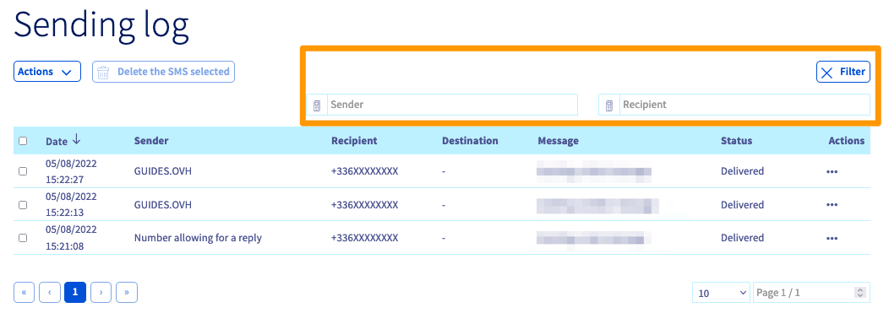
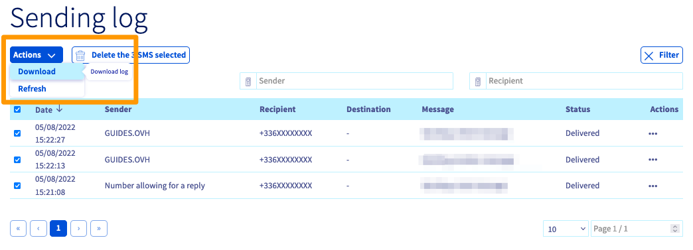
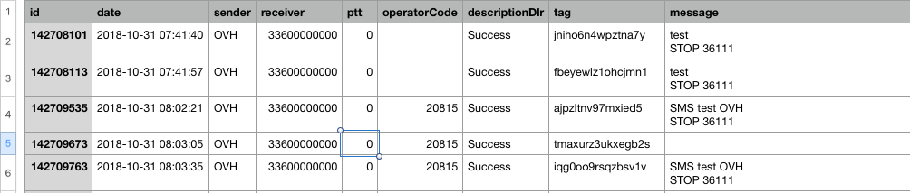

## Objectif

Votre espace client OVHcloud vous permet de consulter et télécharger l'historique de vos SMS envoyés. Ce guide vous décrit comment effectuer ces actions.

## Prérequis

- Disposer d'un compte SMS OVHcloud avec au moins 1 SMS envoyé.

<!-- CP-NAV-START:telecom-sms -->
---

### Accès à l'espace client OVHcloud

- **Lien direct :** [SMS](/links/control-panel/telecom-sms)
- **Pour accéder à vos services :** `Télécom`{.action} > `SMS`{.action} > Sélectionnez votre compte SMS

---
<!-- CP-NAV-END:telecom-sms -->

{.thumbnail}

## En pratique

L'historique comprend la date, l'heure, l'expéditeur, le destinataire ainsi que le contenu du SMS envoyé.

> [!primary]
>
> L'espace client OVHcloud vous permet de consulter les SMS envoyés au cours des 6 derniers mois (ou les 5000 derniers SMS si vous avez envoyé plus de 5000 SMS au cours des 6 derniers mois).
>
> Pour consulter des SMS plus anciens (jusqu'aux 12 derniers mois), vous devez télécharger l'historique de vos SMS au format CSV. Consultez [l'étape 2 de ce guide](#csv).
>

### Étape 1 : Consulter l'historique dans votre espace client

<!-- CP-STEPS-START:view-sms-log -->
Dans la barre d'onglets, cliquez sur `Message et campagne`{.action} puis sur `Gestion des SMS`{.action} pour accéder à l'historique de vos SMS unitaires ou sur `Gestion des campagnes`{.action} pour accéder à l'historique de vos campagnes de SMS.

Selon votre choix, cliquez ensuite sur `Historique des envois`{.action} ou `Statistiques et historique`{.action}.

{.thumbnail}

Vous pouvez cliquer sur la date à gauche pour trier votre historique par date d'envoi.

{.thumbnail}

La rubrique Actions `...`{.action} en face de chaque SMS vous permet de le consulter ou le supprimer.

{.thumbnail}

Pour supprimer plusieurs SMS à la fois, il suffit de cocher les cases à côté de chacun d'entre eux. Le bouton `Supprimer les éléments sélectionnés`{.action} apparaîtra alors au-dessus de l'historique.

{.thumbnail}
 
Le bouton `Filtrer`{.action} vous permet de filtrer la recherche par expéditeur (si vous disposez de plusieurs expéditeurs) ou par destinataire.

{.thumbnail}
<!-- CP-STEPS-END:view-sms-log -->
 
### Étape 2 : Télécharger l'historique de vos SMS en CSV 

<!-- CP-STEPS-START:download-sms-csv -->
Cliquez sur le bouton `Actions`{.action} à gauche au-dessus de votre historique puis sur `Télécharger`{.action} pour télécharger l'historique de vos SMS envoyés au format « .csv ». 
 
{.thumbnail}
<!-- CP-STEPS-END:download-sms-csv -->
 
Vous pourrez alors consulter l'historique depuis un outil de type tableur. Les informations s'afficheront comme dans l'exemple ci-dessous.

{.thumbnail}

Voici le détail des informations contenues dans cet historique :

|  Titre  |  Description  |
|  :-----          |  :-----          |
|  id |  l'identifiant unique sur nos serveurs du SMS envoyé |
|  date | la date et heure d'envoi du SMS  |
|  sender |  l'expéditeur depuis lequel le SMS a été envoyé |
|  receiver |  le numéro du mobile destinataire du SMS |
|  ptt |  le code de retour sur le statut du SMS |
|  operatorCode |  l'identifiant réseau de l'opérateur mobile à qui nous avons transmis le SMS |
|  descriptionDlr |  la description du code ptt reçu et donc du statut du SMS |
|  tag |  le tag attribué manuellement via les API (à un ou plusieurs SMS) ou automatiquement par nos serveurs à chacun des SMS (ou chaque campagne de SMS) envoyés |
|  message |  le contenu du SMS |

Vous trouverez plus de détails sur les codes ptt et les différents ID du DLR en consultant la dernière section du guide [Tout savoir sur les utilisateurs SMS](/pages/web_cloud/messaging/sms/tout_savoir_sur_les_utilisateurs_sms#etape-5-specifier-une-url-de-callback).
 
## Aller plus loin

Échangez avec notre [communauté d'utilisateurs](/links/community).
