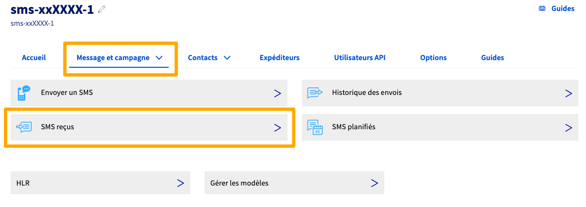

## Objectif

Le service de [SMS réponse](https://www.ovhcloud.com/fr/sms/marketing/sms-response/) vous permet d'envoyer un SMS auquel le destinataire pourra répondre. Vous pouvez ainsi créer un échange de réponses (programmation d'un rendez-vous médical, jeux, etc.) avec votre destinataire.

Lexpéditeur du SMS réponse sera un numéro court aléatoire. Son utilisation est incluse dans votre offre SMS et la réponse n'est pas surtaxée pour le destinataire.

> [!primary]
> **Important**
>
> - Le service SMS réponse n'est disponible que pour la France.
> - Lorsqu'une réponse est apportée par votre destinataire, un crédit SMS (minimum) vous est décompté.
> - Lorsque vous répondez à nouveau à votre destinataire, un crédit SMS (minimum) vous est décompté.
>

## Prérequis

- Disposer d’un compte SMS OVHcloud crédité.
- Être connecté à l'[espace client OVHcloud](https://www.ovh.com/auth?onsuccess=https%3A%2F%2Fwww.ovhtelecom.fr%2Fmanager&ovhSubsidiary=fr){.external}, partie `Télécom`{.action} puis `SMS`{.action}.

{.thumbnail}

## En pratique

### Principe de fonctionnement et limitations

Les réponses sont possibles depuis les opérateurs mobiles français (Bouygues Telecom, Free, Orange, SFR et opérateurs virtuels (MNVO) associés). 
Cela signifie que seuls les numéros géolocalisés en France métropolitaine et associés à un abonnement chez un de ces opérateurs utilisent des SMS compatibles et verront leurs réponses traitées.

Les destinataires ne peuvent répondre à votre SMS que lorsque vous utilisez le [numéro virtuel](https://www.ovhcloud.com/fr/sms/virtual-numbers/) ou le numéro court lors de l’envoi. Ce dernier, à 5 chiffres, est attribué aléatoirement et est spécifique à la conversation. Il ne pourra donc pas être conservé.

Le fonctionnement du service de réponse par SMS est très simple :

{.thumbnail}

Le service permet au destinataire de répondre au SMS reçu dans un délai de 48 heures. Passé ce délai, la réponse ne sera pas prise en compte.

La réponse (si vous l'activez) peut être ensuite :

- **Automatique** et **unique** : vous définissez une réponse (dans l'espace client) qui sera systématiquement envoyée.
- **Dynamique** : vous faites appel à un script qui gère la réponse.

### Gérer les options des réponses

Avant d'envoyer votre SMS réponse, nous vous conseillons de configurer les options de réception des réponses.

Connectez-vous à votre [espace client](/links/manager) puis sélectionnez `Télécom`{.action}. Cliquez ensuite sur `SMS`{.action} et choisissez votre compte SMS.

Dans la barre d'onglets, cliquez sur `Options`{.action} puis sur `Options des réponses`{.action}.

{.thumbnail}

Vous pouvez configurer une **action à la réception** (pour répondre à votre destinataire ou déclencher un script) et / ou une **notification à la réception** (pour vous tenir vous-même informé des réponses de vos destinataires).

#### Action à la réception

Dans le menu déroulant, choisissez l'une des options proposées :

| Option | Action complémentaire |
|---|---|
| Répondre un texte prédéfini | Saisissez le texte qui sera envoyé par SMS au destinataire (le nombre correspondant de crédits sera débité de votre compte SMS à chaque réponse automatique) |
| Appeler un CGI | Saisissez l'URL de votre script CGI |
| Aucune | Aucune |

Une fois votre option configurée, cliquez sur le bouton `Valider`{.action}.

> [!primary]
>
> Si vous choisissez de répondre par SMS, le numéro court effectuant l'envoi pourra être différent du numéro court ayant envoyé votre SMS initial.

#### Notification à la réception

> [!warning]
> **Informations sur la confidentialité des données**
> 
> Ce service de notification doit être réservé à votre propre usage.
>
> En effet, les notifications contiennent des informations relatives au destinataire de votre SMS ainsi que des données de votre compte OVHcloud (nom du compte SMS contenant votre identifiant OVHcloud).

Cliquez sur `Ajouter une notification`{.action} pour accéder au menu suivant.

Configurez alors une notification par e-mail ou par SMS.

- Notification par e-mail
    - Expéditeur : renseignez obligatoirement une adresse e-mail valide vous appartenant.
    - Adresse e-mail: renseignez l'adresse e-mail destinataire de la notification.

- Notification par SMS
    - Expéditeur : choisissez un expéditeur parmi ceux déjà validés dans votre compte SMS.
    - Numéro : entrez le numéro du destinataire de la notification au **format international**.

Une fois votre notification configurée, cliquez sur le bouton `Valider`{.action}. Vous pouvez ajouter plusieurs notifications, les éditer ou les supprimer.

### Envoyer un SMS réponse

Dans l'espace client, sélectionnez l'onglet `Accueil`{.action} de votre compte SMS. Cliquez ensuite sur `Envoyer un SMS`{.action}.

{.thumbnail}

Assurez-vous que votre expéditeur est bien le `Numéro permettant la réponse (France uniquement`.

{.thumbnail}

Complétez ensuite les champs dédiés au(x) destinataire(s) et à votre message. Pour plus de détails, consultez [notre guide sur l'envoi de SMS depuis l'espace client](/pages/web_cloud/messaging/sms/envoyer_des_sms_depuis_mon_espace_client).

### Consulter les réponses

Dans l'espace client, cliquez sur l'onglet `Message et campagne`{.action} de votre compte SMS. Cliquez ensuite sur `SMS reçus`{.action}.

{.thumbnail}

Un tableau liste tous les SMS reçus en réponse de vos envois. Vous pouvez trier ces SMS en cliquant sur les en-têtes des colonnes du tableau.

## Aller plus loin

Échangez avec notre communauté d'utilisateurs sur <https://community.ovh.com>.
