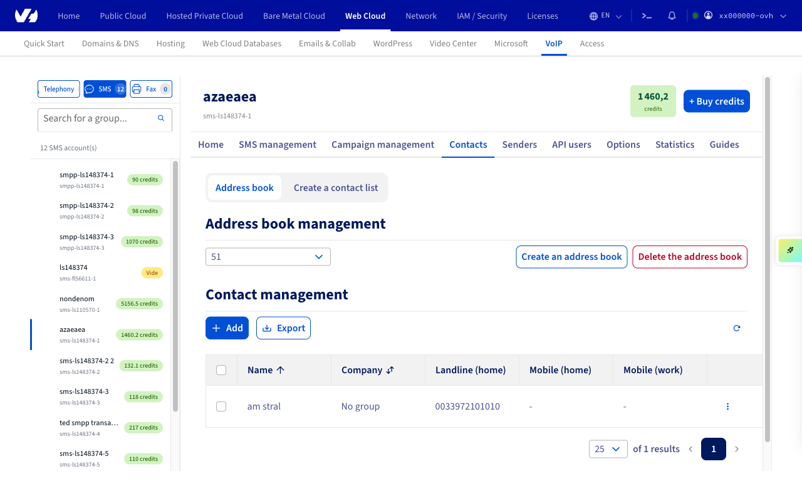
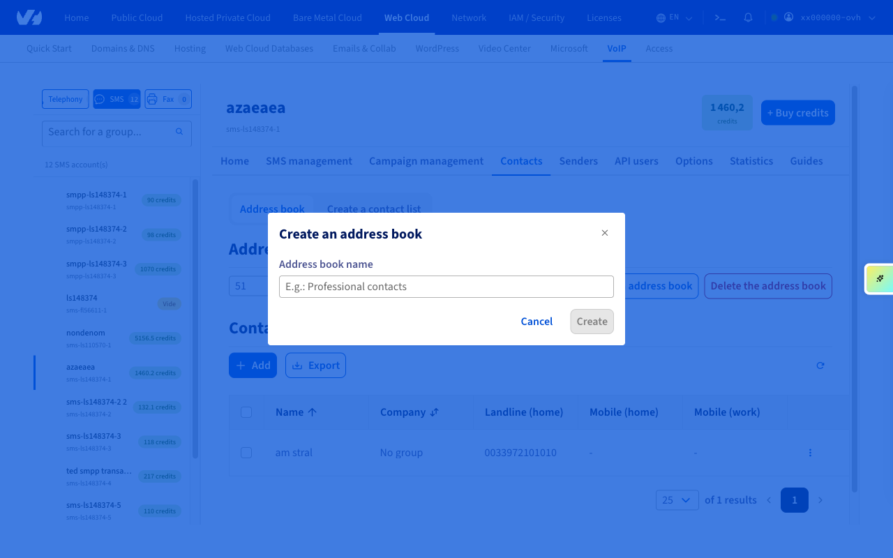
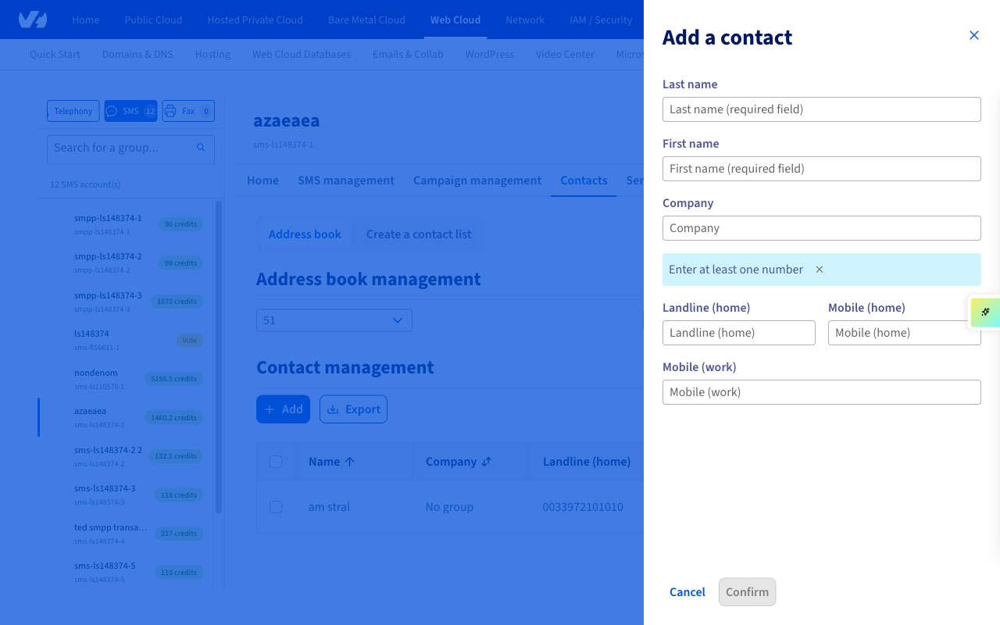
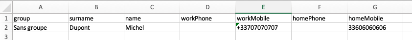
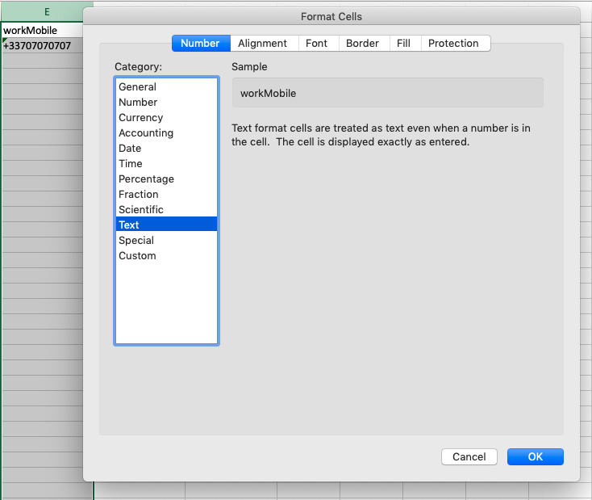
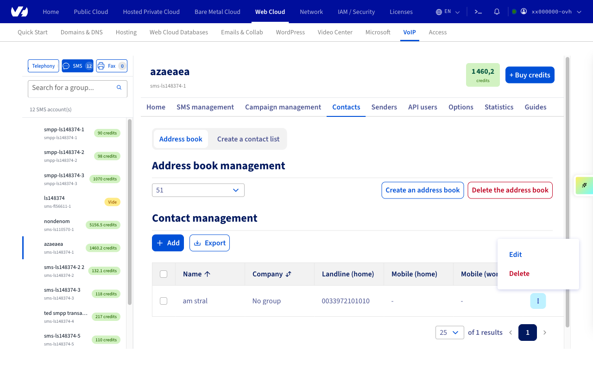

## Objective

All OVHcloud SMS accounts can use one or more address books. This guide explains how to create them in the OVHcloud Control Panel.

## Requirements

- an active OVHcloud SMS account
- a spreadsheet or text editor tool

<!-- CP-NAV-START:telecom-sms -->
---

### OVHcloud Control Panel Access

- **Direct link:** [SMS](/links/control-panel/telecom-sms)
- **Navigation path:** `Telecom`{.action} > `SMS`{.action} > Select your SMS account

---
<!-- CP-NAV-END:telecom-sms -->

{.thumbnail}

## Instructions

### Step 1: Create an address book via the OVHcloud Control Panel

<!-- CP-STEPS-START:create-address-book -->

In the `Contacts`{.action} tab, click `Address book`{.action}.

{.thumbnail}

Click `Create an address book`{.action}, and give it a name.

{.thumbnail}

<!-- CP-STEPS-END:create-address-book -->

### Step 2: Add contacts to your address book

You have now created the address book, but it does not contain any contacts. There are several ways of adding contacts.

### Add them individually via the OVHcloud Control Panel

<!-- CP-STEPS-START:add-contact-individually -->

Click `Add`{.action}.

{.thumbnail}

A side drawer opens where you can enter the contact's details (last name, first name, company, and at least one phone number).

{.thumbnail}

Fill in the required fields and click `Confirm`{.action} to save your changes. The contact will then be added to your address book. Repeat this process to add more contacts.

<!-- CP-STEPS-END:add-contact-individually -->

### Add multiple contacts by importing a contact file to the OVHcloud Control Panel

#### Prepare a file in your spreadsheet

If you would like to use or create a document in a spreadsheet format, you will need to design it as per the layout below, and export it in .csv format.

{.thumbnail}

The vast majority of spreadsheet tools won't support the international format expected for telephone/fax numbers (+44xxxxxxxxxx). This means you will need to change the format of the cells that contain these numbers (workPhone, workMobile, etc.). To do this, select the columns concerned, and select a “Text” format for them.

{.thumbnail}

Once the document is ready, save it in a spreadsheet format to edit later.

At the same time, save or export it in .csv format to prepare the import.

> [!primary] 
>
> **Recommendations**
>
> Save your spreadsheet file in .csv format (separator: semi-colon).
>
> Special characters like accents are not included in the .csv file import, and contacts that contain special characters will not be imported.
>
> Please follow the international format +44xxxxxxxxxx for your phone numbers.
>
> We advise ensuring that your address books do not contain more than 2,000 contacts.
>
> All of your contacts must be on the same sheet in your spreadsheet file.
>
>

#### Import the file into the OVHcloud Control Panel

<!-- CP-STEPS-START:import-contact-file -->

> [!warning]
> **Feature not available in the new Manager**
>
> The CSV contact file import is not available in the new OVHcloud Manager. Contacts can only be added individually via the `Add`{.action} button in the `Contacts`{.action} tab.

<!-- ⚠️ To document: The CP import-contact-file flow (Actions > Import > Contact file) has no NM equivalent. NM phonebooks only support adding contacts one at a time via a form drawer. Consider removing or replacing this section with a note pointing users to the individual add flow. -->

<!-- CP-STEPS-END:import-contact-file -->

### Step 3: Edit or delete an address book

<!-- CP-STEPS-START:edit-delete-address-book -->

To delete an address book, select it from the dropdown menu (if you have created several), then click `Delete the address book`{.action}.

To edit or delete a contact, click the ellipsis icon (⋮) on the contact row. A menu will appear with `Edit`{.action} and `Delete`{.action} options.

{.thumbnail}

<!-- CP-STEPS-END:edit-delete-address-book -->

## Go further

Join our [community of users](/links/community).
