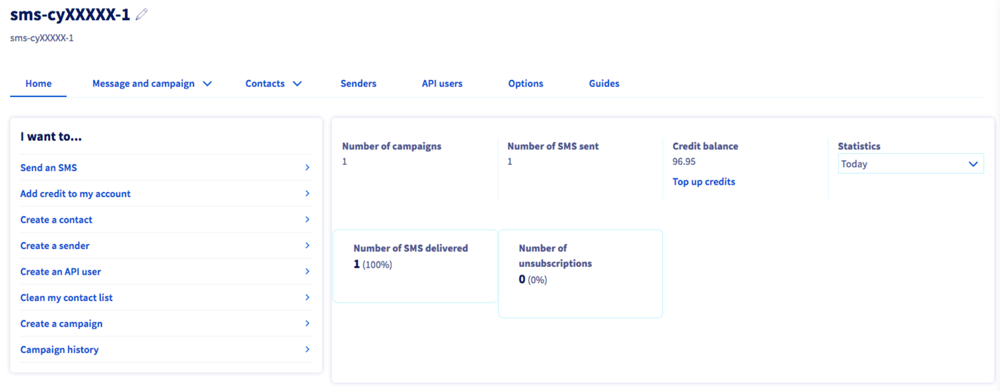
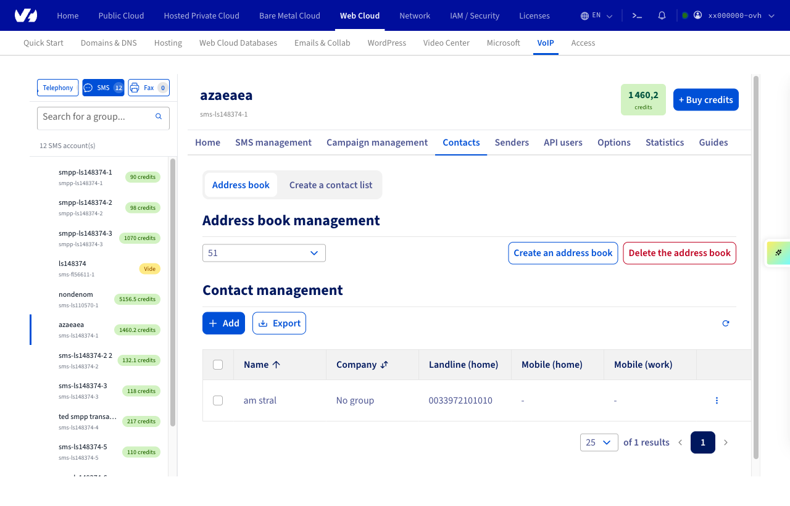
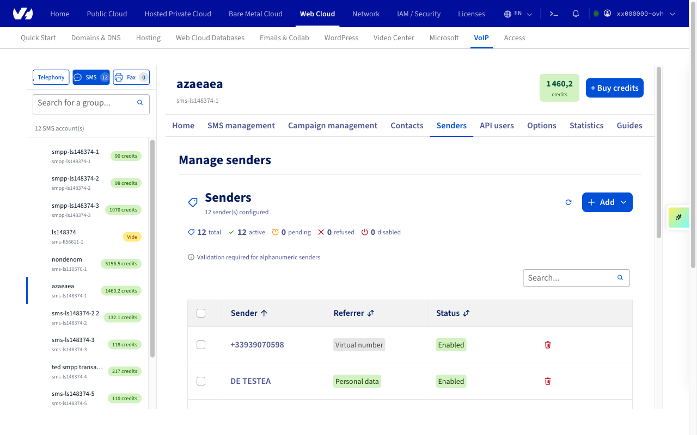
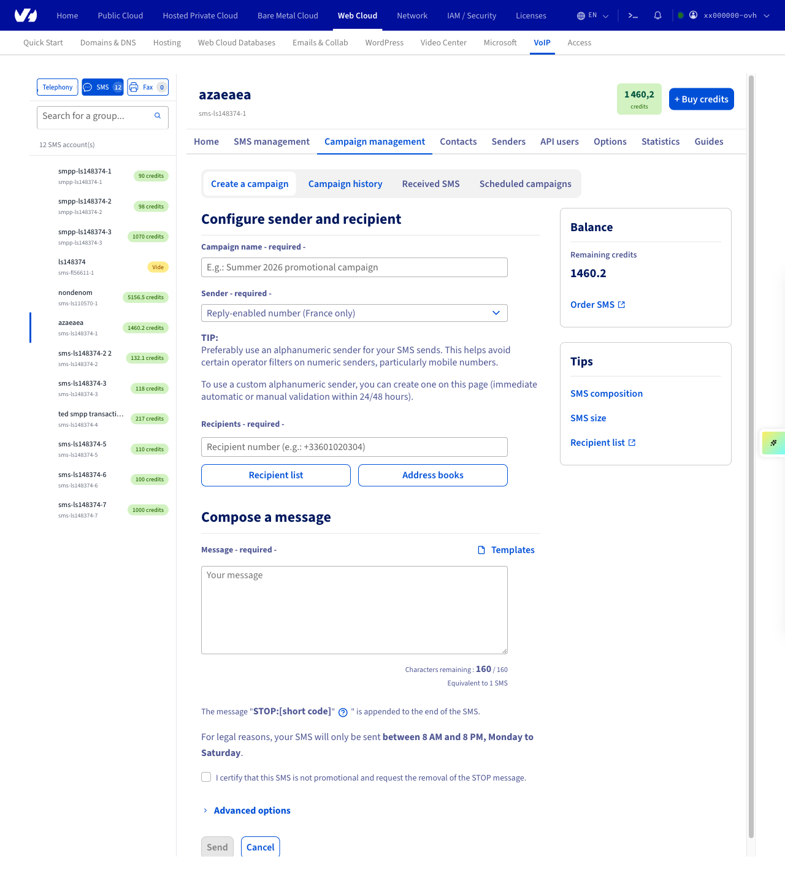

> [!primary]
> Tłumaczenie zostało wygenerowane automatycznie przez system naszego partnera SYSTRAN. W niektórych przypadkach mogą wystąpić nieprecyzyjne sformułowania, na przykład w tłumaczeniu nazw przycisków lub szczegółów technicznych. W przypadku jakichkolwiek wątpliwości zalecamy zapoznanie się z angielską/francuską wersją przewodnika. Jeśli chcesz przyczynić się do ulepszenia tłumaczenia, kliknij przycisk "Zgłóś propozycję modyfikacji" na tej stronie.
> 

## Wprowadzenie

OVHcloud udostępnia Ci zintegrowane z Panelem klienta narzędzia umożliwiające wysyłanie wiadomości SMS. W tym przewodniku poznasz te narzędzia i dowiesz się, jak przeprowadzić pierwszą kampanię wysyłki SMS-ów.

## Wymagania początkowe

- Posiadanie konta SMS OVHcloud z zasileniami SMS

<!-- CP-NAV-START:telecom-sms -->
---

### Dostęp do Panelu klienta OVHcloud

- **Link bezpośredni:** [SMS](/links/control-panel/telecom-sms)
- **Ścieżka nawigacji:** `Telecom`{.action} > `SMS`{.action} > Wybierz konto SMS

---
<!-- CP-NAV-END:telecom-sms -->

{.thumbnail}

## W praktyce

Pasek narzędzi oraz skróty ułatwiają dostęp do głównych funkcji służących do wysyłania kampanii SMS.

{.thumbnail}

### Etap 1: Dodaj kontakty

<!-- CP-STEPS-START:add-contacts -->
#### Dodanie listy kontaktów

Listę kontaktów można zaimportować z pliku .csv lub .txt.

Aby dodać listę kontaktów, kliknij zakładkę `Kontakty`{.action}, a następnie `Utwórz listę kontaktów`{.action}. 

{.thumbnail}

Z następującego przewodnika dowiesz się, [jak utworzyć listę odbiorców wiadomości SMS](/pages/web_cloud/messaging/sms/liste_de_destinataire_sms).

#### Dodanie książki adresowej

W przeciwieństwie do listy kontaktów, książka adresowa zawiera kontakty, które możesz nazwać, a tym samym łatwo zidentyfikować w przypadku ukierunkowanych kampanii.

Aby dodać książkę adresową, kliknij zakładkę `Kontakty`{.action}, a następnie `Książka adresowa`{.action}.

{.thumbnail}

Zapoznaj się z przewodnikiem [Zarządzanie książkami adresowymi SMS](/pages/web_cloud/messaging/sms/gerer_mes_carnets_dadresses_sms), aby dowiedzieć się więcej.
<!-- CP-STEPS-END:add-contacts -->

### Etap 2: Utworzyć nadawcę

<!-- CP-STEPS-START:create-sender -->
Domyślnie wysyłka wiadomości SMS z konta OVHcloud we Francji odbywa się ze skróconego numeru umożliwiającego otrzymanie odpowiedzi. Być może bardziej przydatne będzie zażądanie nadawcy alfanumerycznego w karcie `Nadawcy`{.action}, aby wiadomości SMS były wysyłane w imieniu Twojej firmy lub organizacji.

{.thumbnail}

W tym celu zapoznaj się z sekcją poświęconą wyborowi nadawcy wiadomości SMS w przewodniku [„Wysyłanie wiadomości SMS z Panelu klienta”](/pages/web_cloud/messaging/sms/envoyer_des_sms_depuis_mon_espace_client#etap-3-wybor-nadawcy-wiadomosci-sms).
<!-- CP-STEPS-END:create-sender -->

### Etap 3: Wysłanie kampanii SMS

<!-- CP-STEPS-START:send-sms-campaign -->
Zakładka `Wiadomość i kampania`{.action} umożliwia dostęp do opcji wysyłki, historii wysłanych i odebranych wiadomości SMS oraz do zaplanowanych wysyłek wiadomości SMS w ramach odroczonej wysyłki.

{.thumbnail}

Aby wysłać pojedynczą wiadomość SMS z Panelu klienta, zapoznaj się [z przewodnikiem dotyczącym tej metody](/pages/web_cloud/messaging/sms/envoyer_des_sms_depuis_mon_espace_client).

Aby wysłać kampanię SMS, kliknij `Zarządzanie kampaniami`{.action}, a następnie `Tworzenie kampanii`{.action}.

{.thumbnail}

Zacznij od zdefiniowania nazwy Twojej kampanii w wyznaczonym polu.

Wybierz nadawcę spośród dostępnych.

{.thumbnail}

Zbuduj swoją wiadomość i wybierz między natychmiastową lub zaplanowaną wysyłką. W przypadku wysyłki zaplanowanej podaj datę i godzinę wysyłki.

{.thumbnail}

Teraz kliknij przycisk `Wyślij`{.action}, aby Twoja kampania została wysłana lub zaplanowana.
<!-- CP-STEPS-END:send-sms-campaign -->

## Sprawdź również

Zapoznaj się z [naszym przewodnikiem dotyczącym zarządzania historią wiadomości SMS](/pages/web_cloud/messaging/sms/gerer_l_historique_des_sms).

Dołącz do [grona naszych użytkowników](/links/community).

