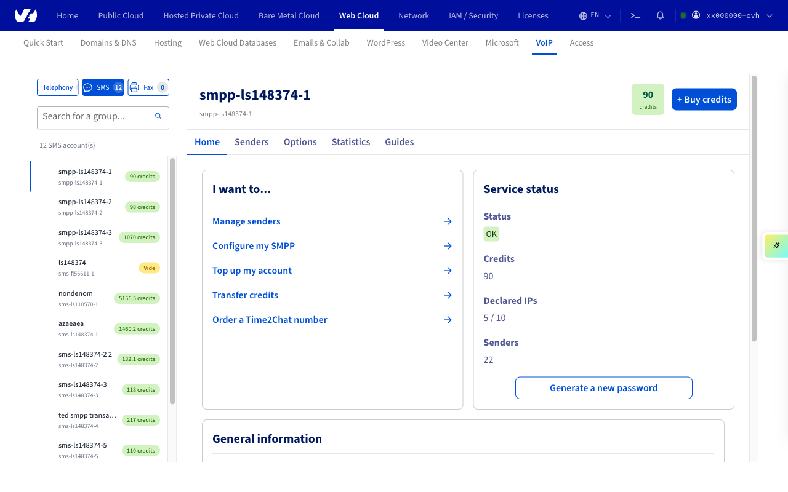
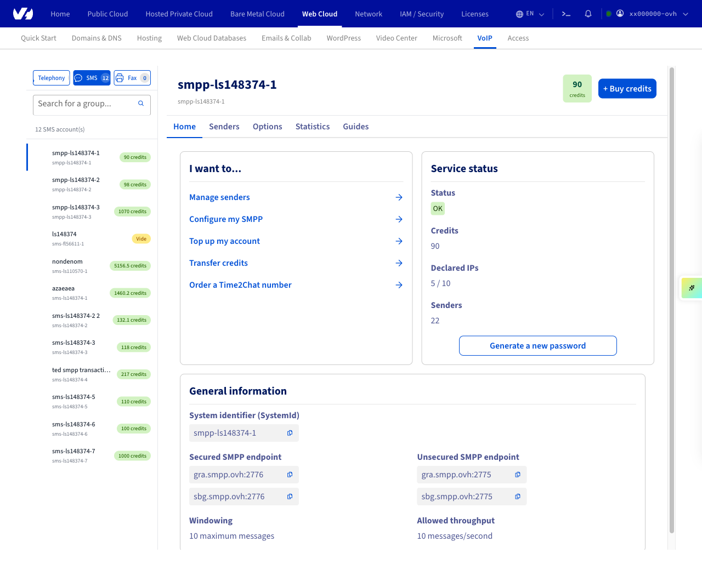
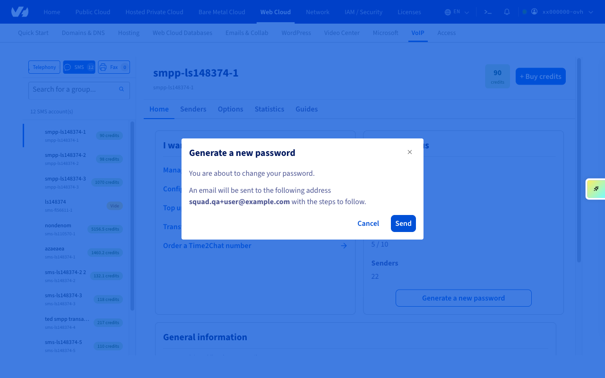
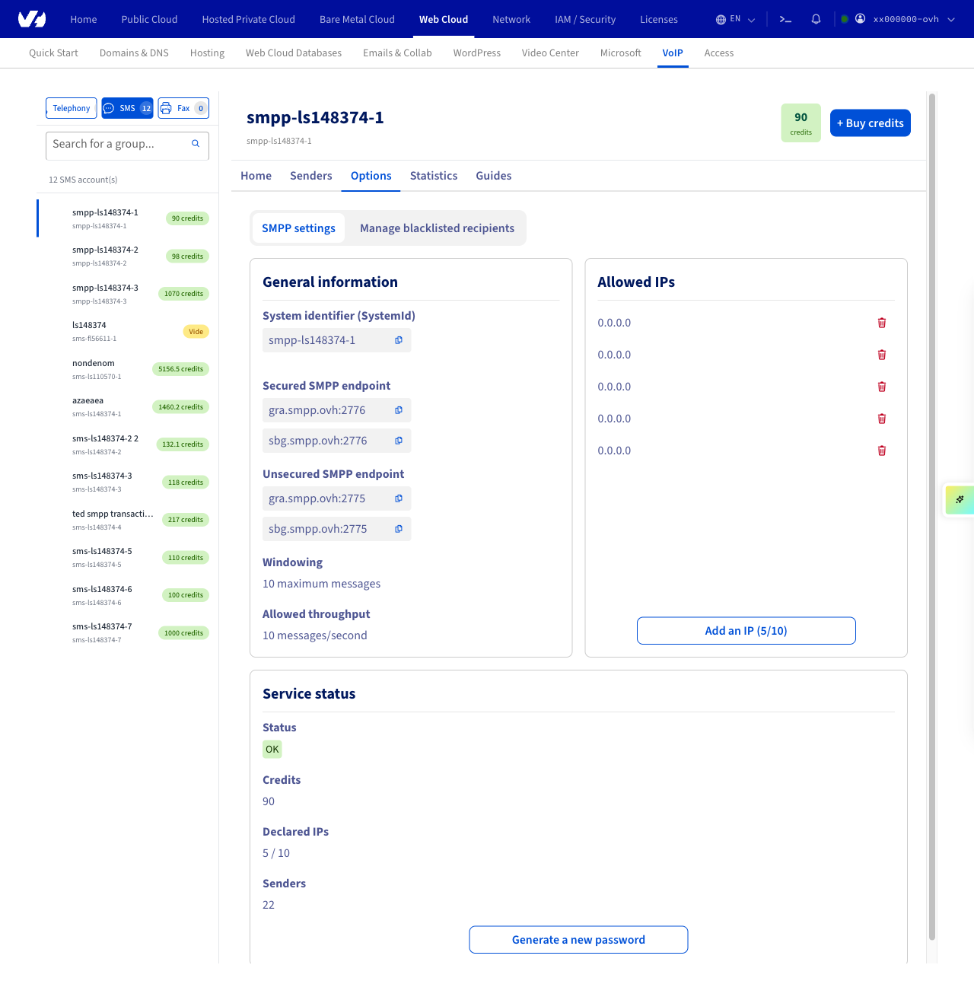
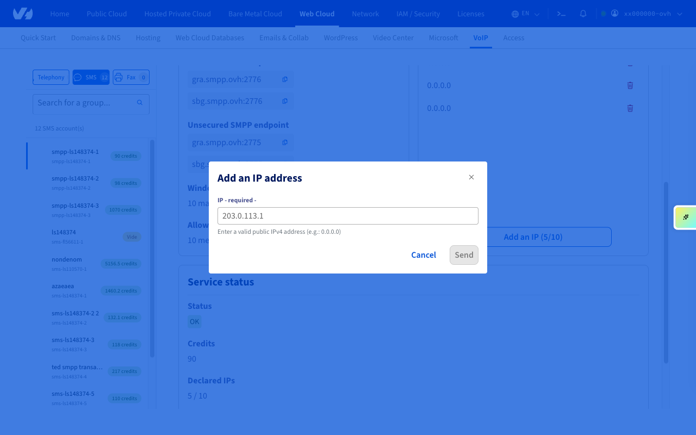

## Objective

In the OVHcloud Control Panel, you can retrieve your SMPP credentials, change your password, manage access to the service, and transfer SMS credits.

**Find out how to manage an SMS SMPP account settings from the OVHcloud Control Panel.**

> [!primary]
>
> We recommend that you read the [technical specifications of the OVHcloud SMPP solution](/pages/web_cloud/messaging/sms/smpp-specification).

## Requirements

- an [OVHcloud SMS SMPP account](https://www.ovhcloud.com/en-gb/sms/api-sms/)

<!-- CP-NAV-START:telecom-sms -->
---

### OVHcloud Control Panel Access

- **Direct link:** [SMS](/links/control-panel/telecom-sms)
- **Navigation path:** `Telecom`{.action} > `SMS`{.action} > Select your SMS account

---
<!-- CP-NAV-END:telecom-sms -->

## Instructions

<!-- CP-STEPS-START:account-selection -->

In the left sidebar, navigate to `Telecom`{.action} > `SMS`{.action}. SMPP accounts appear at the top of the account list alongside regular SMS accounts. Their names start with `smpp-` instead of `sms-` for standard SMS accounts. Click your SMPP account to select it.

{.thumbnail}

<!-- CP-STEPS-END:account-selection -->

### Credentials

<!-- CP-STEPS-START:credentials -->

Once your SMPP account is selected, the Home tab opens by default. Your login credentials are displayed in the **General information** tile: System identifier (SystemId), secured and unsecured SMPP endpoints, windowing, and allowed throughput.

{.thumbnail}

To reset your SMPP password, click `Generate a new password`{.action} in the **Service status** tile. A confirmation modal will appear. Click `Send`{.action} to confirm. A new password will be sent to the contact email address for your OVHcloud account.

{.thumbnail}

<!-- CP-STEPS-END:credentials -->

### Access management

<!-- CP-STEPS-START:access-management -->

Click the `Options`{.action} tab. For SMPP accounts, the `SMPP settings`{.action} sub-tab is selected by default.

{.thumbnail}

The **Allowed IPs** tile lists the IP addresses authorised to connect to the SMPP server. Click `Add an IP`{.action} to add a new IP address to the list.

{.thumbnail}

<!-- CP-STEPS-END:access-management -->

### Manage senders and credits

See our guides on [sender management](/pages/web_cloud/messaging/sms/envoyer_des_sms_depuis_mon_espace_client#step-3-choose-an-sms-sender) and [managing SMS credits and enabling automatic re-crediting](/pages/web_cloud/messaging/sms/activer_la_recharge_automatique_du_credit_sms).

## Go further

See [our guide on managing SMS history](/pages/web_cloud/messaging/sms/gerer_l_historique_des_sms).

[The technical specifications of the OVHcloud SMPP solution](/pages/web_cloud/messaging/sms/smpp-specification).

Join our [community of users](/links/community).
