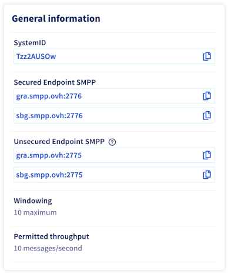
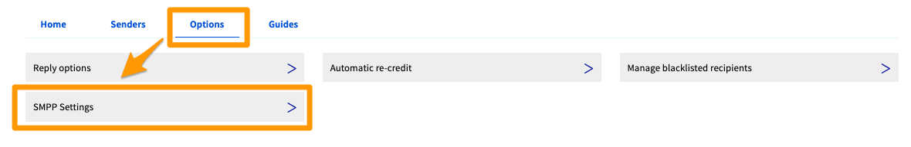

> [!primary]
> Questa traduzione è stata generata automaticamente dal nostro partner SYSTRAN. I contenuti potrebbero presentare imprecisioni, ad esempio la nomenclatura dei pulsanti o alcuni dettagli tecnici. In caso di dubbi consigliamo di fare riferimento alla versione inglese o francese della guida. Per aiutarci a migliorare questa traduzione, utilizza il pulsante "Contribuisci" di questa pagina.
>

## Obiettivo

Lo Spazio Cliente OVHcloud permette di recuperare le credenziali SMPP, modificare la password, gestire gli accessi al servizio e trasferire crediti SMS.

**Questa guida ti mostra come gestire le impostazioni di un account SMS SMPP dallo Spazio Cliente OVHcloud.**

> [!primary]
>
> Ti consigliamo di prendere visione delle [specifiche tecniche dell'offerta SMPP OVHcloud](/pages/web_cloud/messaging/sms/smpp-specification).

## Prerequisiti

- Disporre di un [account SMS SMPP OVHcloud](https://www.ovhcloud.com/it/sms/api-sms/)
- Avere accesso allo [Spazio Cliente OVHcloud](https://www.ovh.com/auth/?action=gotomanager&from=https://www.ovh.it/&ovhSubsidiary=it) nella sezione `Telecom`{.action} > `SMS`{.action}

## Procedura

Seleziona il tuo account SMPP. Con il suo nome si distingue dagli altri account SMS OVHcloud. infatti inizia da `smpp-` invece di `sms-` per gli account SMS classici.

{.thumbnail}

### Informazioni di identificazione

Nella sezione `Informazioni generali` sono disponibili le credenziali necessarie all'utilizzo del tuo servizio. Utilizza il pulsante a destra di ogni campo per copiarne il contenuto.

{.thumbnail}

Se hai dimenticato la password SMPP, clicca su `Genera una nuova password`{.action}. Una nuova password verrà inviata all'indirizzo email di contatto del tuo account OVHcloud, visualizzandoti la password. 

Clicca su `Inviare`{.action} per confermare l'operazione.

{.thumbnail}

### Gestione degli accessi

Clicca sulla scheda `Opzioni`{.action} e poi su `Impostazioni SMPP`{.action}.

{.thumbnail}

La casella `IP autorizzati` elenca gli indirizzi IP dei client SMPP a cui è consentito l'accesso al server SMPP.

Clicca su `Aggiungi un IP`{.action} per aggiungere indirizzi IP a questa lista.

{.thumbnail}

### Gestione mittenti e crediti

Consulta le nostre guide sulla [gestione mittenti](/pages/web_cloud/messaging/sms/envoyer_des_sms_depuis_mon_espace_client#step-3-scegli-il-mittente-del-tuo-sms) e sulla [gestione dei crediti SMS e ricarica automatica](/pages/web_cloud/messaging/sms/activer_la_recharge_automatique_du_credit_sms).

## Per saperne di più

Consulta la nostra guida dedicata alla [gestione dello storico degli SMS](/pages/web_cloud/messaging/sms/gerer_l_historique_des_sms).

[Specifiche tecniche dell'offerta SMPP OVHcloud](/pages/web_cloud/messaging/sms/smpp-specification).

Contatta la nostra Community di utenti all’indirizzo <https://community.ovh.com/en/>
