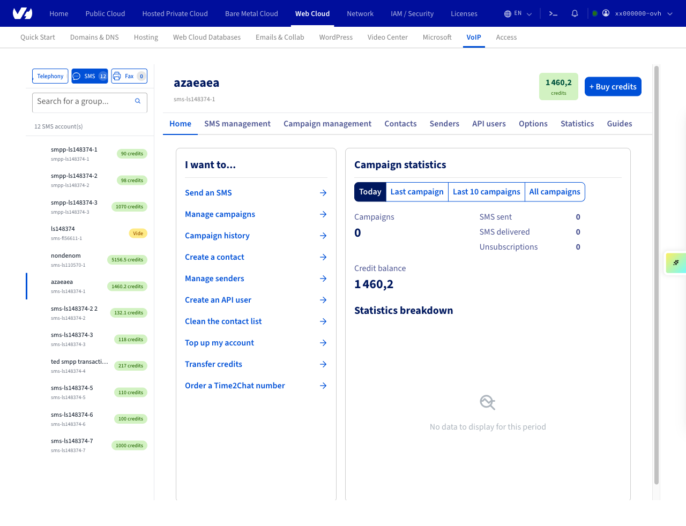
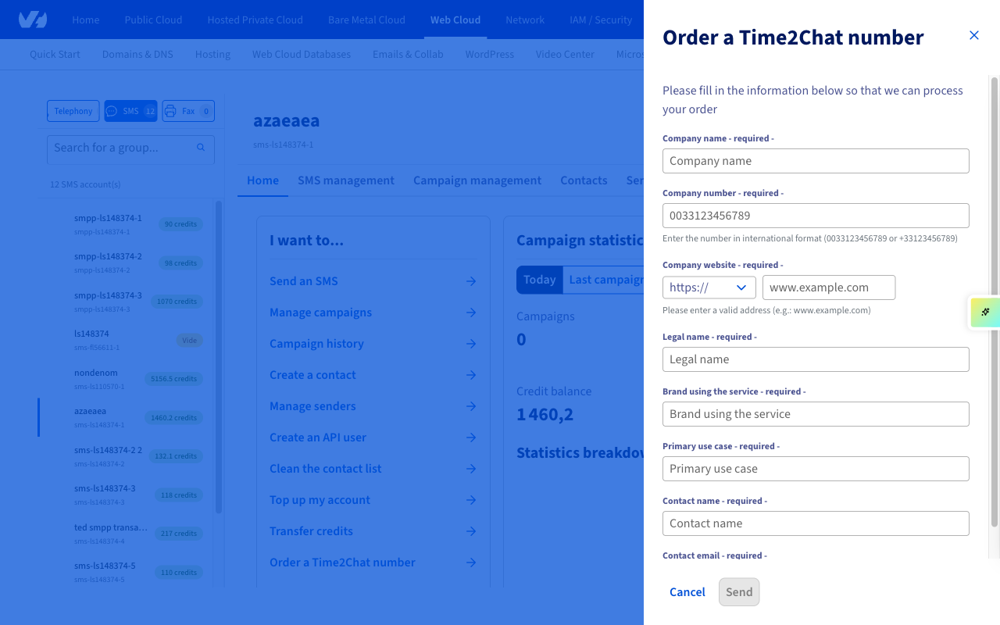
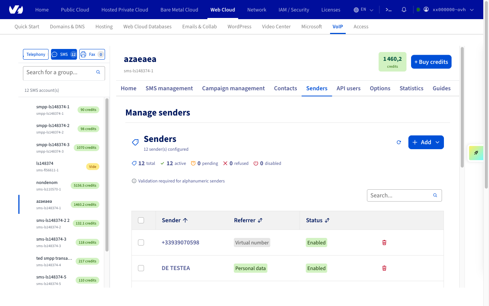

## Objectif

Time2Chat est une solution de messagerie conversationnelle par SMS. Elle permet à une entreprise d’envoyer et de recevoir des messages depuis un numéro unique commençant par « 09 », accessible partout en France métropolitaine.

Ce guide présente le principe de Time2Chat, ses avantages, les conditions d’accès et les premières étapes d’utilisation.

## Prérequis

- Disposer d'un [compte SMS OVHcloud](/links/telecom/sms).

<!-- CP-NAV-START:telecom-sms -->
---

### Accès à l'espace client OVHcloud

- **Lien direct :** [SMS](/links/control-panel/telecom-sms)
- **Pour accéder à vos services :** `Télécom`{.action} > `SMS`{.action} > Sélectionnez votre compte SMS

---
<!-- CP-NAV-END:telecom-sms -->

{.thumbnail}

## En pratique

### Informations générales sur Time2Chat

Time2Chat est une solution de messagerie conversationnelle bidirectionnelle (marque ↔ client) permettant à une entreprise et à ses clients d’échanger par SMS en France.

Contrairement à un envoi de SMS classique, le service repose sur un numéro dédié commençant par « 09 », attribué spécifiquement à chaque entreprise. Vous pouvez utiliser ce numéro pour envoyer et recevoir des SMS.

Une « session » de conversation débute dès qu’un premier message est envoyé — qu’il provienne de la marque ou du client. À partir de cet instant, la session reste active pendant 24 heures. Durant ce laps de temps, les deux interlocuteurs peuvent échanger un nombre illimité de SMS via le même canal, sous réserve de crédits disponibles côté marque. Une fois la période écoulée, tout nouveau message provenant de la marque ou du client relance automatiquement une nouvelle session de 24 heures.

#### Exemples d’usage

- Prise ou confirmation de rendez-vous.
- Suivi de commande ou notification de livraison.
- Service après-vente et assistance client.
- Enquêtes de satisfaction ou sondages rapides.
- Interaction directe sans application à installer.

#### Avantages pour votre entreprise

- **Canal universel** : Le SMS reste accessible à toute personne disposant d'un forfait de téléphonie mobile.
- **Numéro unique et identifiable** (en « 09 »), renforçant la reconnaissance de marque.
- **Expérience fluide** : Échanges naturels et continus, sans contrainte de format.
- **Conformité** : Respect de la réglementation française sur la messagerie professionnelle.

#### Différences avec l’offre SMS historique

Le service Time2Chat repose sur un modèle conversationnel, différent des envois de SMS classiques :

| Fonctionnalité | SMS classique | Time2Chat |
|----------------|------------------------|-----------|
| Expéditeurs | Numéro court mutualisé permettant la réponse, pouvant changer.  Expéditeur alphanumérique. | Numéro dédié en 09. |
| Type d’usage | Envoi unidirectionnel (notification, alerte). | Conversation bidirectionnelle. |
| Gestion des réponses | Réponses ponctuelles sur le numéro court, sans fil de discussion.  Pas de réponse possible pour un expéditeur alphanumérique. | Fil de conversation de 24 heures entre la marque et le client. |
| Facturation | 1 SMS envoyé = 1 crédit. | 1 SMS envoyé = 2 crédits. |

> [!primary]
>
> Le client s’engage à utiliser le service Time2Chat de manière équilibrée, en visant un **ratio d’échange proche de 1:1** entre les messages envoyés et reçus.

#### Conditions d'accès

La phase de lancement de Time2Chat est réservée aux clients déjà détenteurs d’un expéditeur SMS de type numéro virtuel (VLN) commençant par « 06 » ou « 07 ».

Nous proposerons prochainement ce service à tous les clients possédant un [compte SMS OVHcloud](/links/telecom/sms).

<!-- CP-STEPS-START:sms-credits-callout -->

> [!primary]
>
> Les crédits SMS existants peuvent être utilisés sur Time2Chat.
>
> Vous pouvez également acheter un pack de crédits SMS depuis le New Manager. Depuis l'onglet `Accueil`{.action}, cliquez sur le bouton `Acheter des crédits`{.action} en haut de la page.

{.thumbnail}

<!-- CP-STEPS-END:sms-credits-callout -->

### Commander un numéro Time2Chat

<!-- CP-STEPS-START:commander-numero-time2chat -->

Depuis l’onglet `Accueil`{.action}, cliquez sur le lien `Commander un numéro Time2Chat`{.action} dans la tuile « Je veux... ».

{.thumbnail}

Un panneau latéral s’ouvre avec le titre « Commander un numéro Time2Chat ». Remplissez tous les champs du formulaire (Nom de la société, Numéro de la société, Site web, Raison sociale, Marque utilisant le service, Cas d’utilisation principal, Nom du contact, Email du contact), puis cliquez sur `Envoyer`{.action}.

{.thumbnail}

> [!primary]
>
> Les informations saisies pourront être modifiées ultérieurement depuis l’espace client.

Vous serez redirigé vers la page de commande OVHcloud pour procéder au paiement.

<!-- CP-STEPS-END:commander-numero-time2chat -->

### Configurer un expéditeur Time2Chat

<!-- CP-STEPS-START:configurer-expediteur-time2chat -->

Une fois votre numéro Time2Chat commandé, cliquez sur l’onglet `Expéditeurs`{.action} de votre compte SMS. Le numéro Time2Chat apparaît automatiquement dans la liste des expéditeurs avec le type « Numéro virtuel ».

{.thumbnail}

> ⚠️ **To document** : L’action « Configurer » disponible dans l’ancien espace client pour paramétrer un expéditeur Time2Chat (réponse automatique, informations KYC) n’est pas présente dans le New Manager. L’onglet Expéditeurs du New Manager permet uniquement d’ajouter ou de supprimer des expéditeurs. La page de configuration du SMS conversationnel Time2Chat doit être documentée dès qu’elle sera disponible dans le New Manager.

<!-- CP-STEPS-END:configurer-expediteur-time2chat -->

## Aller plus loin

[Gérer les crédits SMS et activer la recharge automatique](/pages/web_cloud/messaging/sms/activer_la_recharge_automatique_du_credit_sms)

[Gérer l’historique des SMS](/pages/web_cloud/messaging/sms/gerer_l_historique_des_sms)

Échangez avec notre [communauté d'utilisateurs](/links/community).