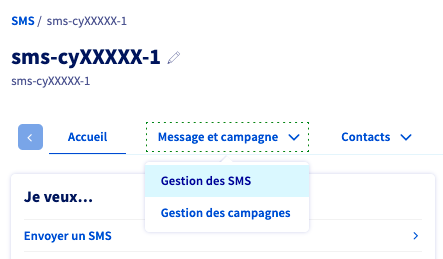
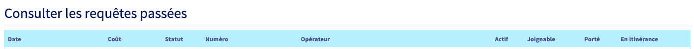
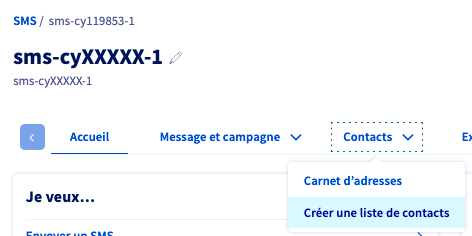
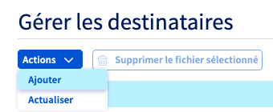
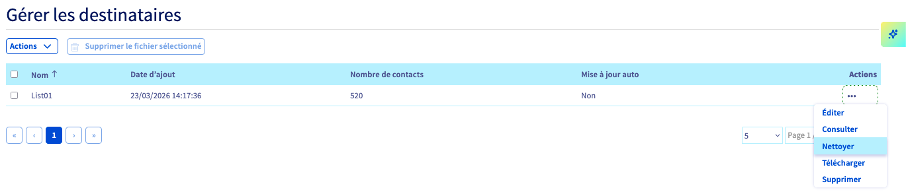

## Objectif

Les requêtes HLR vous permettent de savoir si un numéro de téléphone mobile est valide avant de lui envoyer un SMS.
Si le numéro est valide, le résultat vous permettra de connaître l'opérateur sur lequel le téléphone est enregistré.

Optimisation de campagne SMS : Vous envoyez un nombre important de SMS, vous souhaitez vous assurer un haut niveau de délivrabilité et éviter les échecs d'envoi ?
En utilisant le HLR Lookup, vous vérifiez la validité du numéro avant de consommer un SMS.

{.thumbnail}

Nettoyer des listes de numéros : Vous disposez de fichiers clients, vous souhaitez qualifier les numéros de mobiles ?
Le HLR Lookup vous indique si le numéro est actif et attribué.
Vous tenez ainsi à jour votre fichier client et vos données conservent leur valeur.

{.thumbnail}

**Ce guide vous explique comment utiliser le HLR Lookup depuis votre espace client OVHcloud.**

## Prérequis

- Disposer d'un [compte SMS OVHcloud](/links/control-panel/telecom-sms) avec des crédits SMS.

## En pratique

<!-- CP-NAV-START:telecom-sms -->
---

### Accès à l'espace client OVHcloud

- **Lien direct :** [SMS](/links/control-panel/telecom-sms)
- **Pour accéder à vos services :** `Télécom`{.action} > `SMS`{.action} > Sélectionnez votre compte SMS

---
<!-- CP-NAV-END:telecom-sms -->

{.thumbnail}

Sélectionnez l'onglet `Message et campagne`{.action} > `Gestion des SMS`{.action}.

{.thumbnail}

Cliquez ensuite sur la partie `HLR`{.action}.

{.thumbnail}

### Nouvelle requête HLR

Renseignez le numéro que vous souhaitez tester puis cliquez sur `Envoyer la requête`{.action}.

{.thumbnail}

Chaque requête est facturée 0,1 crédit SMS. Consultez la [grille tarifaire SMS](/links/telecom/sms-prices) pour plus de détails.

### Consulter les requêtes passées

Vous retrouverez les résultats de vos requêtes dans le tableau présent en bas de page :

{.thumbnail}

### Les différents états

Les rapports HLR indiquent :

- la date de la requête HLR ;
- le coût de la requête HLR ;
- le statut de la requête HLR ;
- le numéro du destinataire ;
- l'opérateur du destinataire ;
- le statut actif/inactif du destinataire ;
- la joignabilité du destinataire ;
- le statut porté du destinataire ;
- le statut en itinérance du destinataire.

### Importation du fichier de destinataires

Rendez-vous dans la partie `Contacts`{.action} > `Créer une liste de contacts`{.action} et ajoutez votre fichier au format `.csv` ou `.txt`.

{.thumbnail}

{.thumbnail}

Consultez le guide « [Liste de destinataires SMS](/pages/web_cloud/messaging/sms/liste_de_destinataire_sms) » pour plus d'informations.

### Nettoyer le fichier

Une fois votre carnet chargé sur l'espace client, sélectionnez-le et procédez au nettoyage.

{.thumbnail}

Deux options vous sont proposées :

- Freemium : dédoublonnage et vérifications syntaxiques (gratuit).
- Premium : dédoublonnage et vérification de la validité des contacts via une requête HLR (cette action sera facturée 0,1 crédit SMS par contact).

{.thumbnail}

Le nettoyage de la base dédoublonnera vos contacts et éliminera ceux qui sont invalides.
Le fichier nettoyé remplacera l'ancien qui sera sauvegardé et accessible. Vous recevrez un rapport par e-mail à la fin de l'opération.

## Aller plus loin

Échangez avec notre [communauté d'utilisateurs](/links/community).
