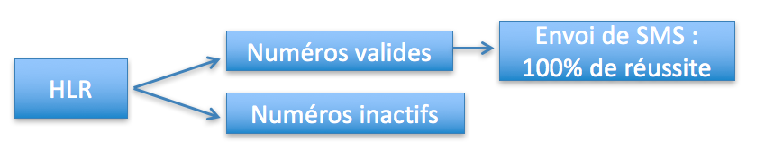
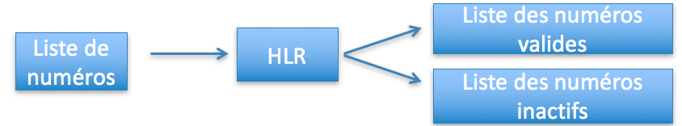
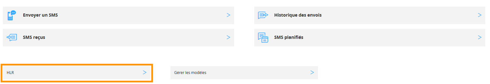
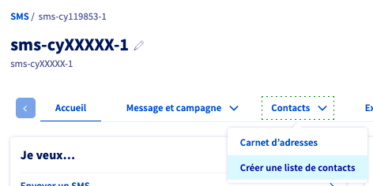
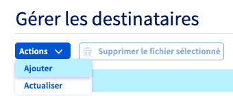
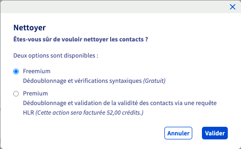

## Objectif

Avant d'envoyer un SMS, une requête [Home Location Register (HLR) Lookup](https://www.ovhcloud.com/fr/sms/home-location-register/) permet de vérifier si le numéro de téléphone mobile du destinataire est toujours valide et actif. Le résultat indique également l'opérateur auquel le numéro est rattaché.

En vérifiant vos numéros avec le HLR Lookup, vous améliorez la délivrabilité de vos campagnes SMS et évitez les échecs d'envoi.

{.thumbnail}

Le HLR Lookup permet également de nettoyer vos listes de numéros en identifiant les numéros inactifs ou non attribués, afin de maintenir un fichier client à jour.

{.thumbnail}

> [!primary]
>
> Le HLR Lookup est une action indépendante de l'envoi de SMS. C'est à vous de l'effectuer avant chaque campagne ou lors du nettoyage de vos listes de contacts.

**Ce guide vous explique comment utiliser le HLR Lookup depuis votre espace client OVHcloud.**

## Prérequis

- Disposer d'un [compte SMS OVHcloud](/links/control-panel/telecom-sms) avec des crédits SMS.

## En pratique

<!-- CP-NAV-START:telecom-sms -->
---

### Accès à l'espace client OVHcloud

- **Lien direct :** [SMS](/links/control-panel/telecom-sms)
- **Pour accéder à vos services :** `Télécom`{.action} > `SMS`{.action} > Sélectionnez votre compte SMS

---
<!-- CP-NAV-END:telecom-sms -->

<!-- CP-STEPS-START:hlr-access -->
{.thumbnail}

Sélectionnez l'onglet `Message et campagne`{.action} > `Gestion des SMS`{.action}.

{.thumbnail}

Cliquez sur `HLR`{.action}.

{.thumbnail}
<!-- CP-STEPS-END:hlr-access -->

### Nouvelle requête HLR

<!-- CP-STEPS-START:hlr-new-request -->
Renseignez le numéro à tester puis cliquez sur `Envoyer la requête`{.action}.

{.thumbnail}

Chaque requête est facturée 0,1 crédit SMS. Consultez la [grille tarifaire SMS](/links/telecom/sms-prices) pour plus de détails.
<!-- CP-STEPS-END:hlr-new-request -->

### Consulter les requêtes passées

<!-- CP-STEPS-START:hlr-past-requests -->
Les résultats de vos requêtes apparaissent dans le tableau en bas de page.

{.thumbnail}
<!-- CP-STEPS-END:hlr-past-requests -->

### Les différents états

Les rapports HLR indiquent :

- la date de la requête HLR ;
- le coût de la requête HLR ;
- le statut de la requête HLR ;
- le numéro du destinataire ;
- l'opérateur du destinataire ;
- le statut actif/inactif du destinataire ;
- la joignabilité du destinataire ;
- le statut porté du destinataire ;
- le statut en itinérance du destinataire.

### Importation du fichier de destinataires

<!-- CP-STEPS-START:import-contacts -->
Rendez-vous dans la partie `Contacts`{.action} > `Créer une liste de contacts`{.action} et ajoutez votre fichier au format `.csv` ou `.txt`.

{.thumbnail}

{.thumbnail}

Consultez le guide « [Liste de destinataires SMS](/pages/web_cloud/messaging/sms/liste_de_destinataire_sms) » pour plus de détails.
<!-- CP-STEPS-END:import-contacts -->

### Nettoyer le fichier

<!-- CP-STEPS-START:clean-contact-list -->
Une fois votre carnet chargé sur l'espace client, sélectionnez-le et procédez au nettoyage.

{.thumbnail}

2 options sont disponibles :

- Freemium : dédoublonnage et vérifications syntaxiques (gratuit).
- Premium : dédoublonnage et vérification de la validité des contacts via une requête HLR (cette action sera facturée 0,1 crédit SMS par contact).

{.thumbnail}

Le nettoyage de la base dédoublonnera vos contacts et éliminera ceux qui sont invalides.
Le fichier nettoyé remplacera l'ancien qui sera sauvegardé et accessible. Vous recevrez un rapport par e-mail à la fin de l'opération.
<!-- CP-STEPS-END:clean-contact-list -->

## Aller plus loin

Échangez avec notre [communauté d'utilisateurs](/links/community).
