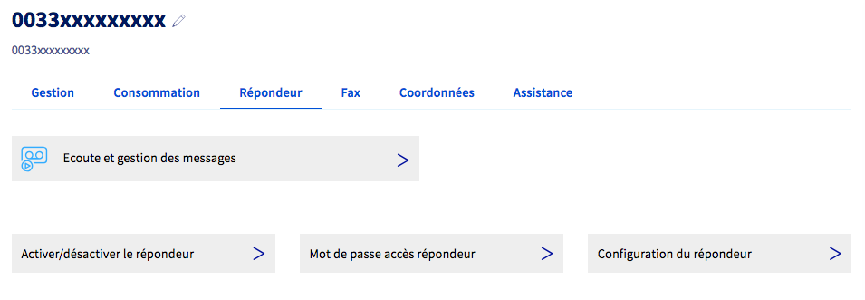
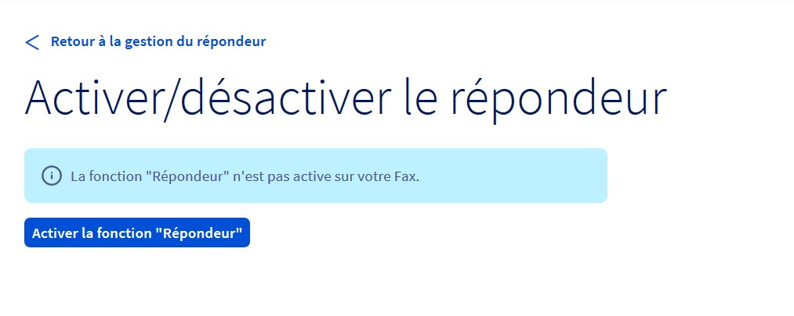
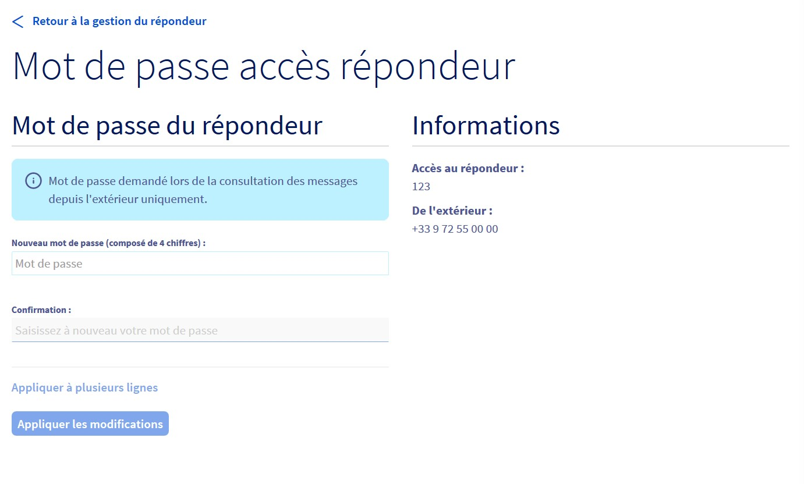
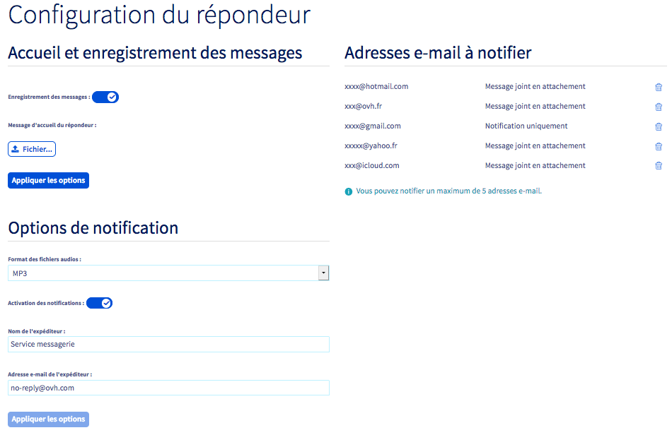
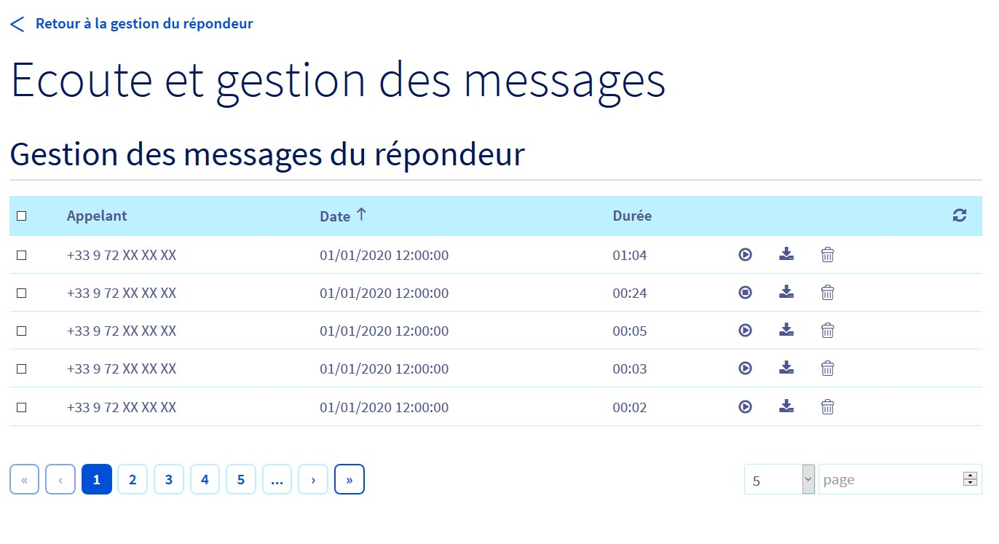

## Objectif

Vous pouvez configurer votre ligne fax en tant que messagerie vocale directement depuis votre espace client OVHcloud. 

**Découvrez comment activer et utiliser le répondeur de la ligne Fax.**

> [!primary]
> L'activation de la fonctionnalité répondeur désactive toutes les fonctionnalités fax de votre ligne.
>

## Prérequis

- Disposer d’une [ligne Fax OVHcloud](/links/telecom/fax).

<!-- CP-NAV-START:telecom-voip-fax -->
---

### Accès à l'espace client OVHcloud

- **Lien direct :** [VoIP & Fax](/links/control-panel/telecom-voip-fax)
- **Pour accéder à vos services :** `Télécom`{.action} > `VoIP & Fax`{.action} > Sélectionnez votre groupe de téléphonie

---
<!-- CP-NAV-END:telecom-voip-fax -->

## En pratique

<!-- CP-STEPS-START:en-pratique -->
Sélectionnez l’onglet `Services`{.action} puis la ligne Fax concernée.

{.thumbnail}
<!-- CP-STEPS-END:en-pratique -->

### Activer le répondeur fax

<!-- CP-STEPS-START:activer-le-repondeur-fax -->
Pour activer le répondeur, cliquez sur l’onglet `Répondeur`{.action} puis sur `Activer/désactiver le répondeur`{.action}. Confirmez l’activation en cliquant sur `Activer la fonction "Répondeur"`{.action}.

{.thumbnail}
<!-- CP-STEPS-END:activer-le-repondeur-fax -->

### Configurer un mot de passe

<!-- CP-STEPS-START:configurer-un-mot-de-passe -->
Vous pouvez consulter votre messagerie vocale depuis n’importe quel téléphone en composant le 0033972550000.

Un mot de passe d’accès, composé de 4 chiffres, est nécessaire pour cette manipulation, vous pouvez le configurer en cliquant sur `Mot de passe accès répondeur`{.action}.

{.thumbnail}
<!-- CP-STEPS-END:configurer-un-mot-de-passe -->

### Configurer le répondeur

<!-- CP-STEPS-START:configurer-le-repondeur -->
Le bouton `Configuration du répondeur`{.action} vous permet de configurer l’enregistrement des messages ainsi que le message d’accueil de votre répondeur.

Vous pouvez aussi renseigner jusqu’à 5 adresses e-mail de notification, sur lesquelles vous pourrez également recevoir les messages. Vous pouvez définir différents formats audio.

Personnalisez l’adresse e-mail et le nom de l’expéditeur des notifications que vous recevez, permettant d’éviter les filtres automatiques (type spam webmail).

{.thumbnail}
<!-- CP-STEPS-END:configurer-le-repondeur -->

### Écoute et gestion des messages

<!-- CP-STEPS-START:ecoute-et-gestion-des-messages -->
Le bouton `Écoute et gestion des messages`{.action} vous permet de gérer l’historique de vos messages, de les écouter et de les télécharger.

{.thumbnail}

Nous conservons jusqu’à 100 messages sur votre boîte vocale pour une durée de 6 mois maximum. Ils sont effacés en dehors de ces conditions.
<!-- CP-STEPS-END:ecoute-et-gestion-des-messages -->

## Aller plus loin

Échangez avec notre [communauté d'utilisateurs](/links/community).
