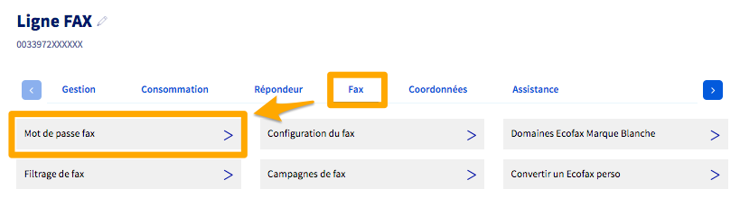
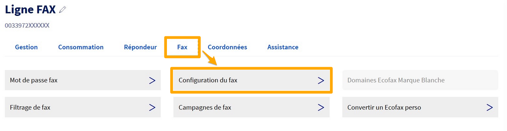
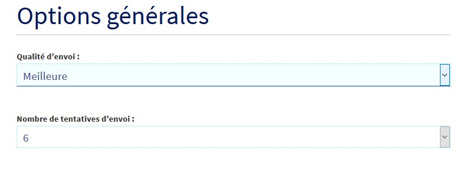
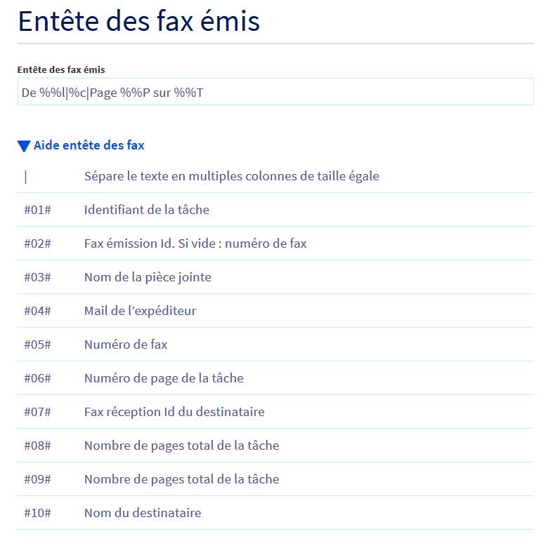
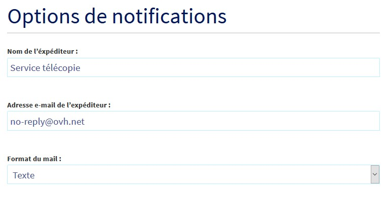
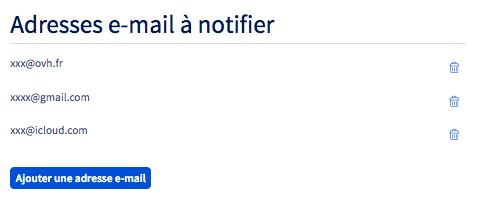
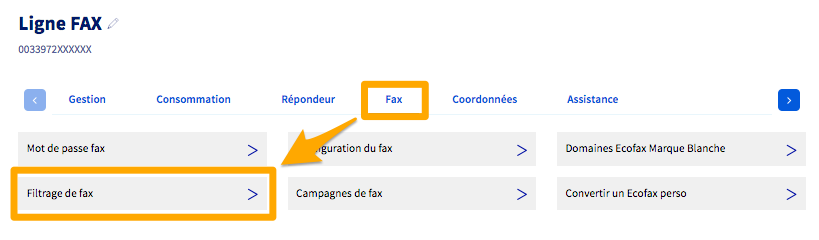
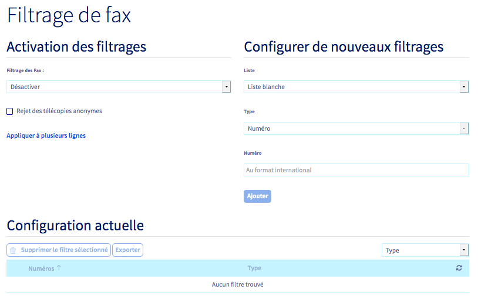

## Objectif

Vous pouvez configurer votre ligne Fax directement via votre espace client OVHcloud, pour optimiser la réception et l'envoi de vos fax sur votre télécopieur, préciser des adresses e-mail de notification ou d'envoi, ou encore appliquer des filtrages.

**Découvrez les différentes options de configuration disponibles dans l'espace client OVHcloud.**

## Prérequis

- Disposer d’une [ligne Fax OVHcloud](/links/telecom/fax).

<!-- CP-NAV-START:telecom-voip-fax -->
---

### Accès à l'espace client OVHcloud

- **Lien direct :** [VoIP & Fax](/links/control-panel/telecom-voip-fax)
- **Pour accéder à vos services :** `Télécom`{.action} > `VoIP & Fax`{.action} > Sélectionnez votre groupe de téléphonie

---
<!-- CP-NAV-END:telecom-voip-fax -->

## En pratique

### Mot de passe fax

<!-- CP-STEPS-START:mot-de-passe-fax -->
Sélectionnez l’onglet `Services`{.action} puis la ligne Fax concernée.

L’envoi de télécopies par e-mail ou via le logiciel EcoFax nécessite de définir un mot de passe fax.

Pour le définir, sélectionnez votre ligne FAX, cliquez sur l’onglet `Fax`{.action} puis sur `Mot de passe fax`{.action}.

{.thumbnail}

Le mot de passe doit contenir au moins 6 caractères.

> [!primary]
>
> Dans le cas d’une ancienne offre de type « EcoFax Perso », la modification du mot de passe s’effectue depuis l’onglet `Configuration du fax`{.action} puis en cliquant sur `Générer`{.action}.
>
<!-- CP-STEPS-END:mot-de-passe-fax -->

### Options de configuration

<!-- CP-STEPS-START:options-de-configuration -->
Sélectionnez votre ligne FAX, cliquez sur l'onglet `Fax`{.action} puis sur `Configuration du Fax`{.action}.

{.thumbnail}

> [!primary]
>
> Dans le cas d'une ancienne offre de type « EcoFax Perso », l'envoi des fax est possible si le nombre de fax restant est positif. Dans le cas contraire, vous pouvez commander des fax via l'onglet situé juste en dessous.
>
#### Options générales

La qualité d'envoi de vos télécopies peut avoir un impact sur vos émissions de télécopies à destination de certains numéros spéciaux.

Passez-la en « Meilleure » pour faciliter des envois vers les numéros spéciaux ou étrangers.

Vous pouvez aussi paramétrer le nombre de tentatives d'envoi maximum, dans le cas d'un échec de transmission lors de la première tentative.

{.thumbnail}

#### En-tête des fax émis

Vous pouvez personnaliser l'en-tête de vos télécopies selon la méthode ci-dessous.

{.thumbnail}

Une personnalisation défectueuse de l'en-tête peut être à l'origine de difficultés d'envoi de télécopies.
<br>Dans ce cas, vous pouvez rétablir l'en-tête par défaut en copiant la valeur ci-dessous :

```console
De %%l|%c|Page %%P sur %%T
```

#### Options de notifications

Personnalisez l'adresse e-mail et le nom de l'expéditeur des notifications que vous recevez. Cela permet d'éviter les filtres automatiques (type spam webmail).

Vous pouvez également définir le format Texte ou HTML de l'e-mail reçu.

{.thumbnail}

#### Adresses à notifier

Configurez les adresses e-mail sur lesquelles vous recevrez les télécopies.

Vous pouvez renseigner jusqu'à 5 adresses différentes.

{.thumbnail}

<!-- CP-STEPS-END:options-de-configuration -->

### Options de filtrage

<!-- CP-STEPS-START:options-de-filtrage -->
Vous pouvez appliquer des règles de filtrage sur votre ligne Fax afin de ne pas recevoir de télécopies indésirables.

Pour configurer ces filtrages, sélectionnez votre ligne FAX, cliquez sur l'onglet `Fax`{.action} puis sur `Filtrage de fax`{.action}.

{.thumbnail}

Vous pouvez configurer et activer soit une liste blanche, soit une liste noire de numéros à filtrer. Vous pouvez également rejeter les télécopies anonymes.

{.thumbnail}

Commencez par ajouter les numéros à filtrer dans le menu de droite puis activez la liste blanche ou noire dans le menu de gauche.
<!-- CP-STEPS-END:options-de-filtrage -->

## Aller plus loin

Échangez avec notre [communauté d'utilisateurs](/links/community).
