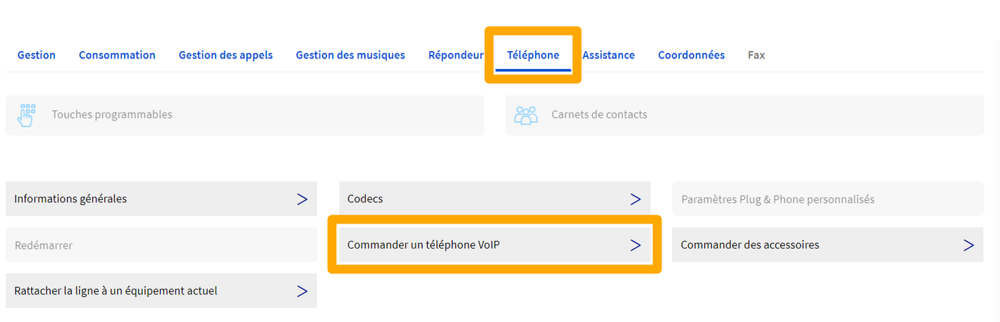
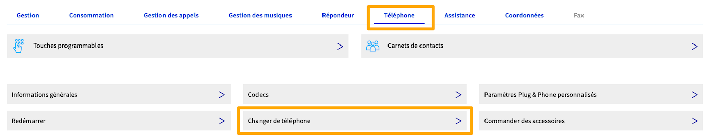
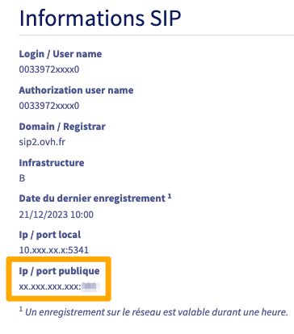
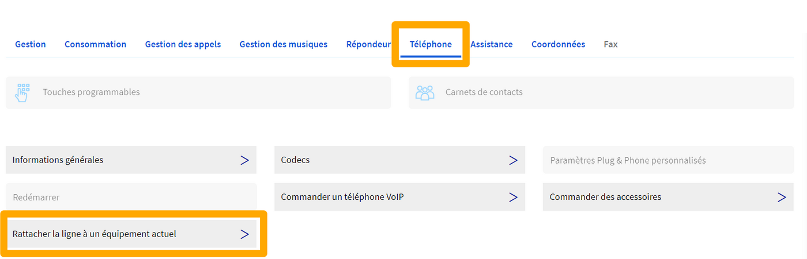
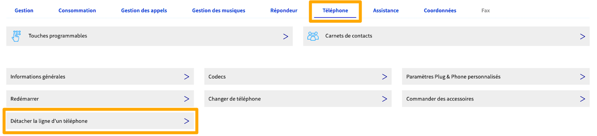
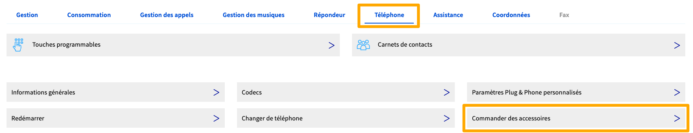

## Objectif

Votre ligne SIP OVHcloud vous permet de recevoir et d’émettre des appels depuis l'appareil de votre choix. Celui-ci peut notamment être un téléphone OVHcloud que vous pouvez gérer depuis votre espace client.

**Découvrez comment effectuer la gestion des téléphones associés à vos lignes SIP OVHcloud depuis votre espace client.**

## Prérequis

- Disposer d'une [ligne SIP OVHcloud](/links/telecom/telephonie-voip){.external}.
- Être connecté à l'[espace client OVHcloud](/links/manager){.external}, partie `Télécom`{.action}.

{.thumbnail}

## En pratique

> [!primary]
>
> Nos téléphones sont fournis en l'échange d'une caution (restituée en fin de contrat). Retrouvez l'ensemble des téléphones proposés par OVHcloud sur [cette page](/links/telecom/telephonie-comparatif-telephones).

Votre ligne SIP peut être associée à un téléphone OVHcloud. Cela vous permet ainsi de gérer ce dernier depuis votre espace client. Cette gestion s'effectue par le biais de plusieurs manipulations. Poursuivez la lecture de cette documentation selon celle que vous souhaitez réaliser.

- [Commander un téléphone OVHcloud](#obtenir-telephone) : vous permet de commander un nouveau téléphone OVHcloud sur une ligne existante dans votre compte.
- [Changer ou renvoyer le téléphone de votre ligne](#changer-telephone) : vous permet de changer le téléphone OVHcloud actuellement associé à votre ligne SIP ou de le renvoyer si vous n'en avez plus l'utilité.
- [Rattacher votre ligne à un téléphone](#rattacher-telephone) : vous permet de rattacher une ligne SIP à un téléphone OVHcloud que vous possédez déjà.
- [Détacher votre ligne d'un téléphone](#detacher-telephone) : vous permet de détacher de votre ligne SIP le téléphone OVHcloud actuellement associé à celle-ci.
- [Commander des accessoires](#accessoires) : vous permet de commander des accessoires (casques, câbles, combinés, etc.) pour vos téléphones OVHcloud.

### Commander un téléphone OVHcloud 

Vous pouvez commander un téléphone OVHcloud pour une ligne SIP qui n'est pas déjà rattachée à un téléphone OVHcloud.

Connectez-vous à votre [espace client OVHcloud](/links/manager){.external} dans la section `Télécom`, cliquez sur `Téléphonie`{.action} puis sélectionnez la ligne SIP concernée.

Positionnez-vous ensuite sur l'onglet `Téléphone`{.action} puis cliquez sur `Commander un téléphone VoIP`{.action}.

{.thumbnail}

Sur la page qui s'affiche, dans la partie « Choix de l'équipement », sélectionnez le téléphone que vous souhaitez commander parmi les modèles proposés puis suivez les étapes qui apparaissent.

Si vous souhaitez rattacher votre ligne SIP à un équipement OVHcloud que vous possédez déjà et qui s'affiche dans l'espace client, suivez les instructions de la section « [Rattacher votre ligne à un téléphone](#rattacher-telephone) » de cette documentation. 

### Changer ou renvoyer le téléphone de votre ligne 

Lorsque vous possédez une ligne SIP OVHcloud actuellement rattachée à un téléphone OVHcloud, vous avez la possibilité de :

- changer votre téléphone actuel pour un autre modèle ;
- renvoyer le téléphone que vous possédez actuellement.

> [!warning]
>
> Selon l'offre dont vous disposez sur votre ligne SIP, l'option de renvoi du téléphone peut ne pas être disponible.
>

Pour débuter, connectez-vous à votre [espace client OVHcloud](/links/manager){.external} dans la section `Télécom`, cliquez sur `Téléphonie`{.action} dans la barre de services à gauche puis sélectionnez la ligne SIP concernée. Positionnez-vous ensuite sur l'onglet `Téléphone`{.action} et cliquez sur `Changer de téléphone`{.action}.

{.thumbnail}

Sur la page qui s'affiche, dans la partie « Choix de l'équipement », sélectionnez l'action que vous souhaitez réaliser puis suivez les étapes qui apparaissent.

|Actions|Description|
|---|---|
|Renvoyer mon équipement actuel|Permet de renvoyer le téléphone actuellement rattaché à votre ligne SIP, si votre offre le permet. Assurez-vous de prendre connaissance de la procédure qui apparaît dans la partie « Informations ».|
|Caution pour le ...|Permet de changer le téléphone actuellement rattaché à votre ligne SIP pour un autre équipement. Assurez-vous de prendre connaissance de la procédure qui apparaît dans la partie « Informations ».| 

> [!primary]
>
> Retrouvez plus d'informations sur le déroulement d'un renvoi ou d'un échange d'un téléphone sur notre guide « [Déroulement d’un RMA](/pages/web_cloud/phone_and_fax/voip/deroulement_d_un_rma) ».
> 

### Rattacher votre ligne à un téléphone 

> [!primary]
> Pour cette démarche, vous aurez besoin de récupérer l'adresse IP publique du téléphone. Dans votre espace client, sélectionnez la ligne principale qui lui est associée. Cliquez ensuite sur l'onglet `Gestion`{.action} puis sur `Informations générales`{.action}. Vous trouverez l'adresse IP publique actuelle du téléphone en bas à droite, dans la partie `Informations SIP`, sous **Ip / port publique**. Attention, ne prenez pas note du port situé après les `:`.
>
> {.thumbnail}
>

Certains téléphones OVHcloud peuvent être associés à plusieurs lignes SIP. Vous avez donc la possibilité de rattacher une ligne SIP OVHcloud à un téléphone que vous possédez déjà, seulement si :

- la ligne SIP sélectionnée n'est actuellement rattachée à aucun téléphone OVHcloud ;
- le téléphone OVHcloud sélectionné peut accueillir une ligne configurée supplémentaire.

Si tel est le cas, pour réaliser la manipulation, connectez-vous à votre [espace client OVHcloud](/links/manager){.external} dans la section `Télécom`, cliquez sur `Téléphonie`{.action} dans la barre de services à gauche puis sélectionnez la ligne SIP concernée (n'étant actuellement rattachée à aucun téléphone). Positionnez-vous ensuite sur l'onglet `Téléphone`{.action} et cliquez sur `Rattacher la ligne à un équipement actuel`{.action}.

{.thumbnail}

Sur la page qui s'affiche, sélectionnez l'équipement sur lequel vous souhaitez rattacher votre ligne SIP, indiquez l'adresse IP publique de celui-ci puis cliquez sur le bouton `Attacher`{.action}.

{.thumbnail}

Si vous préférez commander un nouveau téléphone OVHcloud, suivez les instructions de la section « [commander un téléphone OVHcloud](#obtenir-telephone) » de ce guide. 

### Détacher votre ligne d'un téléphone 

> [!primary]
> Pour cette démarche, vous aurez besoin de récupérer l'adresse IP publique du téléphone. Dans votre espace client, sélectionnez la ligne principale qui lui est associée. Cliquez ensuite sur l'onglet `Gestion`{.action} puis sur `Informations générales`{.action}. Vous trouverez l'adresse IP publique actuelle du téléphone en bas à droite, dans la partie `Informations SIP`, sous **Ip / port publique**. Attention, ne prenez pas note du port situé après les `:`.
>
> {.thumbnail}
>

Vous pouvez détacher une ligne SIP d'un téléphone OVHcloud disposant de plusieurs lignes SIP configurées. Pour cela, connectez-vous à votre [espace client OVHcloud](/links/manager){.external} et assurez-vous de vous situer dans la section `Télécom`. Cliquez sur `Téléphonie`{.action} dans la barre de services à gauche puis sélectionnez la ligne SIP concernée.

Positionnez-vous ensuite sur l'onglet `Téléphone`{.action} et cliquez sur `Détacher la ligne d'un téléphone`{.action}.

{.thumbnail}

Sur la page qui s'affiche, renseignez l'adresse IP publique du téléphone puis cliquez sur `Détacher`{.action}. 

{.thumbnail}

### Commander des accessoires 

Vous pouvez commander des accessoires (casques, câbles, combinés, etc.) pour vos téléphones OVHcloud. Pour cela, connectez-vous à votre [espace client OVHcloud](/links/manager){.external} et assurez-vous de vous situer dans la section `Télécom`. Cliquez sur `Téléphonie`{.action} dans la barre de services à gauche puis sélectionnez la ligne SIP concernée.

Positionnez-vous ensuite sur l'onglet `Téléphone`{.action} et cliquez sur `Commander des accessoires`{.action}.

{.thumbnail}

Utilisez les onglets pour filtrer les accessoires par marque ou utilisez le filtre de compatibilité, à droite de l'écran, pour vous assurer de la compatibilité des accessoires avec vos téléphones.

Sélectionnez l'accessoire de votre choix puis suivez les étapes qui apparaissent.

## Aller plus loin

[Déroulement d’un RMA](/pages/web_cloud/phone_and_fax/voip/deroulement_d_un_rma)

Échangez avec notre communauté d'utilisateurs sur <https://community.ovh.com>.
