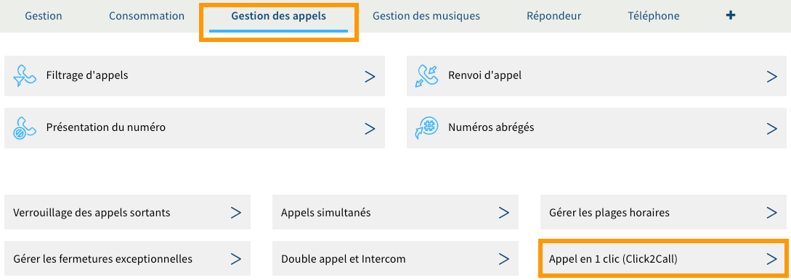
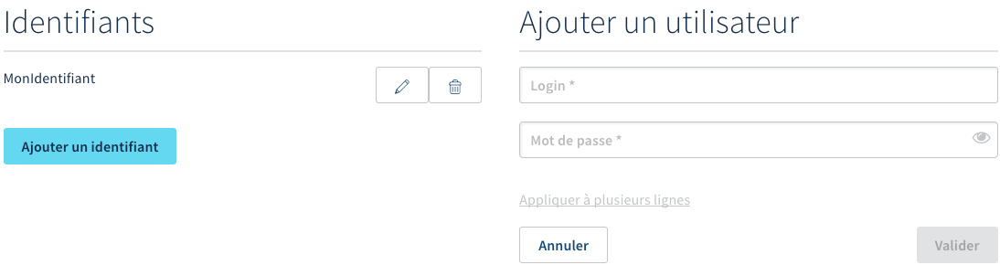
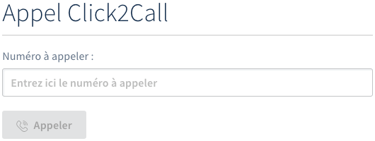

## Objectif

La fonctionnalité Click2Call (ou « appel en un clic ») permet de mettre en relation automatiquement deux interlocuteurs. Vous pouvez ainsi bénéficier, par exemple, d'un service de rappel automatique sur votre site Internet (sous réserve d'intégration à ce dernier).

**Découvrez comment configurer et utiliser la fonctionnalité Click2Call avec une ligne SIP OVHcloud.**

## Prérequis

- Disposer d'une ligne SIP possédant un [forfait compatible](/links/telecom/telephonie-services-inclus) avec la fonctionnalité Click2Call.

<!-- CP-NAV-START:telecom-voip-fax -->
---

### Accès à l'espace client OVHcloud

- **Lien direct :** [VoIP & Fax](/links/control-panel/telecom-voip-fax)
- **Pour accéder à vos services :** `Télécom`{.action} > `VoIP & Fax`{.action} > Sélectionnez votre groupe de téléphonie

---
<!-- CP-NAV-END:telecom-voip-fax -->

{.thumbnail}

## En pratique

Ce guide explique comment créer et gérer un identifiant Click2Call et présente les fonctions API permettant l'intégration de cette fonctionnalité dans vos programmes.

> [!primary]
>
> Les communications lancées depuis la fonctionnalité Click2Call vers un numéro non enregistré chez OVHcloud (externe) seront décomptées de votre forfait ou facturées selon le [forfait auquel vous avez souscrit](/links/telecom/telephonie-voip) (voir la note en bas de page) et [les tarifs en vigueur](/links/telecom/telephonie-decouvrez-tarifs-telephonie).
>
> Le Click2Call peut être utilisé conjointement avec d'[autres fonctionnalités disponibles](/links/telecom/telephonie-services-inclus) sur votre ligne SIP, telles que le [filtrage d'appel](/pages/web_cloud/phone_and_fax/voip/comment_configurer_les_renvois_d_appels) (permettant par exemple d'empêcher tout appel vers des numéros commençant par « 08 »).
>

### Créer et gérer un identifiant Click2Call

Vous pouvez créer et gérer vos identifiants Click2Call depuis votre espace client OVHcloud ou depuis les [API OVHcloud](/links/console).

<!-- CP-STEPS-START:creer-gerer-identifiant-click2call -->
> [!tabs]
> Depuis l'espace client OVHcloud
>>
>> Dans l'onglet `Gestion des appels`{.action}, cliquez sur `Appel en 1 clic (Click2Call)`{.action}.
>>
>> {.thumbnail}
>>
>> Pour que la fonctionnalité Click2Call puisse fonctionner, vous devez disposer d'au moins un identifiant Click2Call. 
>>
>> **Si vous disposez déjà d'un identifiant Click2Call** : vous avez la possibilité de modifier son mot de passe en cliquant sur le pictogramme en forme de crayon ou de le supprimer en cliquant sur le pictogramme en forme de poubelle. Suivez alors les étapes qui apparaissent.
>>
>> **Si vous ne disposez pas d'un identifiant Click2Call** : commencez par en créer un nouveau en cliquant sur `Ajouter un identifiant`{.action}. Renseignez alors l'identifiant que vous souhaitez ajouter puis définissez-lui un mot de passe en respectant les conditions qui apparaissent. Cliquez enfin sur `Valider`{.action}.
>>
>> {.thumbnail}
>>
>> Une fois que vous disposez d'au moins un identifiant Click2Call et de son mot de passe, vous pouvez poursuivre vers la section suivante « [Utiliser la fonctionnalité Click2Call depuis les API OVHcloud](#utiliser-la-fonctionnalite-click2call) » de cette documentation.
>>
>> Si cela est nécessaire, l'interface de gestion de la fonctionnalité Click2Call vous permet de réaliser un appel de test vers le numéro de votre choix. Pour cela, dans la partie `Appel Click2Call`, renseignez le numéro dans la zone en dessous de « Numéro à appeler » puis cliquez sur `Appeler`{.action}.
>>
>> {.thumbnail}
>>
> Depuis les API OVHcloud
>>
>> > [!primary]
>> >
>> > Pour plus d'informations sur le fonctionnement des API OVHcloud, consultez notre guide « [Premiers pas avec les API OVHcloud](/pages/manage_and_operate/api/first-steps) ».
>>
>> Connectez-vous aux [API OVHcloud](/links/console) :
>>
>> 1. Cliquez sur `Authentication`{.action} en haut à gauche.
>> 1. Cliquez ensuite sur `Login with OVHcloud SSO`{.action}.
>> 1. Saisissez vos identifiants OVHcloud.
>> 1. Cliquez sur le bouton `Authorize`{.action} pour autoriser les appels aux API depuis ce site.
>>
>> Une fois connecté, utilisez les appels ci-dessous pour créer et gérer un identifiant Click2Call.
>>
>> **Créez un nouvel identifiant Click2Call et définissez son mot de passe :**
>>
>> > [!api]
>> >
>> > @api {v1} /telephony POST /telephony/{billingAccount}/line/{serviceName}/click2CallUser
>> >
>>
>> - Renseignez les éléments suivants :
>>     - **billingAccount** : groupe de facturation contenant la ligne SIP (sous la forme xxyyyy-ovh-x).
>>     - **serviceName** : ligne SIP concernée au format international.
>>     - **login** : nom de l'utilisateur Click2Call.
>>     - **password** : mot de passe de l'utilisateur Click2Call.
>> - Cliquez sur `EXECUTE`{.action}.
>>
>> **Récupérez l'*id* des identifiants Click2Call créés sur une ligne SIP :**
>>
>> > [!api]
>> >
>> > @api {v1} /telephony GET /telephony/{billingAccount}/line/{serviceName}/click2CallUser
>> > 
>>
>> - Renseignez les éléments suivants :
>>     - **billingAccount** : groupe de facturation (sous la forme xxyyyy-ovh-x).
>>     - **serviceName** : ligne SIP concernée au format international.
>> - Cliquez sur `EXECUTE`{.action}.
>>
>> **Récupérez les informations relatives à un identifiant Click2Call, excepté son mot de passe :**
>>
>> > [!api]
>> >
>> > @api {v1} /telephony GET /telephony/{billingAccount}/line/{serviceName}/click2CallUser/{id}
>> >
>>
>> - Renseignez les éléments suivants :
>>     - **billingAccount** : groupe de facturation (sous la forme xxyyyy-ovh-x).
>>     - **id** : *id* récupéré précédemment.
>>     - **serviceName** : ligne SIP concernée au format international.
>> - Cliquez sur `EXECUTE`{.action}.
>>
>> **Modifiez le mot de passe d'un identifiant Click2Call :**
>>
>> > [!api]
>> >
>> > @api {v1} /telephony POST /telephony/{billingAccount}/line/{serviceName}/click2CallUser/{id}/changePassword
>> >
>>
>> - Renseignez les éléments suivants :
>>     - **billingAccount** : groupe de facturation (sous la forme xxyyyy-ovh-x).
>>     - **id** : *id* récupéré précédemment.
>>     - **serviceName** : ligne SIP concernée au format international.
>>     - **password** : nouveau mot de passe de l'utilisateur.
>> - Cliquez sur `EXECUTE`{.action}.
>>
>> **Supprimez un identifiant Click2Call :**
>>
>> > [!api]
>> >
>> > @api {v1} /telephony DELETE /telephony/{billingAccount}/line/{serviceName}/click2CallUser/{id}
>> >
>>
>> - Renseignez les éléments suivants :
>>     - **billingAccount** : groupe de facturation (sous la forme xxyyyy-ovh-x).
>>     - **id** : *id* récupéré précédemment.
>>     - **serviceName** : ligne SIP concernée au format international.
>> - Cliquez sur `EXECUTE`{.action}.
>>
<!-- CP-STEPS-END:creer-gerer-identifiant-click2call -->

### Utilisez la fonctionnalité Click2Call depuis les API OVHcloud 

Muni d'un identifiant Click2Call et de son mot de passe, vous pouvez à présent utiliser la fonctionnalité Click2Call.

Connectez-vous aux [API OVHcloud](/links/console) :

1. Cliquez sur `Authentication`{.action} en haut à gauche.
1. Cliquez ensuite sur `Login with OVHcloud SSO`{.action}.
1. Saisissez vos identifiants OVHcloud.
1. Cliquez sur le bouton `Authorize`{.action} pour autoriser les appels aux API depuis ce site.

> [!primary]
>
> Pour plus d'informations sur le fonctionnement des API OVHcloud, consultez notre guide « [Premiers pas avec les API OVHcloud](/pages/manage_and_operate/api/first-steps) ».

Les appels API renseignés ci-dessous vous permettront d'utiliser la fonctionnalité Click2Call. Vous pourrez par exemple intégrer ces derniers au code de votre site Internet afin de générer un rappel automatique depuis un formulaire.

#### Exécuter des appels depuis la ligne SIP où a été activé le Click2Call

> [!api]
>
> @api {v1} /telephony POST /telephony/{billingAccount}/line/{serviceName}/click2CallUser/{id}/click2Call
> 

Les éléments à renseigner sont les suivants :

- **billingAccount** : groupe de facturation (sous la forme xxyyyy-ovh-x).
- **id** : *id* de l'identifiant Click2Call.
- **serviceName** : ligne SIP concernée au format international.
- **calledNumber** : numéro à appeler au format international.
- **callingNumber** : ligne SIP concernée au format international.

> [!primary]
>
> Personnalisez si besoin [le numéro présenté depuis votre ligne SIP](/pages/web_cloud/phone_and_fax/voip/gerer_la_presentation_du_numero_sur_votre_ligne_sip).

#### Exécuter les appels depuis la ligne SIP en activant le mode intercom de votre téléphone

Le mode intercom sera opérationnel sous réserve de disposer d'un téléphone ou d'un équipement compatible.

> [!api]
>
> @api {v1} /telephony POST /telephony/{billingAccount}/line/{serviceName}/click2Call
> 

Les éléments à renseigner sont les suivants :

- **billingAccount** : groupe de facturation (sous la forme xxyyyy-ovh-x).
- **id** : *id* de l'identifiant Click2Call.
- **serviceName** : ligne SIP concernée au format international.
- **calledNumber** : numéro à appeler au format international.
- **callingNumber** : ligne SIP concernée au format international.
- **intercom** : par défaut sur `false`, passez ce paramètre à `true` pour activer le mode intercom.

> [!primary]
>
> Personnalisez si besoin [le numéro présenté depuis votre ligne SIP](/pages/web_cloud/phone_and_fax/voip/gerer_la_presentation_du_numero_sur_votre_ligne_sip).

## Aller plus loin

Échangez avec notre [communauté d'utilisateurs](/links/community).