## Objectif

La portabilité permet à un abonné de conserver son numéro de téléphone lorsqu'il souhaite changer d'opérateur. Toute demande doit alors suivre un processus comportant plusieurs étapes.

**Apprenez à porter un ou plusieurs numéros chez OVHcloud et à suivre l'avancement du processus.**

## Prérequis

- Disposer d'au moins un numéro de téléphone chez un autre opérateur, dont le pays est compatible avec [la portabilité chez OVHcloud](/links/telecom/telephonie-services-inclus-portabilite-numero).
- Disposer d'une offre [VoIP OVHcloud](/links/telecom/telephonie).

<!-- CP-NAV-START:telecom-voip-fax -->
---

### Accès à l'espace client OVHcloud

- **Lien direct :** [VoIP & Fax](/links/control-panel/telecom-voip-fax)
- **Pour accéder à vos services :** `Télécom`{.action} > `VoIP & Fax`{.action} > Sélectionnez votre groupe de téléphonie

---
<!-- CP-NAV-END:telecom-voip-fax -->

{.thumbnail}

## En pratique

> [!warning]
>
> Si vous souhaitez porter un ou plusieurs numéros belges, nous vous invitons à consulter notre guide dédié « [Demander et suivre une portabilité de numéro belge](/pages/web_cloud/phone_and_fax/voip/portabilite-numero-belge) ».
>

### 1 - Préparer sa demande de portabilité

Le processus et le délai varient selon le type de numéro(s) à porter. Afin que votre demande de portabilité arrive au plus vite à son terme, suivez les recommandations suivantes :

- assurez-vous de connaître les informations du titulaire actuel de la ou des lignes concernées (comme son nom et prénom, son adresse, etc.) ;

- même si une portabilité est possible jusqu'à 40 jours après la résiliation d'un numéro, entamez de préférence la démarche de portabilité lorsque le ou les numéros concernés sont toujours actifs chez votre opérateur actuel. N'en demandez pas la résiliation durant le processus de portabilité ;

- assurez-vous de connaître le type du ou des numéros que vous souhaitez porter : celui-ci déterminera le processus à effectuer (si vous avez un doute, votre opérateur actuel peut vous confirmer le type de numéro que vous possédez).

|Type de numéro|Description|
|---|---|
|Numéro individuel|Il s'agit d'un numéro ne faisant pas partie d'une plage de numéros (comme celui d'une ligne ADSL ou d'une ligne téléphonique seule). Un RIO (pour relevé d’identité opérateur) est alors nécessaire pour le porter. Vous pouvez l'obtenir en appelant le 3179 depuis la ligne concernée ou en contactant votre opérateur actuel.|
|Plage de numéros (SDA)|Comme son nom l'indique, il s'agit d'une plage de plusieurs numéros. Il est possible de porter tout ou partie des numéros de cette plage. Un mandat de portabilité est alors nécessaire pour effectuer la demande. Celui-ci vous sera transmis par OVHcloud durant les étapes du processus de portabilité.|

### 2 - Demander la portabilité

<!-- CP-STEPS-START:demander-portabilite-intro -->
Dans l'onglet `Tableau de bord`{.action}, cliquez sur `Demander une portabilité`{.action}.

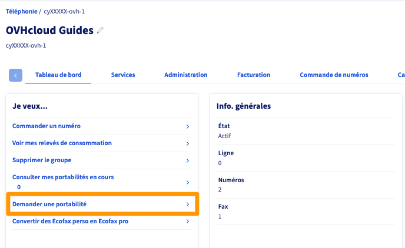{.thumbnail}
<!-- CP-STEPS-END:demander-portabilite-intro -->

Dans la page qui apparaît, deux types de demandes sont proposés. Poursuivez la lecture de cette documentation selon celui choisi.

- [Porter un numéro individuel](#numero-individuel).
- [Porter une plage de numéros](#plage-numeros).

> [!primary]
> **Cas particulier des numéros spéciaux**
>
> La portabilité d'un numéro spécial de Services à Valeur Ajoutée (SVA) nécessitant la validation de justificatifs d'identité spécifiques, reportez-vous d'abord à la sous-partie « [Porter un numéro spécial de Services à Valeur Ajoutée (SVA)](#numero-special) » de ce guide.
>
> Les numéros spéciaux (SVA) ne pouvant faire l'objet d'une demande de portabilité en numéro individuel, vous devez utiliser la demande de [portabilité d'une plage de numéros](#plage-numeros).
>

#### Porter un numéro individuel 

Cliquez sur les onglets ci-dessous pour afficher les 5 étapes.

<!-- CP-STEPS-START:porter-numero-individuel -->
> [!tabs]
> Étape 1
>>
>> Sélectionnez `Numéro individuel`{.action} et renseignez le numéro que vous souhaitez porter au format international (par exemple, « 0033100000000 » pour un numéro français). Indiquez ensuite le *RIO* du numéro concerné, puis sélectionnez la date souhaitée de la portabilité.
>>
>> 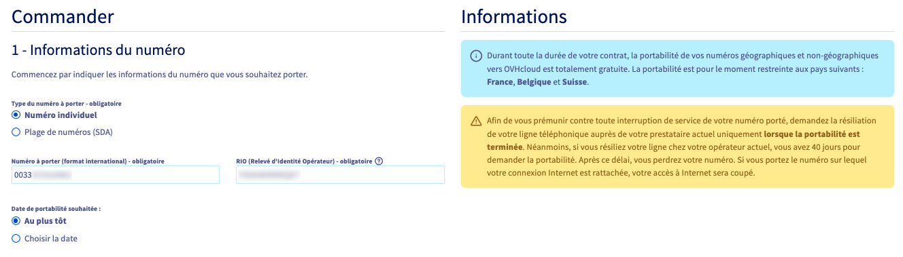{.thumbnail}
>>
> Étape 2
>>
>> Renseignez ensuite avec précision les informations personnelles du titulaire de la ligne.
>>
>> 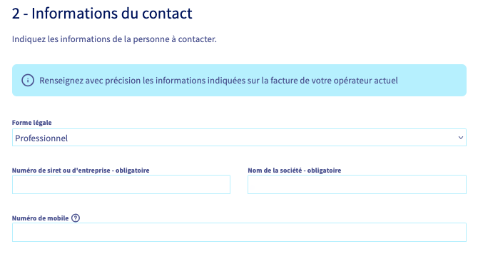{.thumbnail}
>>
> Étape 3
>>
>> Saisissez ensuite l'adresse où la ligne sera installée. Précisez également si vous souhaitez voir apparaître votre numéro dans l'annuaire.
>>
>> 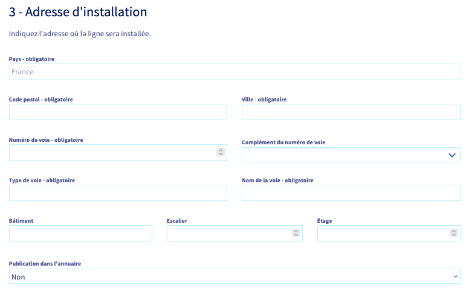{.thumbnail}
>>
> Étape 4
>>
>> Assurez-vous maintenant que le groupe de facturation qui apparaît est bien celui dans lequel le numéro porté doit être intégré. Si ce n'est pas le cas, modifiez-le en choisissant le bon groupe dans le menu déroulant.
>>
>> Vous pouvez également configurer une redirection, effective une fois le numéro porté, des appels réceptionnés sur ce numéro vers une de vos lignes. Utilisez le bouton `Choisir une ligne`{.action} pour la définir.
>>
>> Vos choix faits, cliquez sur `Valider`{.action}.
>>
>> 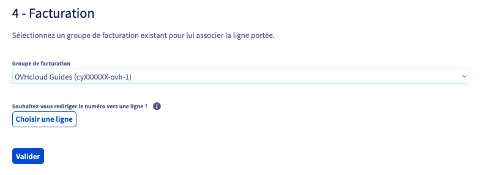{.thumbnail}
>>
>> > [!primary]
>> > Si vous souhaitez utiliser un autre type de configuration pour ce numéro (comme une file d'appels par exemple), sachez que vous pourrez l'appliquer depuis votre espace client OVHcloud 24 à 48 heures avant la date effective de sa portabilité.
>> >
>>
> Étape 5
>>
>> La dernière étape consiste à finaliser votre demande de portabilité. Prenez connaissance des contrats liés à la portabilité et validez leur acceptation. Cliquez ensuite sur `Commander`{.action} et validez le bon de commande qui vous sera présenté.
>>
>> 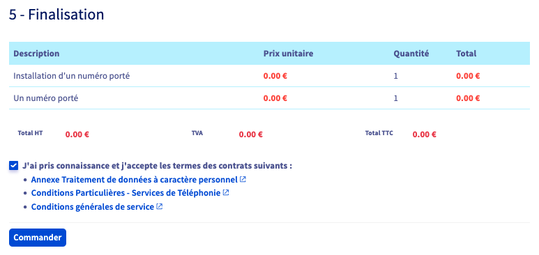{.thumbnail}
>>
>> Dès lors, pour suivre l'avancement de votre demande, reportez-vous aux informations de la partie 3 « [Suivre une demande de portabilité](#suivre-demande) » de cette documentation.
<!-- CP-STEPS-END:porter-numero-individuel -->

#### Porter une plage de numéros 

Cliquez sur les onglets ci-dessous pour afficher les 6 étapes.

<!-- CP-STEPS-START:porter-plage-numeros -->
> [!tabs]
> Étape 1
>>
>> Pour porter tout ou partie des numéros d'une plage, sélectionnez `Plage de numéros (SDA)`{.action}.
>>
>> Renseignez alors le numéro de tête de ligne de la plage concernée au format international (par exemple, « 0033100000000 » pour un numéro français). En cas de doute, votre opérateur actuel peut vous communiquer ce numéro. Ensuite, indiquez si vous souhaitez :
>> 
>> - **porter l'ensemble de la plage de numéros** : pour cela, sélectionnez `Porter votre numéro principal et l’ensemble des numéros Sélection Directe à l'Arrivée (SDA) rattachés`{.action}. Dans ce cas, la liste des SDA vous sera transmise par e-mail dans les prochains jours ;
>>
>> - **porter certains numéros de la plage, dont celui de tête de ligne** : pour cela, sélectionnez `Porter votre numéro principal et une partie des numéros Sélection Directe à l'Arrivée (SDA)`{.action} puis renseignez les numéros additionnels de la plage que vous souhaitez porter. Utilisez alors la zone de texte en dessous de `Numéro SDA à ajouter` ainsi que le bouton `Ajouter`{.action}.
>>
>> Sélectionnez également la date souhaitée de la portabilité.
>>
>> | Porter votre numéro principal et l’ensemble des numéros SDA | Porter votre numéro principal et une partie des numéros SDA |
>> | :---: | :---: |
>> | 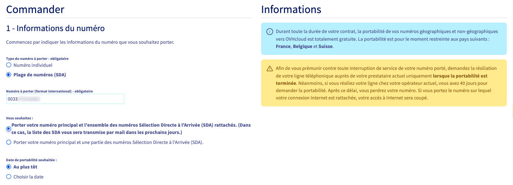{.thumbnail} | 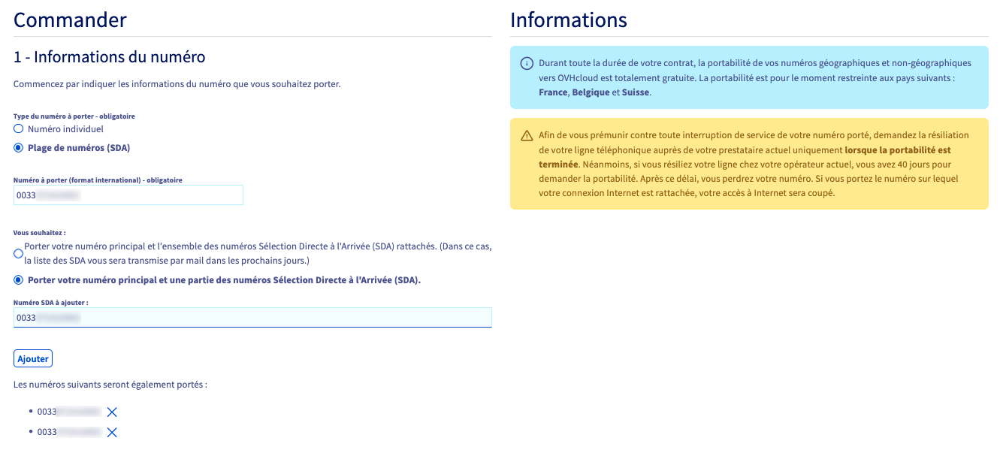{.thumbnail} |
>>
> Étape 2
>>
>> Renseignez ensuite avec précision les informations personnelles du titulaire de la plage de numéros.
>>
>> {.thumbnail}
>>
> Étape 3
>>
>> Saisissez ensuite l'adresse où la plage de numéros sera installée. Précisez également si vous souhaitez voir apparaître vos numéros dans l'annuaire.
>>
>> {.thumbnail}
>>
> Étape 4
>>
>> Assurez-vous maintenant que le groupe de facturation qui apparaît est bien celui dans lequel les numéros portés doivent être intégrés. Si ce n'est pas le cas, modifiez-le en choisissant le bon groupe dans le menu déroulant.
>>
>> Vous pouvez également configurer une redirection, effective une fois le numéro de tête de ligne porté, des appels réceptionnés sur ce numéro uniquement vers une de vos lignes. Utilisez le bouton `Choisir une ligne`{.action} pour la définir.
>>
>> Vos choix faits, cliquez sur `Valider`{.action}.
>>
>> {.thumbnail}
>>
>> > [!primary]
>> > Si vous souhaitez utiliser un autre type de configuration pour ce numéro (comme une file d'appels par exemple), sachez que vous pourrez l'appliquer depuis votre espace client OVHcloud 48 heures avant la date effective de sa portabilité. Vous aurez également accès à la configuration de l'ensemble de vos numéros portés.
>> >
>>
> Étape 5
>>
>> Cette étape consiste à finaliser votre demande de portabilité. Prenez connaissance des contrats liés à la portabilité et validez leur acceptation. Cliquez ensuite sur `Commander`{.action} et validez le bon de commande qui vous sera présenté.
>>
>> {.thumbnail}
>>
> Étape 6
>>
>> Une fois votre bon de commande validé, vous recevrez un mandat de portabilité autorisant OVHcloud à porter les numéros souhaités. Complétez puis retournez-nous ce mandat daté et signé de moins de 3 mois et comportant le cachet au nom de votre entreprise, **depuis votre espace client**, au format PDF.
>>
>> Pour cela, sélectionnez votre groupe de téléphonie dans la barre de services à gauche puis cliquez sur `Consulter mes portabilités en cours`{.action}. Cliquez alors sur `Attacher mon mandat de portabilité signé`{.action}, sous la demande de portabilité concernée, pour importer le mandat au format PDF.
>>
>> > [!primary]
>> >
>> > Si le bouton `Attacher mon mandat de portabilité signé`{.action} n'est pas disponible ou que vous n'avez pas reçu de mandat de portabilité, vérifiez que les informations concernant le titulaire de la ligne sont bien exactes. Le cas échéant, utilisez le bouton `Modification d'informations`{.action} pour les corriger.
>> >
>>
>> Avant la validation manuelle du mandat par nos services techniques, vous pouvez, en cas d'erreur, supprimer le mandat actuel pour en attacher un autre. Pour cela, cliquez sur `Liste des documents envoyés`{.action} puis sur le bouton `...`{.action} à droite du mandat actuel et enfin sur `Supprimer`{.action}. 
>>
>> 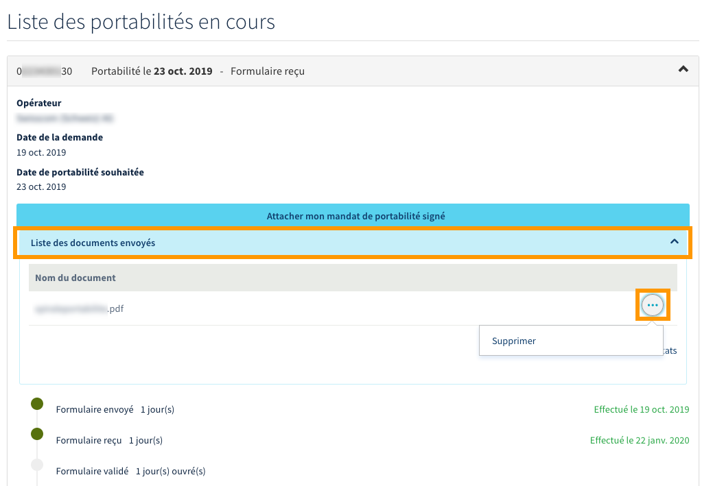{.thumbnail}
>>
>> Pour suivre l'avancement de votre demande de portabilité, reportez-vous aux informations décrites dans la partie 3 « [Suivre une demande de portabilité](#suivre-demande) » de cette documentation.
<!-- CP-STEPS-END:porter-plage-numeros -->

#### Porter un numéro spécial de Services à Valeur Ajoutée (SVA) 

Les numéros spéciaux ne pouvant faire l'objet d'une demande de portabilité en numéro individuel, vous devez utiliser la demande de [portabilité d'une plage de numéros](#plage-numeros).

L'exploitation de numéros de Services à Valeur Ajoutée (SVA) nécessite d'être en conformité avec le cadre réglementaire défini par l'ARCEP. 
Lors de la portabilité d'un numéro SVA, vous devez fournir à OVHcloud des justificatifs de l'identité de votre entreprise.

<!-- CP-STEPS-START:porter-numero-sva -->
Une fois le numéro spécial à porter renseigné (au format international) dans le champ prévu à cet effet, cliquez sur le bouton `Vérifier l'identité`{.action}. Vous serez alors redirigé vers la procédure de vérification d'identité.

> [!primary]
> Pour plus d'informations sur cette procédure, consultez notre guide « [Valider votre identité pour l'exploitation d'un numéro spécial SVA](/pages/web_cloud/phone_and_fax/voip/verification_identite_numeros_sva) ».
>

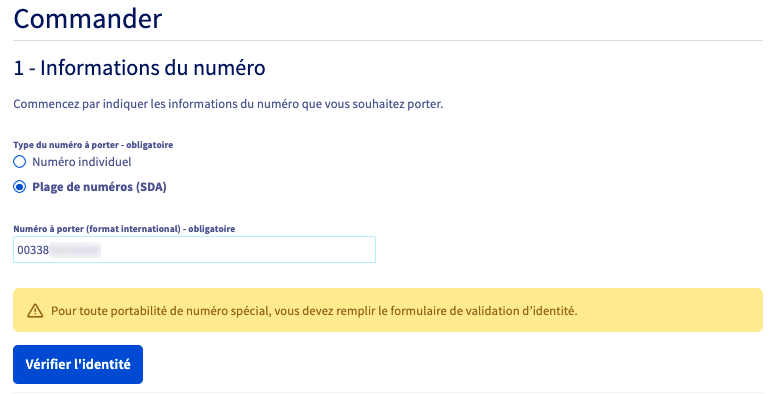{.thumbnail}
<!-- CP-STEPS-END:porter-numero-sva -->

### 3 - Suivre une demande de portabilité 

<!-- CP-STEPS-START:suivre-demande-portabilite -->
Dans l'onglet `Tableau de bord`{.action}, cliquez sur `Consulter mes portabilités en cours`{.action}.

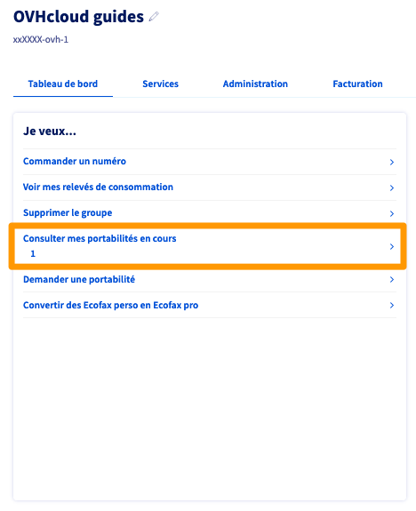{.thumbnail}

Dans la page qui apparaît, vous trouverez l'état de vos demandes de portabilité. L'image ci-dessous montre par exemple l'avancement pour un numéro individuel.

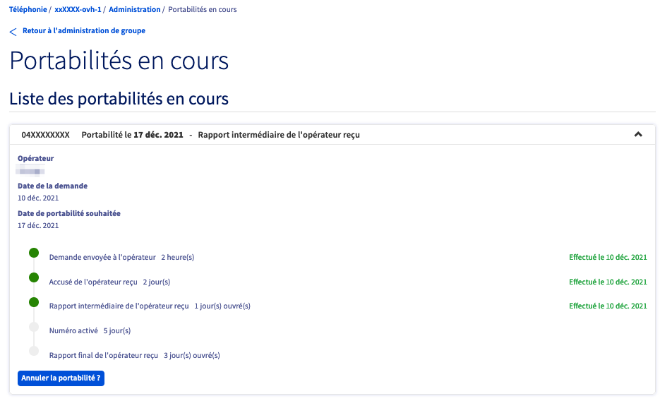{.thumbnail}

Si, durant le processus, vous souhaitez annuler votre demande de portabilité, vous pouvez le faire, au plus tard jusqu'à 72 heures avant la date de portabilité, grâce au bouton `Annuler la portabilité ?`{.action}.
<!-- CP-STEPS-END:suivre-demande-portabilite -->

Nous vous recommandons également de consulter régulièrement votre adresse e-mail. Des notifications peuvent en effet vous y être envoyées si une action de votre part est requise.

Vous trouverez ci-dessous un récapitulatif des différentes étapes du **processus de portabilité de numéro(s)** chez OVHcloud :

> [!tabs]
> Numéro individuel
>>
>> |Avancement dans le processus|Description|Délai estimé|
>> |---|---|---|
>> |Demande envoyée à l'opérateur|La demande est envoyée à l'opérateur cédant|2 heures|
>> |Accusé de l'opérateur reçu|L'opérateur cédant valide la réception de la demande|2 jours|
>> |Rapport intermédiaire de l'opérateur reçu|Après vérification des informations, l'opérateur confirme le lancement de la procédure de portabilité vers OVHcloud|1 jour ouvré|
>> |Numéro activé|48 heures avant la finalisation de la portabilité, le numéro est disponible dans votre espace client pour être configuré. Pour vous aider, reportez-vous aux informations décrites dans la partie 4 « [Préparer la configuration des numéros portés](#preparer-configuration-numero) »|11 jours|
>> |Rapport final de l'opérateur cédant|L'opérateur cédant confirme la portabilité. OVHcloud configure le numéro sur son réseau (déclaration *APNF* et routage). La portabilité est terminée et le numéro opérationnel|3 jours ouvrés|
>> 
> Plage de numéros
>>
>> |Avancement dans le processus|Description|Délai estimé|
>> |---|---|---|
>> |Mandat de portabilité envoyé|Vous envoyez le mandat de portabilité à OVHcloud|Selon votre action|
>> |Réception du mandat|Il s'agit du temps entre l'envoi du formulaire de votre part et sa réception chez OVHcloud|Quelques minutes à quelques jours selon le mode d'envoi|
>> |Validation du mandat|OVHcloud vérifie la cohérence et la légitimité des informations du mandat de portabilité|1 jour ouvré|
>> |Demande envoyée à l'opérateur|Suite à la validation du mandat, la demande est envoyée à l'opérateur cédant|2 heures|
>> |Accusé de l'opérateur reçu|L'opérateur cédant valide la réception de la demande|2 jours|
>> |Rapport intermédiaire de l'opérateur reçu|L'opérateur cédant vérifie l'ensemble de la plage de numéros SDA|5 jours ouvrés|
>> |Numéro activé|48 heures avant la finalisation de la portabilité, le numéro est disponible dans votre espace client pour être configuré. Afin de vous aider, reportez-vous aux informations décrites dans la partie 4 « [Préparer la configuration des numéros portés](#preparer-configuration-numero) »| - |
>> |Rapport final de l'opérateur cédant|L'opérateur cédant confirme la portabilité. OVHcloud configure les numéros sur son réseau (déclaration *APNF* et routage). Il faut en moyenne 24h pour le déploiement APNF après la portabilité du numéro. Pendant ces 24h, les opérateurs doivent mettre à jour leur table de routage afin que les appels arrivent bien chez OVHcloud. La portabilité est terminée et les numéros opérationnels|3 jours ouvrés|
>> 

### 4 - Préparer la configuration des numéros portés 

Vous avez la possibilité de préparer la configuration du ou des numéros portés 48 heures avant que celle-ci soit effective. Ceci peut vous permettre de limiter, voire d'éviter, une coupure de service lors de votre changement d'opérateur pour OVHcloud.

Pour cela, et selon la configuration que vous souhaitez mettre en place sur vos numéros, reportez-vous aux instructions décrites dans notre documentation « [Choisir et appliquer une configuration pour un numéro alias](/pages/web_cloud/phone_and_fax/voip/quelle_configuration_est_adaptee_a_mes_besoins) ».

## Aller plus loin

Échangez avec notre [communauté d'utilisateurs](/links/community).
