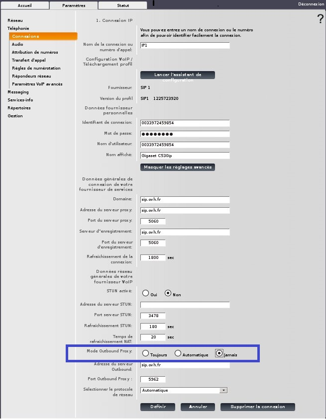

> [!warning]
> 
> Ce guide est à présent déprécié et est uniquement conservé afin de documenter des dysfonctionnements spécifiques au téléphone concerné.
> Le processus de dépannage pour nos téléphones est à présent documenté sur [cette page](/pages/web_cloud/phone_and_fax/voip/troubleshoot-02-fix-control-panel).
>

### Mon combiné affiche "Pas de base" {#mon-combiné-affiche-pas-de-base}

Si votre combiné affiche ce message c'est qu'il n'arrive pas à dialoguer avec la base.

-   Vérifiez dans un premier temps que la base est bien alimentée électriquement et que le bouton central soit allumé en bleu.   {.thumbnail}
-   Si le voyant de la base est bien bleu il faut procéder à l'enregistrement du combiné.
-   Cliquez sur le bouton central du téléphone.
-   Déplacez vous sur "**Réglages**" puis validez en appuyant sur OK.
-   Puis sur "**Enreg. combiné**" et validez en appuyant sur OK.
-   Sélectionnez remplacer Base 1 par défaut et validez en appuyant sur OK.
-   Il vous faut maintenant rester appuyé sur le bouton centrale de la base jusqu'à que le combiné vous indique qu'il ai trouvé une base. Un code PIN vous sera demandé, par défaut c'est "0000" (sans guillemets).
-   Si l'opération réussie vous aurez un message vous confirmant le bon enregistrement.

### Echec connexion fournis. services {#echec-connexion-fournis.-services}

Lorsque votre combiné affiche ce message c'est que la base n'arrive pas à enregistrer le compte SIP inscrit en elle.

Si vous allez dans l'interface web du C530 IP dans la partie **Paramètres &gt; Téléphonie &gt; Connexions** vous obtiendrez ceci :

{.thumbnail}

Dans 95% de cas, si en cliquant sur "**Modifier**" puis "**Afficher les réglages avancés"** les champs sont bien remplis, c'est que vous êtes probablement confronté à un firewall un peut trop restrictif.

Nos téléphones SIP utilisent les ports 5060 et 5962 pour s'enregistrer. Le 5060 peut chez certains FAI être bloqué. Nous préconisons alors de passer par l'outbound proxy qui est une seconde porte.

Pour changer ce paramètre :

{.thumbnail}

-   Validez la modification en cliquant sur "**Définir**".
-   Si après cette étape le téléphone ne s'enregistre toujours pas, il faudra regarder au niveau du firewall.

