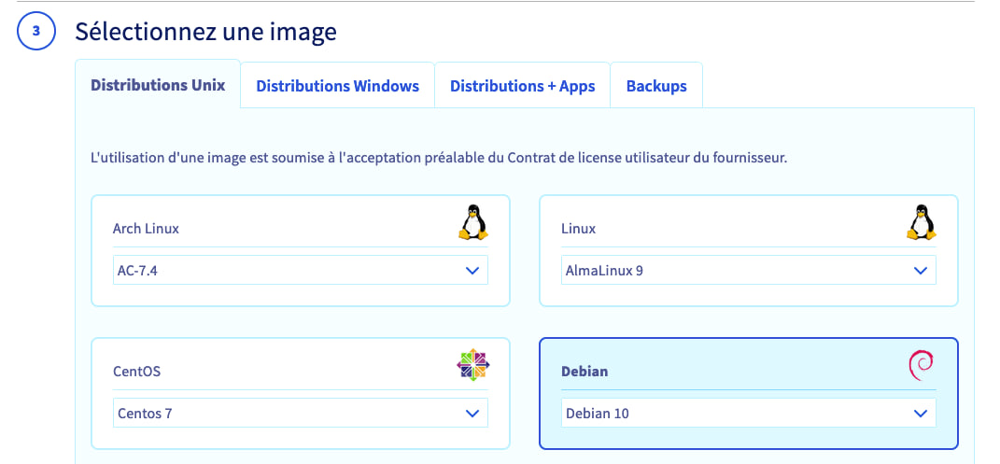

## Objectif

Ce guide vous détaille comment déployer automatiquement votre instance 3CX sur une instance Public Cloud. 

A la fin de ce guide, vous aurez les bases pour gérer le déploiement de votre instance et sa configuration automatiquement.

## Prérequis

- Un projet [Public Cloud](https://www.ovhcloud.com/fr/public-cloud/) dans votre compte OVHcloud. Retrouvez plus d'informations dans notre guide « [Créer votre premier projet Public Cloud](/pages/public_cloud/compute/create_a_public_cloud_project) ».
- L'IPBX 3CX requiert une license valide pour être utilisé. Assurez-vous d'avoir une license valide lors du déploiement. Retrouvez toutes les informations sur <https://www.3cx.fr>. 

## En pratique

> [!warning]
> 
> OVHcloud met à votre disposition des services dont la configuration, la gestion et la responsabilité vous incombent. Il vous revient de ce fait d'en assurer le bon fonctionnement.
>
> Nous mettons à votre disposition ce guide afin de vous accompagner au mieux sur des tâches courantes. Néanmoins, nous vous recommandons de faire appel à un [prestataire spécialisé](https://partner.ovhcloud.com/fr/) et/ou de contacter l'éditeur du service si vous éprouvez des difficultés. En effet, nous ne serons pas en mesure de vous fournir une assistance. Plus d'informations dans la section [« Aller plus loin »](#go-further) de ce guide.
>

Nous allons utiliser un template au format XML afin de pouvoir configurer automatiquement l'instance 3CX. 

Ce fichier XML peut être très simple, pour simplement installer 3CX et votre license.<br>
Il peut aussi être très complet pour vous permettre non seulement d'installer la license mais aussi de créer vos utilisateurs, vos trunks et les autres fonctions de 3CX.

Dans ce guide, nous allons utiliser un template XML très simple. Pour un template plus complet, nous vous invitons à consulter la [documentation de 3CX](https://www.3cx.com/docs/configure-pbx-automatically/).

### Etape 1 : compléter le template 

Nous allons joindre à l'instance un *user-data*. Lors du démarrage de l'instance, ce fichier permettra à l'outil cloud-init de : 

- créer le fichier XML de configuration de 3CX ;
- lancer l'installation des packages de 3CX.

Le fichier XML est inclus dans le template que nous allons joindre à l'instance lors de sa création. 

Voici le fichier à utiliser pour suivre ce guide : 

```xml
#!/bin/bash -e
mkdir -p /etc/3cxpbx
cat > /etc/3cxpbx/setupconfig.xml << "<EOF>"
<?xml version="1.0" encoding="UTF-8"?>
<SetupConfig xmlns:xsd="http://www.w3.org/2001/XMLSchema" xmlns:xsi="http://www.w3.org/2001/XMLSchema-instance">
  <tcxinit>
    <option>
      <code>InstallationType</code>
      <answer>new</answer><!--New install "new", restore Backup  = "restore"-->
    </option>
    <option>
      <code>LicenseKey</code>
      <answer>YourLicenseKey</answer>
    </option>
    <option>
      <code>BackupFile</code><!--If New install skip this-->
      <answer/><!--If you want to restore a backup put a reachable path from where the backup can be downloaded from. Can be actual physical path on local machine or http link-->
    </option>
    <option>
      <code>BackupPassword</code><!--Password for backup file (if backup is encrypted)-->
      <answer/>
    </option>
    <option>
      <code>AdminUsername</code>
      <answer>admin</answer><!--Admin Username-->
    </option>
    <option>
      <code>AdminPassword</code>
      <answer>YourStrongAdminPassword</answer> <!--Admin Pasword, make sure it is complex, Minimum 10 characters, no spaces and must contain at least a Lowercase, and Uppercase and a Digit-->
    </option>
    <option>
      <code>PublicIP</code>
      <answer>auto</answer><!--"auto" means automatically detect the ip address. Useful in most cases. Otherwise you can put "manual" and fill in Manual Public IP below-->
    </option>
    <option>
      <code>ManualPublicIP</code><!--If public IP = "manual" enter ip here. if "auto" skip-->
      <answer/>
    </option>
    <option>
      <code>StaticOrDynamicIP</code>
      <answer>static</answer><!--If your public ip is Static (does not change) use "static" otherwise use "dynamic"-->
    </option>
    <option>
      <code>LocalIP</code><!--Here we ask to choose the local ip of the machine. If you have no nat then the public is taken--> 
      <answer>auto</answer><!--if auto it takes the first ip on the network stack in the list. If you answer with the "manual" option (in multiple nic adapters you will have more interfaces,) then you need to populate the next option ManualLocalIP with the local IP Address you want"-->
    </option>
    <option>
      <code>ManualLocalIP</code><!--Answer only if above question you choose that you want to enter ip manually-->
	  <answer/>
    </option>
    <option>
      <code>NeedFqdn</code>
      <answer>yes</answer><!-- enter "yes" to get a 3CX FQDN. enter "no" to use your fqdn (custom domains)-->
    </option>
    <option>
      <code>Hostname</code>
      <answer>contoso</answer><!--enter your hostname example contoso - the company name - This option needs to be filled in if NeedFqdn is yes. Skip if need fqdn is NO-->
    </option>
	<option>
	<!--
		Select Domain Group:
		(1) Africa
		(2) Asia
		(3) Cities
		(4) Continent
		(5) Europe
		(6) Oceania
		(7) Other
		(8) South America
		(9) United States
		
		List of available suffixes per Domain Group can be found on:https://activate.3cx.com/apiv2/domains	
	-->
	  <code>DomainGroup</code>
	  <answer>Europe</answer>
	</option>
    <option>
      <code>DnsSuffix</code> <!--This option needs to be selected in NeedFqdn is yes. List of available suffixes per Domain Group can be found on:https://activate.3cx.com/apiv2/domains Skip if need fqdn is NO. -->
      <answer>eu</answer>
    </option>
    <option>
      <code>FullExternalFqdn</code><!--This should be populated if NeedFqdn = "no". -->
      <answer/><!--User selected needfqdn = no. This means you have an fqdn so enter your fully qualified domain here example pbx.contoso.com-->
    </option>
    <option>
      <code>CertificatePath</code><!--Use if NeedFqdn = "no". -->
      <answer/><!--This is the certificate file which can be either a path, http link or just copy and paste the whole contents of the certificate - Including the "BEGIN certificate part"-->
    </option>
    <option>
      <code>CertificatePassword</code><!--Use if NeedFqdn = "no". -->
      <answer/><!--This is the PFX certificate password. Shows only when you select a pfx file"-->
    </option>
    <option>
      <code>CertificateKey</code><!--Use if NeedFqdn = "no". -->
      <answer/><!--This is the certificate key which can be either a path, http link or it can be the whole contents of the pem file.. Including the "BEGIN certificate part Applies to PEM Certs"--> 
    </option>
    <option>
      <code>CertificateKeyPasswordRequest</code><!--Use if NeedFqdn = "no". -->
      <answer/><!-- It could be that the pem file is encrypted, so without the key, setupconfig will download the file but will not be able to decrypt it unless we enter the password request key here.-->
    </option>
    <option>
      <code>HasLocalDns</code><!--"yes" assumes that you have a manageable local dns example windows dns. "no" assumes that you do not have a dns and therefore will fallback to using IP Addresses --> 
      <answer>yes</answer>
    </option>
    <option>
      <code>InternalFqdn</code><!--Used when HasLocalDns = yes. Can be skipped if HasLocalDns = no-->
      <answer>pbx.contoso.local</answer><!--this is the full internal FQDN. If in HasLocalDns  you select "yes", this means you have a managed dns so therefore we need to know the FQDN local. if you select 2 then you can skip this out. "-->
    </option>
    <option>
      <code>HttpsPort</code>
      <answer>5001</answer>
    </option>
    <option>
      <code>HttpPort</code>
      <answer>5000</answer>
    </option>
	<option>
      <code>SipPort</code>
      <answer>5060</answer>
    </option>
	<option>
      <code>TunnelPort</code>
      <answer>5090</answer>
    </option>
    <option>
      <code>NumberOfExtensions</code> <!--How many digits your extensions should have. Default is 3 Digits. Note that the system reserves 30 numbers for system extension. This can not be changed later. -->
      <answer>3</answer>
    </option>
	<option>
	<!--
		Mail Server Configuration. One of values: 3CX, Custom or one of SMTP server names from: https://downloads.3cx.com/downloads/v155/templates/smtp/smtpproviders.html . With free key (3CXPSPBX) you can use only 3CX SMTP provider
		You can use a Gmail account. More info here: https://www.3cx.com/blog/docs/gmail-mail-server/. Select mail server type:
		(1) 3CX SMTP server
		(2) Custom SMTP server
	-->
      <code>MailServerType</code>
      <answer>3CX</answer>
    </option>
    <option>
      <code>MailServerAddress</code> <!-- Email server details to be used for notifications, voicemails and invites. You can use a Gmail account. More info here: https://www.3cx.com/blog/docs/gmail-mail-server/-->
      <answer/>
    </option>
    <option>
      <code>MailServerReplyTo</code>
      <answer/>
    </option>
    <option>
      <code>MailServerUserName</code> <!-- Can be empty -->
      <answer/>
    </option>
    <option>
      <code>MailServerPassword</code> <!-- Can be empty -->
      <answer/>
    </option>
    <option>
      <code>MailServerEnableSslTls</code>
      <answer/>
    </option>
	<option>
	  <!-- 
		Continent name one of: 
		North America
		South America
		Europe
		Middle East
		Asia and the Middle East
		Africa
		Australia
	  -->
	  <code>Continent</code> 
	  <answer>North America</answer>
	</option>
    <option>
      <code>Country</code> <!-- Country name from here https://www.3cx.com/wp-content/uploads/2016/11/Time-Zone-Sheet1-1.pdf  -->
      <answer>United States</answer>
    </option>
    <option>
      <code>Timezone</code> <!--get codes from here https://www.3cx.com/wp-content/uploads/2016/11/Time-Zone-Sheet1-1.pdf -->
      <answer>9</answer>
    </option>
    <option>
      <code>OperatorVoicemail</code>
      <answer>999</answer>
    </option>
    <!--
		Available Language values:
		EN = English (US)
		UK = English (UK)
		DE = German
		FR = French
		ES = Spanish
		IT = Italian
		PT = Portuguese
		RU = Russian
		PL = Polish
		ZH = Chinese
    -->
    <option>
      <code>Language</code>
      <answer>UK</answer>
    </option>
    <option>
      <code>Promptset</code>
      <answer>English</answer> <!-- get data from http://downloads-global.3cx.com/downloads/v180/templates/promptsets/promptsets.xml -->
    </option>
    <option>
      <code>LicenseContactName</code>
      <answer>FirstName LastName</answer>
    </option>
    <option>
      <code>LicenseCompanyName</code>
      <answer>MyCompany Ltd.</answer>
    </option>
    <option>
      <code>LicenseEmail</code>
      <answer>admin@maycompany.com</answer>
    </option>
    <option>
      <code>LicensePhone</code>
      <answer>+357</answer>
    </option>
    <option>
      <code>ResellerId</code> <!-- Id of reseller. Can be empty-->
      <answer/>
    </option>
  </tcxinit>
  <HostingConfiguration>
    <HostingAdminLogin/> <!-- Hosting Administrative Login-->
    <HostingAdminPassword/> <!-- Hosting Administrative Password-->
    <HostingAdminEmail/> <!-- Hosting Administrative Email-->
  </HostingConfiguration>
  <extensions>
    <extension>
      <Number>100</Number> <!-- Extension Number -->
      <FirstName>OVH</FirstName>
      <LastName>Test</LastName>
      <EmailAddress>john.smith@example.com</EmailAddress>
      <MobileNumber>801123456</MobileNumber>
      <OutboundCallerId>801123456</OutboundCallerId>
      <AuthPassword>jsz5aOuM3Y</AuthPassword> <!-- Authentication password, enter secure value a-z, A-Z,0-9, minimum 10 characters -->
      <AuthID>3pY48gwjR5</AuthID> <!-- Authentication ID, enter secure value a-z, A-Z,0-9, minimum 10 characters -->
      <AllowLanOnly>false</AllowLanOnly> <!-- true false-->
      <RecordCalls>false</RecordCalls>
      <TemplateFilename>snom.ph.xml</TemplateFilename> 
	  <!--http://www.3cx.com/wp-content/uploads/2016/11/Phone-templates-and-Models-Sheet1.pdf -->
	  <ProvisioningFilename2>Snom D785</ProvisioningFilename2>
	  <!--http://www.3cx.com/wp-content/uploads/2016/11/Phone-templates-and-Models-Sheet1.pdf -->
      <MAC>121212ABABAB</MAC>
      <Codecs> <!-- Codec Priority  - based on phone model - different phones support different codecs-->
        <codec>G711u</codec>
        <codec>G711a</codec>
        <codec>G722</codec>
        <codec>G729</codec>
      </Codecs>
      <Language>English</Language> <!--take languages based on phone model - different phones support different languages-->
      <ProvisionType>LocalLan</ProvisionType> 
	  <!-- Available values: LocalLan, RemoteExt, SBC -->								
    </extension>
    <extension>
      <Number>101</Number>
      <FirstName>Joanne</FirstName>
      <LastName>Davis</LastName>
      <EmailAddress>joanne.davis@example.com</EmailAddress>
      <MobileNumber>801123453</MobileNumber>
      <OutboundCallerId>801123454</OutboundCallerId>
      <AuthPassword>C77j3ZbJwS</AuthPassword> <!-- Authentication password, enter secure value a-z, A-Z,0-9, minimum 10 characters -->
      <AuthID>YclK0y1kQ1</AuthID> <!-- Authentication ID, enter secure value a-z, A-Z,0-9, minimum 10 characters -->
      <AllowLanOnly>false</AllowLanOnly>
      <RecordCalls>false</RecordCalls>
      <TemplateFilename>fanvil.ph.xml</TemplateFilename>
	  <ProvisioningFilename2>Fanvil X6U</ProvisioningFilename2>
      <MAC>1234567890AB</MAC>
      <Codecs> <!-- Codec Priority  - based on phone model - different phones support different codecs-->
        <codec>G711U</codec>
        <codec>G711A</codec>
        <codec>G729</codec>
        <codec>G722</codec>
      </Codecs>
      <Language>English</Language>
      <ProvisionType>LocalLan</ProvisionType>
    </extension>
  </extensions>
  <siptrunk>
    <Name>OVH Trunk Keke</Name>
    <TemplateFilename>GenericSIPTrunk.pv.xml</TemplateFilename> <!-- Template file name from C:\ProgramData\3CX\Instance1\Data\Http\Templates\provider -->
    <Host>trunk.link.at</Host> <!-- Registrar/Server/Gateway Hostname or IP -->
    <Port>5050</Port>
    <ProxyHost>proxy.trunk.link.at</ProxyHost> <!-- Outbound Proxy of sip trunk -->
    <ProxyPort>5160</ProxyPort> <!--Proxy port-->
    <SimultaneousCalls>10</SimultaneousCalls> <!-- Number of SIM Calls -->
    <RequireRegistrationFor>InOutCalls</RequireRegistrationFor> 
	<!-- Type of Authentication possible values: "Nothing" - No registration required, "IncomingCalls" - Registration is only required for incoming calls, "OutgoingCalls" - Registration is only required for outgoing call, "InOutCalls"	- Registration is required for both incoming and outgoing calls -->
    <AuthID>456456456</AuthID> <!-- Authentication ID (aka SIP User ID) -->
    <AuthPassword>Authentication_Password</AuthPassword> <!-- Authentication Password -->
    <Use3WayAuth>true</Use3WayAuth> <!-- Use 3 Way Authentication can be true or false -->
    <SeparateAuthPassword>3WayPass</SeparateAuthPassword> <!-- Authentication Password for 3 way authentication -->
    <ExternalNumber>0044870478511004</ExternalNumber> <!-- Main Trunk Number -->
    <OfficeHoursDestinationType>Extension</OfficeHoursDestinationType> 
	<!-- Destination for calls during office hours, possible values: "None" - end call, "Extension", "VoiceMail", "External" - destination is external number, "Fax" - destination is Fax number -->																		
    <OfficeHoursDestination>100</OfficeHoursDestination>  <!-- Destination for calls during office hours (number) -->
    <OutOfOfficeHoursDestinationType>Extension</OutOfOfficeHoursDestinationType>
	<!-- Destination for calls outside office hours, possible values: "None" - end call, "Extension", "VoiceMail", "" - destination is external number, "Fax" - destination is Fax number -->	
    <OutOfOfficeHoursDestination>101</OutOfOfficeHoursDestination> <!-- Destination for calls during out of office hours (number) -->
    <DIDNumbers>0044870478511000,0044870478511001,0044870478511002,0044870478511003</DIDNumbers> <!--enter DID numbers that the provider gave you here in comma separated form.-->
    <OutboundCallerID>0044870478511004</OutboundCallerID>
    <Direction>Both</Direction> 
	<!-- Allow inbound/outbound calls, possible value: 
	Both - Both inbound and outbound calls can be made on this line - default option 
	None - No calls can be made on this line, 
	Inbound - Only inbound calls can be made on this line, 
	Outbound - Only outbound calls can be made on this line, -->	

	<!-- PBX Delivers Audio true / false-->
	<DeliverAudio>true</DeliverAudio> 

	<!--Disallow video calls--> 
	<DisableVideoCalls>true</DisableVideoCalls>

	<!--Supports Re-Invite-->
	<SupportReinvite>false</SupportReinvite>

	<!--Supports Replaces-->
	<SupportReplaces>false</SupportReplaces>

	<!--Put Public IP in SIP VIA Header-->
	<PublicIpInSipViaHeader>1.2.3.4</PublicIpInSipViaHeader> <!-- Optional. Can be empty or absent -->

	<!-- SRTP-->
	<EnableSRTP>false</EnableSRTP> 

    <TimeBetweenReg>120</TimeBetweenReg> <!-- Re-Register Timeout -->
	<!--Select which IP to use in 'Contact' (SIP) and 'Connection'(SDP) fields
	Available options are 
	"Default"
	"Local"
	"Specified"
	-->
	<!--IPcontactsdp 2.2.2.2:5061--> 
    <IPInRegistrationContact>Default</IPInRegistrationContact>
    <SpecifiedIPForRegistrationContact/>

    <Codecs> <!-- Codec Priority adjust depending on what the sip trunk supports-->
      <codec>Speex</codec>
      <codec>PCMU</codec>
      <codec>GSM</codec>
      <codec>iLBC</codec>
      <codec>G722</codec>
      <codec>opus</codec>
      <codec>G729</codec>
      <codec>PCMA</codec>
    </Codecs>
		<InboundRules> <!--creation of inbound rules-->
		<InboundRule>
			<Name>Inbound Rule 1</Name>
			<DID>0044870478511001</DID> <!--select one of the DID's you declared in <DIDNumbers>-->
			<OfficeHoursDestinationType>Extension</OfficeHoursDestinationType>
			<OfficeHoursDestination>100</OfficeHoursDestination> <!--select an extension that exists or that is already declared in this file-->
			<OutOfOfficeHoursDestinationType>VoiceMail</OutOfOfficeHoursDestinationType>
			<OutOfOfficeHoursDestination>100</OutOfOfficeHoursDestination>
			<SpecificHours> <!-- OPTIONAL. If not specified it means use Global Office Hours -->
				<HoursRange>
					<StartTime>08:00</StartTime><!--Start time in format 00:00-->
					<EndTime>16:00</EndTime> <!--End time in format 00:00-->
					<DayOfWeek>Monday</DayOfWeek> <!-- Monday, Tuesday, Wednesday, Thursday, Friday, Saturday, Sunday-->
				</HoursRange>
				<HoursRange>
					<StartTime>17:00</StartTime> <!--split time - do not overlap times-->
					<EndTime>22:00</EndTime> <!--split time - do not overlap times-->
					<DayOfWeek>Monday</DayOfWeek>
				</HoursRange>
			</SpecificHours>
		</InboundRule>
	</InboundRules>
  </siptrunk>
  <siptrunk>
    <Name>Voip Trunk 2</Name>
    <TemplateFilename>GenericSIPTrunk.pv.xml</TemplateFilename> <!-- Template file name from C:\ProgramData\3CX\Instance1\Data\Http\Templates\provider -->
    <Host>trunk.link.at</Host> <!-- Registrar/Server/Gateway Hostname or IP -->
    <Port>5050</Port>
    <ProxyHost>proxy.trunk.link.at</ProxyHost> <!-- Outbound Proxy of sip trunk -->
    <ProxyPort>5160</ProxyPort> <!--Proxy port-->
    <SimultaneousCalls>10</SimultaneousCalls> <!-- Number of SIM Calls -->
    <RequireRegistrationFor>InOutCalls</RequireRegistrationFor> 
	<!-- Type of Authentication possible values: "Nothing" - No registration required, "IncomingCalls" - Registration is only required for incoming calls, "OutgoingCalls" - Registration is only required for outgoing call, "InOutCalls"	- Registration is required for both incoming and outgoing calls -->
    <AuthID>456456457</AuthID> <!-- Authentication ID (aka SIP User ID) -->
    <AuthPassword>Authentication_Password</AuthPassword> <!-- Authentication Password -->
    <Use3WayAuth>true</Use3WayAuth> <!-- Use 3 Way Authentication can be true or false -->
    <SeparateAuthPassword>3WayPass</SeparateAuthPassword> <!-- Authentication Password for 3 way authentication -->
    <ExternalNumber>0044870478512004</ExternalNumber> <!-- Main Trunk Number -->
    <OfficeHoursDestinationType>Extension</OfficeHoursDestinationType> 
	<!-- Destination for calls during office hours, possible values: "None" - end call, "Extension", "VoiceMail", "External" - destination is external number, "Fax" - destination is Fax number -->																		
    <OfficeHoursDestination>100</OfficeHoursDestination>  <!-- Destination for calls during office hours (number) -->
    <OutOfOfficeHoursDestinationType>Extension</OutOfOfficeHoursDestinationType>
	<!-- Destination for calls outside office hours, possible values: "None" - end call, "Extension", "VoiceMail", "" - destination is external number, "Fax" - destination is Fax number -->	
    <OutOfOfficeHoursDestination>101</OutOfOfficeHoursDestination> <!-- Destination for calls during out of office hours (number) -->
    <DIDNumbers>0044870478512000,0044870478512001,0044870478512002,0044870478512003</DIDNumbers> <!--enter DID numbers that the provider gave you here in comma separated form.-->
    <OutboundCallerID>0044870478512004</OutboundCallerID>
    <Direction>Both</Direction> 
	<!-- Allow inbound/outbound calls, possible value: 
	Both - Both inbound and outbound calls can be made on this line - default option 
	None - No calls can be made on this line, 
	Inbound - Only inbound calls can be made on this line, 
	Outbound - Only outbound calls can be made on this line, -->	

	<!-- PBX Delivers Audio true / false-->
	<DeliverAudio>true</DeliverAudio> 

	<!--Disallow video calls--> 
	<DisableVideoCalls>true</DisableVideoCalls>

	<!--Supports Re-Invite-->
	<SupportReinvite>false</SupportReinvite>

	<!--Supports Replaces-->
	<SupportReplaces>false</SupportReplaces>

	<!--Put Public IP in SIP VIA Header-->
	<PublicIpInSipViaHeader>1.2.3.4</PublicIpInSipViaHeader> <!-- Optional. Can be empty or absent -->

	<!-- SRTP-->
	<EnableSRTP>false</EnableSRTP> 

    <TimeBetweenReg>120</TimeBetweenReg> <!-- Re-Register Timeout -->
	<!--Select which IP to use in 'Contact' (SIP) and 'Connection'(SDP) fields
	Available options are 
	"Default"
	"Local"
	"Specified"
	-->
	<!--IPcontactsdp 2.2.2.2:5061--> 
    <IPInRegistrationContact>Default</IPInRegistrationContact>
    <SpecifiedIPForRegistrationContact/>

    <Codecs> <!-- Codec Priority adjust depending on what the sip trunk supports-->
      <codec>Speex</codec>
      <codec>PCMU</codec>
      <codec>GSM</codec>
      <codec>iLBC</codec>
      <codec>G722</codec>
      <codec>opus</codec>
      <codec>G729</codec>
      <codec>PCMA</codec>      
    </Codecs>
		<InboundRules> <!--creation of inbound rules-->
		<InboundRule>
			<Name>Inbound Rule 2</Name>
			<DID>0044870478512002</DID> <!--select one of the DID's you declared in <DIDNumbers>-->
			<OfficeHoursDestinationType>Extension</OfficeHoursDestinationType>
			<OfficeHoursDestination>101</OfficeHoursDestination> <!--select an extension that exists or that is already declared in this file-->
			<OutOfOfficeHoursDestinationType>VoiceMail</OutOfOfficeHoursDestinationType>
			<OutOfOfficeHoursDestination>101</OutOfOfficeHoursDestination>
			<SpecificHours> <!-- OPTIONAL. If not specified it means use Global Office Hours -->
				<HoursRange>
					<StartTime>08:00</StartTime><!--Start time in format 00:00-->
					<EndTime>16:00</EndTime> <!--End time in format 00:00-->
					<DayOfWeek>Monday</DayOfWeek> <!-- Monday, Tuesday, Wednesday, Thursday, Friday, Saturday, Sunday-->
				</HoursRange>
				<HoursRange>
					<StartTime>17:00</StartTime> <!--split time - do not overlap times-->
					<EndTime>22:00</EndTime> <!--split time - do not overlap times-->
					<DayOfWeek>Monday</DayOfWeek>
				</HoursRange>
			</SpecificHours>
		</InboundRule>
	</InboundRules>
  </siptrunk>
   <!-- All following rules will be added to the end of list of existed (if any) rules on target PBX -->
  <OutboundRules>
    <OutboundRule>
      <Name>Outbound Rule 1</Name>
	  <Prefix>111</Prefix>
	  <DNRanges> <!--Calls from extensions example 100,200-205-->
        <DNRange>
          <To>100</To>
          <From>100</From>
        </DNRange>
        <DNRange>
          <To>205</To>
          <From>200</From>
        </DNRange>
      </DNRanges>
	  <NumberLengthRanges>9,10,11</NumberLengthRanges> <!-- can be comma-separated string of lengths as well: 9,10,11 -->
      <DNGroups> <!--add the group or groups here-->
        <Group>Sales</Group>
        <Group>Ceo</Group>
      </DNGroups>
      <OutboundRoutes>
        <OutboundRoute>
          <Gateway>Voip Trunk 1</Gateway>
		      <StripDigits>0</StripDigits>
		      <Prepend>807</Prepend>
        </OutboundRoute>
        <OutboundRoute>
          <Gateway>Voip Trunk 2</Gateway>
          <StripDigits>1</StripDigits>
		      <Prepend>801</Prepend>
        </OutboundRoute>
      </OutboundRoutes>
    </OutboundRule>
  </OutboundRules>
  <!-- Configure the list of Allowed/Denied IP's-->
  <IpBlackList>
    <IpBlackListEntry>
      <Address>1.2.3.4</Address>
      <Mask>255.255.255.255</Mask>
      <Allowed>true</Allowed>
      <Description>Sample Description</Description>
    </IpBlackListEntry>
  </IpBlackList>
</SetupConfig>
<EOF>
apt-get update
dpkg-query -W -f='${Status}' sudo 2>/dev/null | grep -qF "ok installed" || apt-get -y install sudo
dpkg-query -W -f='${Status}' wget 2>/dev/null | grep -qF "ok installed" || apt-get -y install wget
dpkg-query -W -f='${Status}' gnupg2 2>/dev/null | grep -qF "ok installed" || apt-get -y install gnupg2
wget -O- https://repo.3cx.com/key.pub | gpg --dearmor | sudo tee /usr/share/keyrings/3cx-archive-keyring.gpg > /dev/null
echo "deb [arch=$(dpkg --print-architecture) by-hash=yes signed-by=/usr/share/keyrings/3cx-archive-keyring.gpg] http://repo.3cx.com/3cx buster main" | sudo tee /etc/apt/sources.list.d/3cxpbx.list
apt-get update
apt-get -y install nginx
rm -f /etc/nginx/sites-enabled/default
systemctl reload nginx
apt-get -y install 3cxpbx

```

Dans ce template, il y a deux éléments à modifier pour un premier test de déploiement :

- Remplacez `YourLicenseKey` par votre clé de license 3CX.

```xml
    <option>
      <code>LicenseKey</code>
      <answer>YourLicenseKey</answer>
    </option>
```

- Remplacez `YourStrongAdminPassword` par votre mot de passe pour le compte admin. Ce mot de passe doit faire 10 caractères minimum, contenir des chiffres, des lettres en minuscules et majuscules : 

```xml
    <option>
      <code>AdminPassword</code>
      <answer>YourStrongAdminPassword</answer> <!--Admin Pasword, make sure it is complex, Minimum 10 characters, no spaces and must contain at least a Lowercase, and Uppercase and a Digit-->
    </option>

```

Une fois votre template terminé, vous pouvez le déployer grâce aux instructions de l'étape 2.

### Etape 2 : déployer l'instance avec le template 

Selon la version et le dimensionnement de votre instance 3CX, le modèle d'instance (*flavor*) à utiliser sera différent. Référez vous au lien suivant pour choisir la bonne instance : <https://www.3cx.com/docs/recommended-hardware-specifications-for-3cx/>

Pour notre guide, nous allons utiliser une instance **Discovery D2-4**.

#### Déploiement via l'espace client OVHcloud

Connectez-vous à votre [espace client OVHcloud](https://www.ovh.com/auth/?action=gotomanager&from=https://www.ovh.com/fr/&ovhSubsidiary=fr) et cliquez sur le menu `Public Cloud`{.action}.

Sélectionnez votre projet Public Cloud.

Sur la page d'accueil, cliquez sur `Créer une instance`{.action}. Sélectionnez votre modèle d'instance et la région désirée.

{.thumbnail}

Sélectionnez ensuite le système d'exploitation. A ce jour, 3CX utilise Debian 10.

{.thumbnail}

C'est à l'étape suivante, appelée « Configurez votre instance » que vous allez pouvoir joindre votre template.

Nommez votre instance, puis cliquez sur `Ajouter`{.action} dans l'encadré `Script de post-installation`.

Dans la boite de texte qui s'affiche, collez le script d'installation généré précédemment.

{.thumbnail}

Cliquez sur `Suivant`{.action} pour valider cette étape. Terminez par le choix de votre configuration réseau et du mode de facturation.

Une fois l'instance démarrée, l'installation sera lancée directement et prendra quelques minutes.

Vous pouvez vous connecter à la machine pour vérifier le bon déroulement avec les logs :

```bash
tail -F /var/lib/3cxpbx/Data/Logs/PbxConfigTool.log
```

Une fois le déploiement terminé, l'interface d'administration sera accessible via le FQDN donné lors de la souscription à votre license 3CX ou via l'adresse IP de votre instance : `https://ip_publique_instance:5001/`

#### Déploiement via API

Il est également possible de déployer votre instance via API, en utilisant l'appel suivant :

> [!api]
>
> @api {v1} /cloud POST /cloud/project/{serviceName}/instance
>

- Exemple avec une flavor D2-4, Debian 10 et la facturation à l'heure :

```bash
curl -X POST "https://eu.api.ovh.com/v1/cloud/project/votre_id_projet/instance" \
 -H "accept: application/json"\
 -H "authorization: Bearer [Votre_Token]"\
 -H "content-type: application/json" \
 -d '{"flavorId":"199060ac-6dde-435a-acab-78456ac337a7","imageId":"60704751-09c2-4ad4-a30f-b3e786348fa0","monthlyBilling":false,"name":"Nom-De-L-Instance","region":"GRA7","sshKeyId":"Id-De-Votre-Cle-Ssh","userData":"LeContenuDuTemplate"}'
```

Dans ce JSON, insérez le template dans `userData`. Attention, les sauts de lignes doivent êtres échappés par `\n`.

## Aller plus loin <a name="gofurther"></a>

[L'essentiel pour commencer avec Public Cloud](/pages/public_cloud/compute/00-essential-info-to-get-started-on-public-cloud)

[Se familiariser avec l'interface Public Cloud](/pages/public_cloud/compute/03-public-cloud-interface-walk-me)

[Créer votre premier projet Public Cloud](/pages/public_cloud/compute/create_a_public_cloud_project)

[Créer une première instance Public Cloud et s'y connecter](/pages/public_cloud/compute/public-cloud-first-steps)

Pour des prestations spécialisées (référencement, développement, etc), contactez les [partenaires OVHcloud](https://partner.ovhcloud.com/fr/).

Si vous souhaitez bénéficier d'une assistance à l'usage et à la configuration de vos solutions OVHcloud, nous vous proposons de consulter nos différentes [offres de support](https://www.ovhcloud.com/fr/support-levels/).

Échangez avec notre communauté d'utilisateurs sur <https://community.ovh.com>.
