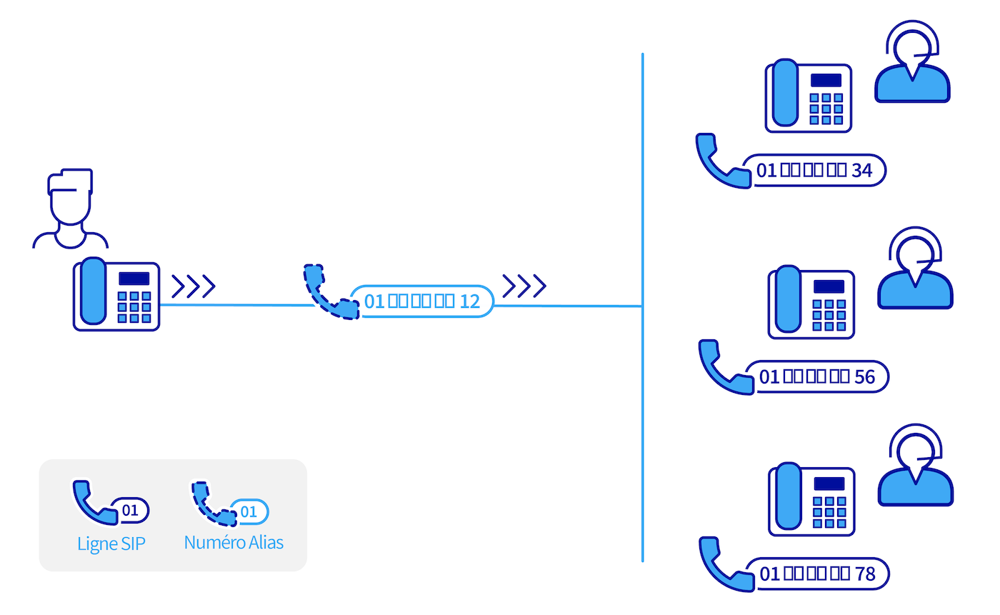

## Objectif

Retrouvez ici les questions les plus fréquemment posées sur les services VoIP OVHcloud

/// details | Quelle est la différence entre une ligne SIP et un numéro « alias » ?

{.thumbnail width="600"}

Une ligne SIP et un numéro alias sont deux services de téléphonie distincts. Bien que complémentaires, ils n'ont pas la même fonction.

Une ligne SIP est une ligne téléphonique utilisant le protocope SIP (*Session Initation Protocol*). Elle est enregistrée sur un seul téléphone SIP, qui peut être [fourni sous caution par OVHcloud](/links/telecom/telephonie-comparatif-telephones), ou sur un logiciel de type « *softphone* » (OVHcloud n'édite pas de softphone).
 La ligne SIP est liée à un [forfait VoIP](/links/telecom/telephonie-voip) facturé mensuellement. Il convient généralement d'avoir **une ligne SIP par personne devant disposer d'une ligne téléphonique directe** dans votre entreprise.

Un [numéro](/links/telecom/telephonie-numeros), souvent appelé « numéro alias », ne peut pas être enregistré sur un téléphone. Suivant votre besoin, il peut rediriger les appels vers **une ou plusieurs** lignes SIP ou peut servir à héberger une [conférence téléphonique OVHcloud](/pages/web_cloud/phone_and_fax/voip/conference).
 Un numéro alias peut être [acheté chez OVHcloud](/links/telecom/telephonie-numeros) ou « porté », via la [portabilité de numéro](/pages/web_cloud/phone_and_fax/voip/demander_la_portabilite_de_mon_numero), depuis un autre opérateur téléphonique.

Dans une entreprise, le schéma classique est d'avoir, au minimum, un numéro alias principal, facile à mémoriser pour la clientèle, qui redirige les appels vers les lignes SIP directes des employés.

- Un numéro alias peut rediriger les appels vers une seule ligne, via une [redirection d'appels](/pages/web_cloud/phone_and_fax/voip/redirection_avec_presentation). Cela peut vous permettre, par exemple, de masquer le numéro direct de la ligne SIP.
- Un numéro alias peut aussi faire sonner **en même temps** plusieurs lignes via une configuration de type « [File d'appels](/pages/web_cloud/phone_and_fax/voip/les_files_d_appels) ».
- Vous pouvez également, sur un numéro alias, appliquer une configuration de type « [SVI](/pages/web_cloud/phone_and_fax/voip/svi_serveur_vocal_interactif) » afin de proposer à vos appelants des choix de touches pour joindre indépendamment chaque service de votre entreprise.
- Vous pouvez même envisager de combiner ces fonctionnalités en utilisant la configuration « [Contact Center Solution](/pages/web_cloud/phone_and_fax/voip/contact-center-solution) ».

Pour déterminer quelle configuration de numéro alias est la plus adaptée à votre entreprise, consultez notre guide « [Choisir et appliquer une configuration pour un numéro](/pages/web_cloud/phone_and_fax/voip/quelle_configuration_est_adaptee_a_mes_besoins) ».
  Un guide par configuration est également disponible dans la [rubrique « Numéros ou alias » de nos guides](/products/web-cloud-phone-and-fax-voip).

///

/// details | Comment utiliser mon répondeur ?

Pour consulter le répondeur d'une ligne téléphonique OVHcloud, le plus simple est de composer le « 123 » depuis cette ligne. Si vous souhaitez des informations complémentaires, nous vous invitons à consulter le guide [Configurer et consulter le répondeur de sa ligne](/pages/web_cloud/phone_and_fax/voip/configurer-consulter-repondeur-ligne-ovh).

> [!success]
>
> **Trucs et astuces**
>
> Le répondeur de votre ligne téléphonique est également consultable depuis votre [espace client OVHcloud](/links/manager), rubrique `Télécom`{.action} > `Téléphonie`{.action}. Sélectionnez la ligne souhaitée puis cliquez sur `Répondeur`{.action}.

///

/// details | Comment configurer un renvoi d'appel ?

Pour effectuer le renvoi d'appels de votre ligne téléphonique, deux solutions s'offrent à vous : 

- Composez  * 21 * (NUMÉRO)# sur le clavier de votre téléphone pour activer le renvoi vers le numéro de votre choix et #21# pour désactiver ce renvoi.
- Depuis votre [espace client OVHcloud](/links/manager), au sein de la rubrique `Télécom`{.action} > `Téléphonie`{.action}, sélectionnez la ligne téléphonique souhaitée puis cliquez sur `Gestion des appels`{.action} et enfin sur `Renvoi d'appel`{.action}.

> [!success]
>
> **Trucs et astuces**
>
> Si vous souhaitez réaliser des renvois d'appels spécifiques, adaptés à vos différents usages, nous vous invitons à consulter notre guide pour [activer ou désactiver des services depuis le téléphone](/pages/web_cloud/phone_and_fax/voip/activer_desactiver_fonctions).

///

/// details | Comment associer un autre numéro à ma ligne téléphonique ?

Cette opération consiste à effectuer une demande de numéro alias. Pour ce faire, connectez-vous sur votre [espace client OVHcloud](/links/manager), sélectionnez la rubrique `Télécom`{.action} puis cliquez sur `Commander`{.action} situé en haut à gauche.

> [!success]
>
> **Trucs et astuces**
>
> Vous avez la possibilité de commander jusqu'à 100 numéros pour 1€ HT/mois/numéro.

///

/// details | Comment suivre ma demande de portabilité ?

Vous pouvez retrouver le suivi de votre demande de portabilité en vous rendant sur votre [espace client OVHcloud](/links/manager), dans l'univers `Télécom`{.action}. Rendez-vous ensuite sur `Téléphonie`{.action} puis sélectionnez le groupe de facturation sur lequel a été demandée la portabilité.

Vous retrouverez alors, dans l'onglet `Tableau de bord`{.action}, un lien vous permettant de « consulter vos portabilités en cours ».

///

/// details | Pourquoi ai-je reçu un sms m'indiquant une erreur sur ma portabilité ?

Lorsque vous réalisez une demande de portabilité et que nous ne sommes pas capable de la traiter, nous vous informons de la situation par SMS. En complément, vous recevez également un e-mail vous précisant la raison de cette impossibilité ainsi que la procédure à suivre.

> [!success]
>
> **Trucs et astuces**
>
> L'ensemble des e-mails envoyés par OVHcloud sont accessibles depuis votre espace client. Pour cela, connectez-vous à votre [espace client OVHcloud](/links/manager) et cliquez à droite sur `E-mails de service`{.action}. 

///

/// details | Comment configurer mes numéro alias ?

Il existe plusieurs configurations pouvant être appliquées à vos numéros alias, vous pouvez retrouver celles-ci sur le guide [Choisir et appliquer une configuration pour un numéro](/pages/web_cloud/phone_and_fax/voip/quelle_configuration_est_adaptee_a_mes_besoins).

///

/// details | Comment supprimer la redirection de mon numéro alias vers ma ligne ?

Pour supprimer la redirection d'un numéro alias vers votre ligne téléphonique, connectez-vous tout d'abord à votre [espace client OVHcloud](/links/manager). Sélectionnez l'onglet `Télécom`{.action} puis `Téléphonie`{.action}. Choisissez alors le groupe de facturation puis le numéro concerné. Pour finir, vous pouvez cliquer sur `Supprimer la configuration`{.action}. 

> [!success]
>
> **Trucs et astuces**
>
> Vous pouvez également modifier la configuration du numéro en cliquant sur `Changer de configuration`{.action}. Vous pouvez retrouver de plus amples informations en suivant le guide [Choisir et appliquer une configuration pour un numéro](/pages/web_cloud/phone_and_fax/voip/quelle_configuration_est_adaptee_a_mes_besoins).

///

/// details | Comment enregistrer mes appels ?

La fonctionnalité d'enregistrement des appels nécessite de réaliser au préalable une configuration sur le numéro de téléphone concerné. Pour cela, connectez-vous à votre [espace client OVHcloud](/links/manager). Sélectionnez l'onglet `Télécom`{.action} puis `Téléphonie`{.action}. Choisissez alors le groupe de facturation puis le numéro concerné. Cliquez sur `Configuration du numéro`{.action}. Votre numéro doit être configuré en « Contact Center Solution ». 

> [!success]
>
> **Trucs et astuces**
>
> Si vous souhaitez des informations complémentaires, nous vous invitons à consulter le guide suivant : [Configurer un Contact Center Solution](/pages/web_cloud/phone_and_fax/voip/contact-center-solution).

///

/// details | Pourquoi l'enregistrement de mes appels dysfonctionne ?

Ce dysfonctionnement peut provenir d'une mauvaise configuration. Pour le vérifier, connectez-vous à votre [espace client OVHcloud](/links/manager). Sélectionnez l'onglet `Télécom`{.action} puis `Téléphonie`{.action}. Choisissez alors le numéro configuré en « Contact Center Solution ». Au sein de cette configuration, cliquez sur le menu « Consulter les enregistrements ». Vérifiez que la case « Enregistrement des appels » est bien cochée. Retrouvez plus de détails dans le guide [Configurer un Contact Center Solution](/pages/web_cloud/phone_and_fax/voip/contact-center-solution#consulter-les-enregistrements).

> [!success]
>
> **Trucs et astuces**
>
> Si vous rencontrez une erreur lors de la consultation d'un enregistrement, n'hésitez pas à essayer de consulter celui-ci depuis un autre navigateur internet.

///

/// details | Que faire si mon téléphone ne sonne plus ?

Si vous rencontrez un dysfonctionnement sur votre téléphone, commencez par le débrancher puis le rebrancher. Si le phénomène persiste, nous vous invitons à réaliser quelques vérifications en suivant les instructions de « Dépannage Plug & Phone », disponibles depuis votre [espace client OVHcloud](/links/manager).

Pour cela, connectez-vous à l'aide de vos identifiants et dirigez-vous vers la rubrique `Télécom`{.action} puis `Téléphonie`{.action}. Sélectionnez votre groupe de facturation puis votre ligne SIP. Cliquez sur l'onglet `Assistance`{.action} puis sur `Dépannage Plug & Phone`{.action}.
 Vous trouverez plus de détails dans le guide [Dépanner son téléphone Plug and Phone](/pages/web_cloud/phone_and_fax/voip/troubleshoot-02-fix-control-panel).

> [!success]
>
> **Trucs et astuces**
>
> Si vous avez récemment activé la fonctionnalité de renvois d'appels, pensez à vérifier que celle-ci n'est plus active. Pour tout complément, n'hésitez pas à consulter la partie [Comment configurer un renvoi d'appel depuis ma ligne téléphonique ?](./##comment-configurer-un-renvoi-dappel)

///

/// details | Un message d'erreur apparait sur mon téléphone, que faire ?

Pour identifier la cause de cette erreur, nous vous conseillons de réaliser un diagnostic de votre téléphone. Pour cela, connectez-vous à votre [espace client OVHcloud](/links/manager), sélectionnez la rubrique `Télécom`{.action} puis `Téléphonie`{.action} et cliquez sur la ligne SIP concernée. Cliquez sur l'onglet `Assistance`{.action} puis sur `Dépannage Plug & Phone`{.action}.

> [!success]
>
> **Trucs et astuces**
>
> Avant de lancer un diagnostic de votre téléphone, nous vous invitons à éteindre puis rallumer votre téléphone. Cette simple opération peut résoudre le défaut.

///

/// details | Pourquoi mon numéro de téléphone abrégé dysfonctionne ?

Ce dysfonctionnement peut provenir d'une mauvaise configuration. Pour le vérifier, connectez-vous tout d'abord à votre [espace client OVHcloud](/links/manager), sélectionnez l'onglet `Télécom`{.action} puis `Téléphonie`{.action} à gauche et sélectionnez votre groupe de facturation. Cliquez ensuite sur `Numéro abrégés`{.action} et vérifiez que la ligne concernée figure bien dans le tableau qui s'affiche à l'écran. Si cela n'est pas le cas, cliquez sur le bouton `Actions`{.action} pour ajouter un numéro abrégé dédié à cette ligne. 

> [!success]
>
> **Trucs et astuces**
>
> Il est recommandé de mettre en place des numéros abrégés à 4 chiffres. Si le numéro est composé uniquement de 3 chiffres, l'appelant attendra quelques secondes avant d'être mis en relation.

///

/// details | Comment retrouver le relevé des consommations de mes lignes téléphoniques ?

Connectez-vous à votre [espace client OVHcloud](/links/manager), cliquez sur l'onglet `Télécom`{.action} puis `Téléphonie`{.action} à gauche et cliquez sur votre groupe de facturation.

Vous retrouvez alors, dans l'onglet `Tableau de bord`{.action}, un lien vous permettant de `Voir mes relevés de consommation`{.action}.

Les relevés de consommation des mois précédents vous sont alors proposés. Cliquez sur le bouton `...`{.action} à droite du relevé de consommation du mois souhaité pour le télécharger au format PDF.

> [!success]
>
> **Trucs et astuces**
>
> Vous pouvez également consulter, pour chaque ligne SIP, les appels émis et reçus du mois en cours en la sélectionnant dans le menu de gauche puis en vous rendant dans l'onglet `Consommation`{.action}.

///

## Aller plus loin

Échangez avec notre communauté d'utilisateurs sur <https://community.ovh.com>.
