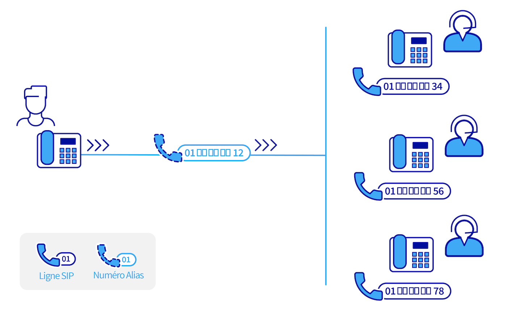

## Objectif

Retrouvez ici les questions les plus fréquemment posées sur les services VoIP OVHcloud.

## FAQ

### Informations générales

/// details | Quelle est la différence entre une ligne SIP et un numéro « alias » ?

{.thumbnail width="600"}

Une ligne SIP et un numéro alias sont deux services de téléphonie distincts. Bien que complémentaires, ils n'ont pas la même fonction.

Une ligne SIP est une ligne téléphonique utilisant le protocole SIP (*Session Initiation Protocol*). Elle est enregistrée sur un seul téléphone SIP, qui peut être [fourni sous caution par OVHcloud](/links/telecom/telephonie-comparatif-telephones), ou sur un logiciel de type « *softphone* ». OVHcloud propose également un softphone, découvrez son utilisation dans le guide « [Installer et configurer Softcall](/pages/web_cloud/phone_and_fax/voip/installer_configurer_softcall) ».
 La ligne SIP est liée à un [forfait VoIP](/links/telecom/telephonie-voip) facturé mensuellement. Il convient généralement d'avoir **une ligne SIP par personne devant disposer d'une ligne téléphonique directe** dans votre entreprise.

Un [numéro](/links/telecom/telephonie-numeros), souvent appelé « numéro alias », ne peut pas être enregistré sur un téléphone. Suivant votre besoin, il peut rediriger les appels vers **une ou plusieurs** lignes SIP ou peut servir à héberger une [conférence téléphonique](/pages/web_cloud/phone_and_fax/voip/conference).
 Un numéro alias peut être [acheté chez OVHcloud](/links/telecom/telephonie-numeros) ou « porté », via la [portabilité de numéro](/pages/web_cloud/phone_and_fax/voip/demander_la_portabilite_de_mon_numero), depuis un autre opérateur téléphonique.

Dans une entreprise, le schéma classique est d'avoir, au minimum, un numéro alias principal, facile à mémoriser pour la clientèle, qui redirige les appels vers les lignes SIP directes des employés.

- Un numéro alias peut rediriger les appels vers une seule ligne, via une [redirection d'appels](/pages/web_cloud/phone_and_fax/voip/redirection_avec_presentation). Cela peut vous permettre, par exemple, de masquer le numéro direct de la ligne SIP.
- Un numéro alias peut aussi faire sonner **en même temps** plusieurs lignes via une configuration de type « [File d'appels](/pages/web_cloud/phone_and_fax/voip/les_files_d_appels) ».
- Vous pouvez également, sur un numéro alias, appliquer une configuration de type « [SVI](/pages/web_cloud/phone_and_fax/voip/svi_serveur_vocal_interactif) » afin de proposer à vos appelants des choix de touches pour joindre indépendamment chaque service de votre entreprise.
- Vous pouvez même combiner ces fonctionnalités en utilisant la configuration « [Contact Center Solution](/pages/web_cloud/phone_and_fax/voip/contact-center-solution) ».

Pour déterminer quelle configuration de numéro alias est la plus adaptée à votre entreprise, consultez le guide « [Choisir et appliquer une configuration pour un numéro](/pages/web_cloud/phone_and_fax/voip/quelle_configuration_est_adaptee_a_mes_besoins) ».

///

/// details | Comment suivre ma demande de portabilité ?

[Accédez à la section VoIP & Fax](/links/control-panel/telecom-voip-fax) de votre espace client OVHcloud et choisissez le groupe de facturation dans lequel a été demandée la portabilité.

Vous retrouverez alors, dans l'onglet `Tableau de bord`{.action}, un lien vous permettant de « consulter vos portabilités en cours ».

///

/// details | Pourquoi ai-je reçu un SMS m'indiquant une erreur sur ma portabilité ?

Lorsque vous réalisez une demande de portabilité et que nous ne sommes pas capables de la traiter, nous vous informons de la situation par SMS. En complément, vous recevez également un e-mail vous précisant la raison de cette impossibilité ainsi que la procédure à suivre.

> [!success]
>
> **Trucs et astuces**
>
> L'ensemble des e-mails envoyés par OVHcloud sont accessibles depuis votre espace client. Connectez-vous à votre [espace client OVHcloud](/links/manager), cliquez sur votre nom en haut à droite, puis sur `Mes communications`{.action}.

///

/// details | Combien de temps prend une portabilité de numéro vers OVHcloud ?

Le délai de portabilité dépend du type de numéro :

- **Numéro fixe isolé (1 à 7 numéros) :** environ **7 jours ouvrés** après acceptation du dossier par l'opérateur donneur.
- **Tranche de numéros (SDA) :** environ **30 jours ouvrés** après acceptation.

La portabilité s'effectue à une date et un créneau horaire définis (généralement le matin). Pendant le basculement, une interruption de quelques minutes est possible. Les principales causes de refus ou de retard sont : un RIO incorrect, une résiliation en cours chez l'opérateur donneur, un titulaire différent entre l'ancien et le nouveau contrat, ou des informations erronées dans le dossier. Vous pouvez suivre l'état de votre demande depuis l'espace client dans `Tableau de bord`{.action} > `Portabilités en cours`{.action}.

Pour plus de détails, consultez le guide « [Demander et suivre une portabilité de numéro](/pages/web_cloud/phone_and_fax/voip/demander_la_portabilite_de_mon_numero) ».

///

/// details | Puis-je porter un numéro belge vers OVHcloud ?

Oui, OVHcloud supporte la portabilité de numéros belges (indicatif +32). La procédure est similaire à celle des numéros français, avec quelques spécificités réglementaires belges. Vous devez fournir une copie de la dernière facture de votre opérateur belge actuel, un document d'identité du titulaire de la ligne, et le numéro Easy Switch (équivalent du RIO en Belgique). La demande se fait depuis l'espace client OVHcloud, dans `Tableau de bord`{.action} > `Commander un numéro`{.action} > `Porter un numéro`{.action}. Le délai de portabilité pour un numéro belge est d'environ 10 jours ouvrés.

Pour plus de détails, consultez le guide « [Demander et suivre une portabilité de numéro belge](/pages/web_cloud/phone_and_fax/voip/portabilite-numero-belge) ».

///

/// details | Comment retrouver le RIO de mes services de téléphonie ?

Tout numéro associé à un service VoIP est portable grâce à son **RIO** (**R**elevé d'**I**dentité **O**pérateur).

Pour récupérer le RIO, [accédez à la section VoIP & Fax](/links/control-panel/telecom-voip-fax) de votre espace client OVHcloud. Cliquez sur le groupe de facturation souhaité puis sur le service VoIP concerné dans l'onglet `Services`{.action}. Le RIO est affiché dans la rubrique `Informations générales`{.action}.

{.thumbnail}

> [!warning]
>
> **La portabilité d'un numéro OVHcloud vers un autre opérateur entraîne sa résiliation technique et commerciale chez OVHcloud à la date effective de la portabilité.**

**Autres méthodes pour obtenir le RIO :**

- Depuis la ligne SIP concernée : composez le **3179**.
- Depuis une autre ligne : composez le **0805 69 3179**, puis renseignez le numéro OVHcloud concerné.

Le RIO sera envoyé par e-mail au contact détenteur du service.

///

/// details | Comment retrouver le relevé des consommations de mes lignes téléphoniques ?

[Accédez à la section VoIP & Fax](/links/control-panel/telecom-voip-fax) de votre espace client OVHcloud puis cliquez sur votre groupe de facturation.

Vous retrouvez alors, dans l'onglet `Tableau de bord`{.action}, un lien vous permettant de `Voir mes relevés de consommation`{.action}.

Les relevés de consommation des mois précédents vous sont alors proposés. Cliquez sur le bouton `...`{.action} à droite du relevé de consommation du mois souhaité pour le télécharger au format PDF.

> [!success]
>
> **Trucs et astuces**
>
> Vous pouvez également consulter, pour chaque ligne SIP, les appels émis et reçus du mois en cours en la sélectionnant depuis l'onglet `Services`{.action} puis en vous rendant dans l'onglet `Consommation`{.action}.

///

/// details | Comment fonctionne le dépôt de garantie pour les téléphones OVHcloud ?

Lorsque vous commandez un téléphone Plug & Phone auprès d'OVHcloud, un dépôt de garantie est prélevé. Ce dépôt correspond à la valeur du matériel et vous est restitué lorsque vous retournez le téléphone en bon état dans le cadre d'une résiliation ou d'un échange (RMA). Le montant du dépôt varie selon le modèle du téléphone choisi. Si le téléphone n'est pas retourné ou s'il est retourné endommagé, le dépôt de garantie est conservé par OVHcloud. La gestion du dépôt de garantie et de la limite hors-forfait est consultable depuis votre espace client dans la rubrique `Tableau de bord`{.action} de votre groupe de facturation.

Pour plus de détails, consultez le guide « [Gestion du dépôt de garantie et de la limite hors-forfait](/pages/web_cloud/phone_and_fax/voip/gestion_du_depot_de_garantie_et_de_la_limite_hors_forfait) ».

///

/// details | Comment fonctionne la limite hors-forfait ?

La limite hors-forfait est un seuil de dépense configurable qui protège votre compte contre les consommations excessives (appels hors forfait, appels internationaux, numéros surtaxés). Lorsque ce seuil est atteint, les appels sortants hors forfait sont automatiquement bloqués. Vous pouvez consulter et modifier cette limite depuis votre [espace client OVHcloud](/links/manager), dans `Tableau de bord`{.action} du groupe de facturation. Une augmentation de la limite hors-forfait peut nécessiter un réajustement du dépôt de garantie. Il est recommandé de paramétrer cette limite en fonction de votre consommation habituelle pour éviter tout blocage imprévu, tout en vous protégeant contre une utilisation frauduleuse de vos lignes.

Pour plus de détails, consultez le guide « [Gestion du dépôt de garantie et de la limite hors-forfait](/pages/web_cloud/phone_and_fax/voip/gestion_du_depot_de_garantie_et_de_la_limite_hors_forfait) ».

///

/// details | Comment gérer mes groupes de facturation téléphonie ?

Un groupe de facturation (ou groupe de téléphonie) regroupe l'ensemble de vos services VoIP et Fax sur une même entité de facturation. Vous pouvez avoir plusieurs groupes pour séparer les coûts par département, site ou projet. [Accédez à la section VoIP & Fax](/links/control-panel/telecom-voip-fax) de votre espace client OVHcloud. Les groupes sont listés dans le menu de gauche. Vous pouvez renommer un groupe pour mieux l'identifier (par exemple : « Siège Paris », « Agence Lyon »). Il est possible de déplacer un service d'un groupe à un autre via la gestion des services. Chaque groupe dispose de son propre tableau de bord avec les relevés de consommation, la gestion du dépôt de garantie et les portabilités en cours.

Pour plus de détails, consultez le guide « [Gérer vos groupes de téléphonie](/pages/web_cloud/phone_and_fax/voip/regrouper_services_telephonie) ».

///

/// details | Comment changer de forfait ou d'offre sur ma ligne VoIP ?

Vous pouvez modifier l'offre associée à votre ligne VoIP directement depuis votre [espace client OVHcloud](/links/manager). [Accédez à la section VoIP & Fax](/links/control-panel/telecom-voip-fax), sélectionnez la ligne concernée dans l'onglet `Services`{.action}, puis cliquez sur `Gestion du service`{.action} > `Changer d'offre`{.action}. Les offres disponibles sont listées avec leurs caractéristiques et tarifs. Le changement d'offre prend effet immédiatement, avec une facturation au prorata pour le mois en cours. Un changement de forfait vers une offre supérieure est immédiat ; un retour vers une offre inférieure s'applique à la prochaine période de facturation. Les options (appels simultanés, destinations internationales) peuvent être ajoutées ou retirées indépendamment du forfait.

Pour plus de détails, consultez le guide « [Gérer vos services VoIP](/pages/web_cloud/phone_and_fax/voip/changer_l_offre_et_les_options_d_une_ligne_voip) ».

///

/// details | Comment valider mon identité pour utiliser les services VoIP ?

Avant de pouvoir passer des appels sortants avec votre ligne VoIP OVHcloud, vous devez valider votre identité. Cette procédure est obligatoire et imposée par la réglementation française des télécommunications. [Accédez à la section VoIP & Fax](/links/control-panel/telecom-voip-fax) de votre espace client OVHcloud, puis accédez à la section `Validation d'identité`{.action}. Vous devrez fournir un justificatif d'identité (carte nationale d'identité, passeport ou Kbis pour les entreprises). Le document sera vérifié par les équipes OVHcloud et la validation intervient généralement sous 48 heures ouvrées. Tant que l'identité n'est pas validée, la ligne peut recevoir des appels mais les appels sortants sont bloqués.

Pour plus de détails, consultez le guide « [Valider votre identité pour l'utilisation des services VoIP](/pages/web_cloud/phone_and_fax/voip/la_procedure_de_validation_voip) ».

///

/// details | Comment effectuer un changement de contacts pour mon groupe de téléphonie ?

Le changement de contacts permet de transférer la gestion technique ou la facturation d'un groupe de téléphonie à un autre identifiant client OVHcloud. [Accédez à la section VoIP & Fax](/links/control-panel/telecom-voip-fax) de votre espace client OVHcloud, sélectionnez le groupe de facturation, puis rendez-vous dans `Tableau de bord`{.action} > `Gestion des contacts`{.action}. Vous pouvez modifier trois types de contacts : le contact administrateur, le contact technique et le contact facturation. Le nouveau contact recevra un e-mail de validation qu'il devra accepter dans un délai de 72 heures. Les deux parties (ancien et nouveau contact) doivent valider le transfert. Cette procédure est utile lors d'un changement de prestataire informatique ou d'une réorganisation interne.

Pour plus de détails, consultez le guide « [Effectuer un changement de contacts pour vos groupes de téléphonie](/pages/web_cloud/phone_and_fax/voip/effectuer_un_changement_de_contact_pour_les_services_voip) ».

///

/// details | Comment résilier un service VoIP ?

[Accédez à la section VoIP & Fax](/links/control-panel/telecom-voip-fax) de votre espace client OVHcloud. Sélectionnez le groupe de facturation contenant le service à résilier, puis cliquez sur le service dans l'onglet `Services`{.action}. Depuis l'onglet `Gestion`{.action}, cliquez sur `Résiliation de la ligne`{.action}. La résiliation prend effet à la fin de la période de facturation en cours. Un service résilié ne peut pas être réactivé. Si un téléphone est associé au service en cours de résiliation, un bon de retour (RMA) vous sera envoyé pour le renvoyer et récupérer votre dépôt de garantie. Assurez-vous de sauvegarder vos données (enregistrements d'appels, messages du répondeur) avant la résiliation.

Pour plus de détails, consultez le guide « [Comment résilier un service VoIP ou une ligne Fax](/pages/web_cloud/phone_and_fax/voip/resilier-services-voip) ».

///

/// details | Comment fonctionne la procédure de RMA (retour matériel) ?

Le RMA (Return Merchandise Authorization) est la procédure de retour du matériel téléphonique fourni sous caution par OVHcloud. Un RMA est déclenché dans les cas suivants : échange de téléphone, changement de modèle, résiliation de la ligne SIP, ou panne nécessitant un remplacement. Lorsqu'un RMA est initié, vous recevez un bon de retour par e-mail avec les instructions d'expédition. Le matériel doit être retourné dans un délai de 15 jours dans son emballage d'origine, avec tous les accessoires. À réception, OVHcloud vérifie l'état du matériel : si celui-ci est en bon état, le dépôt de garantie vous est restitué. En cas de matériel endommagé ou incomplet, le dépôt peut être conservé partiellement ou intégralement. Vous pouvez suivre l'état de votre RMA depuis l'espace client.

Pour plus de détails, consultez le guide « [Déroulement d'un RMA](/pages/web_cloud/phone_and_fax/voip/deroulement_d_un_rma) ».

///

/// details | J'ai résilié une ligne VoIP, le bon de retour (RMA) est illisible ou absent, et je n'ai plus accès à mon compte OVHcloud. Que faire ?

Ce cas combine deux problèmes distincts qu'il faut traiter séparément et dans l'ordre suivant :

**Étape 1 — Récupérer l'accès au compte OVHcloud**

Si l'ancien technicien ou administrateur est parti avec les identifiants du compte, plusieurs options existent :

- **Réinitialisation du mot de passe :** si vous connaissez l'identifiant client (NIC handle, au format `xx12345-ovh`), rendez-vous sur la page de connexion de l'[espace client OVHcloud](https://www.ovh.com/auth/?action=gotoresetpassword) et cliquez sur « Mot de passe oublié ». Un lien de réinitialisation sera envoyé à l'adresse e-mail associée au compte.
- **Si l'adresse e-mail n'est plus accessible :** contactez le support OVHcloud et effectuez une **procédure de récupération de compte**. Fournissez : Kbis de la société (datant de moins de 3 mois), pièce d'identité du représentant légal, et une lettre sur papier à en-tête demandant la modification de l'adresse e-mail de contact. Cette procédure est traitée manuellement et peut prendre plusieurs jours ouvrés.
- **Si vous ne connaissez même pas l'identifiant client :** le support OVHcloud peut le retrouver à partir du nom de la société, du numéro SIRET ou d'un numéro de téléphone/alias associé au compte. Contactez le support par téléphone au **1007** (depuis la France).

**Étape 2 — Obtenir un bon de retour (RMA) lisible**

Une fois l'accès au compte récupéré, si le PDF du bon de retour affiche « fichier absent ou incorrect » :

- **Essayez un autre navigateur :** certains navigateurs gèrent différemment le téléchargement de PDF depuis le portail OVHcloud.
- **Videz le cache du navigateur** et retentez le téléchargement.
- **Vérifiez l'e-mail original :** le bon de retour est normalement envoyé en pièce jointe de l'e-mail de confirmation de RMA.
- **Demandez un renvoi via le support :** [créez une demande d'assistance](/links/support-contact) ou appelez le **1007** en demandant le renvoi du bon de retour RMA.

**Points importants :**

- Le matériel doit être retourné dans un **délai de 15 jours** après émission du bon de retour.
- Le retour doit être effectué dans l'**emballage d'origine** avec tous les accessoires (câble Ethernet, alimentation, combiné, socle).
- Conservez le **numéro de suivi du colis** comme preuve d'expédition.
- À réception, OVHcloud vérifie l'état du matériel et restitue le **dépôt de garantie** si tout est en ordre.

///

### Lignes SIP

/// details | Comment utiliser mon répondeur ?

Pour consulter le répondeur d'une ligne téléphonique OVHcloud, le plus simple est de composer le « 123 » depuis cette ligne. Pour plus de détails, consultez le guide « [Configurer et consulter le répondeur de sa ligne](/pages/web_cloud/phone_and_fax/voip/configurer-consulter-repondeur-ligne-ovh) ».

> [!success]
>
> **Trucs et astuces**
>
> Le répondeur de votre ligne téléphonique est également consultable depuis votre espace client OVHcloud. [Accédez à la section VoIP & Fax](/links/control-panel/telecom-voip-fax) et choisissez le groupe de facturation contenant votre ligne. Dans l'onglet `Services`{.action}, sélectionnez la ligne souhaitée puis cliquez sur `Répondeur`{.action}.

///

/// details | Comment configurer un renvoi d'appel ?

Pour effectuer le renvoi d'appels de votre ligne téléphonique, deux solutions s'offrent à vous :

- Composez `*21*(NUMÉRO)#` sur le clavier de votre téléphone pour activer le renvoi vers le numéro de votre choix et `#21#` pour désactiver ce renvoi.
- [Accédez à la section VoIP & Fax](/links/control-panel/telecom-voip-fax) de votre espace client OVHcloud et choisissez le groupe de facturation contenant votre ligne. Dans l'onglet `Services`{.action}, sélectionnez la ligne téléphonique souhaitée puis cliquez sur `Gestion des appels`{.action} et enfin sur `Renvoi d'appel`{.action}.

> [!success]
>
> **Trucs et astuces**
>
> Pour des renvois d'appels spécifiques, consultez le guide « [Activer ou désactiver des services depuis le téléphone](/pages/web_cloud/phone_and_fax/voip/activer_desactiver_fonctions) ».

///

/// details | Comment modifier le mot de passe de ma ligne SIP ?

Le mot de passe SIP est un élément essentiel pour l'enregistrement de votre ligne sur un téléphone ou un softphone. Pour le modifier, [accédez à la section VoIP & Fax](/links/control-panel/telecom-voip-fax) de votre espace client OVHcloud. Sélectionnez la ligne SIP concernée dans l'onglet `Services`{.action}, puis rendez-vous dans `Gestion`{.action} > `Mot de passe SIP`{.action}. Saisissez un nouveau mot de passe respectant les critères de sécurité (minimum 8 caractères, mélange de lettres, chiffres et caractères spéciaux). Après la modification, votre téléphone se déconnectera brièvement le temps de se réenregistrer avec le nouveau mot de passe. Si vous utilisez un téléphone Plug & Phone OVHcloud, la mise à jour est automatique. Si vous utilisez un softphone ou un téléphone tiers, vous devrez mettre à jour le mot de passe manuellement dans la configuration de votre appareil.

Pour plus de détails, consultez le guide « [Modifier le mot de passe d'une ligne SIP](/pages/web_cloud/phone_and_fax/voip/modifier-mot-de-passe-ligne-sip) ».

///

/// details | Quels codecs audio sont supportés par les lignes SIP OVHcloud ?

Les lignes SIP OVHcloud supportent les codecs audio suivants : **G.711 a-law (PCMA)**, **G.711 u-law (PCMU)** et **G.722** pour la voix HD. Le codec G.711 est le codec par défaut et offre une bonne qualité audio avec une consommation de bande passante de 64 kbps par appel. Le codec G.722 offre une qualité audio supérieure (wideband) mais nécessite un téléphone compatible HD. Le choix du codec peut être effectué dans les paramètres avancés de votre téléphone SIP ou de votre softphone. Pour une qualité optimale, il est recommandé de privilégier le G.722 si votre équipement et votre réseau le permettent, et de conserver le G.711 en codec de secours.

///

/// details | Quelle bande passante Internet est nécessaire pour utiliser la VoIP OVHcloud ?

Chaque appel VoIP simultané consomme environ **80 à 100 kbps** en montée et en descente avec le codec G.711 (en comptant les en-têtes réseau). Pour garantir une qualité d'appel optimale, OVHcloud recommande de disposer d'une connexion Internet avec un débit montant d'au moins **100 kbps par appel simultané** et une latence inférieure à **150 ms**. La gigue (jitter) doit idéalement rester en dessous de **30 ms**. Si vous disposez de nombreuses lignes SIP, il est conseillé d'utiliser un routeur supportant la **QoS (Quality of Service)** afin de prioriser le trafic voix. Un test de débit et de qualité réseau peut être effectué depuis l'outil de diagnostic de votre espace client.

Pour plus de détails, consultez le guide « [Diagnostic du réseau local](/pages/web_cloud/phone_and_fax/voip/troubleshoot-01-local-network) ».

///

/// details | Comment restreindre ma ligne SIP par adresse IP ?

La restriction par IP empêche l'enregistrement de votre ligne SIP depuis des adresses IP non autorisées. [Accédez à la section VoIP & Fax](/links/control-panel/telecom-voip-fax) de votre espace client OVHcloud. Sélectionnez la ligne SIP concernée, puis accédez à `Gestion`{.action} > `Restrictions SIP par IP`{.action}. Ajoutez les adresses IP publiques depuis lesquelles vous autorisez l'enregistrement de votre ligne. Vous pouvez renseigner jusqu'à 6 adresses IP. Cette fonctionnalité est particulièrement recommandée si vous utilisez un softphone ou un SIP trunk sur une infrastructure à IP fixe.

> [!warning]
>
> Si votre adresse IP publique change (cas fréquent avec les connexions grand public), votre téléphone ne pourra plus s'enregistrer tant que la nouvelle IP n'aura pas été ajoutée.

Pour plus de détails, consultez le guide « [Restreindre sa ligne SIP OVHcloud par IP](/pages/web_cloud/phone_and_fax/voip/secure-sip-line-ovh) ».

///

/// details | Comment configurer les touches programmables de mon téléphone OVHcloud ?

Les téléphones fournis par OVHcloud disposent de touches programmables personnalisables. [Accédez à la section VoIP & Fax](/links/control-panel/telecom-voip-fax) de votre espace client OVHcloud, sélectionnez la ligne SIP associée au téléphone, puis cliquez sur `Téléphone`{.action} > `Touches programmables`{.action}. Vous pouvez attribuer à chaque touche une fonction parmi : appel rapide (numéro de votre choix), supervision de ligne (BLF), transfert d'appel, intercom, mise en attente, etc. Les modifications sont appliquées automatiquement au téléphone sous quelques minutes. Le nombre de touches programmables varie selon le modèle de téléphone. Des modules d'extension de touches sont également disponibles pour certains modèles.

Pour plus de détails, consultez le guide « [Configurer les touches programmables de votre téléphone OVHcloud](/pages/web_cloud/phone_and_fax/voip/configuration_ovh_phone) ».

///

/// details | Comment configurer des plages horaires et des fermetures exceptionnelles sur ma ligne ?

[Accédez à la section VoIP & Fax](/links/control-panel/telecom-voip-fax) de votre espace client OVHcloud, sélectionnez la ligne concernée dans l'onglet `Services`{.action}, puis rendez-vous dans `Gestion des appels`{.action} > `Gérer les plages horaires`{.action}. Vous pouvez y définir les créneaux pendant lesquels la ligne est joignable et configurer un renvoi vers le répondeur ou un autre numéro en dehors de ces créneaux. Les fermetures exceptionnelles (jours fériés, congés) permettent de configurer un comportement spécifique sur des dates précises, qui prime sur les plages horaires habituelles.

Pour plus de détails, consultez le guide « [Configurer des plages horaires et des fermetures exceptionnelles sur une ligne](/pages/web_cloud/phone_and_fax/voip/configure-time-slot-and-closing-time) ».

///

/// details | Comment gérer les appels simultanés sur ma ligne SIP ?

Par défaut, une ligne SIP OVHcloud permet de gérer **2 appels simultanés** (1 appel en cours + 1 appel en attente, ou 2 appels entrants en même temps). Vous pouvez augmenter ce nombre depuis votre [espace client OVHcloud](/links/manager), en sélectionnant la ligne puis `Gestion des appels`{.action} > `Appels simultanés`{.action}. Des appels simultanés supplémentaires sont facturés mensuellement. Cette option est utile si vous utilisez le Click2Call ou si votre ligne reçoit un volume d'appels élevé.

> [!warning]
>
> Le nombre d'appels simultanés doit être cohérent avec la bande passante disponible sur votre connexion Internet.

Pour plus de détails, consultez le guide « [Gérer et utiliser les appels simultanés](/pages/web_cloud/phone_and_fax/voip/gerer-utiliser-appels-simultanes) ».

///

/// details | Comment utiliser la fonctionnalité Click2Call ?

Le Click2Call permet de déclencher un appel entre votre ligne SIP et un numéro de destination depuis votre espace client ou via l'API OVHcloud, sans avoir à composer le numéro sur le téléphone. [Accédez à la section VoIP & Fax](/links/control-panel/telecom-voip-fax) de votre espace client OVHcloud, sélectionnez la ligne SIP, puis cliquez sur `Gestion des appels`{.action} > `Appel en 1 clic (Click2Call)`{.action}. Saisissez le numéro à appeler : votre téléphone sonnera d'abord, puis le correspondant sera appelé une fois que vous aurez décroché. Le Click2Call est aussi utilisable via l'API OVHcloud (`POST /telephony/{billingAccount}/line/{serviceName}/click2CallUser`), ce qui permet de l'intégrer dans un CRM ou une application métier. Un identifiant et un mot de passe Click2Call dédiés doivent être créés au préalable.

Pour plus de détails, consultez le guide « [Configurer et utiliser le Click2Call sur une ligne SIP](/pages/web_cloud/phone_and_fax/voip/configurer-utiliser-click2call) ».

///

/// details | Comment configurer la présentation du numéro sur ma ligne SIP ?

La présentation du numéro détermine quel numéro est affiché chez votre correspondant lorsque vous passez un appel sortant. Par défaut, c'est le numéro de votre ligne SIP qui est présenté. [Accédez à la section VoIP & Fax](/links/control-panel/telecom-voip-fax) de votre espace client OVHcloud, sélectionnez la ligne puis `Gestion des appels`{.action} > `Présentation du numéro`{.action}. Vous pouvez choisir de présenter : le numéro de la ligne elle-même, un numéro alias rattaché à votre compte, ou passer en mode « anonyme » (numéro masqué). La présentation d'un numéro alias est particulièrement utile en entreprise pour que tous les collaborateurs présentent le numéro principal de la société. Seuls les numéros alias associés à votre compte OVHcloud peuvent être utilisés comme numéro de présentation.

Pour plus de détails, consultez le guide « [Configurer la présentation de son numéro](/pages/web_cloud/phone_and_fax/voip/gerer_la_presentation_du_numero_sur_votre_ligne_sip) ».

///

/// details | Comment importer un carnet de contacts sur ma ligne SIP ?

Vous pouvez importer un carnet de contacts au format CSV sur votre ligne SIP pour retrouver vos contacts directement sur l'écran de votre téléphone Plug & Phone. [Accédez à la section VoIP & Fax](/links/control-panel/telecom-voip-fax) de votre espace client OVHcloud, sélectionnez la ligne SIP, puis cliquez sur `Carnets de contacts`{.action}. Vous pouvez y ajouter des contacts manuellement ou importer un fichier CSV. Le fichier doit respecter le format attendu : colonnes pour le nom, le prénom et le numéro de téléphone. Le carnet de contacts est synchronisé automatiquement avec le téléphone. Le nombre de contacts supporté dépend du modèle de téléphone utilisé.

Pour plus de détails, consultez le guide « [Gérer un carnet de contacts sur une ligne SIP](/pages/web_cloud/phone_and_fax/voip/importer_un_carnet_de_contacts) ».

///

/// details | Qu'est-ce que le mode intercom et comment l'activer ?

Le mode intercom permet à un appelant interne de déclencher le haut-parleur du téléphone du destinataire automatiquement, sans que celui-ci n'ait besoin de décrocher. Cette fonctionnalité est utile en milieu professionnel pour les communications rapides entre bureaux. [Accédez à la section VoIP & Fax](/links/control-panel/telecom-voip-fax) de votre espace client OVHcloud, sélectionnez la ligne SIP concernée, puis cliquez sur `Gestion des appels`{.action} > `Double appel et Intercom`{.action}. Vous pouvez y définir les lignes autorisées à utiliser l'intercom vers ce poste. Le mode intercom nécessite un téléphone compatible (la plupart des téléphones Plug & Phone OVHcloud le supportent). L'appel intercom est généralement déclenché en composant un code spécifique avant le numéro abrégé du destinataire.

Pour plus de détails, consultez le guide « [Gérer le mode intercom de votre ligne](/pages/web_cloud/phone_and_fax/voip/mode-intercom) ».

///

/// details | Comment personnaliser la musique d'attente de ma ligne SIP ?

La musique d'attente est diffusée à votre correspondant lorsqu'il est mis en attente pendant un appel. [Accédez à la section VoIP & Fax](/links/control-panel/telecom-voip-fax) de votre espace client OVHcloud, sélectionnez la ligne SIP, puis cliquez sur l'onglet `Gestion des musiques`{.action}. Vous pouvez y charger un fichier audio aux formats WAV, MP3 ou OGG. Le fichier est automatiquement converti au format adapté à la téléphonie. Vous pouvez également personnaliser la sonnerie d'appel entrant de la même manière. Pour les numéros alias configurés en File d'appels ou SVI, la musique d'attente se configure directement dans la configuration du numéro alias.

Pour plus de détails, consultez le guide « [Modifier les musiques et sonneries de votre ligne](/pages/web_cloud/phone_and_fax/voip/modifier-musiques-sonneries-ligne) ».

///

/// details | Comment publier mes coordonnées dans l'annuaire avec ma ligne OVHcloud ?

[Accédez à la section VoIP & Fax](/links/control-panel/telecom-voip-fax) de votre espace client OVHcloud, sélectionnez la ligne ou le numéro concerné, puis cliquez sur l'onglet `Coordonnées`{.action}. Renseignez les coordonnées à publier (nom, adresse, activité pour les professionnels). La publication est gratuite et prend effet sous 4 à 6 semaines. Vous pouvez choisir de publier en liste normale, en liste rouge (coordonnées non communiquées sauf aux services d'urgence) ou en liste orange (coordonnées publiées mais non accessibles au démarchage). La modification ou la suppression des coordonnées suit le même délai.

Pour plus de détails, consultez le guide « [Renseigner les coordonnées d'une ligne et les faire paraître en ligne](/pages/web_cloud/phone_and_fax/voip/publication_annuaire) ».

///

/// details | Puis-je utiliser ma ligne SIP OVHcloud sur un softphone personnel ?

Oui, il est possible d'enregistrer votre ligne SIP OVHcloud sur un softphone (application logicielle de téléphonie) installé sur un ordinateur ou un smartphone. Les informations nécessaires sont : le nom d'utilisateur SIP (identifiant de la ligne, au format `0033xxxxxxxxx`), le mot de passe SIP (disponible ou modifiable depuis l'espace client), et le serveur SIP (`sip.ovh.fr` ou le serveur indiqué dans les paramètres de votre ligne). OVHcloud fournit des guides de configuration pour les softphones Zoiper et Linphone. Les softphones tiers compatibles SIP fonctionnent également, à condition de respecter les paramètres d'enregistrement.

> [!warning]
>
> Si vous enregistrez votre ligne sur un softphone, elle sera désenregistrée de tout téléphone physique précédemment utilisé, car une ligne SIP ne peut être enregistrée que sur un seul appareil à la fois.

Pour plus de détails, consultez le guide « [Configuration sur un softphone / téléphone personnel](/pages/web_cloud/phone_and_fax/voip/register-sip-softphone) ».

///

/// details | Comment installer et utiliser Softcall, le softphone OVHcloud ?

Softcall est l'application softphone développée par OVHcloud pour utiliser votre ligne SIP depuis un ordinateur (Windows ou macOS). [Accédez à la section VoIP & Fax](/links/control-panel/telecom-voip-fax) de votre espace client OVHcloud, sélectionnez votre ligne SIP, puis cliquez sur l'onglet `Softphone`{.action}. Téléchargez l'application correspondant à votre système d'exploitation. L'authentification se fait via un lien d'activation envoyé par e-mail, ce qui évite de manipuler les identifiants SIP. Softcall offre les fonctionnalités classiques : appels entrants/sortants, transfert d'appel, mise en attente, gestion du répondeur, et affichage du carnet de contacts.

> [!warning]
>
> L'utilisation de Softcall désenregistre tout téléphone physique préalablement associé à la ligne.

Pour plus de détails, consultez le guide « [Installer et configurer Softcall](/pages/web_cloud/phone_and_fax/voip/installer_configurer_softcall) ».

///

/// details | Comment sécuriser ma ligne SIP contre les usages frauduleux ?

Plusieurs mesures de sécurité sont recommandées pour protéger votre ligne SIP :

- **Mot de passe robuste :** choisissez un mot de passe SIP complexe (minimum 8 caractères, mélange de lettres, chiffres et caractères spéciaux) et changez-le régulièrement.
- **Restriction par IP :** limitez l'enregistrement de votre ligne aux seules adresses IP légitimes via la fonctionnalité de restriction par IP dans l'espace client.
- **Limite hors-forfait :** configurez un seuil de dépense adapté pour bloquer automatiquement les appels sortants en cas de surconsommation suspecte.
- **Filtrage d'appels :** bloquez les appels vers les destinations à risque (numéros surtaxés, destinations internationales non nécessaires) via les filtres d'appels dans `Gestion des appels`{.action} > `Filtrage d'appels`{.action}.
- **Surveillance :** consultez régulièrement vos relevés de consommation pour détecter toute anomalie.

En cas de suspicion de fraude, contactez immédiatement le support OVHcloud pour faire bloquer la ligne.

Pour plus de détails, consultez le guide « [Sécuriser sa ligne SIP OVHcloud](/pages/web_cloud/phone_and_fax/voip/secure-sip-line) ».

///

/// details | Que faire si mon téléphone ne sonne plus ?

Si vous rencontrez un dysfonctionnement sur votre téléphone, commencez par le débrancher puis le rebrancher. Si le phénomène persiste, réalisez quelques vérifications en suivant les instructions de « Dépannage Plug & Phone », disponibles depuis votre espace client OVHcloud.

[Accédez à la section VoIP & Fax](/links/control-panel/telecom-voip-fax), choisissez votre groupe de facturation puis votre ligne SIP depuis l'onglet `Services`{.action}. Cliquez sur l'onglet `Assistance`{.action} puis sur `Dépannage Plug & Phone`{.action}.
 Pour plus de détails, consultez le guide « [Dépanner son téléphone OVHcloud](/pages/web_cloud/phone_and_fax/voip/troubleshoot-02-fix-control-panel) ».

> [!success]
>
> **Trucs et astuces**
>
> Si vous avez récemment activé la fonctionnalité de renvoi d'appels, pensez à vérifier que celle-ci n'est plus active. Pour tout complément, n'hésitez pas à consulter la partie **Comment configurer un renvoi d'appel ?**

///

/// details | Un message d'erreur apparaît sur mon téléphone, que faire ?

Pour identifier la cause de cette erreur, réalisez un diagnostic de votre téléphone. [Accédez à la section VoIP & Fax](/links/control-panel/telecom-voip-fax) de votre espace client OVHcloud, choisissez le groupe de facturation puis la ligne SIP concernée dans l'onglet `Services`{.action}. Cliquez sur l'onglet `Assistance`{.action} puis sur `Dépannage Plug & Phone`{.action}.

> [!success]
>
> **Trucs et astuces**
>
> Avant de lancer un diagnostic, éteignez puis rallumez votre téléphone. Cette simple opération peut résoudre le défaut.

///

/// details | Pourquoi mon numéro de téléphone abrégé dysfonctionne ?

Ce dysfonctionnement peut provenir d'une mauvaise configuration. [Accédez à la section VoIP & Fax](/links/control-panel/telecom-voip-fax) de votre espace client OVHcloud et sélectionnez votre groupe de facturation. Cliquez ensuite sur `Numéros abrégés`{.action} et vérifiez que la ligne concernée figure bien dans le tableau. Si ce n'est pas le cas, cliquez sur le bouton `Actions`{.action} pour ajouter un numéro abrégé dédié à cette ligne.

> [!success]
>
> **Trucs et astuces**
>
> Il est recommandé de mettre en place des numéros abrégés à 4 chiffres. Si le numéro est composé uniquement de 3 chiffres, l'appelant attendra quelques secondes avant d'être mis en relation.

///

/// details | Mon téléphone affiche « No Service » ou « Pas de service », que faire ?

Ce message signifie que le téléphone n'arrive pas à s'enregistrer auprès de l'infrastructure VoIP OVHcloud. Les causes les plus fréquentes sont :

- **Problème réseau :** vérifiez que le câble Ethernet est correctement branché et que votre connexion Internet fonctionne. Testez en accédant à un site web depuis un ordinateur sur le même réseau.
- **Mot de passe SIP incorrect :** si le mot de passe a été modifié récemment, le téléphone tente de s'enregistrer avec l'ancien mot de passe. Réinitialisez le mot de passe depuis l'espace client ou reconfigurez le téléphone.
- **Restriction IP :** si une restriction par IP est activée et que votre adresse IP publique a changé, le téléphone sera rejeté. Mettez à jour la liste des IP autorisées.
- **Pare-feu ou routeur :** certains pare-feu bloquent le trafic SIP (port UDP 5060) ou les flux RTP (ports UDP 30000-45000). Assurez-vous que ces ports sont ouverts.

Si le problème persiste, lancez un diagnostic depuis l'espace client (`Assistance`{.action} > `Dépannage Plug & Phone`{.action}).

Pour plus de détails, consultez le guide « [Dépanner son téléphone OVHcloud](/pages/web_cloud/phone_and_fax/voip/troubleshoot-02-fix-control-panel) ».

///

/// details | Quels sont les ports réseau à ouvrir pour le bon fonctionnement de la VoIP ?

Pour que la téléphonie VoIP fonctionne correctement, les flux suivants doivent pouvoir transiter sans blocage à travers votre pare-feu ou routeur :

- **SIP (signalisation) :** port **UDP 5060** en sortie vers les serveurs OVHcloud.
- **RTP (flux audio) :** ports **UDP 30000 à 45000** en entrée et en sortie.
- **Provisioning (configuration automatique des téléphones Plug & Phone) :** ports **TCP 80 et 443** (HTTP/HTTPS) en sortie.
- **NTP (synchronisation horaire) :** port **UDP 123** en sortie.

> [!warning]
>
> Il est fortement déconseillé d'activer un SIP ALG (Application Layer Gateway) sur votre routeur, car cette fonctionnalité modifie les paquets SIP et provoque fréquemment des dysfonctionnements (audio unidirectionnel, appels coupés, échecs d'enregistrement). Si votre routeur dispose d'un SIP ALG, désactivez-le.

Pour plus de détails, consultez le guide « [Diagnostic du réseau local](/pages/web_cloud/phone_and_fax/voip/troubleshoot-01-local-network) ».

///

/// details | Pourquoi mes appels ont-ils un son saccadé ou des coupures audio ?

Les problèmes de qualité audio en VoIP sont généralement liés au réseau local ou à la connexion Internet. Les principales causes et solutions sont :

- **Bande passante insuffisante :** si votre connexion Internet est saturée (téléchargements, streaming vidéo), le flux audio VoIP est perturbé. Configurez la QoS sur votre routeur pour prioriser le trafic voix.
- **Connexion Wi-Fi :** la téléphonie SIP est sensible aux perturbations Wi-Fi. Privilégiez toujours une connexion **filaire Ethernet** pour vos téléphones.
- **Gigue (jitter) élevée :** une gigue supérieure à 30 ms dégrade la qualité audio. Cela peut provenir d'un réseau local surchargé ou d'un équipement réseau défaillant.
- **Perte de paquets :** même un taux de perte de 1 % est perceptible en VoIP. Vérifiez l'état de votre connexion Internet auprès de votre FAI.
- **SIP ALG actif :** désactivez cette fonctionnalité sur votre routeur si elle est activée.

Un diagnostic réseau peut être effectué via l'outil dédié dans l'espace client (`Assistance`{.action} > `Diagnostic réseau`{.action}).

Pour plus de détails, consultez le guide « [Diagnostic du réseau local](/pages/web_cloud/phone_and_fax/voip/troubleshoot-01-local-network) ».

///

/// details | Mon correspondant n'entend pas ma voix (audio unidirectionnel), que faire ?

L'audio unidirectionnel (vous entendez votre correspondant mais il ne vous entend pas, ou inversement) est un problème réseau fréquent en VoIP. Les causes les plus courantes sont :

- **SIP ALG activé sur le routeur :** c'est la cause la plus fréquente. Cette fonctionnalité modifie les paquets SIP et corrompt les informations de routage des flux audio RTP. Désactivez-la dans l'interface d'administration de votre routeur.
- **Pare-feu bloquant les flux RTP :** les ports UDP 30000 à 45000 doivent être ouverts en entrée et en sortie.
- **Double NAT :** si vous avez deux routeurs en cascade (par exemple box Internet + routeur Wi-Fi), le double NAT peut empêcher le routage correct des flux audio. Configurez le second routeur en mode bridge ou DMZ.
- **VPN actif :** certains VPN encapsulent le trafic SIP/RTP et provoquent des problèmes d'audio. Excluez le trafic VoIP de votre VPN si possible.

Pour plus de détails, consultez le guide « [Diagnostic du réseau local](/pages/web_cloud/phone_and_fax/voip/troubleshoot-01-local-network) ».

///

### Numéros alias

/// details | Comment associer un autre numéro à ma ligne téléphonique ?

Cette opération consiste à effectuer une demande de numéro alias. [Accédez à la section VoIP & Fax](/links/control-panel/telecom-voip-fax) de votre espace client OVHcloud, choisissez le groupe de facturation souhaité puis cliquez sur `Commander un numéro`{.action} dans l'onglet `Tableau de bord`{.action}.

> [!success]
>
> **Trucs et astuces**
>
> Vous pouvez commander jusqu'à 100 numéros pour 1 € HT/mois/numéro.

///

/// details | Comment configurer mes numéros alias ?

Consultez le guide « [Choisir et appliquer une configuration pour un numéro](/pages/web_cloud/phone_and_fax/voip/quelle_configuration_est_adaptee_a_mes_besoins) » pour découvrir les différentes configurations disponibles.

///

/// details | Comment supprimer la redirection de mon numéro alias vers ma ligne ?

[Accédez à la section VoIP & Fax](/links/control-panel/telecom-voip-fax) de votre espace client OVHcloud, choisissez le groupe de facturation puis le numéro concerné dans l'onglet `Services`{.action}. Cliquez sur `Supprimer la configuration`{.action}.

> [!success]
>
> **Trucs et astuces**
>
> Vous pouvez également modifier la configuration du numéro en cliquant sur `Changer de configuration`{.action}. Consultez le guide « [Choisir et appliquer une configuration pour un numéro](/pages/web_cloud/phone_and_fax/voip/quelle_configuration_est_adaptee_a_mes_besoins) » pour plus de détails.

///

/// details | Comment enregistrer mes appels ?

La fonctionnalité d'enregistrement des appels nécessite une configuration « Contact Center Solution » sur le numéro de téléphone concerné. [Accédez à la section VoIP & Fax](/links/control-panel/telecom-voip-fax) de votre espace client OVHcloud, choisissez le groupe de facturation puis le numéro concerné dans l'onglet `Services`{.action}. Cliquez sur `Configuration du numéro`{.action}. Votre numéro doit être configuré en « Contact Center Solution ».

Pour plus de détails, consultez le guide « [Configurer un Contact Center Solution](/pages/web_cloud/phone_and_fax/voip/contact-center-solution) ».

///

/// details | Pourquoi l'enregistrement de mes appels dysfonctionne ?

Ce dysfonctionnement peut provenir d'une mauvaise configuration. [Accédez à la section VoIP & Fax](/links/control-panel/telecom-voip-fax) de votre espace client OVHcloud, choisissez le groupe de facturation puis le numéro configuré en « Contact Center Solution » depuis l'onglet `Services`{.action}. Au sein de cette configuration, cliquez sur le menu « Consulter les enregistrements ». Vérifiez que la case « Enregistrement des appels » est bien cochée. Consultez le guide « [Configurer un Contact Center Solution](/pages/web_cloud/phone_and_fax/voip/contact-center-solution#consulter-les-enregistrements) » pour plus de détails.

> [!success]
>
> **Trucs et astuces**
>
> Si vous rencontrez une erreur lors de la consultation d'un enregistrement, essayez de le consulter depuis un autre navigateur Internet.

///

/// details | Quelle configuration de numéro alias choisir pour mon entreprise ?

OVHcloud propose plusieurs configurations pour les numéros alias, chacune adaptée à un besoin spécifique :

- **[Redirection d'appels](/pages/web_cloud/phone_and_fax/voip/redirection_avec_presentation) :** redirige tous les appels vers une seule ligne SIP. Simple et efficace pour masquer le numéro direct d'un collaborateur derrière un numéro principal.
- **[File d'appels](/pages/web_cloud/phone_and_fax/voip/les_files_d_appels) :** fait sonner plusieurs lignes SIP simultanément ou séquentiellement. Idéal pour un standard ou un service client avec plusieurs agents.
- **[SVI (Serveur Vocal Interactif)](/pages/web_cloud/phone_and_fax/voip/svi_serveur_vocal_interactif) :** propose un menu vocal avec choix de touches (« tapez 1 pour le service commercial, 2 pour le support… »). Adapté aux entreprises avec plusieurs départements.
- **[Contact Center Solution](/pages/web_cloud/phone_and_fax/voip/contact-center-solution) :** combine les fonctionnalités du SVI et de la file d'appels, avec l'enregistrement des appels, les statistiques avancées et les stratégies de distribution. Recommandé pour les centres d'appels.
- **[Conférence](/pages/web_cloud/phone_and_fax/voip/conference) :** transforme le numéro en salle de conférence téléphonique accessible par code PIN.

Le choix dépend de la taille de votre entreprise, du volume d'appels entrants et de la complexité du routage souhaité. Consultez le guide « [Choisir et appliquer une configuration pour un numéro](/pages/web_cloud/phone_and_fax/voip/quelle_configuration_est_adaptee_a_mes_besoins) ».

///

/// details | Comment configurer un Serveur Vocal Interactif (SVI) ?

Le SVI permet de proposer un menu vocal à vos appelants pour les orienter vers le bon service. [Accédez à la section VoIP & Fax](/links/control-panel/telecom-voip-fax) de votre espace client OVHcloud. Sélectionnez le numéro alias, puis appliquez la configuration « Serveur Vocal Interactif ». Vous pouvez :

- Charger un message d'accueil audio (format WAV, MP3 ou OGG) ou utiliser la synthèse vocale.
- Définir jusqu'à 9 choix de touches (1 à 9), chacun pouvant rediriger vers une ligne SIP, un autre numéro alias, un sous-menu SVI, ou une boîte vocale.
- Configurer une action par défaut en cas de non-réponse ou de touche invalide.
- Définir des plages horaires pour adapter le comportement du SVI selon les heures d'ouverture.

Le SVI peut être imbriqué sur plusieurs niveaux pour des arborescences complexes. Pour plus de détails, consultez le guide « [Configurer un Serveur Vocal Interactif (SVI)](/pages/web_cloud/phone_and_fax/voip/svi_serveur_vocal_interactif) ».

///

/// details | Comment configurer une file d'appels sur un numéro alias ?

La file d'appels permet de distribuer les appels entrants vers plusieurs lignes SIP. [Accédez à la section VoIP & Fax](/links/control-panel/telecom-voip-fax) de votre espace client OVHcloud, sélectionnez le numéro alias concerné, puis appliquez la configuration « File d'appels ». Vous pouvez :

- **Ajouter des membres :** ajoutez les lignes SIP qui recevront les appels de la file.
- **Choisir la stratégie de sonnerie :** toutes les lignes sonnent en même temps (ringAll), ou l'appel est distribué séquentiellement (roundRobin), ou vers la ligne la moins sollicitée (leastCalls), ou aléatoirement (random).
- **Configurer le temps de sonnerie :** durée pendant laquelle la file tente de joindre un agent avant de passer au suivant ou de basculer vers le répondeur.
- **Définir une musique d'attente :** personnalisez l'attente musicale pour les appelants en file.
- **Paramétrer le débordement :** si aucun agent ne décroche, l'appel peut être redirigé vers un répondeur, un autre numéro, ou être raccroché après un message.

Pour plus de détails, consultez le guide « [Configurer une file d'appels](/pages/web_cloud/phone_and_fax/voip/les_files_d_appels) ».

///

/// details | Comment créer et gérer une conférence téléphonique OVHcloud ?

La conférence téléphonique permet à plusieurs participants de se réunir sur un même appel en composant un numéro dédié et un code PIN. [Accédez à la section VoIP & Fax](/links/control-panel/telecom-voip-fax) de votre espace client OVHcloud, sélectionnez un numéro alias, puis appliquez la configuration « Conférence ». Vous pouvez :

- Définir un **code PIN** d'accès pour sécuriser la salle de conférence.
- Choisir si les participants sont annoncés par un bip à l'entrée et à la sortie.
- Configurer un nombre maximum de participants (jusqu'à 50 par défaut selon l'offre).
- Activer ou désactiver l'enregistrement de la conférence.
- Suivre en temps réel les participants connectés depuis l'espace client.

La conférence est accessible depuis n'importe quel téléphone (fixe, mobile, VoIP) en composant le numéro alias dédié. Pour plus de détails, consultez le guide « [Créer et gérer des conférences téléphoniques](/pages/web_cloud/phone_and_fax/voip/conference) ».

///

/// details | Qu'est-ce que le Contact Center Solution et quelles sont ses fonctionnalités ?

Le Contact Center Solution (CCS) est la configuration la plus avancée pour les numéros alias OVHcloud. Il combine les fonctionnalités du SVI et de la file d'appels, avec des options supplémentaires dédiées aux centres d'appels :

- **Menu vocal interactif (SVI)** avec arborescence multi-niveaux.
- **File d'appels** avec stratégies de distribution avancées.
- **Enregistrement des appels :** les appels peuvent être enregistrés et consultés depuis l'espace client.
- **Statistiques détaillées :** nombre d'appels reçus, décrochés, abandonnés, temps d'attente moyen, durée moyenne des appels, par agent et par période.
- **Supervision en temps réel :** visualisation des appels en cours, des agents disponibles et en communication.
- **Plages horaires et fermetures exceptionnelles :** comportement automatique selon les horaires.

Le CCS est recommandé pour les entreprises ayant un volume d'appels entrants important et nécessitant un suivi qualitatif de leur accueil téléphonique. Pour plus de détails, consultez le guide « [Configurer un Contact Center Solution](/pages/web_cloud/phone_and_fax/voip/contact-center-solution) ».

///

/// details | Comment configurer une redirection d'appels avec présentation du numéro ?

La redirection avec présentation permet de rediriger les appels reçus sur un numéro alias vers une ligne SIP tout en affichant le numéro de l'appelant (et non le numéro alias) sur le téléphone de destination. [Accédez à la section VoIP & Fax](/links/control-panel/telecom-voip-fax) de votre espace client OVHcloud, sélectionnez le numéro alias, appliquez la configuration « Redirection avec présentation du numéro », puis indiquez la ligne SIP de destination. Contrairement à la redirection simple (DDI), cette configuration consomme un canal d'appel simultané sur le numéro alias et présente le numéro de l'appelant d'origine. La redirection simple (DDI), quant à elle, présente le numéro alias comme appelant sur la ligne de destination.

Pour plus de détails, consultez le guide « [Configurer une redirection d'appels](/pages/web_cloud/phone_and_fax/voip/redirection_avec_presentation) ».

///

/// details | Quels types de numéros spéciaux (SVA) puis-je exploiter avec OVHcloud ?

OVHcloud permet l'exploitation de numéros SVA (Services à Valeur Ajoutée) de différentes catégories :

- **Numéros gratuits (0800, 0805) :** l'appel est gratuit pour l'appelant, vous êtes facturé au trafic entrant.
- **Numéros banalisés (0806 à 0809) :** l'appel est facturé au prix d'un appel local pour l'appelant, sans reversement pour vous.
- **Numéros majorés (081x, 082x, 089x) :** l'appel est surtaxé pour l'appelant, vous bénéficiez d'un reversement.

L'exploitation d'un numéro SVA nécessite une validation d'identité spécifique et le respect de la réglementation SVA+ (information tarifaire, mentions légales). Les reversements ou coûts associés sont consultables et gérables depuis l'espace client. Le choix du palier tarifaire et du type de reversement s'effectue lors de la commande du numéro ou via la modification de son offre dans l'espace client.

Pour plus de détails, consultez le guide « [Gérer les reversements ou les coûts de vos numéros spéciaux](/pages/web_cloud/phone_and_fax/voip/reversements-sva) ».

///

### Lignes SIP Trunk

/// details | Qu'est-ce qu'un SIP Trunk OVHcloud et à quoi sert-il ?

Un SIP Trunk est une ligne de téléphonie VoIP multi-canaux qui se connecte à votre IPBX (autocommutateur téléphonique IP). Contrairement à une ligne SIP individuelle associée à un téléphone unique, un SIP Trunk peut gérer simultanément plusieurs appels (entrants et sortants) sur un même lien. Chez OVHcloud, le SIP Trunk s'utilise principalement avec des IPBX logiciels comme 3CX, Asterisk, ou FreePBX. L'intérêt principal est de centraliser la gestion de la téléphonie d'entreprise sur votre propre infrastructure (hébergée en local ou dans le cloud) tout en bénéficiant de la connectivité et des tarifs OVHcloud pour la partie opérateur. Le nombre de canaux simultanés est configurable selon vos besoins.

///

/// details | Comment déployer un IPBX 3CX sur OVHcloud Public Cloud ?

OVHcloud propose un déploiement automatisé de l'IPBX 3CX sur une instance Public Cloud. La procédure s'effectue via l'espace client OVHcloud :

1. Commandez une instance Public Cloud adaptée (minimum recommandé : 2 vCores, 4 Go RAM).
2. Utilisez le template de déploiement 3CX fourni par OVHcloud pour installer automatiquement le système.
3. Configurez votre SIP Trunk OVHcloud dans l'interface d'administration 3CX en renseignant les paramètres SIP fournis par OVHcloud (serveur, identifiants, codec).
4. Créez vos postes internes et vos règles de routage dans 3CX.

Le déploiement sur Public Cloud présente l'avantage d'une infrastructure scalable, haute disponibilité, et sans matériel à gérer. Le coût combine l'abonnement Public Cloud (instance) et les frais de téléphonie VoIP (forfait + consommation).

Pour plus de détails, consultez le guide « [Déployer automatiquement l'IPBX 3CX sur l'offre Public Cloud OVHcloud](/pages/web_cloud/phone_and_fax/voip/deployer_3cx_sur_public_cloud) ».

///

/// details | Comment configurer un SIP Trunk avec 3CX ?

Pour connecter votre IPBX 3CX au SIP Trunk OVHcloud, vous devez configurer un « Fournisseur SIP » dans l'interface d'administration 3CX. Les paramètres à renseigner sont :

- **Serveur SIP (Registrar) :** l'adresse du serveur SIP fournie dans votre espace client OVHcloud (ex : `sip5.ovh.fr`).
- **Identifiant (Auth ID) :** l'identifiant de votre trunk SIP (au format `0033xxxxxxxxx`).
- **Mot de passe SIP :** le mot de passe associé au trunk.
- **Nombre de canaux simultanés :** à configurer selon votre forfait.
- **Codec :** sélectionnez G.711 a-law en priorité.

3CX dispose de templates préconfigurés pour OVHcloud qui simplifient la saisie. Une fois le trunk configuré, créez les règles de routage entrant (DID vers poste interne) et sortant (préfixe de sortie). Testez les appels entrants et sortants avant de mettre en production.

Pour plus de détails, consultez le guide « [3CX - Configuration et utilisation](/pages/web_cloud/phone_and_fax/voip/configuration_basique_dun_sip_trunk_ovh_sur_3cx_phone_system) ».

///

/// details | Quels IPBX sont compatibles avec les SIP Trunk OVHcloud ?

Les SIP Trunk OVHcloud sont basés sur le protocole SIP standard (RFC 3261) et sont compatibles avec la grande majorité des IPBX du marché. Les IPBX les plus couramment utilisés avec OVHcloud incluent :

- **3CX :** documentation et templates de configuration fournis par OVHcloud.
- **Asterisk / FreePBX :** compatible, configuration manuelle du trunk SIP.
- **Wazo / XiVO :** compatible, basé sur Asterisk.
- **FusionPBX / FreeSWITCH :** compatible avec les paramètres SIP standard.

Les IPBX matériels (Avaya, Cisco, Yealink, Mitel) compatibles SIP peuvent également fonctionner, à condition de prendre en charge l'enregistrement SIP standard. Le codec G.711 a-law doit être supporté au minimum. Pour les IPBX non documentés par OVHcloud, la configuration du trunk SIP repose sur les paramètres génériques : serveur SIP, identifiant, mot de passe, et codec.

///

/// details | Comment configurer le routage des appels entrants (DID) sur mon IPBX ?

Le routage des appels entrants (DID — Direct Inward Dialing) consiste à diriger un appel entrant sur un numéro alias vers le bon poste interne de votre IPBX. La procédure dépend de votre IPBX mais suit le même principe :

1. Assurez-vous que le numéro alias est configuré en « redirection DDI » dans l'espace client OVHcloud, pointant vers votre SIP Trunk.
2. Dans l'interface de votre IPBX, créez une règle de routage entrant (Inbound Route) associant le numéro DID (numéro appelé) au poste interne, au groupe d'appel ou à l'IVR souhaité.
3. Si vous avez plusieurs numéros alias pointant vers le même trunk, chaque numéro peut être routé vers un destinataire interne différent.

En cas de difficulté, vérifiez dans les logs de votre IPBX que l'en-tête SIP « To » contient bien le numéro DID attendu. Les numéros sont transmis au format international (0033xxxxxxxxx).

///

/// details | Comment gérer les appels simultanés sur un SIP Trunk ?

Le nombre d'appels simultanés sur un SIP Trunk détermine combien de conversations téléphoniques peuvent être actives en même temps (entrantes et/ou sortantes). Ce nombre est configurable depuis votre [espace client OVHcloud](/links/manager), dans les paramètres du trunk. Chaque canal supplémentaire est facturé mensuellement. Pour dimensionner correctement votre trunk, estimez le nombre maximum d'appels simultanés pendant vos heures de pointe. Une formule courante est d'avoir un ratio de 1 canal pour 3 postes en usage bureautique, ou 1 canal pour 1,5 poste en centre d'appels. Le dépassement du nombre de canaux autorisés provoquera un signal « occupé » pour les appels excédentaires.

///

## Aller plus loin

Échangez avec notre [communauté d'utilisateurs](/links/community).
