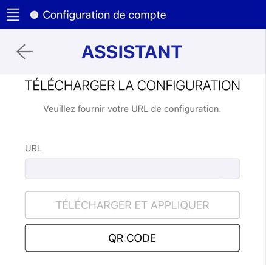

> [!primary]
> L'application [Softcall](https://labs.ovhcloud.com/en/softphone-beta/) sera **prochainement disponible** en phase bêta.
>
> Ce guide peut donc être incomplet et sera mis à jour lors de la bêta. Notre équipe reste disponible pour répondre à vos questions sur la mailing-list [voip@ml.ovh.net](mailto:voip@ml.ovh.net). Posez des questions, donnez votre avis et interagissez directement avec l’équipe qui construit nos services VoIP.
>
> **[Inscrivez-vous à la bêta dès maintenant !](https://survey.ovh.com/index.php/361586?lang=fr)**
> 

## Objectif

Le Softphone est une solution qui transforme votre ordinateur, smartphone ou tablette en un téléphone virtuel, vous permettant d'utiliser votre ligne SIP (**S**ession **I**nitiation **P**rotocol) n'importe où et à tout moment. Grâce à notre application [Softcall](https://labs.ovhcloud.com/en/softphone-beta/), facilement téléchargeable sur les plateformes Android, iOS, macOS et Windows, vous pouvez accéder à toutes les fonctionnalités de votre ligne téléphonique professionnelle sans être lié à un téléphone de bureau traditionnel. Que vous soyez en déplacement ou que vous travailliez à distance, Softcall assure que votre ligne SIP reste aussi mobile et flexible que vos besoins quotidiens l'exigent.

**Découvrez comment installer et configurer Softcall sur les plateformes Android, iOS, macOS et Windows.**

## Prérequis

- Disposer d'une [ligne SIP OVHcloud](/links/telecom/telephonie-voip).
- Être connecté à l'[espace client OVHcloud](/links/manager), partie `Télécom`{.action}.
- Rejoindre la [bêta Softcall](https://survey.ovh.com/index.php/361586?lang=fr).

## En pratique

### Installer Softcall

Connectez-vous à votre espace client et rendez-vous dans la partie `Télécom`{.action}. Dans le menu de gauche, cliquez sur `Téléphonie`{.action} puis sur votre ligne SIP. Après avoir sélectionné l'onglet `Softphone`{.action}, cliquez sur l'interrupteur pour générer l'envoi d'un e-mail dans lequel se trouve le logiciel Softcall, disponible pour Windows, macOS, Android et iOS.

{.thumbnail}

Ouvrez l'e-mail et suivez les instructions pour installer Softcall.

### Configurer Softcall

Cliquez sur l'icône de l'application Softcall. Au premier démarrage, vous êtes dirigé vers l'écran `Assistant`{.action}.

#### Application mobile (Android et IOS)

*Cliquez sur l'onglet correspondant à votre système d'exploitation mobile :*

> [!tabs]
> **Android**
>>
>> {.thumbnail}
>>
> **iOS**
>>
>> {.thumbnail}
>>

Récupérez l'URL ou le QR CODE de configuration vous permettant de télécharger votre configuration Softcall. Retrouvez l'URL et le QR CODE de configuration dans l'e-mail que vous avez reçu après avoir souscrit à l'offre Softcall.

> [!warning]
> 
> Si vous cliquez sur l'URL de configuration, vous ne pourrez pas télécharger votre configuration Softcall. Veuillez uniquement copier l'URL ou scanner le QR CODE pour plus de sécurité.
>

Dans l'écran `Assistant`{.action} de l'application Softcall, entrez l'URL de configuration ou appuyez sur le bouton QR CODE pour scanner le QR CODE. Cliquez sur `Télécharger et appliquer`{.action} pour valider.

Votre compte Softcall est désormais configuré. Dans le menu principal de Softcall, retrouvez votre numéro de téléphone (au format international) tout en haut du menu.

#### Application de bureau (Windows et MacOS)

*Cliquez sur l'onglet correspondant à votre système d'exploitation :*

> [!tabs]
> **Windows**
>>
>> {.thumbnail}
>>
> **macOS**
>>
>> {.thumbnail}
>>

Récupérez l'URL de configuration vous permettant de télécharger votre configuration Softcall. Retrouvez l'URL de configuration dans l'e-mail que vous avez reçu après avoir souscrit à l'offre Softcall.

> [!warning]
> 
> Si vous cliquez sur l'URL de configuration, vous ne pourrez pas télécharger votre configuration Softcall. Veuillez uniquement copier le lien.
>

Dans l'écran `Assistant`{.action} de l'application Softcall, entrez l'URL de configuration puis cliquez sur `Télécharger`{.action}. Un message de confirmation s'affiche.

{.thumbnail}

Cliquez sur `Confirmer`{.action} pour redémarrer l'application Softcall afin de prendre en compte la configuration de votre compte Softcall.

Votre compte Softcall est désormais configuré. Dans le menu principal de Softcall, retrouvez votre numéro de téléphone (au format international) tout en haut de l'interface.

### Fonctionnalités de base

#### Passer un appel téléphonique

##### Application mobile (Android et IOS)

Dans le menu principal en bas de l'écran, cliquez sur l'icône représentant un clavier numérique.

> [!tabs]
> **Android**
>>
>> {.thumbnail}
>>
> **iOS**
>>
>> {.thumbnail}
>>

Entrez le numéro de votre contact et cliquez sur l'icône représentant un téléphone pour passer l'appel.

#### Gérer les contacts

Dans le menu principal en bas de l'écran, cliquez sur l'icône des contacts. Sur l'écran qui s'affiche, vous pouvez :

- Accéder à vos contacts
- Rechercher un contact
- Ajouter des nouveaux contacts
- Modifier et supprimer des contacts

##### Application de bureau (Windows et macOS)

Pour passer un appel téléphonique, entrez le numéro dans le champ en haut de l'interface, ou cliquez sur l'icône représentant un clavier numérique pour tapper le numéro. Cliquez sur l'icône représentant un téléphone pour passer l'appel.

{.thumbnail}

Dans le menu principal à gauche de l'interface, cliquez sur l'icône représentant un téléphone pour accéder à votre historique d'appels.

#### Gérer les contacts

Dans le menu principal à gauche de l'interface, cliquez sur l'icône des contacts. Sur l'écran qui s'affiche, vous pouvez :

- Accéder à vos contacts
- Rechercher un contact
- Ajouter des nouveaux contacts
- Modifier et supprimer des contacts

## Aller plus loin

Échangez avec notre communauté d'utilisateurs sur <https://community.ovh.com>.
