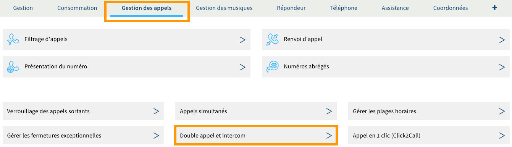
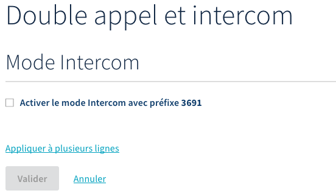

## Objectif

Votre ligne téléphonique vous permet de recevoir et d'émettre des appels. Un mode, que vous pouvez activer dans votre espace client, permet à votre ligne de décrocher automatiquement un appel en haut-parleur lorsque celle-ci est contactée avec un préfixe à quatre chiffres.

**Découvrez comment gérer le mode intercom de votre ligne OVHcloud.**

## Prérequis

- Disposer d'une offre de téléphonie SIP.
- Disposer d'un téléphone ou d'un équipement compatible avec le mode intercom.

<!-- CP-NAV-START:telecom-voip-fax -->
---

### Accès à l'espace client OVHcloud

- **Lien direct :** [VoIP & Fax](/links/control-panel/telecom-voip-fax)
- **Pour accéder à vos services :** `Télécom`{.action} > `VoIP & Fax`{.action} > Sélectionnez votre groupe de téléphonie

---
<!-- CP-NAV-END:telecom-voip-fax -->

{.thumbnail}

## En pratique

### Étape 1 : accéder à la gestion du mode intercom

<!-- CP-STEPS-START:acces-gestion-intercom -->
Dans l'onglet `Gestion des appels`{.action}, cliquez sur `Double appel et Intercom`{.action}.
 
{.thumbnail}
<!-- CP-STEPS-END:acces-gestion-intercom -->

### Étape 2 : gérer le mode intercom

<!-- CP-STEPS-START:gerer-mode-intercom -->
Une fois positionné sur la page « Double appel et Intercom », vous pouvez réaliser deux actions selon l'état d'activation du mode intercom. Cet état est représenté par la case se trouvant à côté de `Activer le mode Intercom avec préfixe 3691`{.action}.

Poursuivez la lecture de cette documentation selon la manipulation que vous souhaitez réaliser.
<!-- CP-STEPS-END:gerer-mode-intercom -->

#### Activer le mode intercom

<!-- CP-STEPS-START:activer-mode-intercom -->
Pour activer le mode intercom, cochez la case `Activer le mode Intercom avec préfixe 3691`{.action}, puis cliquez sur le bouton `Valider`{.action}.

Si vous souhaitez activer ce mode sur plusieurs lignes, cliquez sur `Appliquer à plusieurs lignes`{.action}, choisissez les lignes concernées dans la fenêtre de sélection, puis cliquez sur le bouton `Valider`{.action}.

{.thumbnail}
<!-- CP-STEPS-END:activer-mode-intercom -->

#### Désactiver le mode intercom

<!-- CP-STEPS-START:desactiver-mode-intercom -->
Pour désactiver le mode intercom, décochez la case `Activer le mode Intercom avec préfixe 3691`{.action}, puis cliquez sur le bouton `Valider`{.action}.

Si vous souhaitez désactiver ce mode sur plusieurs lignes, cliquez sur `Appliquer à plusieurs lignes`{.action}, choisissez les lignes concernées dans la fenêtre de sélection, puis cliquez sur le bouton `Valider`{.action}.

{.thumbnail}
<!-- CP-STEPS-END:desactiver-mode-intercom -->

### Étape 3 : utiliser le mode intercom

Une fois le mode intercom activé, communiquez aux correspondants souhaités le numéro permettant de joindre votre ligne en mode intercom. Ce dernier se compose du préfixe que vous avez pu récupérer lors de l'étape précédente, ainsi que du numéro de ligne pour lequel le mode a été activé (par exemple : 36913100000000).

Sachez également que le mode intercom peut également être utilisé si vous souhaitez équiper votre installation d'un portier IP. Pour cela, vous devrez simplement configurer ce dernier pour qu'il appelle en mode intercom votre ligne (par le biais du numéro composé notamment du préfixe). Pour configurer votre propre équipement, consultez sa documentation ou contactez son constructeur.

## Aller plus loin

Échangez avec notre [communauté d'utilisateurs](/links/community).
