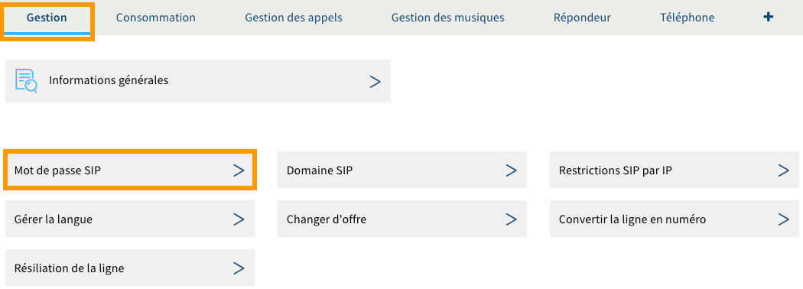
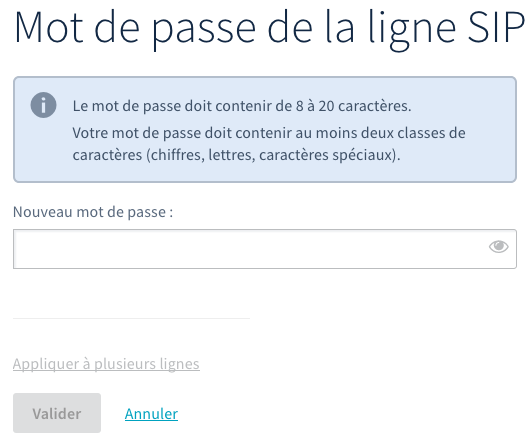

## Objectif

Votre ligne SIP OVHcloud permet d'émettre et de recevoir des appels depuis l'appareil de votre choix via un mot de passe dédié. Si toutefois vous disposez d'un téléphone Plug & Phone OVHcloud avec votre ligne SIP, ce mot de passe est automatiquement configuré sur ce dernier.

**Découvrez comment changer le mot de passe d’une ligne SIP OVHcloud ne disposant pas d'un téléphone Plug & Phone OVHcloud.**

## Prérequis

- Disposer d'une [ligne SIP OVHcloud](/links/telecom/telephonie-voip).

<!-- CP-NAV-START:telecom-voip-fax -->
---

### Accès à l'espace client OVHcloud

- **Lien direct :** [VoIP & Fax](/links/control-panel/telecom-voip-fax)
- **Pour accéder à vos services :** `Télécom`{.action} > `VoIP & Fax`{.action} > Sélectionnez votre groupe de téléphonie

---
<!-- CP-NAV-END:telecom-voip-fax -->

{.thumbnail}

## En pratique

### Étape 1 : accéder à la gestion du mot de passe de la ligne SIP

<!-- CP-STEPS-START:etape-1-mot-de-passe-sip -->
Dans l'onglet `Gestion`{.action}, cliquez sur le bouton `Mot de passe SIP`{.action}.

> [!primary]
>
> Si le bouton « Mot de passe SIP » est grisé, cela vous indique que la modification est impossible pour la ligne SIP que vous avez sélectionnée. Celle-ci dispose en effet d'un téléphone Plug & Phone OVHcloud. Dans ce type de configuration, le mot de passe est automatiquement configuré sur le téléphone Plug & Phone que vous utilisez. 
>

{.thumbnail}
<!-- CP-STEPS-END:etape-1-mot-de-passe-sip -->

### Étape 2 : modifier le mot de passe de la ligne SIP

<!-- CP-STEPS-START:etape-2-modifier-mot-de-passe -->
Dans la fenêtre qui s’affiche, renseignez le nouveau mot de passe souhaité dans la zone de texte en dessous de « Nouveau mot de passe », puis cliquez sur le bouton `Valider`{.action}.

> [!primary]
>
> Pour des raisons de sécurité, nous vous invitons à respecter les conditions indiquées lors du choix du nouveau mot de passe. Nous vous recommandons également :
>
> - de ne pas utiliser deux fois le même mot de passe ;
> - de choisir un mot de passe qui n'a aucun rapport avec vos informations personnelles (évitez les mentions à votre nom, prénom ou date de naissance, par exemple) ;
> - de renouveler régulièrement vos mots de passe ;
> - de ne pas noter sur un papier ou de vous envoyer vos mots de passe sur votre adresse e-mail.
>

{.thumbnail}
<!-- CP-STEPS-END:etape-2-modifier-mot-de-passe -->

### Étape 3 : configurer le nouveau mot de passe

Une fois le mot de passe modifié depuis votre espace client, vous devez le mettre à jour dans les paramètres du logiciel ou de l'appareil utilisant votre ligne SIP OVHcloud. Pour cela, il se peut qu’un message ou une fenêtre apparaisse automatiquement sur votre logiciel ou votre appareil, vous demandant de renseigner le nouveau mot de passe de la ligne SIP. Si tel est le cas, suivez les étapes jusqu'à le modifier.

Dans le cas contraire, nous vous invitons à vous rapprocher de l’éditeur du logiciel ou du constructeur de l'appareil que vous utilisez pour réaliser cette manipulation, celle-ci étant inhérente à ce dernier.

## Aller plus loin

[Tutoriel - Utiliser une ligne SIP OVHcloud sur un softphone](/pages/web_cloud/phone_and_fax/voip/register-sip-softphone)

[En apprendre plus sur la sécurité des mots de passe grâce à l'ANSSI](http://www.ssi.gouv.fr/guide/mot-de-passe/).

Échangez avec notre [communauté d'utilisateurs](/links/community).