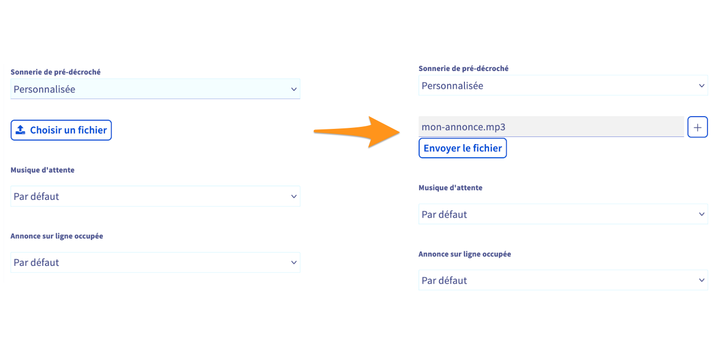

## Objectif

Votre ligne SIP OVHcloud vous permet de recevoir et d’émettre des appels. Afin de personnaliser l'expérience de vos correspondants, vous pouvez modifier les musiques et les sonneries qu'ils entendent lors d'un appel vers votre ligne ou votre numéro.

**Découvrez comment modifier les musiques et les sonneries de votre ligne OVHcloud.**

## Prérequis

- Disposer d'une [ligne téléphonique OVHcloud Entreprise](/links/telecom/telephonie){.external}
- Être en possession de la ou des musiques ou sonneries que vous souhaitez utiliser, au format audio adéquat.
- Être connecté à l'[espace client OVHcloud](/links/manager){.external}, partie `Télécom`{.action} :

{.thumbnail}

## En pratique

### Étape 1 : accéder à la gestion des musiques et sonneries

Connectez-vous à votre [espace client OVHcloud](/links/manager){.external} et rendez-vous dans la section `Télécom`. Cliquez sur `Téléphonie`{.action} puis sélectionnez la ligne concernée parmi celles qui s'affichent.

Positionnez-vous ensuite sur l'onglet `Gestion des musiques`{.action}.

{.thumbnail width="600"}

> [!primary]
>
> La gestion des musiques n'est pas disponible sur les lignes SIP Découverte. L'onglet « Gestion des musiques » est alors grisé.
>

Dans la page qui apparaît, vous avez la possibilité de modifier plusieurs musiques ou sonneries. Chacune d'elles dispose d'un son par défaut :

|Musique/sonnerie|Description|Son par défaut|
|---|---|---|
|Sonnerie de pré-décroché|Ce son est joué avant que l'appel soit décroché.|Tonalité de pré-décroché classique (bip long)|
|Musique d'attente|Ce son est joué lorsque vous mettez un correspondant en attente pendant votre conversation.|Le message suivant est joué : « Votre correspondant vous a mis en attente, veuillez patienter. »|
|Annonce sur ligne occupée|Ce son est joué à un correspondant qui contacte la ligne alors que celle-ci a déjà un appel en cours.|Tonalité d'occupation classique (bip court)|

### Étape 2 : modifier une musique ou une sonnerie

Certaines règles et informations sont à prendre en considération en ce qui concerne le fichier audio que vous souhaitez utiliser en tant que nouvelle sonnerie ou musique :

- **Le fichier audio doit être dans un format compatible** : seuls les formats WAV, MP3, MP4, OGG et WMA sont acceptés par l’outil d’import.
- **Le fichier audio ne doit pas excéder une certaine taille** : la taille maximale est fixée à 10 Mo.
- **Le fichier audio doit être encodé pour une qualité optimale** : nous vous recommandons d'encoder votre fichier en mono, 16 bits, 8 kHz.
- **Vous devez disposer du droit d'utiliser le fichier audio** : si vous n'êtes pas le créateur du fichier, vous avez l'obligation légale de détenir le droit de l'utiliser (sauf s'il est libre de droits).

> [!primary]
> **Création de fichiers audio**
>
> La création des fichiers-sons est à votre charge. OVHcloud ne sera pas en mesure de créer ces fichiers pour vous.
> Vous pouvez faire appel à un [prestataire spécialisé](/links/partner) mais sachez qu'il est également possible de créer des fichiers-sons par vos propres moyens :
> 
> - Soit en laissant un message sur le répondeur de votre ligne OVHcloud puis en le téléchargeant. Plus d'informations sur [notre guide d'utilisation du répondeur](/pages/web_cloud/phone_and_fax/voip/configurer-consulter-repondeur-ligne-ovh).
> - Soit via le logiciel open source et gratuit [Audacity](https://www.audacityteam.org/){.external}.
>

Une fois que vous êtes prêt, en dessous de la musique ou de la sonnerie que vous voulez modifier, choisissez `Personnalisée` dans le menu déroulant puis cliquez sur le bouton `Choisir un fichier`{.action}. Dans la fenêtre qui s'ouvre, retrouvez le fichier audio que vous souhaitez utiliser. Une fois sélectionné, cliquez sur le bouton `Envoyer le fichier`{.action}.

{.thumbnail width="600"}

## Aller plus loin

[Configurer et consulter le répondeur de sa ligne](/pages/web_cloud/phone_and_fax/voip/configurer-consulter-repondeur-ligne-ovh)

[Configurer des plages horaires et des fermetures exceptionnelles sur une ligne](/pages/web_cloud/phone_and_fax/voip/configure-time-slot-and-closing-time)

Échangez avec notre [communauté d'utilisateurs](/links/community).
