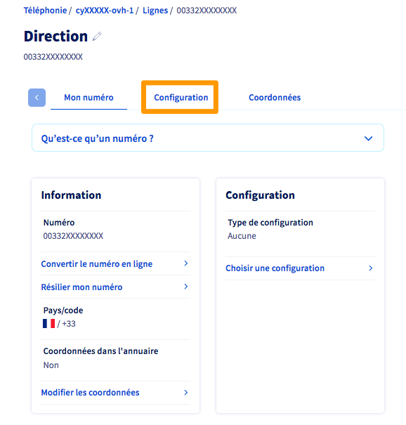
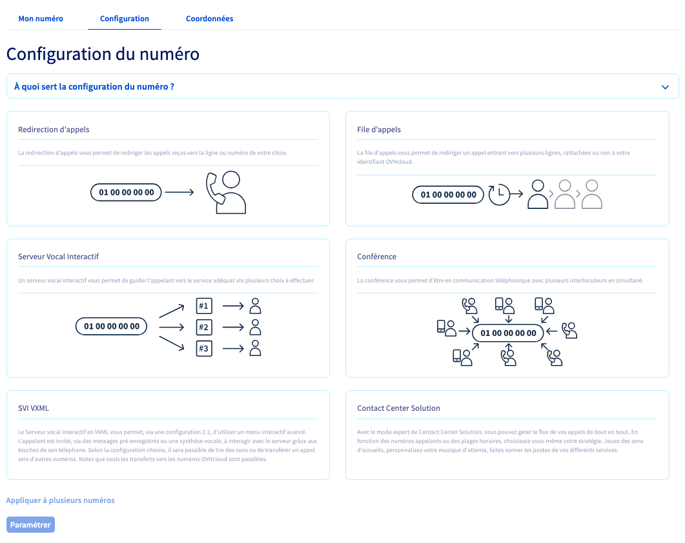
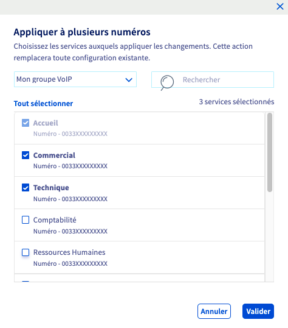

## Objectif

Lorsque vous disposez d'un numéro alias chez OVHcloud, qu'il soit nouvellement commandé ou porté, il est nécessaire de le configurer pour l'utiliser. Plusieurs types de configurations existent, vous permettant de répondre au mieux à vos besoins.

**Découvrez comment choisir et appliquer une configuration sur votre numéro.**

> [!primary]
>
> Pour obtenir plus de détails sur la différence entre un **numéro alias** et une **ligne SIP**, consultez notre [FAQ](/pages/web_cloud/phone_and_fax/voip/faq-voip#ligne-ou-numero).
>

## Prérequis

- Disposer d'un [numéro alias fourni par OVHcloud](/links/telecom/telephonie-numeros) ou d'un [numéro porté](/pages/web_cloud/phone_and_fax/voip/demander_la_portabilite_de_mon_numero) depuis un autre opérateur.

<!-- CP-NAV-START:telecom-voip-fax -->
---

### Accès à l'espace client OVHcloud

- **Lien direct :** [VoIP & Fax](/links/control-panel/telecom-voip-fax)
- **Pour accéder à vos services :** `Télécom`{.action} > `VoIP & Fax`{.action} > Sélectionnez votre groupe de téléphonie

---
<!-- CP-NAV-END:telecom-voip-fax -->

{.thumbnail}

## En pratique

### Étape 1 : Accéder à la gestion de votre numéro

<!-- CP-STEPS-START:acces-gestion-numero -->
Dès lors, deux possibilités existent selon le numéro concerné :

- **le numéro n'a aucune configuration** : cliquez sur l'onglet `Configuration`{.action}, puis suivez les instructions ci-dessous ;
- **le numéro possède déjà une configuration** : cliquez sur l'onglet `Configuration`{.action}, puis sur `Changer de configuration`{.action}. Suivez ensuite les instructions ci-dessous.

{.thumbnail}
<!-- CP-STEPS-END:acces-gestion-numero -->

### Étape 2 : Définir la configuration la plus adaptée à votre besoin

<!-- CP-STEPS-START:choisir-configuration -->
Dans la nouvelle fenêtre qui apparaît, plusieurs configurations sont possibles.

{.thumbnail}
<!-- CP-STEPS-END:choisir-configuration -->

Vous trouverez ci-dessous un récapitulatif des différentes configurations. Poursuivez vers celle(s) que vous souhaitez consulter.

- [Redirection d'appels](#redirection)
- [File d'appels](#file-d-appels)
- [Serveur Vocal Interactif](#svi)
- [Conférence](#conference)
- [SVI VXML](#svi-vxml)
- [Contact Center Solution](#ccs)

#### 2.1 Redirection d'appels 

La redirection permet de rediriger les appels reçus sur un numéro OVHcloud vers une seule ligne SIP OVHcloud.

Reportez-vous aux instructions décrites dans notre documentation « [Configurer une redirection d’appels](/pages/web_cloud/phone_and_fax/voip/redirection_avec_presentation) » si vous désirez en apprendre plus.

#### 2.2 File d'appels 

La file d'appels vous permet de gérer le flux de vos appels entrants. Elle vous permet de créer une file d'attente, avant de mettre en relation avec vos collaborateurs les interlocuteurs qui vous contactent. Cette solution s’adapte à vos besoins et à votre propre organisation en fonction de ce que vous souhaitez paramétrer.

Reportez-vous aux instructions décrites dans notre documentation « [Configurer une file d’appels](/pages/web_cloud/phone_and_fax/voip/les_files_d_appels) » si vous désirez en apprendre plus.

#### 2.3 Conférence 

La conférence permet à toutes les personnes composant un numéro donné d’être en communication simultanément. Différentes fonctionnalités sont alors disponibles : protéger la conférence par un code, définir une annonce personnalisée, enregistrer les participants et recevoir un rapport par e-mail à la fin de celle-ci. Une interface spécifique vous propose également de suivre en temps réel les discussions des participants, mais aussi de gérer leur audio et leur micro.

Reportez-vous aux instructions décrites dans notre documentation « [Créer et gérer des conférences téléphoniques](/pages/web_cloud/phone_and_fax/voip/conference) » si vous désirez en apprendre plus.

#### 2.4 Serveur Vocal Interactif 

Le Serveur Vocal Interactif (SVI) vous propose une interface simple pour créer un menu interactif. L’appelant est invité, via des messages pré-enregistrés, à interagir avec le serveur grâce aux touches de son téléphone. Selon la configuration, il est alors possible de transférer votre interlocuteur vers un autre numéro, de le renvoyer vers une messagerie OVHcloud, de raccrocher ou de lire des sons.

Consultez notre guide « [Configurer un Serveur Vocal Interactif (SVI)](/pages/web_cloud/phone_and_fax/voip/svi_serveur_vocal_interactif) » si vous désirez en apprendre plus.

#### 2.5 SVI VXML 

Le Serveur Vocal Interactif en VXML permet, via une configuration VXML 2.1, d’utiliser un menu interactif avancé. L’appelant est invité, par des messages pré-enregistrés ou de la synthèse vocale, à interagir avec le serveur grâce aux touches de son téléphone. Selon la configuration choisie, il sera alors possible de lire des sons ou de transférer l'appelant vers d’autres numéros. Veuillez noter que seuls les transferts vers les numéros OVHcloud sont possibles.

#### 2.6 Contact Center Solution 

Le Contact Center Solution (ou CCS) est une évolution de la file d'appels. Il permet de gérer les flux d'appels entrants et sortants et d'en obtenir des statistiques détaillées. Étape par étape, vous pouvez définir votre stratégie afin de décrocher les appels comme bon vous semble.

Via une interface unique, vous avez la possibilité de gérer une file d'appels, de définir des services (par exemple : service commercial, technique, production, etc.), de personnaliser vos sons (musique d'attente, musique de prédécroché), mais aussi de mettre en place une supervision de l’ensemble de vos postes téléphoniques.

Des options supplémentaires sont également disponibles telles que l'enregistrement des appels entrants.

Consultez notre guide « [Configurer un Contact Center Solution](/pages/web_cloud/phone_and_fax/voip/contact-center-solution) » si vous désirez en apprendre plus.

### Étape 3 : Appliquer la configuration souhaitée

<!-- CP-STEPS-START:appliquer-configuration -->
Une fois votre choix effectué, sélectionnez la configuration que vous souhaitez appliquer à votre numéro, puis cliquez sur le bouton `Paramétrer`{.action}.

Patientez quelques instants afin que le changement soit pris en compte.

> [!primary]
>
> Pour appliquer le même type de configuration à plusieurs numéros, cliquez sur `Appliquer à plusieurs numéros`{.action}, sélectionnez les numéros concernés puis cliquez sur `Valider`{.action}.
> 
> {.thumbnail}
>
> Cliquez sur le bouton `Paramétrer`{.action} et patientez quelques instants pendant l’application du paramétrage.
>
> Si vous appliquez le même type de configuration à plusieurs numéros, vous devrez finaliser la configuration sur chacun des numéros concernés.
<!-- CP-STEPS-END:appliquer-configuration -->

## Aller plus loin

Échangez avec notre [communauté d'utilisateurs](/links/community).
