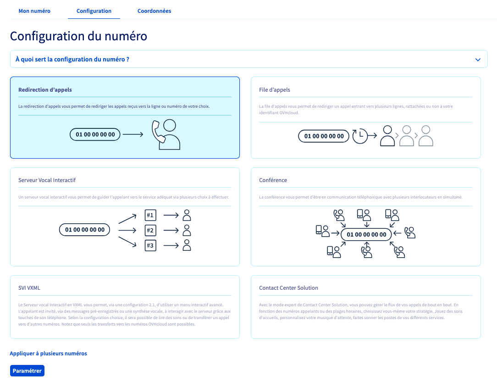
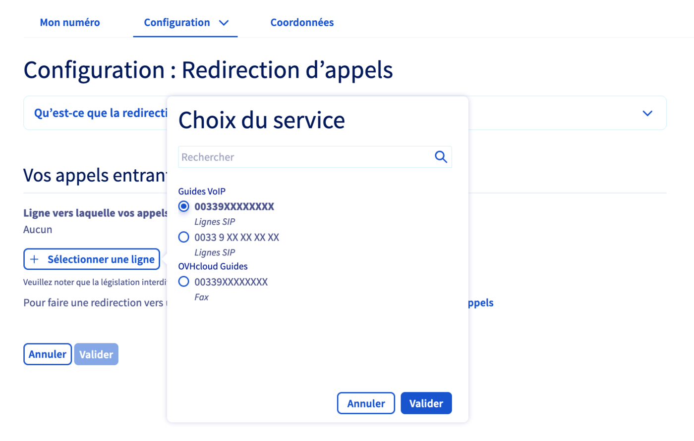
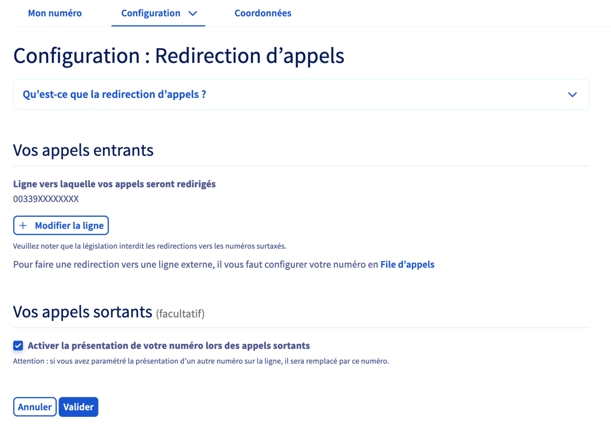

## Objectif

La redirection permet de rediriger vers une ligne SIP OVHcloud les appels reçus sur un numéro alias OVHcloud. 
Cette configuration permet notamment la réception d'appels sur votre numéro principal.

**Découvrez comment configurer une redirection d'appels sur votre numéro OVHcloud.**

> [!primary]
>
> Pour obtenir plus de détails sur la différence entre un **numéro alias** et une **ligne SIP**, consultez notre [FAQ](/pages/web_cloud/phone_and_fax/voip/faq-voip#ligne-ou-numero).
>

## Prérequis

- Disposer d'un [numéro alias fourni par OVHcloud](/links/telecom/telephonie-numeros) ou d'un [numéro porté](/pages/web_cloud/phone_and_fax/voip/demander_la_portabilite_de_mon_numero) depuis un autre opérateur.
- Disposer d'[une ligne SIP OVHcloud](/links/telecom/telephonie-voip).

## En pratique

<!-- CP-NAV-START:telecom-voip-fax -->
---

### Accès à l'espace client OVHcloud

- **Lien direct :** [VoIP & Fax](/links/control-panel/telecom-voip-fax)
- **Pour accéder à vos services :** `Télécom`{.action} > `VoIP & Fax`{.action} > Sélectionnez votre groupe de téléphonie

---
<!-- CP-NAV-END:telecom-voip-fax -->

{.thumbnail}

### Étape 1 : Appliquer la configuration « Redirection d'appels »

<!-- CP-STEPS-START:etape-1-appliquer-configuration-redirection -->
- Si votre numéro n'est actuellement pas configuré, cliquez sur l'onglet `Configuration`{.action}, sélectionnez `Redirection d'appels`{.action} puis cliquez sur `Paramétrer`{.action}.

- Si votre numéro a déjà une configuration en place, cliquez sur l'onglet `Configuration`{.action} puis sur `Changer de configuration`{.action}. Sélectionnez ensuite `Redirection d'appels`{.action} et cliquez sur `Paramétrer`{.action}. Vous devrez alors confirmer la perte de la configuration actuellement en place.

{.thumbnail}

> [!primary]
>
> Pour appliquer le même type de configuration à plusieurs numéros, cliquez sur `Appliquer à plusieurs numéros`{.action}, sélectionnez les numéros concernés puis cliquez sur `Valider`{.action}.
> 
> {.thumbnail}
>
> Cliquez sur le bouton `Paramétrer`{.action} et patientez quelques instants pendant l’application du paramétrage.
<!-- CP-STEPS-END:etape-1-appliquer-configuration-redirection -->

### Étape 2 : Paramétrer la redirection d’appels

<!-- CP-STEPS-START:etape-2-parametrer-redirection -->
Dans la partie « **Vos appels entrants** », cliquez d'abord sur le bouton `+ Sélectionner une ligne`{.action}. 
Choisissez alors, parmi les lignes affichées, celle vers laquelle vous souhaitez rediriger les appels reçus sur votre numéro. Cliquez ensuite sur le bouton `Valider`{.action} pour confirmer votre sélection.

{.thumbnail}

La ligne sélectionnée apparaît alors sous la mention « Ligne vers laquelle vos appels seront redirigés ».

Choisissez ensuite, dans la partie « **Vos appels sortants** », si vous souhaitez activer ou non la présentation de votre numéro lors d'un appel sortant.

Vous pouvez ainsi, lorsque vous émettez un appel depuis votre ligne SIP OVHcloud, présenter votre numéro alias (et non plus la ligne OVHcloud) sur les téléphones de vos destinataires.

Si vous souhaitez activer cette fonctionnalité, cochez la case située à côté de « Activer la présentation de votre numéro lors des appels sortants ».

{.thumbnail}

Une fois vos choix effectués, cliquez sur `Valider`{.action} afin d'appliquer la configuration. 
Patientez quelques instants afin que celle-ci soit prise en compte.

> [!primary]
>
> Si vous avez appliqué le même type de configuration à plusieurs numéros, vous devrez finaliser la configuration sur chacun des numéros concernés.
<!-- CP-STEPS-END:etape-2-parametrer-redirection -->

## Aller plus loin

Échangez avec notre [communauté d'utilisateurs](/links/community).
