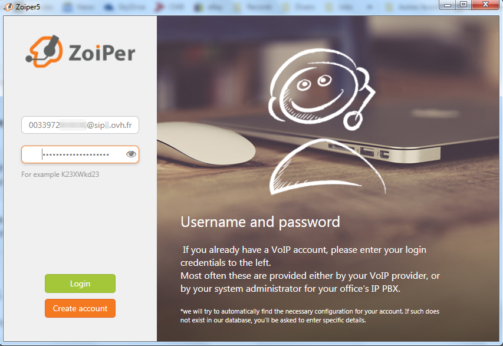
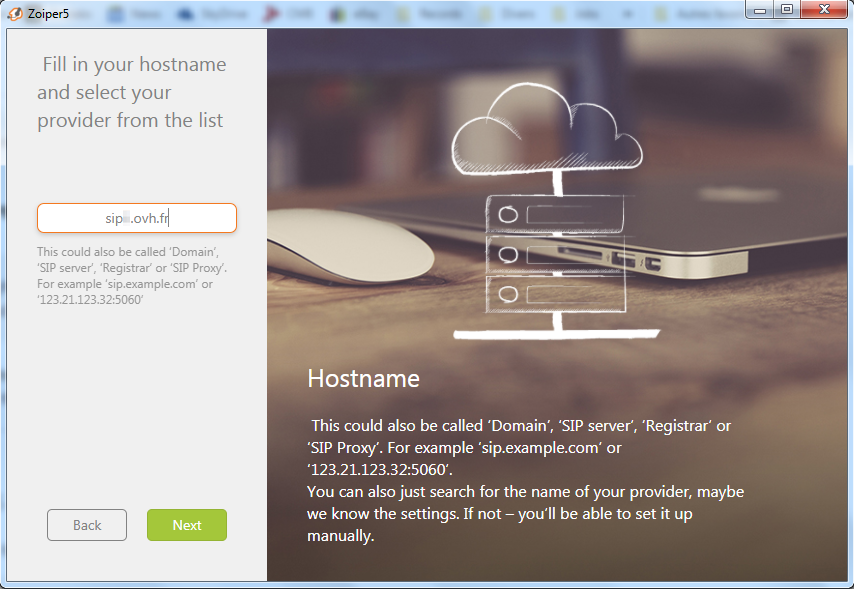
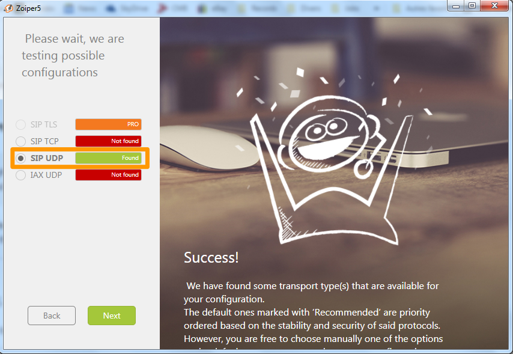

## Objectif

Le logiciel [Zoiper](https://www.zoiper.com/){.external} est un softphone (logiciel de téléphonie) gratuit permettant d'enregistrer une ligne SIP fixe OVHcloud afin d'émettre et recevoir des appels via cette ligne, depuis un ordinateur ou un smartphone.

**Découvrez comment enregistrer votre ligne SIP OVHcloud sur Zoiper**

> [!warning]
>
> OVHcloud met à votre disposition des services dont la configuration, la gestion et la responsabilité vous incombent. Il vous revient de ce fait d'en assurer le bon fonctionnement.
> 
> Nous mettons à votre disposition ce tutoriel afin de vous accompagner au mieux sur des tâches courantes. Néanmoins, nous vous recommandons de faire appel à un [prestataire spécialisé](https://partner.ovhcloud.com/fr/) et/ou de contacter l'éditeur du service si vous éprouvez des difficultés. En effet, nous ne serons pas en mesure de vous fournir une assistance. Plus d'informations dans la section « Aller plus loin » de ce guide.
> 

## Prérequis

- Disposer d'une [ligne SIP OVHcloud](https://www.ovhtelecom.fr/telephonie/voip/){.external}
- [Disposer des identifiants de votre ligne SIP OVHcloud](/pages/web_cloud/phone_and_fax/voip/register-sip-softphone)
- Disposer du logiciel [Zoiper](https://www.zoiper.com/en/voip-softphone/download/current){.external} sur un smartphone ou un ordinateur

## En pratique

Ce tutoriel décrit la méthode pour enregistrer votre ligne sur la version Windows de Zoiper5. 
 La méthode d'enregistrement est similaire sur les autres systèmes d'exploitation.

### Enregistrer votre ligne SIP

Une fois Zoiper ouvert, vous devez renseigner deux champs.

Le premier champ doit être renseigné avec votre **Login/Username** et votre **domain** OVHcloud sous la forme `username@domain`. 
Par exemple : `0033912345678@sip5.ovh.fr`.

Renseignez votre **mot de passe SIP** dans le deuxième champ puis cliquez sur `Créer un compte`{.action}.

{.thumbnail}

Dans la fenêtre suivante, renseignez à nouveau votre **domain** OVHcloud et cliquez sur `Suivant`{.action}.

{.thumbnail}

L'assistant de configuration Zoiper vous propose alors de saisir un nom d'utilisateur d'authentification ou un proxy sortant. Ces informations n'étant pas nécessaires pour l'enregistrement d'une ligne SIP OVHcloud, cliquez sur le bouton `Passer`{.action}.

{.thumbnail}

Le logiciel testera ensuite les protocoles de transport possibles. Les lignes SIP OVHcloud utilisant uniquement le protocole UDP, veillez à ce qu'il soit sélectionné puis sélectionnez `Terminer`{.action}.

{.thumbnail}

Un message de succès de l'enregistrement de la ligne est alors présenté.

{.thumbnail}

Vous pouvez dès lors être joint et composer des appels depuis votre ligne SIP OVHcloud.

{.thumbnail}

### Dépannage

Si l'enregistrement a échoué, vérifiez que vous avez bien saisi les identifiants SIP OVHcloud, notamment le mot de passe SIP. En cas d'échecs répétés, [modifiez votre mot de passe SIP depuis l'espace client OVHcloud](/pages/web_cloud/phone_and_fax/voip/modifier-mot-de-passe-ligne-sip) et refaites un essai d'enregistrement avec un nouveau mot de passe SIP.

Vérifiez également que l'adresse IP depuis laquelle vous utilisez Zoiper fait partie des adresses IP autorisées à utiliser votre ligne SIP. Pour plus de détails, consultez le guide [Restreindre sa ligne SIP OVHcloud par IP](/pages/web_cloud/phone_and_fax/voip/secure-sip-line-ovh).

Vous pouvez aussi tester l'enregistrement de votre ligne [sur un autre softphone](/pages/web_cloud/phone_and_fax/voip/register-sip-softphone-linphone).

## Aller plus loin

[Utiliser une ligne SIP OVHcloud sur un softphone](/pages/web_cloud/phone_and_fax/voip/register-sip-softphone)

[Utiliser une ligne SIP OVHcloud sur Linphone](/pages/web_cloud/phone_and_fax/voip/register-sip-softphone-linphone)

Échangez avec notre communauté d'utilisateurs sur <https://community.ovh.com>.
