

## Objectif

Le logiciel [Zoiper](https://www.zoiper.com/){.external} est un softphone (logiciel de téléphonie) gratuit permettant d'enregistrer une ligne SIP fixe OVHcloud afin d'émettre et recevoir des appels via cette ligne, depuis un ordinateur ou un smartphone.

**Découvrez comment enregistrer votre ligne SIP OVHcloud sur Zoiper**

> [!warning]
>
> OVHcloud met à votre disposition des services dont la configuration, la gestion et la responsabilité vous incombent. Il vous revient de ce fait d'en assurer le bon fonctionnement.
> 
> Nous mettons à votre disposition ce tutoriel afin de vous accompagner au mieux sur des tâches courantes. Néanmoins, nous vous recommandons de faire appel à un [prestataire spécialisé](/links/partner) et/ou de contacter l'éditeur du service si vous éprouvez des difficultés. En effet, nous ne serons pas en mesure de vous fournir une assistance. Plus d'informations dans la section « Aller plus loin » de ce guide.
> 

## Prérequis

- Disposer d'une [ligne SIP OVHcloud](/links/telecom/telephonie-voip){.external}
- [Disposer des identifiants de votre ligne SIP OVHcloud](/pages/web_cloud/phone_and_fax/voip/register-sip-softphone)
- Disposer du logiciel [Zoiper](https://www.zoiper.com/en/voip-softphone/download/current){.external} sur un smartphone ou un ordinateur

## En pratique

Ce tutoriel décrit la méthode pour enregistrer votre ligne sur la version gratuite de Zoiper5 pour Windows, macOS et Android, via l'assistant de configuration.

La version gratuite de Zoiper pour iOS, appelée *Zoiper Lite*, ne propose pas d'assistant de configuration. Retrouvez la méthode de configuration manuelle pour Zoiper Lite sur iOS [en bas de ce guide](#ios-manual-installation)

### Windows - macOS - Android

Une fois Zoiper ouvert, vous devez renseigner deux champs.

- Le premier champ doit être renseigné avec votre **Login/Username** et votre **domain** OVHcloud sous la forme `username@domain`. Par exemple : `0033912345678@sip5.ovh.fr`.
- Renseignez votre **mot de passe SIP** dans le deuxième champ.

**Cliquez sur l'onglet correspondant à votre plateforme :**

> [!tabs]
> Windows
>> Une fois les deux champs complétés, cliquez sur `Login`{.action}.  
>> {.thumbnail}
>>
> macOS
>> Une fois les deux champs complétés, cliquez sur `Login`{.action}.  
>> 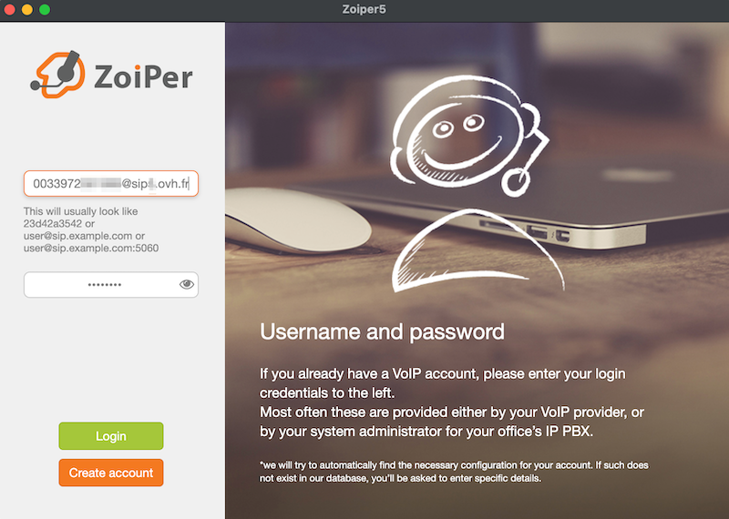{.thumbnail}
>>
> Android
>> Une fois les deux champs complétés, cliquez sur `Créer un compte`{.action}.  
>> 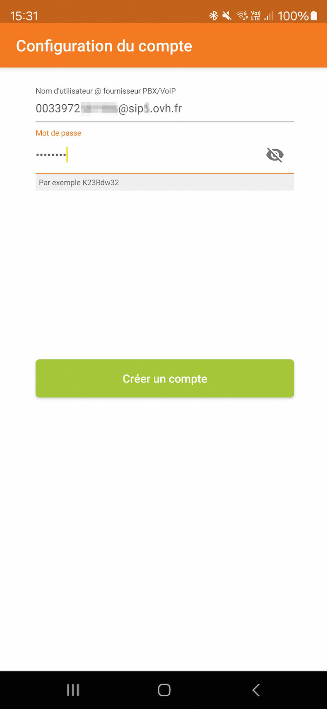{.thumbnail height="500"}
>>

Dans la fenêtre suivante, renseignez à nouveau votre **domain** OVHcloud et cliquez sur `Suivant`{.action}.

> [!tabs]
> Windows
>> {.thumbnail}
>>
> macOS
>> 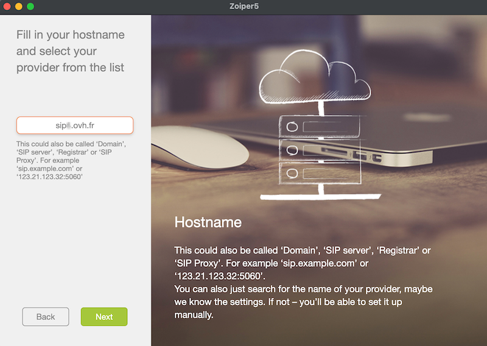{.thumbnail}
>>
> Android
>> 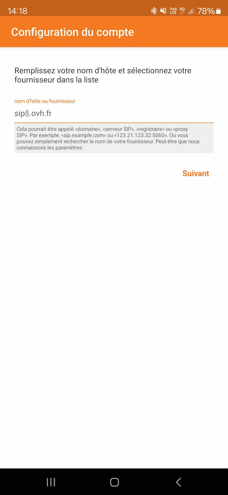{.thumbnail height="500"}

L'assistant de configuration Zoiper vous propose alors de saisir un nom d'utilisateur d'authentification ou un proxy sortant. Ces informations n'étant pas nécessaires pour l'enregistrement d'une ligne SIP OVHcloud, cliquez sur le bouton `Passer`{.action}.

> [!tabs]
> Windows
>> {.thumbnail}
>>
> macOS
>> 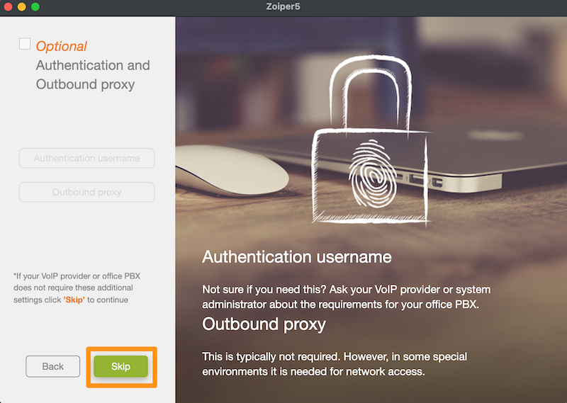{.thumbnail}
>>
> Android
>> 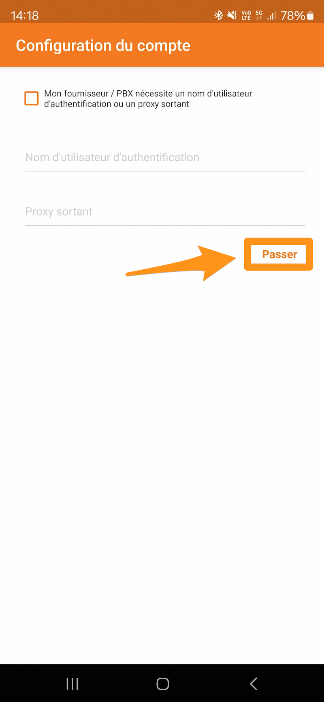{.thumbnail height="500"}

Le logiciel testera ensuite les protocoles de transport possibles. Les lignes SIP OVHcloud utilisant uniquement le protocole UDP, veillez à ce qu'il soit sélectionné.

Sélectionnez ensuite `Suivant`{.action} ou `Terminer`{.action}.

> [!tabs]
> Windows
>> {.thumbnail}
>>
> macOS
>> 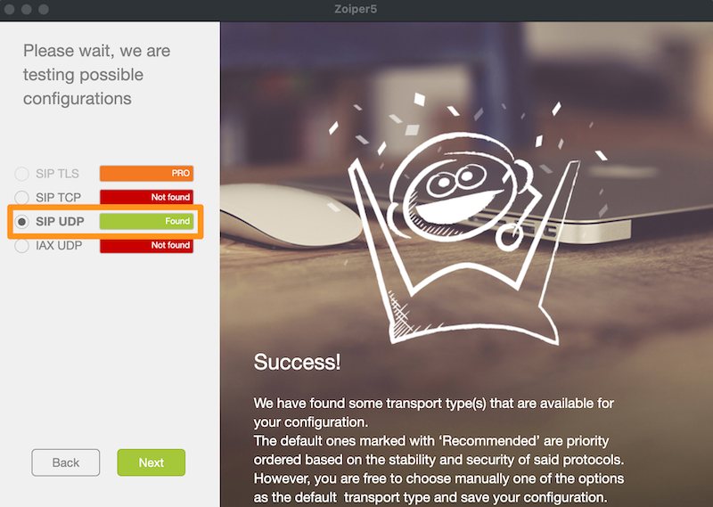{.thumbnail}
>>
> Android
>> 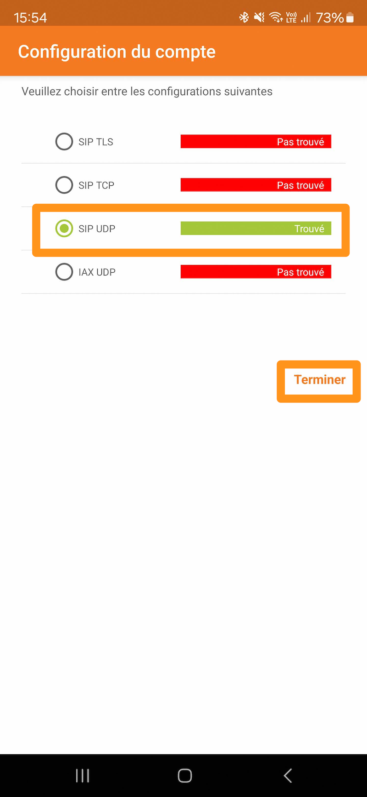{.thumbnail height="500"}

Un message de succès de l'enregistrement de la ligne est alors présenté. Si ce n'est pas le cas, consultez la section « [Dépannage](#depannage) » de ce guide.

{.thumbnail}

Vous pouvez dès lors être joint et composer des appels depuis votre ligne SIP OVHcloud.

{.thumbnail}

### iOS - Installation manuelle 

> [!primary]
>
> Sur iOS, la version gratuite de Zoiper est intitulée *Zoiper Lite* et ne propose pas d'assistant de configuration de ligne.
> Les étapes ci-dessous décrivent comment configurer manuellement une ligne SIP OVHcloud dans Zoiper Lite pour iOS.

/// details | Cliquez sur ce lien pour la procédure d'installation de Zoiper Lite sur iOS

Une fois Zoiper Lite installé, sélectionnez `Réglages`{.action} en bas à droite.

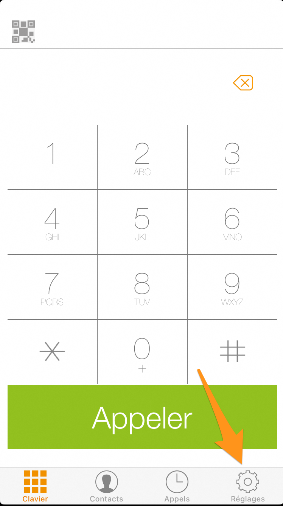{.thumbnail height="500"}

Sélectionnez `Comptes`{.action}.

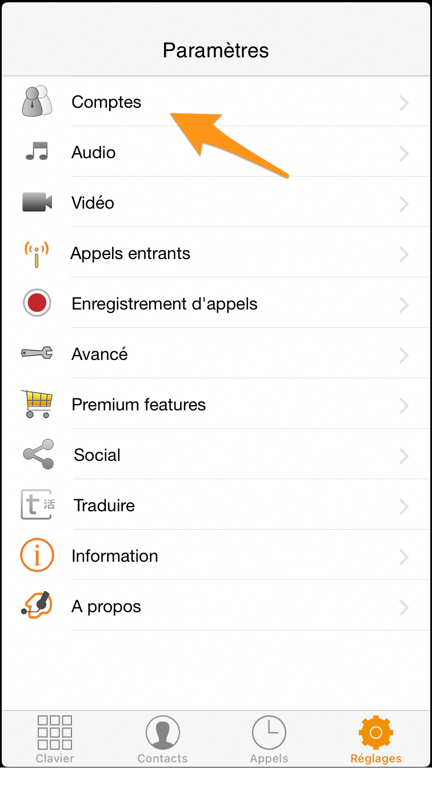{.thumbnail height="500"}

Sélectionnez le bouton `+`{.action} pour ajouter un nouveau compte SIP.

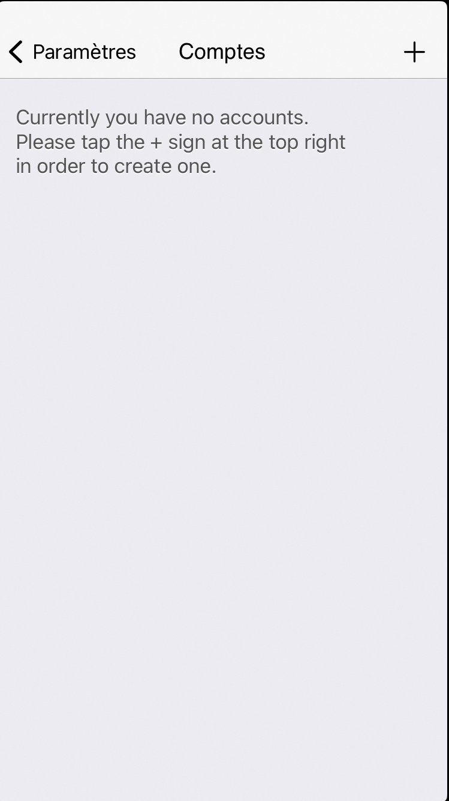{.thumbnail height="500"}

Répondez `Oui`{.action} à la question « Avez-vous déjà un compte ? ».

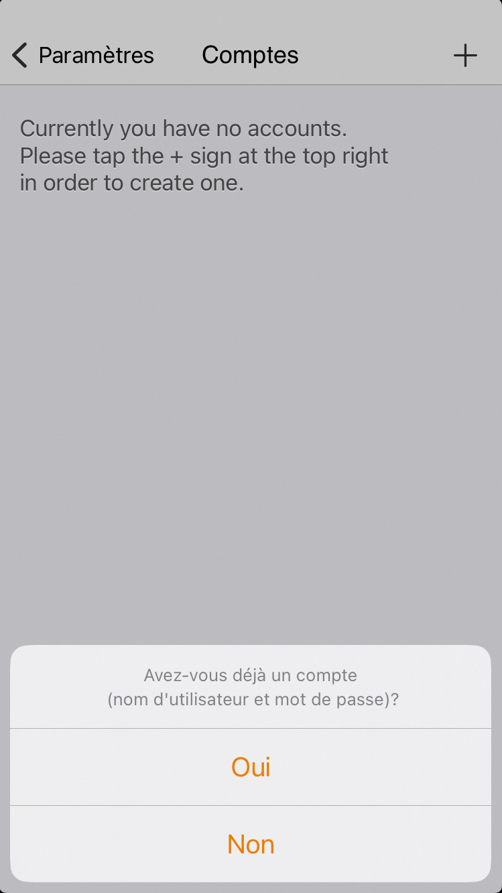{.thumbnail height="500"}

Sélectionnez `Compte SIP`{.action}.

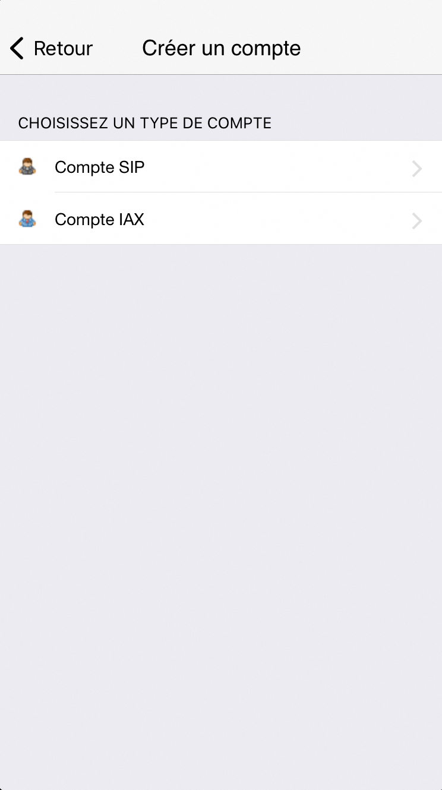{.thumbnail height="500"}

Vous avez alors accès à la configuration du compte SIP. Complétez les champs suivants :

- `Nom du compte`{.action} : définissez un nom pour votre compte.
- `Domaine`{.action} : renseignez le domaine de votre ligne SIP. Si vous ne le connaissez pas, consultez le guide « [Tutoriel - Utiliser une ligne SIP OVHcloud sur un softphone](/pages/web_cloud/phone_and_fax/voip/register-sip-softphone) ».
- `Numéro`{.action} : renseignez le numéro de votre ligne SIP au format `0033912345678`.
- `Mot de passe`{.action} : renseignez le mot de passe de votre ligne SIP. Si vous ne connaissez plus votre mot de passe SIP, consultez notre guide pour [modifier le mot de passe d'une ligne SIP](/pages/web_cloud/phone_and_fax/voip/modifier-mot-de-passe-ligne-sip).

Appuyez ensuite sur le bouton vert `S'enregistrer`{.action} situé **au-dessus** des champs complétés.

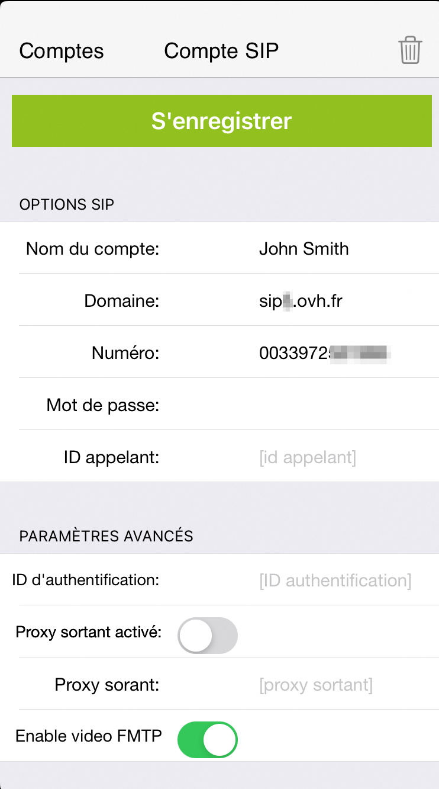{.thumbnail height="500"}

Si les informations d'identification de la ligne sont correctes, le message `État de l'enregistrement: OK` s'affichera alors. Revenez alors au menu principal de l'application Zoiper pour utiliser votre ligne SIP.

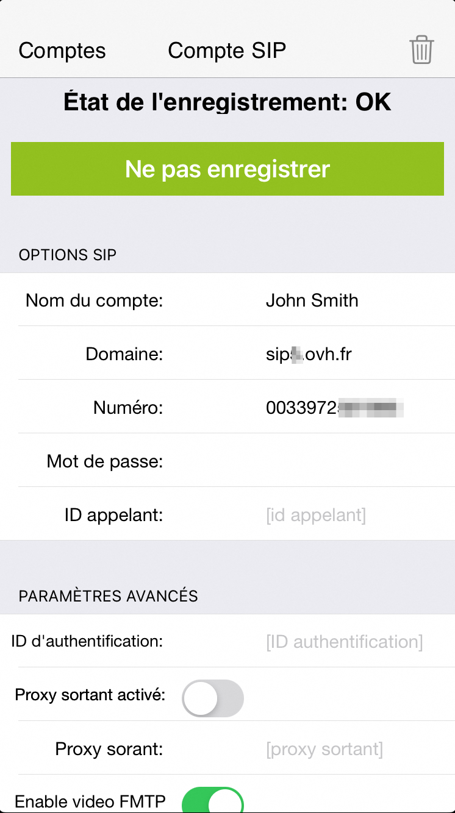{.thumbnail height="500"}

///

### Dépannage 

Si l'enregistrement de votre ligne a échoué, vérifiez que vous avez bien saisi les identifiants SIP OVHcloud, notamment le mot de passe SIP. 
En cas d'échecs répétés, [modifiez votre mot de passe SIP depuis l'espace client OVHcloud](/pages/web_cloud/phone_and_fax/voip/modifier-mot-de-passe-ligne-sip) et refaites un essai d'enregistrement avec un nouveau mot de passe SIP.

Vérifiez également que l'adresse IP depuis laquelle vous utilisez Zoiper fait partie des adresses IP autorisées à utiliser votre ligne SIP. 
Pour plus de détails, consultez le guide [Restreindre sa ligne SIP OVHcloud par IP](/pages/web_cloud/phone_and_fax/voip/secure-sip-line-ovh).

Vous pouvez aussi tester l'enregistrement de votre ligne sur [un autre softphone](/pages/web_cloud/phone_and_fax/voip/register-sip-softphone-linphone).

## Aller plus loin

[Utiliser une ligne SIP OVHcloud sur un softphone](/pages/web_cloud/phone_and_fax/voip/register-sip-softphone)

[Utiliser une ligne SIP OVHcloud sur Linphone](/pages/web_cloud/phone_and_fax/voip/register-sip-softphone-linphone)

Échangez avec notre [communauté d'utilisateurs](/links/community).
