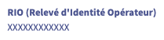
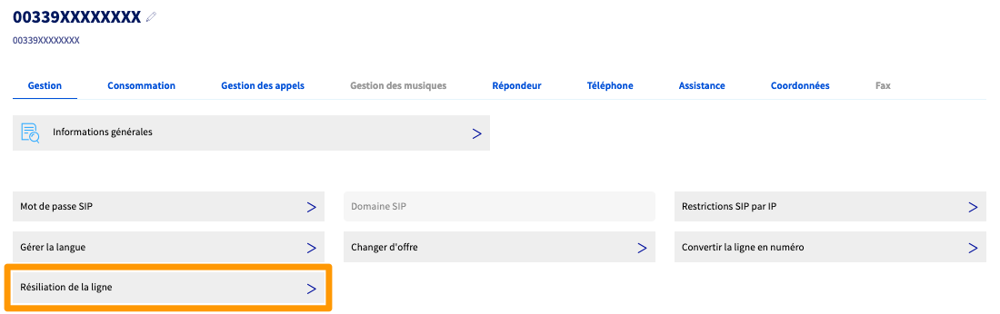
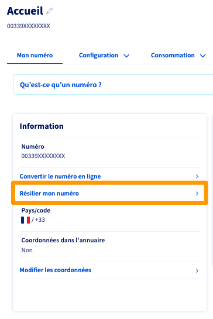
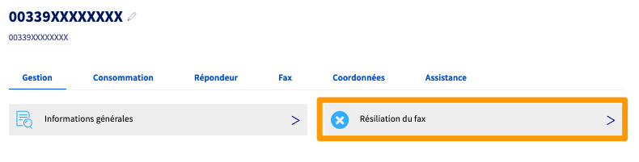

## Objectif

Ce guide décrit comment résilier une ligne Fax ou un service VoIP OVHcloud, que ce soit une ligne SIP, Trunk SIP ou un numéro alias.

**Découvrez comment résilier un service VoIP ou une ligne Fax depuis l'espace client OVHcloud.**

## Prérequis

- Disposer de [services VoIP OVHcloud](/links/telecom/telephonie-voip).

<!-- CP-NAV-START:telecom-voip-fax -->
---

### Accès à l'espace client OVHcloud

- **Lien direct :** [VoIP & Fax](/links/control-panel/telecom-voip-fax)
- **Pour accéder à vos services :** `Télécom`{.action} > `VoIP & Fax`{.action} > Sélectionnez votre groupe de téléphonie

---
<!-- CP-NAV-END:telecom-voip-fax -->

## En pratique

Retrouvez dans ce guide les explications pour résilier unitairement un service VoIP ou une ligne Fax OVHcloud.

> [!primary]
> Si vous souhaitez résilier l'ensemble des services d'un groupe de téléphonie, vous pouvez supprimer ce groupe, ce qui entraînera la résiliation de tous les services qu'il contient.
>
> Retrouvez les informations correspondantes dans notre guide « [Gérer vos groupes de téléphonie](/pages/web_cloud/phone_and_fax/voip/regrouper_services_telephonie) ».

<!-- CP-STEPS-START:acces-service-resilier -->
Cliquez sur l'onglet `Services`{.action} puis sur sur la ligne ou le numéro concerné (vous pouvez rechercher le service dans le champ prévu à cet effet).
<!-- CP-STEPS-END:acces-service-resilier -->

En fonction de votre service, référez-vous à la partie correspondante.

### Cas particulier : portabilité sortante

<!-- CP-STEPS-START:portabilite-sortante-rio -->
La portabilité d'un numéro OVHcloud vers un autre opérateur entraîne sa résiliation technique et commerciale chez OVHcloud à la date effective de la portabilité.

Tout numéro associé à un service VoIP ou à une ligne Fax est portable grâce à son **RIO** (**R**elevé d'**I**dentité **O**pérateur).

Récupérez le RIO d'un service VoIP ou Fax depuis les informations générales du service dans votre espace client OVHcloud.

{.thumbnail}

> [!success]
>
> Autres méthodes pour obtenir le RIO :
>
> - Depuis la ligne SIP concernée : composez le **3179**.
> - Depuis une autre ligne : composez le **0805 69 3179**, puis renseignez le numéro OVHcloud concerné.
>
> Le RIO sera envoyé par e-mail au contact détenteur du service.
<!-- CP-STEPS-END:portabilite-sortante-rio -->

### Résilier une ligne SIP / Trunk

<!-- CP-STEPS-START:resilier-sip-trunk -->
Pour résilier une ligne **SIP** ou **Trunk** OVHcloud, sélectionnez-la dans votre espace client OVHcloud puis, depuis l'onglet `Gestion`{.action}, cliquez sur `Résiliation de la ligne`{.action}.

{.thumbnail}

Prenez connaissance des informations fournies, précisez la raison de votre résiliation puis confirmez-la en cliquant sur `Résilier`{.action}.

Toute demande de résiliation sera prise en compte lors de votre prochaine facturation. Jusqu'à cette date, l'annulation d'une résiliation restera possible.

> [!warning]
> 
> Si un téléphone Plug And Phone est attaché à cette ligne, ce dernier ne fonctionnera plus et nous vous proposerons un [retour de matériel (RMA)](/pages/web_cloud/phone_and_fax/voip/deroulement_d_un_rma).
>
<!-- CP-STEPS-END:resilier-sip-trunk -->

### Résilier un numéro alias

<!-- CP-STEPS-START:resilier-numero-alias -->
Pour résilier un numéro alias, sélectionnez-le dans votre espace client OVHcloud puis, depuis l'onglet `Mon numéro`{.action}, cliquez sur `Résilier mon numéro`{.action}.

{.thumbnail}

Prenez connaissance des informations fournies, précisez la raison de votre résiliation puis confirmez-la en cliquant sur `Résilier`{.action}.

Toute demande de résiliation sera prise en compte lors de votre prochaine facturation. Jusqu'à cette date, l'annulation d'une résiliation restera possible.

> [!warning]
> 
> Si le numéro fait partie d'un pool de numéros, sa résiliation entraînera la résiliation de l'ensemble du pool.
>
<!-- CP-STEPS-END:resilier-numero-alias -->

### Résilier une ligne Fax

<!-- CP-STEPS-START:resilier-fax -->
Pour résilier une ligne Fax OVHcloud, sélectionnez-la dans votre espace client OVHcloud puis, depuis l'onglet `Gestion`{.action}, cliquez sur `Résiliation du fax`{.action}.

{.thumbnail}

Prenez connaissance des informations fournies, précisez la raison de votre résiliation puis confirmez-la en cliquant sur `Résilier`{.action}.

Toute demande de résiliation sera prise en compte lors de votre prochaine facturation. Jusqu'à cette date, l'annulation d'une résiliation restera possible.

> [!warning]
> 
> Si un équipement de type Plug & Fax est attaché à cette ligne, ce dernier ne fonctionnera plus et nous vous proposerons un [retour de matériel (RMA)](/pages/web_cloud/phone_and_fax/voip/deroulement_d_un_rma).
>
<!-- CP-STEPS-END:resilier-fax -->

## Aller plus loin

Échangez avec notre [communauté d'utilisateurs](/links/community).
